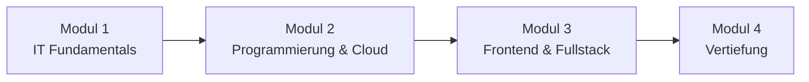

# Kurs 25-06

Willkommen auf der Kursplattform. Hier findest du alle Unterlagen, Übungen und Assignments zu den einzelnen Modulen und Wochen.

---

## Kursverlauf

---

## Module im Überblick

| Modul | Thema | Wochen | Beschreibung |
|-------|-------|--------|--------------|
| [**Modul 1**](modul-1/index.md) | IT Fundamentals | 10 Wochen | Grundlagen der IT, Betriebssysteme, Netzwerke, PowerShell, Bash |
| [**Modul 2**](modul-2/index.md) | Programmierung & Cloud | 10 Wochen | Linux, AWS, Python, FastAPI, SQL, Datenbanken |
| [**Modul 3**](modul-3/index.md) | Frontend & Fullstack | 6 Wochen | HTML/CSS, JavaScript, React, Fullstack-Projekte |
| [**Modul 4**](modul-4/index.md) | Vertiefung | – | Wird noch bekannt gegeben |

---

## Wichtige Termine

!!! info "Termine werden noch ergänzt"
    Die konkreten Termine werden zu Kursbeginn bekannt gegeben.

| Datum | Ereignis | Hinweis |
|-------|----------|---------|
| – | Kursstart | – |
| – | Ende Modul 1 | – |
| – | Ende Modul 2 | – |
| – | Ende Modul 3 | – |
| – | Kursende | – |

---

## Zertifikate

!!! abstract "Zertifikate im Kurs"
    Im Verlauf des Kurses werden folgende Zertifizierungen vorbereitet:

    - **LPI Linux Essentials (010-160)** – Vorbereitung in Modul 2, Woche 3
    - Weitere Zertifikate werden ggf. im Kursverlauf ergänzt

---

## Wichtige Informationen

!!! tip "Allgemeine Hinweise"
    - Abgaben erfolgen über Google Classroom
    - Abgabefristen: in der Regel freitags bis 23:59 Uhr
    - Akzeptierte Formate: PDF, DOCX, ODT, PNG, JPG
    - Bei Fragen oder Problemen: frühzeitig melden

---

## Freie Tage & Ferien

!!! note "Wird noch ergänzt"
    Informationen zu freien Tagen und Ferienzeiten werden hier veröffentlicht.

| Datum | Anlass |
|-------|--------|
| – | – |
