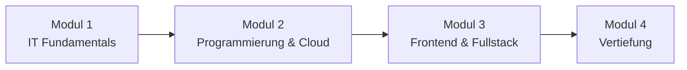

# Kurs 25-06

Willkommen auf der Kursplattform. Hier findest du alle Unterlagen, Übungen und Assignments zu den einzelnen Modulen und Wochen.

---

## Kursverlauf

---

## Module im Überblick

| Modul | Thema | Wochen | Beschreibung |
|-------|-------|--------|--------------|
| [**Modul 1**](modul-1/index.md) | IT Fundamentals | 10 Wochen | Grundlagen der IT, Betriebssysteme, Netzwerke, PowerShell, Bash |
| [**Modul 2**](modul-2/index.md) | Programmierung & Cloud | 10 Wochen | Linux, AWS, Python, FastAPI, SQL, Datenbanken |
| [**Modul 3**](modul-3/index.md) | Frontend & Fullstack | 8 Wochen | HTML/CSS, JavaScript, React, Fullstack-Projekte, Datenbanken, Docker |
| [**Modul 4**](modul-4/index.md) | Vertiefung | – | Wird noch bekannt gegeben |

---

## Wichtige Termine

!!! info "Kurszeiten"
    :alarm_clock: Modul I, II, III & IV: Montag bis Freitag

    - 37,5 Wochenstunden exkl. Pausen (50 UE)
    - 09:00 Uhr - 12:00 Uhr
    - 13:00 Uhr - 17:00 Uhr (10 UE + Selbstlernzeiten)

| Datum | Ereignis |
|-------|----------|
| 30.06.2025 | Kursstart |
| 26.09.2025 | Ende Modul 1 |
| 29.06.2026 | Kursende |

---

## Zertifikate

!!! abstract "Zertifikate im Kurs"
    Im Verlauf des Kurses werden folgende Zertifizierungen vorbereitet:

    - **Professional Scrum Master I – PSM I** :flag_gb:
    - **LPI Linux Essentials** :flag_gb: :flag_de:
    - **AWS Cloud Practitioner Zertifikat** :flag_de: :flag_gb:
    - **Cloud Business Expert (IHK)** :flag_de:
    - **IT-Support Specialist (IHK)** :flag_de:
    - **IT-Administrator (IHK)** :flag_de:

---

## Wichtige Informationen

!!! tip "Allgemeine Hinweise"
    - Abgaben erfolgen über Google Classroom
    - Abgabefristen: in der Regel freitags bis 23:59 Uhr
    - Akzeptierte Formate: PDF, DOCX, ODT, PNG, JPG
    - Bei Fragen oder Problemen: frühzeitig melden

---

## Freie Tage & Ferien

!!! note "Unterrichtsfreie Tage"
    Insgesamt hat jede(r) Teilnehmer(in) einen gesetzlichen Anspruch auf **20 Urlaubstage** pro Kursjahr. **10 Urlaubstage** werden durch gemeinsame Ferienzeiten abgebildet. Zusätzlich stehen jede(r) Teilnehmer(in) **10 Urlaubstage** zur individuellen Inanspruchnahme zur Verfügung.

    Schicke hierfür bitte eine kurze E-Mail an: abwesenheit@techstarter.de.

    Zusätzlich gelten die hamburgischen Feiertage, da die Techstarter GmbH in Hamburg ansässig ist. Du hast an allen unten genannten Feiertagen keinen Unterricht.

**Ferien (für alle verpflichtend):**

| Zeitraum | Ferien | Urlaubstage |
|----------|--------|-------------|
| 04.08.2025 – 08.08.2025 | Sommerferien 2025 | 5 |
| 24.12.2025 – 02.01.2026 | Winterferien 2025 | 4 |
| 15.05.2026 | Mai-Brücke | 1 |

**Feiertage 2025/2026 (Hamburg):**

| Datum | Feiertag |
|-------|----------|
| 03.10.2025 | Tag der Deutschen Einheit |
| 31.10.2025 | Reformationstag |
| 25.12.2025 | 1. Weihnachtstag |
| 26.12.2025 | 2. Weihnachtstag |
| 01.01.2026 | Neujahr |
| 03.04.2026 | Karfreitag 2026 |
| 06.04.2026 | Ostermontag |
| 01.05.2026 | Tag der Arbeit |
| 14.05.2026 | Christi Himmelfahrt |
| 25.05.2026 | Pfingstmontag |
