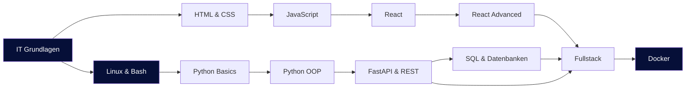
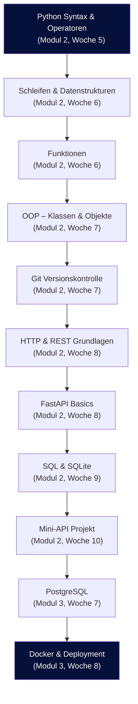
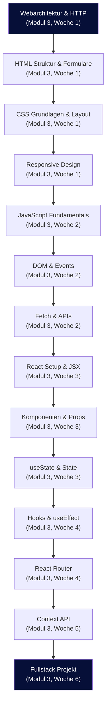
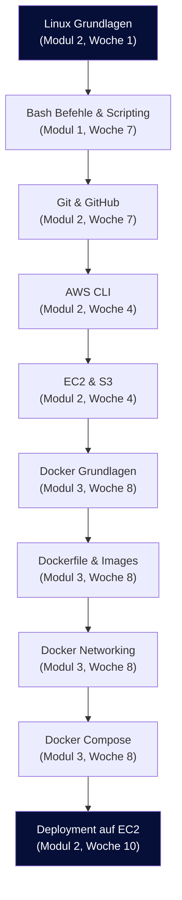

# Lernpfade – Dein Weg durch den Kurs

Diese Seite zeigt dir, wie die verschiedenen Themen des Kurses zusammenhängen und aufeinander aufbauen.

---

## Gesamtübersicht

---

## Backend-Pfad

Vom ersten Python-Skript bis zur fertigen API in der Cloud.

---

## Frontend-Pfad

Von der ersten HTML-Seite bis zur interaktiven React-Anwendung.

---

## DevOps-Pfad

Vom Terminal bis zur Cloud-Infrastruktur.

---

## Legende

!!! info "Wie liest man die Diagramme?"
    - **Pfeile** zeigen Abhängigkeiten: Du solltest das Thema oben verstanden haben, bevor du zum nächsten gehst
    - **Modul- und Wochenangaben** helfen dir, das Thema im Kurs zu finden
    - Die Pfade überschneiden sich – z.B. brauchst du Backend-Wissen für das Fullstack-Projekt
    - Du musst nicht jeden Pfad linear durcharbeiten – nutze die Pfade als Orientierung
