---
tags:
  - Fullstack
  - React
  - FastAPI
---
# Optionales Wochenprojekt: Fullstack mit React + FastAPI (Einzelarbeit)

## Wochenabschluss: Vom Frontend zum Fullstack

### Organisatorische Rahmenbedingungen

**Dieses Wochenprojekt ist komplett freiwillig!** Da wir aktuell in der Prüfungsphase sind, ist das hier ein optionales Mini-Projekt für alle, die Lust haben, sich mit dem Thema Fullstack auseinanderzusetzen. Kein Druck, kein Stress.

Dieses Projekt verbindet alles, was ihr bisher gelernt habt: React-Frontend, Python-Backend und AWS-Deployment. Es ist ein guter Einstieg in die Fullstack-Entwicklung.

**Denk daran:** Das Wochenprojekt ist komplett freiwillig. Gerade in der Prüfungsphase hat die Prüfungsvorbereitung für den IHK-ISS Vorrang. Wenn du es machst, toll! Wenn nicht, auch kein Problem, wir werden am Freitag noch einmal alles besprechen was in dieser übung passiert.

Bei Fragen: Frag nach! Das ist keine Schwäche, sondern zeigt, dass du verstehen willst.


Falls du abgeben möchtest oder Feedback wünschst, reiche deinen Projektordner ein:

```
vorname_nachname_woche6/
    backend/
        main.py
        requirements.txt
    frontend/
        src/
            ...
        package.json
    README.md
```

**Hinweis:** Lade NICHT den `node_modules` Ordner und NICHT den `__pycache__` Ordner hoch! Komprimiere deinen Projektordner als ZIP-Datei.

Der thematische Umfang dieses Projekts:
- Python-Backend mit FastAPI (REST-API erstellen)
- React-Frontend mit API-Anbindung (fetch/axios statt localStorage)
- Kommunikation zwischen Frontend und Backend (CORS, JSON)
- Deployment beider Teile auf einer EC2-Instanz

---

## Inhaltsverzeichnis

| Teil | Thema |
|------|-------|
| Teil 1 | Konzept: Wie Frontend und Backend zusammenarbeiten |
| Teil 2 | Weg A oder Weg B wählen |
| Teil 3 | Backend mit FastAPI aufsetzen |
| Teil 4 | Frontend mit Backend verbinden |
| Teil 5 | Deployment auf EC2 |

### Minimalpfad (wenn du wenig Zeit hast)

Wenn du nur begrenzt Zeit hast, konzentriere dich auf:
1. **Teil 1** lesen (Konzept verstehen)
2. **Teil 3** (Backend aufsetzen, lokal testen)
3. **Teil 4** (Frontend anbinden, lokal alles zum Laufen bringen)

Das Deployment auf EC2 (Teil 5) ist ein Bonus.

---

## Hinweis zur Nutzung von KI-Tools

**Die Nutzung von KI-Tools (wie ChatGPT, Claude, Copilot) ist erlaubt!**

**Wichtige Bedingungen:**
- Du musst **jeden Code, den eine KI generiert hat, vollständig verstehen**
- Du solltest in der Lage sein, **jede Zeile deines Codes zu erklären**
- Bei Rückfragen musst du erklären können, was der Code macht und warum

**Tipp:** Wenn du KI nutzt, frage sie auch, dir den Code zu erklären!

---

## Teil 1: Konzept - Wie Frontend und Backend zusammenarbeiten

### Was ändert sich?

Bisher hat unser React-Frontend die Daten im **localStorage** des Browsers gespeichert. Das funktioniert, hat aber Nachteile:

| Aspekt | localStorage | Backend + API |
|--------|-------------|---------------|
| **Datenzugriff** | Nur in diesem Browser | Von überall |
| **Datensicherheit** | User kann Daten löschen | Server speichert sicher |
| **Mehrere User** | Nicht möglich | Jeder hat eigene Daten |
| **Datenmenge** | ~5-10 MB Limit | Praktisch unbegrenzt |
| **Logik** | Alles im Browser | Geschäftslogik auf dem Server |

### Die neue Architektur

```mermaid
%%{init: {'theme': 'base', 'themeVariables': {'primaryColor': '#e3f2fd', 'primaryTextColor': '#0d47a1', 'primaryBorderColor': '#90caf9', 'secondaryColor': '#e0f2f1', 'secondaryTextColor': '#004d40', 'secondaryBorderColor': '#80cbc4', 'tertiaryColor': '#fff3e0', 'tertiaryTextColor': '#e65100', 'tertiaryBorderColor': '#ffcc80', 'lineColor': '#78909c', 'fontSize': '14px'}}}%%
graph LR
    subgraph arch [" "]
        direction LR
        A["🖥️ <b>React Frontend</b><br/>Vite · Port 5173"]
        B["⚙️ <b>FastAPI Backend</b><br/>Uvicorn · Port 8000"]
        C[("💾 <b>Daten</b><br/>RAM / SQLite")]

        A -- "GET · POST · DELETE · PATCH" --> B
        B -- "JSON" --> A
        B --> C
    end
```



### Was ist FastAPI?

FastAPI ist ein modernes Python-Web-Framework zum Erstellen von REST-APIs. Es ist schnell, einfach zu lernen und hat automatische Dokumentation.

**Warum FastAPI?**
- **Python:** Ihr kennt Python bereits
- **Einfach:** Weniger Boilerplate als Django oder Flask
- **Automatische Docs:** Swagger UI unter `/docs` inklusive
- **Type Hints:** Validierung und Dokumentation durch Python-Typen
- **Schnell:** Eines der schnellsten Python-Frameworks

### Was ist eine REST-API?

Eine REST-API definiert Endpunkte (URLs), über die das Frontend mit dem Backend kommuniziert:

| HTTP-Methode | Endpunkt | Beschreibung | Beispiel |
|-------------|----------|--------------|----------|
| `GET` | `/items` | Alle Items abrufen | Liste aller Bookmarks |
| `POST` | `/items` | Neues Item erstellen | Neuen Bookmark anlegen |
| `DELETE` | `/items/{id}` | Item löschen | Bookmark entfernen |
| `PATCH` | `/items/{id}` | Item teilweise ändern | Favorit umschalten |

Das Frontend schickt HTTP-Requests (mit `fetch`) und bekommt JSON-Antworten zurück. Genau wie bei externen APIs, nur dass die API jetzt auf unserem eigenen Server läuft.

**Wichtige HTTP-Statuscodes:**

| Code | Name | Bedeutung | Wann? |
|------|------|-----------|-------|
| `200` | OK | Alles gut, Daten kommen zurück | GET, PATCH |
| `201` | Created | Neue Ressource wurde erstellt | POST (neues Item angelegt) |
| `204` | No Content | Erfolgreich, aber keine Daten zurück | DELETE (Item gelöscht) |
| `404` | Not Found | Ressource existiert nicht | Item-ID nicht gefunden |
| `422` | Unprocessable Entity | Daten sind ungültig | z.B. Titel fehlt bei POST |

### Was ist CORS?

Wenn das Frontend auf `localhost:5173` läuft und das Backend auf `localhost:8000`, blockt der Browser die Requests aus Sicherheitsgründen. Das nennt sich **Cross-Origin Resource Sharing (CORS)**.

```mermaid
%%{init: {'theme': 'base', 'themeVariables': {'primaryColor': '#e3f2fd', 'primaryTextColor': '#0d47a1', 'primaryBorderColor': '#90caf9', 'lineColor': '#78909c', 'fontSize': '14px'}}}%%
graph LR
    A["🌐 <b>Browser</b><br/>localhost:5173"]
    B{"🛡️ <b>CORS</b>"}
    C["❌ <b>Blockiert</b><br/>Andere Origin!"]
    D["✅ <b>Erlaubt</b><br/>FastAPI :8000"]

    A -- "Request" --> B
    B -- "Ohne Config" --> C
    B -- "Mit Middleware" --> D
```



FastAPI bietet dafür eine fertige Lösung, die wir einfach einbinden.

---

## Teil 2: Wähle deinen Weg

Du hast die Wahl zwischen zwei Ansätzen.

---

## Weg A: Eigenes Projekt (Kreativ)

Erstelle ein eigenes Fullstack-Projekt mit React-Frontend und FastAPI-Backend. Du kannst das Recap-Projekt (Mini-Hub) erweitern oder eine komplett eigene Idee umsetzen.

### Mindestanforderungen

**Backend (FastAPI):**
- Mindestens 3 API-Endpunkte (z.B. GET, POST, DELETE)
- Korrekte HTTP-Methoden und Statuscodes
- CORS korrekt konfiguriert
- Daten als Python-Liste im RAM speichern (SQLite optional)
- Pydantic-Models für Request-Validierung

**Frontend (React):**
- Daten über `fetch` vom Backend laden (nicht localStorage)
- Mindestens eine Aktion, die Daten ans Backend schickt (z.B. neues Item erstellen)
- Loading- und Error-States für API-Calls
- Saubere Projektstruktur

**Projekt-Struktur:**
- Getrennter `frontend/` und `backend/` Ordner
- `requirements.txt` für Python-Dependencies
- `README.md` mit Anleitung zum Starten

### Ideen für eigene Projekte

| Projekt | Beschreibung | API-Endpunkte |
|---------|-------------|---------------|
| **Todo-App** | Aufgaben verwalten | GET, POST, PATCH, DELETE |
| **Notizen-App** | Markdown-Notizen | GET, POST, PUT, DELETE |
| **Rezepte-Sammlung** | Rezepte speichern | GET, POST, DELETE |
| **Kontakte-Liste** | Kontakte verwalten | GET, POST, PUT, DELETE |
| **Bookmark-Manager** | Links sammeln (Mini-Hub) | GET, POST, PATCH, DELETE |

### Hinweise für Weg A

- Halte es einfach! Eine funktionierende App mit 3 Endpunkten ist besser als eine halbfertige mit 10.
- Starte mit dem Backend und teste die Endpunkte über die Swagger-Docs (`/docs`), bevor du das Frontend anbindest.
- Für SQLite kannst du die Python-Standardbibliothek `sqlite3` verwenden -- kein ORM nötig.
- Schau dir Weg B als Referenz an, auch wenn du Weg A machst.

---

## Weg B: Geführte Aufgabe (Schritt für Schritt)

Wir erweitern das **Recap-Projekt (Mini-Hub)** um ein FastAPI-Backend. Die Items werden dann nicht mehr im localStorage gespeichert, sondern über eine API vom Backend verwaltet.

**Am Ende hast du automatisch alle Anforderungen erfüllt!**

### Was wir bauen:

1. Ein FastAPI-Backend mit 4 Endpunkten (GET, POST, PATCH, DELETE)
2. Das React-Frontend so anpassen, dass es die API nutzt statt localStorage
3. (Bonus) Alles zusammen auf einer EC2-Instanz deployen

---

### Voraussetzungen & Setup

**Du brauchst:**
- Node.js und npm (sollte bereits installiert sein)
- Python 3.10+ (sollte bereits installiert sein)
- Dein Recap-Projekt (26.3-recap-projekt-v1 oder v2) -- oder eine frische Kopie

**Python-Version prüfen:**

```bash
python --version
# oder
python3 --version
# Erwartet: Python 3.10 oder höher
```

> **Hinweis:** Falls Python nicht installiert ist, geh auf [python.org/downloads](https://www.python.org/downloads/) und lade die neueste Version herunter. Achte bei Windows darauf, den Haken bei "Add Python to PATH" zu setzen!

---

### Schritt 1: Projektstruktur anlegen

Erstelle eine neue Projektstruktur mit getrenntem Frontend und Backend:

```bash
# Neuen Projektordner erstellen
mkdir fullstack-mini-hub
cd fullstack-mini-hub

# Backend-Ordner erstellen
mkdir backend

# Recap-Projekt als Frontend kopieren
# (Passe den Pfad zu deinem Recap-Projekt an!)
cp -r pfad/zu/26.3-recap-projekt-v1 frontend
# Unter Windows (PowerShell):
# Copy-Item -Recurse pfad\zu\26.3-recap-projekt-v1 frontend
```

Deine Struktur sollte so aussehen:

```
fullstack-mini-hub/
├── backend/
│   └── (hier erstellen wir gleich die Dateien)
└── frontend/
    ├── src/
    ├── package.json
    ├── vite.config.js
    └── ...
```

> **Wichtig:** Falls du `node_modules` mitkopiert hast, ist das kein Problem. Falls nicht, lauf im `frontend/`-Ordner `npm install` aus.

---

### Schritt 2: Python Virtual Environment und FastAPI installieren

```bash
# In den Backend-Ordner wechseln
cd backend

# Virtual Environment erstellen
python -m venv venv

# Virtual Environment aktivieren
# Linux/Mac:
source venv/bin/activate
# Windows (PowerShell):
# venv\Scripts\Activate.ps1
# Windows (CMD):
# venv\Scripts\activate.bat

# ⚠️ Windows-Nutzer: Falls PowerShell "running scripts is disabled" meldet:
# Fuehre zuerst diesen Befehl aus (einmalig pro Terminal-Session):
# Set-ExecutionPolicy -Scope Process -ExecutionPolicy Bypass
# Dann erneut: venv\Scripts\Activate.ps1
# Alternativ kannst du einfach CMD statt PowerShell nutzen: venv\Scripts\activate.bat

# FastAPI und Uvicorn installieren
pip install "fastapi~=0.115.0" "uvicorn~=0.34.0"
```

**Erklärung:**
- **Virtual Environment (venv):** Isolierte Python-Umgebung, damit die Pakete nicht global installiert werden. Jedes Projekt hat seine eigenen Abhängigkeiten.
- **FastAPI:** Das Web-Framework für unsere API. Ab Version 0.115 wird Pydantic v2 stabil unterstützt.
- **Uvicorn:** Ein ASGI-Server der unsere FastAPI-App ausführt. Vergleichbar mit dem Vite-Dev-Server für React.

Erstelle die `requirements.txt`:

```bash
pip freeze > requirements.txt
```

Alternativ kannst du die `requirements.txt` auch manuell erstellen (empfohlen, damit die Versionen konsistent sind):

```
fastapi~=0.115.0
uvicorn~=0.34.0
```

> **Was bedeutet `~=`?** Der "compatible release" Operator `~=0.115.0` erlaubt Patch-Updates (z.B. `0.115.1`, `0.115.2`), aber keine Minor-Sprünge (z.B. nicht `0.116.0`). Das ist sicherer als `>=`, weil es verhindert, dass bei einem grossen Update plötzlich etwas nicht mehr funktioniert.

> **Hinweis:** `requirements.txt` ist das Python-Äquivalent zu `package.json`. Andere können damit die gleichen Pakete installieren: `pip install -r requirements.txt`
>
> **Wichtig:** Wir nutzen in diesem Projekt **Pydantic v2** Syntax (z.B. `model_dump()`). Falls du eine ältere FastAPI-Version hast und Fehler wie `AttributeError: 'ItemUpdate' object has no attribute 'model_dump'` bekommst, aktualisiere FastAPI mit `pip install --upgrade fastapi`.

---

### Schritt 3: FastAPI Backend erstellen

Erstelle die Datei `backend/main.py`:

<details markdown>
<summary><b>backend/main.py anzeigen</b> (kompletter Code mit Kommentaren)</summary>

```python
# ===========================================================================
# MAIN.PY - FastAPI Backend fuer den Mini-Hub
# ===========================================================================
#
# Diese Datei ist das Backend unserer Fullstack-Anwendung.
# Sie stellt eine REST-API bereit, ueber die das React-Frontend
# Items erstellen, lesen, aendern und loeschen kann (CRUD).
#
# Konzepte in dieser Datei:
# - FastAPI: Modernes Python-Framework fuer REST-APIs
# - Pydantic Models: Datenvalidierung mit Python-Typen
# - CORS Middleware: Cross-Origin Requests erlauben
# - REST-Endpunkte: GET, POST, PATCH, DELETE
# - HTTP-Statuscodes: 200, 201, 204, 404
# - In-Memory Speicher: Daten in einer Python-Liste
#
# ===========================================================================

from fastapi import FastAPI, HTTPException
from fastapi.middleware.cors import CORSMiddleware
from pydantic import BaseModel, Field
from datetime import datetime
import uuid

# ===========================================================================
# APP ERSTELLEN
# ===========================================================================

# FastAPI-Instanz erstellen
# das ist unsere Anwendung, an der wir die Endpunkte registrieren
app = FastAPI(
    title="Mini-Hub API",
    description="Backend API fuer die Mini-Hub React-App",
    version="1.0.0"
)

# ===========================================================================
# CORS KONFIGURATION
# ===========================================================================

# CORS Middleware hinzufuegen
# ohne diese Konfiguration wuerde der Browser die Requests vom Frontend blockieren
# weil Frontend (Port 5173) und Backend (Port 8000) unterschiedliche Origins sind
app.add_middleware(
    CORSMiddleware,
    # allow_origins: Welche Origins duerfen auf die API zugreifen?
    # in der Entwicklung erlauben wir den Vite-Dev-Server
    allow_origins=[
        "http://localhost:5173",    # Vite Default-Port
        "http://127.0.0.1:5173",   # Alternative Adresse
    ],
    # allow_credentials: Cookies und Auth-Header erlauben
    # auf False setzen wenn keine Cookies/Auth benoetigt werden (unser Fall)
    # Wichtig: wenn True, darf allow_origins NICHT ["*"] sein!
    allow_credentials=False,
    # allow_methods: Welche HTTP-Methoden sind erlaubt?
    # ["*"] bedeutet alle (GET, POST, PUT, DELETE, PATCH, etc.)
    allow_methods=["*"],
    # allow_headers: Welche HTTP-Header sind erlaubt?
    allow_headers=["*"],
)

# ===========================================================================
# PYDANTIC MODELS (Datenvalidierung)
# ===========================================================================

# Pydantic Models definieren die Struktur der Daten
# FastAPI nutzt diese um eingehende Requests automatisch zu validieren
# und die Swagger-Dokumentation zu generieren


class ItemCreate(BaseModel):
    """Daten die zum Erstellen eines neuen Items noetig sind.
    Wird fuer POST /items verwendet."""
    title: str                                  # Pflichtfeld: Titel des Items
    url: str = ""                               # Optional: URL (Default: leerer String)
    tags: list[str] = Field(default_factory=list)  # Optional: Tags (Default: leere Liste)
    # Hinweis: Field(default_factory=list) ist Best Practice in Pydantic
    # es stellt sicher, dass jede Instanz ihre eigene leere Liste bekommt
    # statt eine geteilte mutable Default-Liste zu verwenden


class ItemUpdate(BaseModel):
    """Daten die zum Aktualisieren eines Items gesendet werden koennen.
    Alle Felder sind optional (daher die Default-Werte).
    Wird fuer PATCH /items/{id} verwendet."""
    title: str | None = None          # Optional: Neuer Titel
    url: str | None = None            # Optional: Neue URL
    tags: list[str] | None = None     # Optional: Neue Tags
    favorite: bool | None = None      # Optional: Favorit-Status aendern


class Item(BaseModel):
    """Vollstaendiges Item mit allen Feldern.
    Wird als Response zurueckgegeben."""
    id: str
    title: str
    url: str
    tags: list[str]
    favorite: bool
    createdAt: str

# ===========================================================================
# DATEN-SPEICHER (In-Memory)
# ===========================================================================

# Unsere "Datenbank" ist eine einfache Python-Liste
# bei einem Server-Neustart gehen die Daten verloren
# fuer unser Lernprojekt ist das voellig ausreichend
#
# In einer echten App wuerde hier eine Datenbank stehen (PostgreSQL, SQLite, etc.)
items_db: list[dict] = [
    {
        "id": "seed-1",
        "title": "React Dokumentation",
        "url": "https://react.dev",
        "tags": ["react", "docs", "learning"],
        "favorite": True,
        "createdAt": "2024-01-15T10:30:00.000Z"
    },
    {
        "id": "seed-2",
        "title": "FastAPI Dokumentation",
        "url": "https://fastapi.tiangolo.com",
        "tags": ["python", "fastapi", "backend"],
        "favorite": True,
        "createdAt": "2024-01-16T14:20:00.000Z"
    },
    {
        "id": "seed-3",
        "title": "MDN Web Docs - JavaScript",
        "url": "https://developer.mozilla.org/de/docs/Web/JavaScript",
        "tags": ["javascript", "docs", "mdn"],
        "favorite": False,
        "createdAt": "2024-01-17T09:00:00.000Z"
    },
    {
        "id": "seed-4",
        "title": "Vite Getting Started",
        "url": "https://vitejs.dev/guide/",
        "tags": ["vite", "tooling", "build"],
        "favorite": False,
        "createdAt": "2024-01-18T11:45:00.000Z"
    },
]

# ===========================================================================
# API-ENDPUNKTE
# ===========================================================================

# --- GET /items ---
# Alle Items abrufen
# der Dekorator @app.get registriert diese Funktion fuer GET-Requests auf /items
@app.get("/items", response_model=list[Item])
def get_items():
    """Gibt alle Items zurueck."""
    # einfach die gesamte Liste zurueckgeben
    # FastAPI wandelt die Python-Dicts automatisch in JSON um
    return items_db


# --- POST /items ---
# Neues Item erstellen
# response_model definiert die Struktur der Antwort
# status_code=201 bedeutet "Created" (Standard fuer neue Ressourcen)
@app.post("/items", response_model=Item, status_code=201)
def create_item(item_data: ItemCreate):
    """Erstellt ein neues Item und gibt es zurueck."""
    # neues Item-Dict erstellen
    new_item = {
        "id": str(uuid.uuid4()),                          # eindeutige ID generieren
        "title": item_data.title,                          # Titel aus dem Request
        "url": item_data.url,                              # URL aus dem Request
        "tags": item_data.tags,                            # Tags aus dem Request
        "favorite": False,                                 # neue Items sind keine Favoriten
        "createdAt": datetime.utcnow().isoformat(timespec="milliseconds") + "Z"      # aktuelles Datum als ISO-String
    }

    # Item zur Liste hinzufuegen (am Anfang, damit es oben erscheint)
    items_db.insert(0, new_item)

    # das neue Item zurueckgeben
    return new_item


# --- DELETE /items/{item_id} ---
# Ein Item loeschen
# {item_id} ist ein Path-Parameter (dynamischer Teil der URL)
# status_code=204 bedeutet "No Content" (Loesch-Operation erfolgreich, keine Daten zurueck)
@app.delete("/items/{item_id}", status_code=204)
def delete_item(item_id: str):
    """Loescht ein Item anhand seiner ID."""
    # nach dem Item mit der gegebenen ID suchen
    for i, item in enumerate(items_db):
        if item["id"] == item_id:
            # Item gefunden: aus der Liste entfernen
            items_db.pop(i)
            # bei Status 204 gibt man nichts zurueck
            return

    # wenn wir hier ankommen, wurde das Item nicht gefunden
    # HTTPException mit Status 404 werfen
    raise HTTPException(status_code=404, detail="Item nicht gefunden")


# --- PATCH /items/{item_id} ---
# Ein Item teilweise aktualisieren (z.B. nur den Favorit-Status aendern)
# PATCH ist fuer teilweise Updates (im Gegensatz zu PUT fuer komplette Updates)
@app.patch("/items/{item_id}", response_model=Item)
def update_item(item_id: str, item_data: ItemUpdate):
    """Aktualisiert ein Item teilweise."""
    # nach dem Item suchen
    for item in items_db:
        if item["id"] == item_id:
            # nur die Felder aktualisieren die im Request enthalten sind
            # item_data.model_dump(exclude_unset=True) gibt nur die Felder zurueck
            # die explizit gesetzt wurden (nicht None sind)
            update_data = item_data.model_dump(exclude_unset=True)
            for key, value in update_data.items():
                item[key] = value
            return item

    raise HTTPException(status_code=404, detail="Item nicht gefunden")


# ===========================================================================
# SERVER STARTEN (nur fuer Entwicklung)
# ===========================================================================

# Dieser Block wird nur ausgefuehrt wenn die Datei direkt gestartet wird
# nicht wenn sie von einem anderen Modul importiert wird
if __name__ == "__main__":
    import uvicorn
    # host="0.0.0.0" macht den Server von aussen erreichbar (wichtig fuer EC2)
    # port=8000 ist der Standard-Port fuer FastAPI
    # reload=True startet den Server automatisch neu wenn sich der Code aendert
    uvicorn.run("main:app", host="0.0.0.0", port=8000, reload=True)
```

</details>

**Erklärung der wichtigsten Konzepte:**

| Konzept | Beschreibung |
|---------|-------------|
| `@app.get("/items")` | Dekorator, der eine Funktion als GET-Endpunkt registriert |
| `response_model=list[Item]` | Definiert die Struktur der JSON-Antwort |
| `item_data: ItemCreate` | FastAPI liest den Request-Body und validiert ihn automatisch |
| `HTTPException(status_code=404)` | Sendet einen Fehler an den Client |
| `CORSMiddleware` | Erlaubt dem Frontend, auf die API zuzugreifen |
| `BaseModel` | Pydantic-Klasse für Datenvalidierung |

---

### Schritt 4: Backend starten und testen

```bash
# Stelle sicher, dass du im backend/ Ordner bist
# und das Virtual Environment aktiv ist

# Server starten (empfohlener Weg ueber Uvicorn CLI)
uvicorn main:app --reload --host 0.0.0.0 --port 8000

# Alternative: Python direkt ausfuehren (nutzt den if __name__ Block in main.py)
# python main.py

# Windows-Alternative falls "uvicorn" nicht gefunden wird:
# python -m uvicorn main:app --reload --host 0.0.0.0 --port 8000
```

**Erklärung:** `uvicorn main:app` sagt Uvicorn: "Starte die Variable `app` aus der Datei `main.py`". `--reload` startet automatisch neu bei Code-Änderungen. Das ist der Standard-Weg in der FastAPI-Dokumentation.

Du solltest folgende Ausgabe sehen:

```
INFO:     Uvicorn running on http://0.0.0.0:8000 (Press CTRL+C to quit)
INFO:     Started reloader process
INFO:     Started server process
INFO:     Waiting for application startup.
INFO:     Application startup complete.
```

**Jetzt testen!** Öffne im Browser:

- **http://localhost:8000/items** -- Zeigt alle Items als JSON
- **http://localhost:8000/docs** -- Swagger UI (interaktive API-Dokumentation)

Die Swagger-Docs sind extrem nützlich! Dort kannst du alle Endpunkte direkt im Browser ausprobieren, ohne ein Frontend zu brauchen:

```mermaid
%%{init: {'theme': 'base', 'themeVariables': {'primaryColor': '#e8f5e9', 'primaryTextColor': '#1b5e20', 'primaryBorderColor': '#a5d6a7', 'lineColor': '#78909c', 'fontSize': '14px'}}}%%
graph LR
    G["🟢 <b>GET</b> /items"] ~~~ P["🟡 <b>POST</b> /items"] ~~~ D["🔴 <b>DELETE</b> /items/{id}"] ~~~ PA["🟠 <b>PATCH</b> /items/{id}"]
```



> **Tipp:** Oeffne **localhost:8000/docs** — klicke auf "Try it out" und dann "Execute" um jeden Endpunkt zu testen!

> **Tipp:** Teste alle 4 Endpunkte über die Swagger UI, bevor du mit dem Frontend weitermachst. So weisst du sicher, dass das Backend korrekt funktioniert.

---

### Schritt 5: Frontend anpassen - API-Hilfsfunktionen erstellen

Jetzt passen wir das Frontend an, damit es die API nutzt statt localStorage.

Erstelle eine neue Datei `frontend/src/utils/api.js`:

<details markdown>
<summary><b>frontend/src/utils/api.js anzeigen</b> (API-Hilfsfunktionen)</summary>

```javascript
// ===========================================================================
// API.JS - Hilfsfunktionen fuer die Backend-Kommunikation
// ===========================================================================
//
// Diese Datei ersetzt storage.js und kommuniziert mit dem FastAPI-Backend
// statt mit dem localStorage.
//
// Konzepte in dieser Datei:
// - fetch API: HTTP-Requests vom Browser aus senden
// - async/await: Asynchrone Operationen lesbar schreiben
// - Error Handling: Fehler bei API-Calls abfangen
// - REST-Konventionen: Richtige HTTP-Methoden und Header verwenden
//
// ===========================================================================

// Basis-URL des Backends
// Vite stellt Umgebungsvariablen ueber import.meta.env bereit
// Variablen muessen mit VITE_ beginnen damit Vite sie einbindet
// der Fallback "http://localhost:8000" greift wenn keine .env-Datei existiert
const API_BASE = import.meta.env.VITE_API_BASE || "http://localhost:8000";

// Sicherheitscheck fuer Produktion:
// wenn im Prod-Build kein VITE_API_BASE gesetzt ist, stimmt etwas nicht
// (z.B. .env.production fehlt oder ist falsch benannt)
if (import.meta.env.PROD && !import.meta.env.VITE_API_BASE) {
  console.warn(
    "⚠️ VITE_API_BASE ist nicht gesetzt! " +
    "Erstelle eine Datei frontend/.env.production mit: VITE_API_BASE=/api"
  );
}

// --- Alle Items laden ---
// GET /items
export async function fetchItems() {
  // fetch sendet standardmaessig einen GET-Request
  const response = await fetch(`${API_BASE}/items`);

  // response.ok ist true wenn der Statuscode 200-299 ist
  if (!response.ok) {
    throw new Error(`Fehler beim Laden: ${response.status}`);
  }

  // response.json() parst den JSON-Body der Antwort
  // das Ergebnis ist ein JavaScript-Array mit Item-Objekten
  return response.json();
}

// --- Neues Item erstellen ---
// POST /items
export async function createItem(itemData) {
  const response = await fetch(`${API_BASE}/items`, {
    // POST fuer das Erstellen neuer Ressourcen
    method: "POST",
    // Content-Type Header sagt dem Backend dass wir JSON senden
    headers: {
      "Content-Type": "application/json",
    },
    // body muss ein JSON-String sein
    // JSON.stringify wandelt das JavaScript-Objekt in einen String um
    body: JSON.stringify(itemData),
  });

  if (!response.ok) {
    throw new Error(`Fehler beim Erstellen: ${response.status}`);
  }

  // das Backend gibt das erstellte Item mit ID zurueck
  return response.json();
}

// --- Item loeschen ---
// DELETE /items/{id}
export async function deleteItem(id) {
  const response = await fetch(`${API_BASE}/items/${id}`, {
    method: "DELETE",
  });

  if (!response.ok) {
    throw new Error(`Fehler beim Loeschen: ${response.status}`);
  }

  // bei DELETE kommt kein Body zurueck (Status 204)
}

// --- Item aktualisieren (z.B. Favorit umschalten) ---
// PATCH /items/{id}
export async function updateItem(id, updateData) {
  const response = await fetch(`${API_BASE}/items/${id}`, {
    method: "PATCH",
    headers: {
      "Content-Type": "application/json",
    },
    body: JSON.stringify(updateData),
  });

  if (!response.ok) {
    throw new Error(`Fehler beim Aktualisieren: ${response.status}`);
  }

  // das Backend gibt das aktualisierte Item zurueck
  return response.json();
}
```

</details>

**Erklärung:**

| Funktion | HTTP-Methode | Beschreibung |
|----------|-------------|--------------|
| `fetchItems()` | GET | Lädt alle Items vom Backend |
| `createItem(data)` | POST | Sendet ein neues Item ans Backend |
| `deleteItem(id)` | DELETE | Löscht ein Item über seine ID |
| `updateItem(id, data)` | PATCH | Ändert einzelne Felder eines Items |

---

### Schritt 6: App.jsx anpassen

Jetzt ändern wir die `App.jsx`, damit sie die API nutzt statt localStorage.

**Was sich ändert:**
- `loadItems` / `saveItems` → `fetchItems` / `createItem` / `deleteItem` / `updateItem`
- `useState` mit Lazy Init → `useState([])` + `useEffect` zum Laden
- Handler-Funktionen werden `async` und rufen die API auf

Ersetze den Inhalt von `frontend/src/App.jsx` durch:

<details markdown>
<summary><b>frontend/src/App.jsx anzeigen</b> (komplette Komponente mit Backend-Anbindung)</summary>

```jsx
// ===========================================================================
// APP.JSX - Hauptkomponente mit Backend-Anbindung
// ===========================================================================
//
// Angepasste Version die statt localStorage die FastAPI-Backend-API nutzt.
//
// Aenderungen gegenueber der localStorage-Version:
// - Items werden beim Start vom Backend geladen (fetchItems)
// - Neue Items werden ans Backend gesendet (createItem)
// - Loeschen sendet DELETE-Request ans Backend (deleteItem)
// - Favorit-Toggle sendet PATCH-Request ans Backend (updateItem)
// - Loading-State und Error-Handling fuer API-Calls
//
// ===========================================================================

import { useState, useEffect } from 'react';
import Header from './components/Header';
import ItemForm from './components/ItemForm';
import ItemList from './components/ItemList';

// NEU: API-Funktionen statt localStorage-Funktionen importieren
import { fetchItems, createItem, deleteItem, updateItem } from './utils/api';

import './App.css';

function App() {
  // State fuer die Items - startet jetzt mit einem leeren Array
  // die Daten werden im useEffect vom Backend geladen
  const [items, setItems] = useState([]);

  // NEU: Loading-State um dem User Feedback zu geben
  const [loading, setLoading] = useState(true);

  // NEU: Error-State um Fehler anzuzeigen
  const [error, setError] = useState(null);

  // NEU: Items beim Start der App vom Backend laden
  // der leere Dependency-Array [] bedeutet: nur einmal beim ersten Render ausfuehren
  useEffect(() => {
    loadItems();
  }, []);

  // NEU: Hilfsfunktion zum Laden der Items
  async function loadItems() {
    try {
      setLoading(true);
      setError(null);
      // API-Call: GET /items
      const data = await fetchItems();
      setItems(data);
    } catch (err) {
      console.error("Fehler beim Laden:", err);
      setError("Items konnten nicht geladen werden. Läuft das Backend?");
    } finally {
      setLoading(false);
    }
  }

  // Handler zum Hinzufuegen - jetzt async mit API-Call
  async function handleAddItem(newItemData) {
    try {
      // API-Call: POST /items
      // das Backend erstellt das Item mit ID und Timestamp
      const newItem = await createItem(newItemData);
      // neues Item vorne in die Liste einfuegen
      setItems(prevItems => [newItem, ...prevItems]);
    } catch (err) {
      console.error("Fehler beim Erstellen:", err);
      setError("Item konnte nicht erstellt werden.");
    }
  }

  // Handler zum Loeschen - jetzt async mit API-Call
  async function handleDeleteItem(id) {
    try {
      // API-Call: DELETE /items/{id}
      await deleteItem(id);
      // Item aus dem lokalen State entfernen
      setItems(prevItems => prevItems.filter(item => item.id !== id));
    } catch (err) {
      console.error("Fehler beim Loeschen:", err);
      setError("Item konnte nicht geloescht werden.");
    }
  }

  // Handler fuer Favorit-Toggle - jetzt async mit API-Call
  async function handleToggleFavorite(id) {
    // aktuelles Item finden um den Favorit-Status umzukehren
    const currentItem = items.find(item => item.id === id);
    if (!currentItem) return;

    try {
      // API-Call: PATCH /items/{id} mit dem neuen Favorit-Status
      const updatedItem = await updateItem(id, {
        favorite: !currentItem.favorite
      });
      // Item im lokalen State aktualisieren
      setItems(prevItems =>
        prevItems.map(item => item.id === id ? updatedItem : item)
      );
    } catch (err) {
      console.error("Fehler beim Aktualisieren:", err);
      setError("Favorit konnte nicht geaendert werden.");
    }
  }

  return (
    <div className="app">
      <Header itemCount={items.length} />

      <main className="app-main">
        <aside className="app-sidebar">
          <ItemForm onAdd={handleAddItem} />
        </aside>

        <section className="app-content">
          {/* NEU: Fehlermeldung anzeigen wenn ein API-Call fehlschlaegt */}
          {error && (
            <div style={{
              padding: "12px 16px",
              marginBottom: "16px",
              backgroundColor: "#fee",
              color: "#c00",
              borderRadius: "6px",
              border: "1px solid #fcc"
            }}>
              {error}
              <button
                onClick={() => setError(null)}
                style={{
                  marginLeft: "12px",
                  background: "none",
                  border: "none",
                  color: "#c00",
                  cursor: "pointer",
                  fontWeight: "bold"
                }}
              >
                ✕
              </button>
            </div>
          )}

          {/* NEU: Loading-Anzeige waehrend die Items geladen werden */}
          {loading ? (
            <p style={{ textAlign: "center", color: "#888", padding: "40px" }}>
              Lade Items...
            </p>
          ) : (
            <ItemList
              items={items}
              onDelete={handleDeleteItem}
              onToggleFavorite={handleToggleFavorite}
            />
          )}
        </section>
      </main>
    </div>
  );
}

export default App;
```

</details>

**Erklärung der wichtigsten Änderungen:**

| Vorher (localStorage) | Nachher (Backend-API) |
|----------------------|----------------------|
| `import { loadItems, saveItems }` | `import { fetchItems, createItem, ... }` |
| `useState(() => loadItems() \|\| seedItems)` | `useState([])` + `useEffect` zum Laden |
| `useEffect → saveItems(items)` | Kein Auto-Save nötig, Backend speichert |
| `setItems(prev => [newItem, ...prev])` | `await createItem(data)` → dann `setItems` |
| Synchrone Funktionen | `async` Funktionen mit `try/catch` |
| Kein Error-Handling | `error`-State und Fehlermeldung im UI |
| Kein Loading-State | `loading`-State und "Lade Items..." |

---

### Schritt 7: Alles zusammen starten und testen

Jetzt starten wir Backend und Frontend gleichzeitig:

**Terminal 1 - Backend starten:**

```bash
cd fullstack-mini-hub/backend

# Virtual Environment aktivieren (falls nicht mehr aktiv)
# Linux/Mac:
source venv/bin/activate
# Windows (PowerShell):
# venv\Scripts\Activate.ps1

# Server starten
uvicorn main:app --reload --host 0.0.0.0 --port 8000
# Windows-Alternative: python -m uvicorn main:app --reload --host 0.0.0.0 --port 8000
```

**Terminal 2 - Frontend starten:**

```bash
cd fullstack-mini-hub/frontend

npm run dev
```

Jetzt läuft:
- **Backend:** http://localhost:8000 (API + Swagger Docs unter `/docs`)
- **Frontend:** http://localhost:5173 (React App)

```mermaid
%%{init: {'theme': 'base', 'themeVariables': {'primaryColor': '#e0f2f1', 'primaryTextColor': '#004d40', 'primaryBorderColor': '#80cbc4', 'secondaryColor': '#e3f2fd', 'secondaryTextColor': '#0d47a1', 'secondaryBorderColor': '#90caf9', 'lineColor': '#78909c', 'fontSize': '14px'}}}%%
graph LR
    T1["⚙️ <b>Terminal 1</b><br/>Backend :8000"] -. "API" .-> BR["🌐 <b>Browser</b><br/>localhost:5173"]
    T2["🖥️ <b>Terminal 2</b><br/>Frontend :5173"] -. "Dev Server" .-> BR
```



**Teste folgende Dinge:**

1. Seite laden → Items erscheinen (vom Backend geladen)
2. Neues Item hinzufügen → Erscheint in der Liste
3. Item löschen → Verschwindet aus der Liste
4. Favorit umschalten → Stern ändert sich
5. Seite neu laden → Items sind noch da (kommen vom Backend, nicht aus localStorage)
6. Backend stoppen (Ctrl+C) → Frontend zeigt Fehlermeldung

> **Wichtig:** Du musst **beide Terminals** offen lassen! Wenn du das Backend stoppst, funktionieren die API-Calls nicht mehr und du siehst eine Fehlermeldung im Frontend.

---

### Schritt 8 (Bonus): SQLite-Datenbank hinzufügen

Aktuell gehen die Daten verloren, wenn das Backend neu gestartet wird. Mit SQLite können wir die Daten dauerhaft speichern -- ohne einen externen Datenbank-Server zu installieren.

> **Hinweis:** Dieser Schritt ist optional. Die In-Memory-Version aus Schritt 3 reicht für das Verständnis völlig aus.

Erstelle eine neue Version von `backend/main.py` mit SQLite:

<details markdown>
<summary>main.py mit SQLite-Speicherung anzeigen</summary>

```python
# ===========================================================================
# MAIN.PY - FastAPI Backend mit SQLite-Datenbank
# ===========================================================================
#
# Erweiterte Version die SQLite statt einer In-Memory-Liste verwendet.
# SQLite ist eine dateibasierte Datenbank die keine Installation braucht.
# Die Daten werden in einer Datei (items.db) gespeichert und ueberleben
# einen Server-Neustart.
#
# ===========================================================================

from fastapi import FastAPI, HTTPException
from fastapi.middleware.cors import CORSMiddleware
from pydantic import BaseModel, Field
from datetime import datetime
import uuid
import sqlite3

# ===========================================================================
# APP ERSTELLEN + CORS
# ===========================================================================

app = FastAPI(title="Mini-Hub API", version="1.0.0")

app.add_middleware(
    CORSMiddleware,
    allow_origins=["http://localhost:5173", "http://127.0.0.1:5173"],
    allow_credentials=False,
    allow_methods=["*"],
    allow_headers=["*"],
)

# ===========================================================================
# PYDANTIC MODELS
# ===========================================================================

class ItemCreate(BaseModel):
    title: str
    url: str = ""
    tags: list[str] = Field(default_factory=list)

class ItemUpdate(BaseModel):
    title: str | None = None
    url: str | None = None
    tags: list[str] | None = None
    favorite: bool | None = None

class Item(BaseModel):
    id: str
    title: str
    url: str
    tags: list[str]
    favorite: bool
    createdAt: str

# ===========================================================================
# DATENBANK FUNKTIONEN
# ===========================================================================

DB_PATH = "items.db"

def get_db():
    """Erstellt eine neue Datenbankverbindung.
    SQLite unterstuetzt nur eine Verbindung pro Thread,
    daher erstellen wir fuer jeden Request eine neue."""
    conn = sqlite3.connect(DB_PATH)
    # Row-Factory damit wir die Spalten ueber Namen ansprechen koennen
    conn.row_factory = sqlite3.Row
    return conn

def init_db():
    """Erstellt die Tabelle falls sie noch nicht existiert.
    CREATE TABLE IF NOT EXISTS erstellt die Tabelle nur beim ersten Mal."""
    conn = get_db()
    conn.execute("""
        CREATE TABLE IF NOT EXISTS items (
            id TEXT PRIMARY KEY,
            title TEXT NOT NULL,
            url TEXT DEFAULT '',
            tags TEXT DEFAULT '[]',
            favorite INTEGER DEFAULT 0,
            createdAt TEXT NOT NULL
        )
    """)
    conn.commit()

    # Seed-Daten einfuegen wenn die Tabelle leer ist
    cursor = conn.execute("SELECT COUNT(*) FROM items")
    count = cursor.fetchone()[0]
    if count == 0:
        seed_items = [
            ("seed-1", "React Dokumentation", "https://react.dev",
             '["react","docs","learning"]', 1, "2024-01-15T10:30:00.000Z"),
            ("seed-2", "FastAPI Dokumentation", "https://fastapi.tiangolo.com",
             '["python","fastapi","backend"]', 1, "2024-01-16T14:20:00.000Z"),
            ("seed-3", "MDN Web Docs", "https://developer.mozilla.org",
             '["javascript","docs","mdn"]', 0, "2024-01-17T09:00:00.000Z"),
        ]
        conn.executemany(
            "INSERT INTO items (id, title, url, tags, favorite, createdAt) VALUES (?, ?, ?, ?, ?, ?)",
            seed_items
        )
        conn.commit()
    conn.close()

def row_to_item(row) -> dict:
    """Wandelt eine Datenbank-Zeile in ein Item-Dict um."""
    import json
    return {
        "id": row["id"],
        "title": row["title"],
        "url": row["url"],
        "tags": json.loads(row["tags"]),       # JSON-String zurueck in Liste
        "favorite": bool(row["favorite"]),      # Integer zurueck in Boolean
        "createdAt": row["createdAt"],
    }

# Datenbank beim Start initialisieren
init_db()

# ===========================================================================
# API-ENDPUNKTE
# ===========================================================================

@app.get("/items", response_model=list[Item])
def get_items():
    conn = get_db()
    rows = conn.execute("SELECT * FROM items ORDER BY createdAt DESC").fetchall()
    conn.close()
    return [row_to_item(row) for row in rows]

@app.post("/items", response_model=Item, status_code=201)
def create_item(item_data: ItemCreate):
    import json
    new_item = {
        "id": str(uuid.uuid4()),
        "title": item_data.title,
        "url": item_data.url,
        "tags": item_data.tags,
        "favorite": False,
        "createdAt": datetime.utcnow().isoformat(timespec="milliseconds") + "Z",
    }
    conn = get_db()
    conn.execute(
        "INSERT INTO items (id, title, url, tags, favorite, createdAt) VALUES (?, ?, ?, ?, ?, ?)",
        (new_item["id"], new_item["title"], new_item["url"],
         json.dumps(new_item["tags"]), int(new_item["favorite"]), new_item["createdAt"])
    )
    conn.commit()
    conn.close()
    return new_item

@app.delete("/items/{item_id}", status_code=204)
def delete_item(item_id: str):
    conn = get_db()
    cursor = conn.execute("DELETE FROM items WHERE id = ?", (item_id,))
    conn.commit()
    if cursor.rowcount == 0:
        conn.close()
        raise HTTPException(status_code=404, detail="Item nicht gefunden")
    conn.close()

@app.patch("/items/{item_id}", response_model=Item)
def update_item(item_id: str, item_data: ItemUpdate):
    import json
    conn = get_db()
    row = conn.execute("SELECT * FROM items WHERE id = ?", (item_id,)).fetchone()
    if not row:
        conn.close()
        raise HTTPException(status_code=404, detail="Item nicht gefunden")

    update_data = item_data.model_dump(exclude_unset=True)
    for key, value in update_data.items():
        if key == "tags":
            value = json.dumps(value)
        elif key == "favorite":
            value = int(value)
        conn.execute(f"UPDATE items SET {key} = ? WHERE id = ?", (value, item_id))
    conn.commit()

    updated_row = conn.execute("SELECT * FROM items WHERE id = ?", (item_id,)).fetchone()
    conn.close()
    return row_to_item(updated_row)

if __name__ == "__main__":
    import uvicorn
    uvicorn.run("main:app", host="0.0.0.0", port=8000, reload=True)
```

</details>

**Erklärung:**
- **SQLite:** Dateibasierte Datenbank, die Teil der Python-Standardbibliothek ist. Keine Installation nötig!
- **`items.db`:** Die Datenbankdatei wird automatisch erstellt wenn sie nicht existiert.
- **Tags als JSON:** SQLite hat keinen nativen Array-Typ. Wir speichern Tags als JSON-String und parsen sie beim Lesen zurück.
- **`favorite` als Integer:** SQLite hat keinen Boolean-Typ. 0 = False, 1 = True.

---

## Teil 5: Deployment auf EC2 (Bonus)

Wenn Frontend und Backend lokal laufen, kannst du beides auf einer EC2-Instanz deployen. Dieser Teil baut auf der AWS-Übung (26.4) auf.

### Überblick: Was muss auf der EC2-Instanz passieren?

```mermaid
%%{init: {'theme': 'base', 'themeVariables': {'primaryColor': '#e8f5e9', 'primaryTextColor': '#1b5e20', 'primaryBorderColor': '#a5d6a7', 'secondaryColor': '#e3f2fd', 'secondaryTextColor': '#0d47a1', 'secondaryBorderColor': '#90caf9', 'tertiaryColor': '#e0f2f1', 'tertiaryTextColor': '#004d40', 'tertiaryBorderColor': '#80cbc4', 'lineColor': '#78909c', 'fontSize': '14px'}}}%%
graph LR
    USER["👤 <b>Browser</b>"] -- "http://EC2-IP" --> NGINX

    subgraph EC2 ["☁️ EC2 Instanz"]
        NGINX["🔀 <b>Nginx</b><br/>Port 80"]
        NGINX -- "/" --> REACT["📁 <b>React Build</b><br/>/var/www/mini-hub/"]
        NGINX -- "/api/*" --> FASTAPI["⚙️ <b>FastAPI</b><br/>Port 8000"]
        FASTAPI --> DB[("💾 <b>SQLite</b>")]
    end
```



**Warum Nginx?** In der Produktion verwenden wir Nginx als Reverse Proxy. Der Vite-Dev-Server ist nur für die Entwicklung gedacht. Nginx liefert die gebauten React-Dateien aus und leitet API-Anfragen an FastAPI weiter.

### Schritt 1: React-App für Produktion bauen

Bevor wir deployen, müssen wir die API-URL für Produktion konfigurieren. Vite unterstützt `.env`-Dateien für unterschiedliche Umgebungen.

Erstelle die Datei `frontend/.env.production`:

```
# .env.production - wird automatisch beim "npm run build" verwendet
VITE_API_BASE=/api
```

Optional kannst du auch eine `frontend/.env.development` erstellen (die greift bei `npm run dev`):

```
# .env.development - wird automatisch bei "npm run dev" verwendet
VITE_API_BASE=http://localhost:8000
```

**Erklärung:** Vite lädt automatisch die passende `.env`-Datei je nach Modus:
- `npm run dev` → lädt `.env.development` → Backend auf `localhost:8000`
- `npm run build` → lädt `.env.production` → relative URL `/api` (Nginx leitet weiter)

Das ist sauberer als Konfiguration im Code, weil Umgebungs-Einstellungen **nicht in den Quellcode** gehören. Der Code in `api.js` (`import.meta.env.VITE_API_BASE`) bleibt unverändert -- nur die `.env`-Dateien wechseln.

> **Hinweis:** Variablen in `.env`-Dateien müssen mit `VITE_` beginnen, damit Vite sie im Frontend verfügbar macht. Das verhindert, dass sensible Server-Variablen versehentlich im Browser landen.

Dann den Produktions-Build erstellen:

```bash
cd frontend
npm run build
# Erzeugt einen dist/ Ordner mit optimierten, statischen Dateien
# VITE_API_BASE wird dabei auf "/api" gesetzt (aus .env.production)
```

### Schritt 2: Dateien auf EC2 hochladen

```bash
# Backend und Frontend-Build auf die EC2-Instanz kopieren
scp -i dein-key.pem -r backend/ ec2-user@DEINE-EC2-IP:~/mini-hub/backend/
scp -i dein-key.pem -r frontend/dist/ ec2-user@DEINE-EC2-IP:~/mini-hub/frontend-dist/
```

### Schritt 3: EC2-Instanz einrichten

```bash
# Per SSH verbinden
ssh -i dein-key.pem ec2-user@DEINE-EC2-IP

# System aktualisieren und Software installieren
# ⚠️ Der Befehl haengt vom Betriebssystem der EC2-Instanz ab:

# Amazon Linux 2023 (Standard bei neuen EC2-Instanzen, nutzt dnf):
sudo dnf update -y
sudo dnf install python3 python3-pip nginx -y

# Amazon Linux 2 (aeltere Instanzen, nutzt yum):
# sudo yum update -y
# sudo yum install python3 python3-pip nginx -y

# Ubuntu:
# sudo apt update -y
# sudo apt install python3 python3-pip python3-venv nginx -y

# Backend einrichten
cd ~/mini-hub/backend
python3 -m venv venv
source venv/bin/activate
pip install -r requirements.txt

# React-Build in den Webserver-Ordner kopieren
sudo mkdir -p /var/www/mini-hub
sudo cp -r ~/mini-hub/frontend-dist/* /var/www/mini-hub/
```

### Schritt 4: Nginx konfigurieren

```bash
sudo nano /etc/nginx/conf.d/mini-hub.conf
```

Füge folgende Konfiguration ein:

```nginx
server {
    listen 80;
    server_name _;

    # React Frontend ausliefern
    root /var/www/mini-hub;
    index index.html;

    # Alle normalen Anfragen an index.html weiterleiten
    # (fuer React Router, falls verwendet)
    location / {
        try_files $uri $uri/ /index.html;
    }

    # API-Anfragen an FastAPI weiterleiten
    location /api/ {
        # /api/ prefix entfernen und an FastAPI weiterleiten
        rewrite ^/api/(.*) /$1 break;
        proxy_pass http://127.0.0.1:8000;
        proxy_set_header Host $host;
        proxy_set_header X-Real-IP $remote_addr;
    }
}
```

```bash
# Nginx-Konfiguration testen und neu starten
sudo nginx -t
sudo systemctl restart nginx
sudo systemctl enable nginx
```

### Schritt 5: FastAPI als Hintergrundprozess starten

```bash
cd ~/mini-hub/backend
source venv/bin/activate

# Backend im Hintergrund starten mit nohup
nohup uvicorn main:app --host 0.0.0.0 --port 8000 > backend.log 2>&1 &
# Hinweis: kein --reload in Produktion (das ist nur fuer Entwicklung)

# Pruefen ob es laeuft
curl http://localhost:8000/items
```

> **Tipp:** In einer echten Produktionsumgebung würde man einen Prozess-Manager wie `systemd` verwenden, damit das Backend automatisch bei einem Neustart des Servers mitstartet. Für unser Lernprojekt reicht `nohup`.

<details markdown>
<summary>Bonus: systemd Service für automatischen Start (optional)</summary>

Erstelle eine Service-Datei:

```bash
sudo nano /etc/systemd/system/mini-hub-api.service
```

```ini
[Unit]
Description=Mini-Hub FastAPI Backend
After=network.target

[Service]
User=ec2-user
WorkingDirectory=/home/ec2-user/mini-hub/backend
# PYTHONUNBUFFERED=1 sorgt dafuer dass Print-Ausgaben sofort in den Logs landen
Environment="PYTHONUNBUFFERED=1"
ExecStart=/home/ec2-user/mini-hub/backend/venv/bin/uvicorn main:app --host 0.0.0.0 --port 8000 --proxy-headers
Restart=always
# RestartSec verhindert tight restart loops bei wiederholten Fehlern
RestartSec=3

[Install]
WantedBy=multi-user.target
```

```bash
# Service aktivieren und starten
sudo systemctl daemon-reload
sudo systemctl enable mini-hub-api
sudo systemctl start mini-hub-api

# Status pruefen
sudo systemctl status mini-hub-api
```

Damit startet das Backend automatisch bei jedem Server-Neustart.

</details>

### Schritt 6: Security Group prüfen

Stelle sicher, dass in der AWS Security Group **Port 80 (HTTP)** für eingehenden Traffic freigegeben ist:

| Typ | Protokoll | Port | Quelle |
|-----|-----------|------|--------|
| HTTP | TCP | 80 | 0.0.0.0/0 |
| SSH | TCP | 22 | Deine IP |

Jetzt sollte deine App unter `http://DEINE-EC2-IP` erreichbar sein!

---

## Checkliste: Was du gelernt/verwendet hast

### Backend (Python/FastAPI)
- [ ] FastAPI installiert und konfiguriert
- [ ] REST-Endpunkte erstellt (GET, POST, DELETE, PATCH)
- [ ] Pydantic Models für Datenvalidierung
- [ ] CORS Middleware konfiguriert
- [ ] HTTP-Statuscodes korrekt verwendet (200, 201, 204, 404)
- [ ] Swagger-Dokumentation genutzt

### Frontend (React)
- [ ] API-Hilfsfunktionen mit fetch erstellt
- [ ] localStorage durch API-Calls ersetzt
- [ ] async/await in Event-Handlern verwendet
- [ ] Loading- und Error-States implementiert
- [ ] Frontend und Backend lokal zusammen getestet

### Deployment (Bonus)
- [ ] React Production-Build erstellt
- [ ] Backend auf EC2 installiert und gestartet
- [ ] Nginx als Reverse Proxy konfiguriert
- [ ] App im Browser über EC2-IP erreichbar

---

## Hilfreiche Tipps & Troubleshooting

### Problem: CORS-Fehler im Browser

```
Access to fetch at 'http://localhost:8000/items' from origin 'http://localhost:5173'
has been blocked by CORS policy
```

**Lösung:** Prüfe in `main.py`, ob `http://localhost:5173` in der `allow_origins`-Liste steht. Starte das Backend nach Änderungen neu.

### Problem: "Failed to fetch" oder "Network Error"

**Lösung:**
1. Läuft das Backend? Prüfe Terminal 1.
2. Ist die URL korrekt? Prüfe `API_BASE` in `api.js`.
3. Teste im Browser: `http://localhost:8000/items`

### Problem: Frontend zeigt alte Daten (localStorage)

**Lösung:** Öffne die Browser-Devtools → Application → Local Storage → Lösche die Einträge. Das Frontend sollte jetzt nur noch vom Backend laden.

### Problem: Python Virtual Environment aktivieren

```bash
# Wenn 'venv' nicht erkannt wird:
python -m venv venv     # venv erstellen
source venv/bin/activate  # Linux/Mac aktivieren
venv\Scripts\Activate.ps1 # Windows PowerShell aktivieren
venv\Scripts\activate.bat # Windows CMD aktivieren
```

### Problem: Windows PowerShell - "running scripts is disabled on this system"

Das ist ein häufiges Problem auf Windows 11. PowerShell blockiert standardmäßig die Ausführung von Skripten.

```powershell
# Lösung 1 (empfohlen): Einmalig pro Terminal-Session erlauben
Set-ExecutionPolicy -Scope Process -ExecutionPolicy Bypass
.\venv\Scripts\Activate.ps1

# Lösung 2: CMD statt PowerShell verwenden
# Öffne CMD (nicht PowerShell) und nutze:
venv\Scripts\activate.bat
```

### Problem: "Module not found" bei FastAPI

```bash
# Stelle sicher, dass das venv aktiv ist (Prefix im Terminal)
# Dann:
pip install fastapi uvicorn
```

### Problem: Port 8000 ist schon belegt

```bash
# Prüfen was auf Port 8000 läuft:
# Linux/Mac:
lsof -i :8000
# Windows:
netstat -ano | findstr :8000
```

### Problem: Auf EC2 - Nginx zeigt "502 Bad Gateway"

**Lösung:** Das Backend läuft nicht. Starte es:
```bash
cd ~/mini-hub/backend
source venv/bin/activate
nohup uvicorn main:app --host 0.0.0.0 --port 8000 > backend.log 2>&1 &
```

---

## README.md Vorlage

Erstelle eine Datei `README.md` im Hauptordner:

```markdown
# Fullstack Mini-Hub - [Dein Name]

## Beschreibung
Eine Fullstack-Anwendung mit React-Frontend und FastAPI-Backend.
Items (Bookmarks) werden über eine REST-API vom Backend verwaltet.

## Tech Stack
- **Frontend:** React, Vite
- **Backend:** Python, FastAPI, Uvicorn
- **Datenbank:** In-Memory / SQLite (optional)

## Starten

### Backend
cd backend
python -m venv venv
source venv/bin/activate   # Windows: venv\Scripts\Activate.ps1
pip install -r requirements.txt
uvicorn main:app --reload --host 0.0.0.0 --port 8000

### Frontend
cd frontend
npm install
npm run dev

## Weg
Ich habe Weg [A/B] gewählt.

## Was ich gelernt habe
[2-3 Sätze über deine wichtigsten Erkenntnisse]
```

---

## Bonus-Ideen (optional)

Falls du alles erledigt hast und mehr machen möchtest:

1. **Suche im Backend:** Einen Query-Parameter `?search=react` hinzufügen, der die Items serverseitig filtert
2. **Sortierung:** Query-Parameter `?sort=title` oder `?sort=date` implementieren
3. **SQLite:** Die In-Memory-Daten durch SQLite ersetzen (siehe Schritt 8)


---

