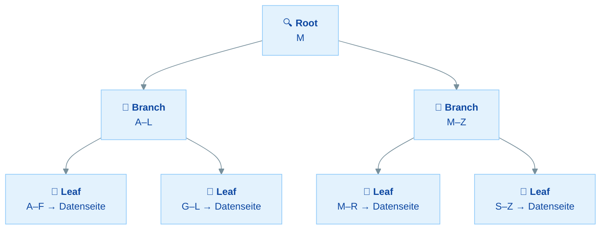
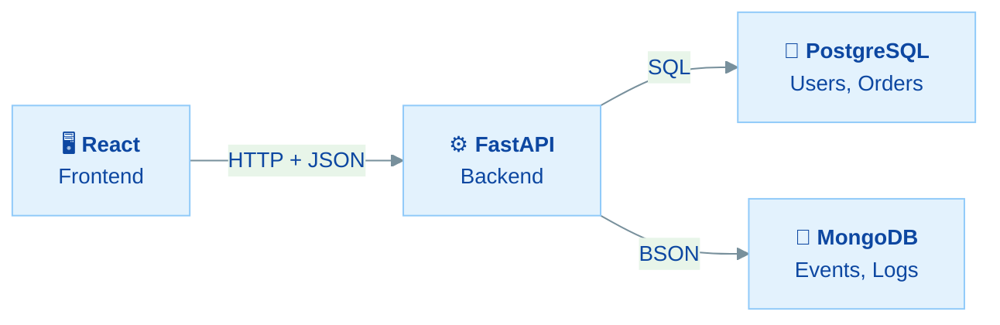

---
tags:
  - PostgreSQL
  - Datenbanken
  - MongoDB
  - FastAPI
---
# Performance & MongoDB – Praktische Übungen

## Übersicht

In dieser Übung misst du die Performance deiner PostgreSQL-Datenbank und lernst MongoDB als zweites Datenbanksystem kennen:

- **Query-Performance messen** - EXPLAIN ANALYZE nutzen, um Queries zu verstehen
- **Indexes erstellen** - Performance-Optimierung mit B-Tree-Indexes
- **MongoDB installieren** - Lokales Setup der Dokument-Datenbank
- **mongosh CRUD** - Dokumente einfügen, abfragen, aktualisieren und löschen
- **FastAPI + MongoDB** - Events-Endpoint mit motor (async)
- **Polyglot Persistence** - PostgreSQL und MongoDB in einer Anwendung kombinieren

Diese Übung baut auf Tag 1 (PostgreSQL-Setup, `kursapp`-Datenbank) und Tag 2 (FastAPI-Projekt mit SQLAlchemy) auf.

| Teil | Thema | Zeitbedarf |
|------|-------|------------|
| **Rückblick** | Performance & das Dokument-Modell | 10 min (lesen) |
| **Teil 1** | PostgreSQL Performance | 30 min |
| **Teil 2** | MongoDB installieren & CRUD | 30 min |
| **Teil 3** | FastAPI + MongoDB (Polyglot) | 25 min |
| | **Gesamt** | **ca. 2–2,5 Stunden** |

**Minimalpfad (ca. 90 Minuten):** Teil 1 (PostgreSQL Performance) und Teil 2 (MongoDB Setup & CRUD). Die FastAPI-Integration (Teil 3) und Bonus sind optional, werden aber empfohlen.

---

## Rückblick: Performance & das Dokument-Modell

Bevor wir loslegen, ein kurzer Rückblick auf die wichtigsten Punkte vom Vormittag.

### Was ist ein Index?

Ein Index ist wie ein **Inhaltsverzeichnis** für eine Datenbank-Tabelle. Ohne Index muss PostgreSQL jede Zeile einzeln prüfen (**Sequential Scan**). Mit Index findet es den Wert über eine Baumstruktur (**Index Scan**) – bei 1 Million Zeilen in ~20 Schritten statt 1 Million Vergleichen.



### Index: Vorteile und Kosten

| Vorteil | Kosten |
|---------|--------|
| SELECTs werden schneller | INSERTs/UPDATEs werden langsamer |
| WHERE, JOIN, ORDER BY profitieren | Jeder Index braucht Speicherplatz |
| Große Tabellen profitieren am meisten | Bei kleinen Tabellen kaum Unterschied |

**Faustregel:** Index auf Spalten, die oft in WHERE, JOIN oder ORDER BY vorkommen. Nicht auf Spalten, die sehr häufig geschrieben werden.

### Relational vs Dokument

| Konzept | PostgreSQL (Relational) | MongoDB (Dokument) |
|---------|------------------------|-------------------|
| Datencontainer | Table | Collection |
| Eintrag | Row | Document (JSON/BSON) |
| Feld | Column | Field |
| Primärschlüssel | Primary Key (uuid) | `_id` (ObjectId) |
| Beziehungen | Foreign Key + JOIN | Embed oder `$lookup` |
| Schema | Fest (ALTER TABLE) | Flexibel (verschiedene Felder pro Dokument) |

### Polyglot Persistence



> **Polyglot Persistence** = Verschiedene Datenbanken für verschiedene Aufgaben. PostgreSQL für strukturierte Geschäftsdaten (ACID, JOINs), MongoDB für flexible Event-Daten (Logs, Analytics).

### Häufige Fehlannahmen

| Behauptung | Realität |
|-----------|---------|
| "MongoDB ist schneller als PostgreSQL" | Kommt auf die Query an – beide können schnell oder langsam sein |
| "NoSQL braucht kein Schema" | Schema-flexibel ≠ schema-los – Validierung ist trotzdem empfohlen |
| "Man muss sich für eine DB entscheiden" | Polyglot Persistence: verschiedene DBs für verschiedene Aufgaben |
| "NoSQL ist moderner" | Beide Ansätze haben Stärken – die richtige Wahl hängt vom Use-Case ab |

### Wissensfrage 1

Was macht ein Index und warum hat er Kosten?

<details markdown>
<summary>Antwort anzeigen</summary>

**Was er macht:** Ein Index erstellt eine sortierte Datenstruktur (B-Tree), die PostgreSQL erlaubt, Werte schnell zu finden – statt alle Zeilen zu durchsuchen (Sequential Scan), springt die DB direkt zur richtigen Stelle (Index Scan).

**Warum er Kosten hat:**
1. **Schreiboperationen werden langsamer:** Bei jedem INSERT, UPDATE oder DELETE muss auch der Index aktualisiert werden.
2. **Speicherplatz:** Der Index braucht zusätzlichen Platz auf der Festplatte.
3. **Wartung:** PostgreSQL muss den Index bei vielen Änderungen gelegentlich reorganisieren.

</details>

### Wissensfrage 2

Wie erkennst du in der EXPLAIN-Ausgabe, ob ein Index benutzt wird?

<details markdown>
<summary>Antwort anzeigen</summary>

- **Ohne Index:** Die Ausgabe zeigt `Seq Scan` (Sequential Scan) – PostgreSQL prüft jede Zeile.
- **Mit Index:** Die Ausgabe zeigt `Index Scan using idx_name` – PostgreSQL nutzt den Index.

Weitere Hinweise:
- `Filter:` = PostgreSQL filtert nach dem Lesen (kein Index für diese Bedingung)
- `Index Cond:` = PostgreSQL nutzt den Index für diese Bedingung (schneller)
- `EXPLAIN ANALYZE` zeigt zusätzlich die tatsächliche Ausführungszeit (`Execution Time`)

</details>

---

## Teil 1: PostgreSQL Performance

### Übung 1: Testdaten erzeugen und Query analysieren

> **Ziel:** Testdaten erstellen und eine Query mit EXPLAIN ANALYZE analysieren
> **Zeitbedarf:** ca. 10 Minuten
> **Du bist fertig, wenn:** Du die EXPLAIN-Ausgabe gelesen und die Execution Time notiert hast

Verbinde dich mit deiner `kursapp`-Datenbank:

```bash
psql -h localhost -U postgres -d kursapp
```

**Schritt 1: Testdaten einfügen**

Füge 5.000 Test-User ein, damit wir genug Daten für aussagekräftige Performance-Messungen haben:

```sql
-- Safety Net: Bis PostgreSQL 12 kommt gen_random_uuid() aus pgcrypto.
-- Ab PostgreSQL 13 geht es auch ohne – diese Zeile schadet aber nicht.
CREATE EXTENSION IF NOT EXISTS pgcrypto;

INSERT INTO users (id, email, name)
SELECT gen_random_uuid(), 'user' || g || '@example.com', 'User ' || g
FROM generate_series(1, 5000) g
ON CONFLICT DO NOTHING;
```

> **Was passiert hier?** `generate_series(1, 5000)` erzeugt die Zahlen 1 bis 5000. Für jede Zahl wird ein User mit einer eindeutigen Email erstellt. `ON CONFLICT DO NOTHING` überspringt Duplikate.

**Schritt 2: Statistiken aktualisieren**

```sql
ANALYZE users;
```

> **Was macht ANALYZE?** PostgreSQL sammelt Statistiken über die Datenverteilung in der Tabelle. Der Query Planner nutzt diese Statistiken, um den besten Ausführungsplan zu wählen.

**Schritt 3: Query analysieren**

```sql
EXPLAIN ANALYZE SELECT * FROM users WHERE name = 'User 42';
```

> **Warum `name` und nicht `email`?** Die Spalte `email` hat bei uns ein `UNIQUE`-Constraint – PostgreSQL erstellt dafür automatisch einen Index. Um den Unterschied zwischen "ohne Index" und "mit Index" zu sehen, nehmen wir `name` – diese Spalte hat keinen Index.

Du solltest eine Ausgabe wie diese sehen:

```
Seq Scan on users  (cost=0.00..135.00 rows=1 width=64)
  Filter: ((name)::text = 'User 42'::text)
  Rows Removed by Filter: 5002
Planning Time: 0.08 ms
Execution Time: 2.15 ms
```

**Notiere dir:**
- Scan-Typ: `Seq Scan` (Sequential Scan – alle Zeilen werden geprüft)
- `Execution Time`: _____ ms

> **Hinweis:** `EXPLAIN` zeigt nur den *geplanten* Ausführungsplan. `EXPLAIN ANALYZE` führt die Query tatsächlich aus und zeigt die *echte* Zeit. Für Performance-Messungen immer `EXPLAIN ANALYZE` verwenden.

<details markdown>
<summary>Musterlösung anzeigen</summary>

Die genauen Zeiten variieren je nach Rechner. Wichtig ist:

- Du siehst `Seq Scan` (nicht `Index Scan`) – weil `name` keinen Index hat
- Die `Execution Time` liegt typischerweise bei 1–5 ms
- `Rows Removed by Filter: ~5000` zeigt, dass PostgreSQL alle Zeilen prüfen musste

Nach der Übung 2 (mit Index auf `name`) wird sich das deutlich verbessern.

</details>

---

### Übung 2: Index erstellen und Performance vergleichen

> **Ziel:** Einen Index erstellen und den Performance-Unterschied messen
> **Zeitbedarf:** ca. 10 Minuten
> **Du bist fertig, wenn:** EXPLAIN ANALYZE `Index Scan` statt `Seq Scan` zeigt

**Schritt 1: Index auf name erstellen**

```sql
CREATE INDEX idx_users_name ON users (name);
```

**Schritt 2: Gleiche Query nochmal analysieren**

```sql
EXPLAIN ANALYZE SELECT * FROM users WHERE name = 'User 42';
```

Jetzt solltest du sehen:

```
Index Scan using idx_users_name on users  (cost=0.28..8.29 rows=1 width=64)
  Index Cond: ((name)::text = 'User 42'::text)
Planning Time: 0.09 ms
Execution Time: 0.04 ms
```

**Trage deine Ergebnisse ein:**

| | Ohne Index | Mit Index |
|-|-----------|-----------|
| **Scan-Typ** | Seq Scan | Index Scan |
| **Execution Time** | _____ ms | _____ ms |

**Schritt 3: Multi-Column-Index erstellen**

Erstelle einen Index über mehrere Spalten für die `orders`-Tabelle:

```sql
CREATE INDEX idx_orders_user_status ON orders (user_id, status);
```

> **Multi-Column-Index:** Die Reihenfolge der Spalten ist wichtig! Der Index wird nur genutzt, wenn die erste Spalte (`user_id`) in der WHERE-Bedingung vorkommt. Ein Query mit nur `WHERE status = 'pending'` profitiert nicht von diesem Index.

**Schritt 4: Bestehende Indexes anzeigen**

```sql
\di
```

Du siehst alle Indexes in der Datenbank – inklusive der automatisch erstellten (für Primary Keys und UNIQUE-Constraints).

### Cardinality: Wann lohnt sich ein Index?

| Spalte | Cardinality | Index sinnvoll? |
|--------|------------|-----------------|
| `email` | Hoch (jeder Wert einzigartig) | Ja – wird durch UNIQUE automatisch indexiert |
| `name` | Hoch (viele verschiedene Werte) | Ja – Index kann gezielt zugreifen |
| `user_id` | Hoch (viele verschiedene User) | Ja – bei JOINs und WHERE |
| `created` | Hoch (viele verschiedene Zeitpunkte) | Ja – bei ORDER BY und Zeitfiltern |
| `status` | Niedrig (wenige Werte: pending, done) | Oft nicht – Index filtert wenig |
| `is_active` | Sehr niedrig (nur true/false) | Nein – Sequential Scan oft schneller |

> **Cardinality** = Anzahl verschiedener Werte in einer Spalte. Je höher die Cardinality, desto nützlicher ist ein Index.

<details markdown>
<summary>Musterlösung anzeigen</summary>

Typische Ergebnisse (variieren je nach System):

| | Ohne Index | Mit Index |
|-|-----------|-----------|
| **Scan-Typ** | Seq Scan | Index Scan |
| **Execution Time** | 1–5 ms | 0.02–0.1 ms |

Das ist ein Unterschied von Faktor **20–100x**! Bei größeren Tabellen (Millionen Zeilen) wird der Unterschied noch dramatischer.

> **Gut zu wissen:** Bei wenigen Zeilen kann PostgreSQL trotz Index einen Seq Scan wählen – der kostenbasierte Planner entscheidet, was schneller ist. Das ist kein Fehler! Bei mehr Daten (z.B. `generate_series(1, 50000)` statt 5000) wird der Unterschied deutlicher.

Die `\di`-Ausgabe zeigt:
```
             List of relations
 Schema |         Name          | Type  | Owner    | Table
--------+-----------------------+-------+----------+--------
 public | idx_orders_user_status| index | postgres | orders
 public | idx_users_name        | index | postgres | users
 public | orders_pkey           | index | postgres | orders
 public | users_email_key       | index | postgres | users
 public | users_pkey            | index | postgres | users
```

> Beachte: `users_email_key` wurde automatisch durch das `UNIQUE`-Constraint auf `email` erstellt. `idx_users_name` ist der Index, den du manuell angelegt hast.

</details>

---

### Übung 3: Query-Patterns testen

> **Ziel:** Verschiedene Query-Patterns mit EXPLAIN ANALYZE testen
> **Zeitbedarf:** ca. 10 Minuten
> **Du bist fertig, wenn:** Du mindestens 3 verschiedene Query-Patterns mit EXPLAIN ANALYZE getestet hast

### Query-Patterns-Referenz

| Pattern | Beispiel | Profitiert von Index? |
|---------|---------|----------------------|
| `WHERE =` | `WHERE name = 'User 42'` | Ja, bei hoher Cardinality |
| `WHERE IN` | `WHERE status IN ('pending', 'done')` | Ja, abhängig von der Werteanzahl |
| `ORDER BY` | `ORDER BY created DESC` | Ja, wenn passender Index existiert |
| `JOIN` | `JOIN users ON users.id = orders.user_id` | Ja, auf FK-Spalte |
| `LIKE 'abc%'` | `WHERE email LIKE 'user1%'` | Ja (oft, Präfix-Suche) |
| `LIKE '%abc'` | `WHERE email LIKE '%example.com'` | **Nein** (Suffix-Suche) |

**Aufgabe:** Teste mindestens 3 dieser Patterns mit EXPLAIN ANALYZE:

```sql
-- Pattern 1: WHERE = (sollte Index nutzen)
EXPLAIN ANALYZE SELECT * FROM users WHERE email = 'user100@example.com';

-- Pattern 2: LIKE Präfix (sollte Index nutzen)
EXPLAIN ANALYZE SELECT * FROM users WHERE email LIKE 'user1%';

-- Pattern 3: LIKE Suffix (kann keinen Index nutzen!)
EXPLAIN ANALYZE SELECT * FROM users WHERE email LIKE '%example.com';

-- Pattern 4: ORDER BY
EXPLAIN ANALYZE SELECT * FROM users ORDER BY email LIMIT 10;
```

> **Beobachte:** Bei welchen Queries siehst du `Index Scan` und bei welchen `Seq Scan`? Die `LIKE '%...'`-Suche (Suffix) kann keinen B-Tree-Index nutzen – dafür bräuchte man einen speziellen Index-Typ.

### Performance-Checkliste

Für den Alltag – so optimiert ihr eure Queries:

1. **Indexes prüfen** – Gibt es Indexes auf den WHERE/JOIN/ORDER BY-Spalten?
2. **EXPLAIN ANALYZE nutzen** – Nicht raten, sondern messen
3. **Auf Seq Scan achten** – Bei großen Tabellen ist Seq Scan oft ein Warnsignal
4. **`SELECT *` vermeiden** – Nur die Spalten abfragen, die ihr braucht
5. **LIMIT nutzen** – Nicht mehr Zeilen laden als nötig
6. **N+1-Problem vermeiden** – Nicht in einer Schleife einzelne Queries schicken (lieber JOIN oder IN)

<details markdown>
<summary>Musterlösung anzeigen</summary>

Erwartete Ergebnisse:

| Query | Scan-Typ | Warum? |
|-------|----------|--------|
| `WHERE email = '...'` | Index Scan | Index auf email existiert |
| `LIKE 'user1%'` | Index Scan | Präfix-Suche kann B-Tree nutzen |
| `LIKE '%example.com'` | Seq Scan | Suffix-Suche braucht vollen Tabellenscan |
| `ORDER BY email LIMIT 10` | Index Scan | Index ist bereits sortiert |

</details>

---

## Teil 2: MongoDB installieren & CRUD

### Übung 4: MongoDB installieren

> **Ziel:** MongoDB Community Edition lokal installieren und mongosh starten
> **Zeitbedarf:** ca. 15 Minuten
> **Du bist fertig, wenn:** `mongosh` den Prompt zeigt und `show dbs` Datenbanken listet

Wähle die Anleitung für dein Betriebssystem:

#### Windows

1. Öffne [mongodb.com/try/download/community](https://www.mongodb.com/try/download/community) und lade den **MSI-Installer** herunter
2. Starte den Installer:
   - Wähle **Complete** Installation
   - Aktiviere **Install MongoDB as a Service** (empfohlen)
   - MongoDB Compass kannst du optional mitinstallieren
3. Lade zusätzlich **mongosh** herunter: [mongodb.com/try/download/shell](https://www.mongodb.com/try/download/shell)
4. Installiere mongosh und stelle sicher, dass es im PATH ist

**Überprüfung:** Öffne eine **neue** Eingabeaufforderung:

```bash
mongosh --version
```

> **Hinweis:** Falls `mongosh` nicht gefunden wird, suche im Startmenü nach "MongoDB Shell" oder füge den Pfad manuell zum PATH hinzu (typisch: `C:\Program Files\mongosh\`).

> **Wichtig (WSL-Nutzer):** MongoDB Community wird in WSL offiziell nicht unterstützt. Nutze den Windows-Installer (MSI) direkt – nicht die Linux-Anleitung in WSL. Docker als Alternative kommt nächste Woche.

#### macOS

```bash
brew tap mongodb/brew
brew install mongodb-community@7.0
```

> **Hinweis:** Falls `mongodb-community@7.0` nicht gefunden wird, prüfe die aktuelle Version auf [mongodb.com/docs/manual/tutorial/install-mongodb-on-os-x](https://www.mongodb.com/docs/manual/tutorial/install-mongodb-on-os-x/) und passe die Versionsnummer an.

Server starten:

```bash
brew services start mongodb-community@7.0
```

mongosh ist automatisch dabei. **Überprüfung:**

```bash
mongosh --version
```

#### Linux (Ubuntu/Debian)

```bash
# MongoDB GPG Key und Repository hinzufügen
# Version (hier 7.0) ggf. anpassen – aktuelle Version auf mongodb.com/docs/manual/installation prüfen
curl -fsSL https://www.mongodb.org/static/pgp/server-7.0.asc | sudo gpg -o /usr/share/keyrings/mongodb-server-7.0.gpg --dearmor
echo "deb [ signed-by=/usr/share/keyrings/mongodb-server-7.0.gpg ] https://repo.mongodb.org/apt/ubuntu jammy/mongodb-org/7.0 multiverse" | sudo tee /etc/apt/sources.list.d/mongodb-org-7.0.list
sudo apt update
sudo apt install -y mongodb-org
```

Server starten:

```bash
sudo systemctl start mongod
sudo systemctl enable mongod
```

**Überprüfung:**

```bash
mongosh --version
```

#### Verbindung testen

Starte mongosh:

```bash
mongosh
```

Du solltest einen Prompt sehen wie:

```
Current Mongosh Log ID: 665a1b2c...
Connecting to:          mongodb://127.0.0.1:27017/
Using MongoDB:          x.x.x    ← (deine installierte Version)
test>
```

Teste die Verbindung:

```javascript
show dbs
```

Du siehst die Standard-Datenbanken (`admin`, `config`, `local`).

### Troubleshooting

| Problem | Ursache | Lösung |
|---------|---------|--------|
| `mongosh` nicht gefunden | Nicht im PATH | Startmenü (Win) oder PATH anpassen |
| `Connection refused` | MongoDB-Dienst läuft nicht | Dienst starten (siehe oben) |
| Port 27017 belegt | Anderer Prozess nutzt den Port | Prozess finden: Win `netstat -ano \| findstr 27017`, macOS/Linux `lsof -i :27017` – dann blockierenden Prozess beenden |
| Permission denied (Linux) | Fehlende Rechte | `sudo systemctl start mongod` |

**Server-Status prüfen** (läuft der Dienst wirklich?):

```bash
# macOS
brew services list

# Linux
systemctl status mongod

# Windows: Win+R → services.msc → nach "MongoDB Server" suchen
```

---

### Übung 5: MongoDB CRUD in mongosh

> **Ziel:** Dokumente in MongoDB einfügen, abfragen, aktualisieren und löschen
> **Zeitbedarf:** ca. 10 Minuten
> **Du bist fertig, wenn:** `db.events.find()` deine eingefügten Dokumente zeigt

**Schritt 1: Datenbank wechseln**

```javascript
use kursapp
```

> **Hinweis:** MongoDB erstellt die Datenbank automatisch, sobald du das erste Dokument einfügst. `use kursapp` wechselt zur Datenbank – sie existiert noch nicht physisch.

**Schritt 2: Dokument einfügen (insertOne)**

```javascript
db.events.insertOne({
    type: "login",
    user: "max@example.com",
    payload: {
        ip: "192.168.1.42",
        browser: "Chrome"
    },
    ts: new Date()
})
```

> **Beachte:** Das Dokument hat verschachtelte Felder (`payload.ip`, `payload.browser`) und ein Array wäre auch möglich. MongoDB speichert das als **BSON** (Binary JSON) – mit zusätzlichen Typen wie `ObjectId`, `Date` und `Decimal128`.

Füge noch ein paar Events ein:

```javascript
db.events.insertOne({
    type: "page_view",
    user: "anna@example.com",
    payload: { path: "/dashboard", duration_ms: 1200 },
    ts: new Date()
})

db.events.insertOne({
    type: "login",
    user: "max@example.com",
    payload: { ip: "10.0.0.1", browser: "Firefox" },
    ts: new Date()
})
```

**Schritt 3: Dokumente abfragen (find)**

```javascript
// Alle Events anzeigen
db.events.find()

// Nach Typ filtern
db.events.find({ type: "login" })

// Nach verschachteltem Feld filtern (Punkt-Notation)
db.events.find({ "payload.browser": "Chrome" })
```

> **Schema-flexibel:** Beachte, dass die Events unterschiedliche Felder in `payload` haben (ip+browser vs path+duration_ms). Das ist in MongoDB erlaubt – jedes Dokument kann eigene Felder haben. Das heißt aber nicht "kein Schema" – Validierung ist trotzdem empfohlen!

**Schritt 4: Dokument aktualisieren (updateOne)**

```javascript
db.events.updateOne(
    { user: "max@example.com", type: "login" },
    { $set: { "payload.browser": "Chrome 120" } }
)
```

> **`$set`** ändert nur das angegebene Feld – der Rest des Dokuments bleibt unverändert.

**Schritt 5: Dokument löschen (deleteOne)**

```javascript
db.events.deleteOne({ type: "page_view" })
```

**Überprüfung:**

```javascript
db.events.find()
```

Du solltest noch mindestens 2 Dokumente sehen.

<details markdown>
<summary>Musterlösung anzeigen</summary>

Die Ausgabe von `db.events.find()` zeigt Dokumente mit automatisch generierten `_id`-Feldern:

```javascript
[
  {
    _id: ObjectId('665a1b2c3d4e5f6a7b8c9d01'),
    type: 'login',
    user: 'max@example.com',
    payload: { ip: '192.168.1.42', browser: 'Chrome 120' },
    ts: ISODate('2025-06-15T14:30:00.000Z')
  },
  {
    _id: ObjectId('665a1b2c3d4e5f6a7b8c9d03'),
    type: 'login',
    user: 'max@example.com',
    payload: { ip: '10.0.0.1', browser: 'Firefox' },
    ts: ISODate('2025-06-15T14:31:00.000Z')
  }
]
```

Die MongoDB-CRUD-Befehle im Vergleich zu SQL:

| MongoDB | SQL (PostgreSQL) |
|---------|-----------------|
| `db.events.insertOne({...})` | `INSERT INTO events (...) VALUES (...)` |
| `db.events.find({type: "login"})` | `SELECT * FROM events WHERE type = 'login'` |
| `db.events.updateOne({...}, {$set: {...}})` | `UPDATE events SET ... WHERE ...` |
| `db.events.deleteOne({...})` | `DELETE FROM events WHERE ...` |

</details>

### Wissensfrage 3

Was ist der Unterschied zwischen **Embed** und **Reference** in MongoDB?

<details markdown>
<summary>Antwort anzeigen</summary>

**Embed** (Einbetten): Zusammengehörige Daten werden direkt im Dokument verschachtelt.

```javascript
// Embed: Adresse im User-Dokument
{ "name": "Max", "address": { "street": "Hauptstr. 1", "city": "Berlin" } }
```

**Reference** (Referenzieren): Daten werden in getrennten Collections gespeichert und über IDs verknüpft.

```javascript
// users Collection
{ "name": "Max", "address_id": ObjectId("...") }

// addresses Collection
{ "_id": ObjectId("..."), "street": "Hauptstr. 1", "city": "Berlin" }
```

**Entscheidungshilfe:**

| Kriterium | → Embed | → Reference |
|-----------|---------|-------------|
| Beziehung | 1:1 oder 1:wenige | 1:viele oder n:m |
| Zugriff | Immer zusammen geladen | Oft einzeln benötigt |
| Größe | Klein und stabil | Groß oder wachsend |
| Beispiel | User → Settings | User → Orders |

</details>

---

### Übung 6: MongoDB Indexes und explain

> **Ziel:** Einen Index in MongoDB erstellen und den Performance-Unterschied messen
> **Zeitbedarf:** ca. 5 Minuten
> **Du bist fertig, wenn:** `explain` den Scan-Typ `IXSCAN` statt `COLLSCAN` zeigt

**Schritt 1: Query ohne Index analysieren**

```javascript
db.events.find({ user: "max@example.com" }).explain("executionStats")
```

Suche in der Ausgabe nach `winningPlan.stage` – es sollte `COLLSCAN` zeigen (Collection Scan = alle Dokumente durchsuchen, wie Seq Scan in PostgreSQL).

**Schritt 2: Index erstellen**

```javascript
db.events.createIndex({ user: 1 })
```

> **`1`** = aufsteigend sortiert. `-1` wäre absteigend.

**Schritt 3: Query mit Index analysieren**

```javascript
db.events.find({ user: "max@example.com" }).explain("executionStats")
```

Jetzt sollte `IXSCAN` (Index Scan) statt `COLLSCAN` erscheinen.

**Schritt 4: Alle Indexes anzeigen**

```javascript
db.events.getIndexes()
```

Du siehst den Standard-Index auf `_id` und deinen neuen Index auf `user`.

<details markdown>
<summary>Musterlösung anzeigen</summary>

Vergleich MongoDB vs PostgreSQL:

| Konzept | PostgreSQL | MongoDB |
|---------|-----------|---------|
| Ohne Index | `Seq Scan` | `COLLSCAN` |
| Mit Index | `Index Scan` | `IXSCAN` |
| Index erstellen | `CREATE INDEX idx ON tbl (col)` | `db.col.createIndex({ field: 1 })` |
| Indexes anzeigen | `\di` | `db.col.getIndexes()` |
| Query analysieren | `EXPLAIN ANALYZE ...` | `.explain("executionStats")` |

Die Ausgabe von `getIndexes()`:

```javascript
[
  { v: 2, key: { _id: 1 }, name: '_id_' },
  { v: 2, key: { user: 1 }, name: 'user_1' }
]
```

</details>

---

## Teil 3: FastAPI + MongoDB (Polyglot)

### Übung 7: Events-Endpoint mit motor

> **Ziel:** Einen FastAPI-Endpoint erstellen, der Events in MongoDB speichert und abruft
> **Zeitbedarf:** ca. 15 Minuten
> **Du bist fertig, wenn:** POST /events speichert in MongoDB und GET /events gibt die Dokumente zurück

> **Polyglot in Aktion:** Eure App nutzt jetzt PostgreSQL für Users/Orders (strukturierte Daten mit ACID) und MongoDB für Events (flexible, schema-freie Logs). Das ist das Polyglot-Persistence-Pattern.

**Schritt 1: motor installieren**

Wechsle in dein `backend/`-Verzeichnis (aus Tag 2) und aktiviere das venv:

```bash
pip install motor
```

> **Was ist motor?** Motor ist der asynchrone MongoDB-Treiber für Python. Er passt perfekt zu FastAPI, weil FastAPI ebenfalls asynchron arbeitet.

**Schritt 2: MongoDB-Verbindung erstellen**

Erstelle die Datei `app/mongodb.py`:

```python
from motor.motor_asyncio import AsyncIOMotorClient

MONGODB_URL = "mongodb://localhost:27017"

client = AsyncIOMotorClient(MONGODB_URL)
mongodb = client.kursapp
```

> **Tipp für Produktion:** In einer echten App würde man `MONGODB_URL` aus einer `.env`-Datei laden (wie `DATABASE_URL` in Tag 2) und den Client im Lifecycle der App starten/stoppen (`app.on_event("startup")` / `"shutdown"`). Für diese Übung reicht die einfache Variante.

**Schritt 3: Events-Endpoints hinzufügen**

Füge in `app/main.py` die neuen Endpoints hinzu:

```python
from app.mongodb import mongodb


@app.post("/events", status_code=201)
async def create_event(event: dict):
    result = await mongodb.events.insert_one(event)
    return {"id": str(result.inserted_id)}


@app.get("/events")
async def list_events(user: str | None = None):
    query = {"user": user} if user else {}
    events = await mongodb.events.find(query).to_list(100)
    for e in events:
        e["_id"] = str(e["_id"])  # ObjectId → String für JSON
    return events
```

**Was ist neu?**

- `async def` statt `def` – motor ist asynchron, daher brauchen wir `await`
- `mongodb.events` – greift auf die `events`-Collection in der `kursapp`-Datenbank zu
- `ObjectId → String` – MongoDB's `_id` ist ein `ObjectId` (kein JSON-Typ). Wir konvertieren mit `str()`, damit FastAPI es als JSON zurückgeben kann
- **Tipp:** Wenn du ein `ts`-Feld beim Insert setzen willst, nutze `from datetime import datetime` und `"ts": datetime.utcnow()` im Request-Body

**Schritt 4: Server starten und testen**

```bash
uvicorn app.main:app --reload
```

Öffne `http://localhost:8000/docs` und teste:

1. **POST /events** mit Body:
   ```json
   {
     "type": "login",
     "user": "max@example.com",
     "payload": {"ip": "192.168.1.42", "browser": "Chrome"}
   }
   ```

2. **GET /events** – zeigt alle Events

3. **GET /events?user=max@example.com** – filtert nach User

<details markdown>
<summary>Musterlösung anzeigen</summary>

Die vollständige `app/mongodb.py`:

```python
from motor.motor_asyncio import AsyncIOMotorClient

MONGODB_URL = "mongodb://localhost:27017"

client = AsyncIOMotorClient(MONGODB_URL)
mongodb = client.kursapp
```

Die Events-Endpoints in `app/main.py`:

```python
from app.mongodb import mongodb

@app.post("/events", status_code=201)
async def create_event(event: dict):
    result = await mongodb.events.insert_one(event)
    return {"id": str(result.inserted_id)}

@app.get("/events")
async def list_events(user: str | None = None):
    query = {"user": user} if user else {}
    events = await mongodb.events.find(query).to_list(100)
    for e in events:
        e["_id"] = str(e["_id"])
    return events
```

Eure App hat jetzt **zwei Datenbanken**:
- PostgreSQL: `/users`, `/orders` (SQLAlchemy, synchron)
- MongoDB: `/events` (motor, asynchron)

</details>

### Wissensfrage 4

Wann würdest du Embed (einbetten) und wann Reference (verweisen) in MongoDB verwenden?

<details markdown>
<summary>Antwort anzeigen</summary>

**Embed** wenn:
- Die Daten eine 1:1 oder 1:wenige Beziehung haben
- Die Daten immer zusammen geladen werden
- Die eingebetteten Daten klein und stabil sind

**Beispiel:** User mit Settings → Settings direkt im User-Dokument einbetten.

**Reference** wenn:
- Die Daten eine 1:viele oder n:m Beziehung haben
- Die Daten oft einzeln abgefragt werden
- Die referenzierten Daten groß sind oder häufig wachsen

**Beispiel:** User mit Orders → Orders in eigener Collection, Referenz über `user_id`.

</details>

### Wissensfrage 5

Nenne je zwei Use-Cases, bei denen PostgreSQL und bei denen MongoDB die bessere Wahl wäre.

<details markdown>
<summary>Antwort anzeigen</summary>

**PostgreSQL ist besser bei:**
1. **Geschäftslogik und Transaktionen** – z.B. Bestellungen, Kontobewegungen (ACID-Garantie)
2. **Komplexe Beziehungen** – z.B. User → Orders → Produkte (JOINs über mehrere Tabellen)

**MongoDB ist besser bei:**
1. **Events und Logs** – z.B. Login-Events, Analytics-Daten (hoher Schreibdurchsatz, flexible Payloads)
2. **CMS/Content** – z.B. Artikel mit variablen Feldern (ein Artikel hat Video, ein anderer Galerie)

**Zusatz:** Beide gleichzeitig nutzen (Polyglot Persistence) ist eine valide und gängige Architektur.

</details>

---

### Übung 8: Audit-Log Vergleich (Optional)

> **Ziel:** Dasselbe Feature (Audit-Log) in beiden Datenbanken umsetzen und vergleichen
> **Zeitbedarf:** ca. 10 Minuten
> **Du bist fertig, wenn:** Du einen Audit-Log-Eintrag in PostgreSQL und in MongoDB erstellt hast

**PostgreSQL-Variante (JSONB):**

Erstelle in psql die Audit-Log-Tabelle:

```sql
CREATE TABLE audit_log (
    id      uuid PRIMARY KEY DEFAULT gen_random_uuid(),
    user_id uuid REFERENCES users(id),
    action  TEXT NOT NULL,
    payload JSONB,
    ts      TIMESTAMPTZ DEFAULT now()
);

-- Eintrag erstellen (user1@ existiert garantiert aus den Testdaten)
INSERT INTO audit_log (user_id, action, payload)
VALUES (
    (SELECT id FROM users WHERE email = 'user1@example.com'),
    'login',
    '{"ip": "192.168.1.42", "browser": "Chrome"}'::jsonb
);

-- Abfragen
SELECT * FROM audit_log ORDER BY ts DESC LIMIT 10;
```

**MongoDB-Variante:**

In mongosh:

```javascript
db.audit_log.insertOne({
    user_id: "user1@example.com",
    action: "login",
    payload: { ip: "192.168.1.42", browser: "Chrome" },
    ts: new Date()
})

db.audit_log.find({ user_id: "user1@example.com" }).sort({ ts: -1 }).limit(10)
```

> **Vergleich:** Beide Varianten funktionieren. PostgreSQL nutzt `JSONB` für flexible Payloads innerhalb eines festen Schemas. MongoDB erlaubt von Haus aus flexible Strukturen. Für einen Audit-Log, der nur geschrieben und selten mit JOINs abgefragt wird, kann MongoDB die einfachere Lösung sein.

### Wissensfrage 6

Vergleiche die PostgreSQL- und MongoDB-Variante des Audit-Logs: Was sind die Vor- und Nachteile jedes Ansatzes?

<details markdown>
<summary>Antwort anzeigen</summary>

| Aspekt | PostgreSQL (JSONB) | MongoDB |
|--------|-------------------|---------|
| **Schema** | Feste Spalten + flexibles JSONB-Feld | Komplett flexibel |
| **Referenzen** | FK auf `users(id)` → Datenintegrität | Kein FK → User-ID könnte ungültig sein |
| **Abfragen** | SQL + JSONB-Operatoren (`->`, `->>`) | Native JSON-Queries |
| **Transaktionen** | ACID-Garantie | Möglich, aber weniger üblich |
| **Schreiblast** | Gut, aber bei sehr vielen Writes overhead durch FK-Check | Optimiert für hohen Schreibdurchsatz |

**Fazit:** Für Audit-Logs, die hohen Schreibdurchsatz brauchen und selten mit JOINs abgefragt werden, ist MongoDB oft die einfachere Wahl. Wenn der Audit-Log eng mit Geschäftsdaten verknüpft ist (FK-Integrität wichtig), ist PostgreSQL besser.

</details>

---

## Zusammenfassung

### Was du heute gelernt hast

| Konzept | Beschreibung | Beispiel |
|---------|-------------|---------|
| **Index** | Sortierte Datenstruktur für schnelle Suche | `CREATE INDEX idx ON users (name)` |
| **EXPLAIN ANALYZE** | Query-Performance messen | `EXPLAIN ANALYZE SELECT ...` |
| **Seq Scan vs Index Scan** | Ohne vs mit Index | 2 ms → 0.04 ms |
| **Cardinality** | Anzahl verschiedener Werte | email (hoch) vs status (niedrig) |
| **MongoDB** | Dokument-Datenbank (JSON/BSON) | `db.events.insertOne({...})` |
| **Collection/Document** | MongoDB-Äquivalente zu Table/Row | `db.events.find({type: "login"})` |
| **Embed vs Reference** | Einbetten vs Verweisen | 1:1 → Embed, 1:n → Reference |
| **motor** | Async MongoDB-Treiber für Python | `AsyncIOMotorClient(...)` |
| **Polyglot Persistence** | Mehrere DBs in einer App | PostgreSQL + MongoDB |

### Performance-Checkliste

1. ✅ Indexes auf WHERE/JOIN/ORDER BY-Spalten prüfen
2. ✅ EXPLAIN ANALYZE nutzen – nicht raten, sondern messen
3. ✅ Auf Seq Scan bei großen Tabellen achten
4. ✅ `SELECT *` vermeiden – nur benötigte Spalten abfragen
5. ✅ LIMIT nutzen – nicht mehr laden als nötig
6. ✅ N+1-Problem vermeiden – JOINs oder IN statt Schleifen-Queries

### Ausblick: Tag 4

Morgen geht es um **AWS RDS – Managed PostgreSQL in der Cloud**! Ihr lernt:

- **AWS RDS** – PostgreSQL als Managed Service
- **Datenbank-Landschaft** – RDS, Aurora, DocumentDB im Überblick
- **Netzwerk & Security** – VPC, Security Groups, öffentlicher Zugang
- **Connection Strings** – Von `localhost` auf Cloud umstellen

Stellt sicher, dass euer PostgreSQL- und MongoDB-Setup lokal funktioniert – das ist die Voraussetzung für den Vergleich mit der Cloud.

---

## Bonus

### Bonus 1: Index-Experiment mit großen Datenmengen

Füge 50.000 Zeilen ein und miss den Unterschied:

```sql
-- Erst den alten Index löschen (falls vorhanden)
DROP INDEX IF EXISTS idx_users_name;

-- 50.000 Zeilen einfügen
INSERT INTO users (id, email, name)
SELECT gen_random_uuid(), 'bulk' || g || '@example.com', 'Bulk User ' || g
FROM generate_series(1, 50000) g
ON CONFLICT DO NOTHING;

ANALYZE users;

-- Ohne Index messen
EXPLAIN ANALYZE SELECT * FROM users WHERE name = 'Bulk User 25000';

-- Index erstellen
CREATE INDEX idx_users_name ON users (name);

-- Mit Index messen
EXPLAIN ANALYZE SELECT * FROM users WHERE name = 'Bulk User 25000';
```

> Bei 50.000+ Zeilen wird der Unterschied noch deutlicher – typischerweise 50–200x schneller mit Index.

### Bonus 2: MongoDB Aggregation Pipeline

Zähle die Anzahl Events pro User:

```javascript
db.events.aggregate([
    { $group: { _id: "$user", count: { $sum: 1 } } },
    { $sort: { count: -1 } }
])
```

> Aggregation Pipelines sind MongoDB's Äquivalent zu `GROUP BY` in SQL. Die Daten fließen durch mehrere Stufen (`$group`, `$sort`, `$match`, etc.).

---

## Checkliste

Bevor du in den Feierabend gehst – hast du alles geschafft?

- [ ] EXPLAIN ANALYZE auf die kursapp-Datenbank ausgeführt
- [ ] Mindestens einen Index erstellt und den Performance-Unterschied gemessen
- [ ] Du verstehst den Unterschied zwischen Seq Scan und Index Scan
- [ ] Du weißt, was Cardinality bedeutet und wann ein Index sinnvoll ist
- [ ] MongoDB ist installiert und mongosh funktioniert
- [ ] Du hast Dokumente in MongoDB eingefügt, abgefragt und aktualisiert (CRUD)
- [ ] Du kennst den Unterschied zwischen Embed und Reference
- [ ] FastAPI `/events`-Endpoint speichert Daten in MongoDB
- [ ] Du kannst erklären, wann PostgreSQL und wann MongoDB sinnvoll ist

**Alles abgehakt? Dann bist du bereit für Tag 4!**
