# Docker Grundlagen & Mental Model - Praktische Übungen

## Übersicht

In dieser Übung vertiefst du die Docker-Grundlagen vom Vormittag und wendest sie praktisch an:

- **Das Problem verstehen** - Warum "Works on my machine" ein echtes Problem ist
- **Docker vs. VMs** - Was Docker von virtuellen Maschinen unterscheidet
- **Kernbegriffe** - Image, Container, Layer, Registry und Dockerfile sicher unterscheiden
- **Container-Lifecycle** - Den Lebenszyklus eines Containers verstehen und steuern
- **CLI-Kommandos** - Die wichtigsten Docker-Befehle sicher anwenden
- **Praxis** - Container starten, erkunden, stoppen und Fehler bewusst lösen

Dies ist dein erster Docker-Tag – du brauchst keine Vorkenntnisse in Docker. Stelle sicher, dass Docker Desktop installiert ist und läuft!

---

## Inhaltsverzeichnis

| Teil | Thema | Zeitbedarf |
|------|-------|------------|
| **Rückblick** | Das Problem & Dockers Lösung | 10 min (lesen) |
| **Teil 1** | Docker vs. Virtuelle Maschinen | 15 min |
| **Teil 2** | Kernbegriffe verstehen | 20 min |
| **Teil 3** | Container-Lifecycle | 15 min |
| **Teil 4** | Erste Schritte: hello-world | 20 min |
| **Teil 5** | Praxis: nginx Webserver | 25 min |
| **Teil 6** | Verschiedene Images erkunden | 20 min |
| **Teil 7** | Typische Fehler provozieren & lösen | 20 min |
| **Bonus** | Container-Lifecycle komplett durchspielen | 15 min |
| | **Gesamt** | **ca. 2,5–3 Stunden** |

### Minimalpfad (wenn du wenig Zeit hast)

**In 60–90 Minuten die wichtigsten Konzepte:**

1. **Rückblick** - Problem & Lösung verstehen
2. **Teil 2** - Kernbegriffe - *Grundverständnis*
3. **Teil 4** - hello-world - *Erstes Hands-on*
4. **Teil 5** - nginx Webserver - *Wichtigste Praxisübung*

---

## Voraussetzungen & Setup

**Bevor du startest:**

1. **Docker Desktop** ist installiert und läuft (das Docker-Symbol ist in der Taskleiste sichtbar)
2. Du hast ein **Terminal** offen (PowerShell, CMD, oder Git Bash unter Windows; Terminal unter macOS/Linux)

<details>
<summary>Welche Shell nutze ich? (wichtig für Windows)</summary>

Unter Windows gibt es mehrere Shells – und sie verhalten sich unterschiedlich:

| Shell | Wo zu finden | Empfehlung |
|-------|-------------|------------|
| **Git Bash** | Wird mit Git installiert | Empfohlen – verhält sich wie Linux |
| **CMD** (Eingabeaufforderung) | `cmd` im Startmenü | Funktioniert gut |
| **PowerShell 7+** | `pwsh` im Startmenü | Funktioniert gut |
| **PowerShell 5.1** | `powershell` im Startmenü | Kann Probleme machen |

> **Achtung:** Windows PowerShell 5.1 (die Standard-PowerShell auf vielen Windows-Systemen) unterstützt **kein `&&`** zum Verketten von Befehlen. In dieser Übung schreiben wir Befehle deshalb immer einzeln untereinander. Falls du trotzdem zwei Befehle in einer Zeile verketten willst, nutze in PowerShell 5.1 ein Semikolon: `docker stop web; docker rm web`.

</details>

**Überprüfe deine Installation:**

```bash
docker --version
```

Du solltest eine Versionsnummer sehen, z.B. `Docker version 27.x.x` oder neuer.

```bash
docker run hello-world
```

Falls dies eine Erfolgsmeldung ausgibt, bist du startklar!

<details>
<summary>Hilfe: Docker ist nicht installiert?</summary>

1. Gehe zu [docker.com/products/docker-desktop](https://www.docker.com/products/docker-desktop/) und lade Docker Desktop herunter
2. Installiere es und starte den Computer ggf. neu
3. Starte Docker Desktop – warte, bis das Docker-Symbol in der Taskleiste **nicht mehr animiert**
4. Teste erneut mit `docker --version`

**Windows-spezifisch:** Falls WSL2 nicht installiert ist, folge den Anweisungen im Docker-Desktop-Installer. Du brauchst WSL2 für Docker unter Windows.

</details>

---

## Rückblick: Das Problem & Dockers Lösung

### "Es läuft doch auf meinem Rechner!"

Kennst du das? Die App funktioniert lokal perfekt, aber auf dem Server läuft eine andere Version, ein Kollege hat andere Abhängigkeiten, oder Umgebungsvariablen fehlen.

### Das Grundproblem: Unterschiedliche Umgebungen

```mermaid
%%{init: {'theme': 'base', 'themeVariables': {'primaryColor': '#e3f2fd', 'primaryTextColor': '#0d47a1', 'primaryBorderColor': '#90caf9', 'secondaryColor': '#e8f5e9', 'secondaryTextColor': '#1b5e20', 'secondaryBorderColor': '#a5d6a7', 'tertiaryColor': '#fff3e0', 'tertiaryTextColor': '#e65100', 'tertiaryBorderColor': '#ffcc80', 'lineColor': '#78909c', 'fontSize': '14px'}}}%%
graph LR
    DEV["🖥️ <b>Entwicklung</b><br/>MacOS<br/>Python 3.12<br/>Node 22"] -->|Code übergeben| TEST["🧪 <b>Test</b><br/>Ubuntu<br/>Python 3.11<br/>Node 20"]
    TEST -->|Deployen| PROD["🚀 <b>Produktion</b><br/>Debian<br/>Python 3.10<br/>Node 18"]
```



Jede Umgebung ist anders konfiguriert – Fehler sind vorprogrammiert!

### Dependency Hell

Wenn zwei Projekte auf dem gleichen System laufen, braucht Projekt A vielleicht `numpy==1.24.0` und Projekt B `numpy==1.26.0`. Virtual Environments (wie `venv` in Python) helfen nur teilweise – was ist mit System-Libraries, Datenbanken, Services?

### Die Lösung: Docker

Docker ist eine Plattform, die Anwendungen in **isolierten, reproduzierbaren Umgebungen** (Containern) verpackt und ausführt. Docker löst das Problem durch:

- **Verpacken** der App mit allen Abhängigkeiten in ein **Image**
- **Ausführen** in einem isolierten **Container**
- **Garantie:** Läuft überall gleich!

> **Analogie:** Denke an Frachtcontainer in der Schifffahrt. Vor Containern wurden Waren einzeln verladen – langsam, fehleranfällig, jeder Hafen anders. Mit standardisierten Containern passt alles auf jedes Schiff und jeden LKW. Docker macht dasselbe für Software.

### Wissensfrage 1

Warum reichen Virtual Environments (z.B. Python venv) nicht aus, um das "Works on my machine"-Problem vollständig zu lösen?

<details>
<summary>Antwort anzeigen</summary>

Virtual Environments isolieren nur **Python-Pakete**. Sie lösen nicht:

1. **System-Libraries:** Unterschiedliche Versionen von z.B. libssl, libpq auf verschiedenen Betriebssystemen
2. **Datenbanken:** PostgreSQL, Redis, etc. müssen separat installiert und konfiguriert werden
3. **Betriebssystem-Unterschiede:** macOS vs. Linux vs. Windows verhalten sich unterschiedlich
4. **Umgebungsvariablen:** Müssen auf jedem System manuell gesetzt werden
5. **Andere Sprachen:** Node.js, Java, Go – jede Sprache hat ihr eigenes Dependency-Management

Docker verpackt **alles** – Dateisystem (Userland), Libraries, App, Abhängigkeiten – in ein einziges Image. (Den Kernel des Host-Systems nutzt Docker mit – es wird kein eigenes OS gebootet.)

</details>

### Wissensfrage 2

Was sind die drei Kernversprechen von Docker?

<details>
<summary>Antwort anzeigen</summary>

1. **Isolation:** Jede App läuft in ihrem eigenen Container, unabhängig von anderen Apps und dem Host-System
2. **Reproduzierbarkeit:** Das gleiche Image läuft überall identisch – auf dem Laptop, im CI/CD, in der Cloud
3. **Portabilität:** Ein Docker-Image läuft auf jedem System, das Docker unterstützt (Windows, macOS, Linux, Cloud)

</details>

---

## Teil 1: Docker vs. Virtuelle Maschinen

### Der Vergleich

Bevor es Docker gab, wurden oft **Virtuelle Maschinen (VMs)** verwendet, um Anwendungen zu isolieren. Docker verfolgt einen anderen Ansatz:

```mermaid
%%{init: {'theme': 'base', 'themeVariables': {'primaryColor': '#e3f2fd', 'primaryTextColor': '#0d47a1', 'primaryBorderColor': '#90caf9', 'secondaryColor': '#e8f5e9', 'secondaryTextColor': '#1b5e20', 'secondaryBorderColor': '#a5d6a7', 'tertiaryColor': '#fff3e0', 'tertiaryTextColor': '#e65100', 'tertiaryBorderColor': '#ffcc80', 'lineColor': '#78909c', 'fontSize': '14px'}}}%%
graph TD
    subgraph vm ["Virtuelle Maschine"]
        direction TB
        VA["📦 App"] --> VG["💿 Gast-OS (komplett)"]
        VG --> VH["⚙️ Hypervisor"]
        VH --> VHO["🖥️ Host-OS"]
    end
    subgraph docker ["Docker Container"]
        direction TB
        DA["📦 App + Abhängigkeiten"] --> DE["🐳 Docker Engine"]
        DE --> DHO["🖥️ Host-OS"]
    end
```



| Eigenschaft | Virtuelle Maschine | Docker Container |
|-------------|-------------------|------------------|
| **Startzeit** | Minuten | Sekunden |
| **Größe** | Gigabytes | Megabytes |
| **Isolation** | Vollständig (eigenes OS) | Prozess-Level |
| **Performance** | Overhead durch Virtualisierung | Fast nativ |
| **Ressourcen** | Oft reserviert/konfiguriert | Teilen Host-Kernel dynamisch |

### Der entscheidende Unterschied

Eine VM virtualisiert die **komplette Hardware** und braucht ein **eigenes Betriebssystem**. Ein Docker-Container teilt sich den **Kernel des Host-Systems** und enthält nur die App mit ihren Abhängigkeiten.

### Wissensfrage 3

In welchem Szenario würdest du eher eine VM statt Docker verwenden?

<details>
<summary>Antwort anzeigen</summary>

VMs sind besser geeignet, wenn:

1. **Vollständige Isolation** nötig ist (z.B. unterschiedliche Kernel-Versionen oder unterschiedliche Betriebssysteme)
2. **Sicherheitskritische Anwendungen** stärkere Isolation brauchen als Prozess-Level
3. Du ein **komplett anderes OS** brauchst (z.B. Windows auf einem Linux-Host)
4. Du **GUI-Anwendungen** in einer isolierten Umgebung ausführen willst

Für die meisten Webentwicklungs-Szenarien ist Docker die bessere Wahl – leichtgewichtiger, schneller, ressourcenschonender.

</details>

### Wissensfrage 4

Warum starten Docker-Container in Sekunden, während VMs Minuten brauchen?

<details>
<summary>Antwort anzeigen</summary>

- **VM:** Muss ein komplettes Betriebssystem hochfahren (Kernel laden, Services starten, etc.) – das dauert wie ein normaler Computerstart.
- **Docker:** Nutzt den **Kernel des Host-Systems** mit. Ein Container ist im Grunde nur ein isolierter Prozess – er muss kein OS booten, sondern startet direkt die Anwendung.

Daher: VM = eigenes OS booten (Minuten), Docker = Prozess starten (Sekunden).

</details>

---

## Teil 2: Kernbegriffe verstehen

### Image vs. Container

Das sind die zwei wichtigsten Begriffe in Docker:

**Image:**
- Bauplan / Vorlage
- **Unveränderlich** (read-only)
- Enthält OS, App, Abhängigkeiten
- Kann geteilt werden (z.B. über Docker Hub)

**Container:**
- **Laufende Instanz** eines Images
- Veränderlich (eigene beschreibbare Schicht)
- Isolierter Prozess
- Kurzlebig oder langlebig

> **Merksatz:** Image = Klasse, Container = Objekt (Instanz). Aus einer Klasse kannst du viele Objekte erstellen – aus einem Image viele Container.

```mermaid
%%{init: {'theme': 'base', 'themeVariables': {'primaryColor': '#e3f2fd', 'primaryTextColor': '#0d47a1', 'primaryBorderColor': '#90caf9', 'secondaryColor': '#e8f5e9', 'secondaryTextColor': '#1b5e20', 'secondaryBorderColor': '#a5d6a7', 'tertiaryColor': '#fff3e0', 'tertiaryTextColor': '#e65100', 'tertiaryBorderColor': '#ffcc80', 'lineColor': '#78909c', 'fontSize': '14px'}}}%%
graph TD
    IMG["🐳 <b>nginx:latest</b><br/>IMAGE (read-only)"] --> C1["📦 <b>Container 1</b><br/>Port 8080"]
    IMG --> C2["📦 <b>Container 2</b><br/>Port 8081"]
    IMG --> C3["📦 <b>Container 3</b><br/>Port 8082"]
```



Alle Container teilen sich das gleiche Image, aber jeder hat seinen eigenen Zustand.

### Layers

Ein Docker-Image besteht aus mehreren **Layers** (Schichten):

```mermaid
%%{init: {'theme': 'base', 'themeVariables': {'primaryColor': '#e3f2fd', 'primaryTextColor': '#0d47a1', 'primaryBorderColor': '#90caf9', 'secondaryColor': '#e8f5e9', 'secondaryTextColor': '#1b5e20', 'secondaryBorderColor': '#a5d6a7', 'tertiaryColor': '#fff3e0', 'tertiaryTextColor': '#e65100', 'tertiaryBorderColor': '#ffcc80', 'lineColor': '#78909c', 'fontSize': '14px'}}}%%
graph TD
    L4["📄 <b>Layer 4:</b> App-Code kopieren"] --> L3["📦 <b>Layer 3:</b> Dependencies installieren"]
    L3 --> L2["🐍 <b>Layer 2:</b> Python installieren"]
    L2 --> L1["💿 <b>Layer 1:</b> Basis-Image (Ubuntu)"]
```



- Jeder Layer ist **unveränderlich**
- Layers werden **gecacht** → schnellere Builds
- Layers werden **geteilt** → spart Speicher (mehrere Images können denselben Basis-Layer nutzen)

### Registry

Eine Registry ist ein zentraler Speicherort für Docker Images:

```mermaid
%%{init: {'theme': 'base', 'themeVariables': {'primaryColor': '#e3f2fd', 'primaryTextColor': '#0d47a1', 'primaryBorderColor': '#90caf9', 'secondaryColor': '#e8f5e9', 'secondaryTextColor': '#1b5e20', 'secondaryBorderColor': '#a5d6a7', 'tertiaryColor': '#fff3e0', 'tertiaryTextColor': '#e65100', 'tertiaryBorderColor': '#ffcc80', 'lineColor': '#78909c', 'fontSize': '14px'}}}%%
graph LR
    DEV["👨‍💻 <b>Entwickler</b><br/>docker push"] --> REG["📚 <b>Registry</b><br/>Docker Hub<br/>GitHub<br/>AWS ECR"]
    REG --> SRV["🖥️ <b>Server</b><br/>docker pull"]
```



- **Docker Hub** ist die öffentliche Standard-Registry (wie npm für Node.js oder PyPI für Python)
- Es gibt auch **private Registries** für firmeninterne Images
- **Offizielle Images:** nginx, python, node, postgres, ...

### Dockerfile

Ein **Dockerfile** ist die Bauanleitung für ein Image. Du schreibst hinein, was dein Image enthalten soll – Basis-Image, installierte Pakete, kopierte Dateien, Startbefehl.

> **Hinweis:** Dockerfiles schreiben wir ausführlich am nächsten Tag. Heute geht es erstmal um das Verständnis der Begriffe.

### Zusammenfassung der Begriffe

| Begriff | Bedeutung | Analogie |
|---------|-----------|----------|
| **Image** | Unveränderliche Vorlage | Kuchenrezept |
| **Container** | Laufende Instanz eines Images | Gebackener Kuchen |
| **Layer** | Einzelne Schicht im Image | Zutaten-Schichten |
| **Registry** | Speicherort für Images | Rezeptbuch-Bibliothek |
| **Dockerfile** | Bauanleitung für ein Image | Rezept schreiben |

### Wissensfrage 5

Was ist der Unterschied zwischen einem Image und einem Container?

<details>
<summary>Antwort anzeigen</summary>

- Ein **Image** ist eine unveränderliche (read-only) Vorlage, die alle Dateien und Konfigurationen enthält, die eine Anwendung braucht.
- Ein **Container** ist eine laufende Instanz eines Images. Er hat eine eigene beschreibbare Schicht und führt einen isolierten Prozess aus.

Aus einem Image können beliebig viele Container erstellt werden – genau wie aus einer Klasse beliebig viele Objekte.

</details>

### Wissensfrage 6

Warum ist das Layer-System von Docker vorteilhaft?

<details>
<summary>Antwort anzeigen</summary>

Das Layer-System bringt zwei Hauptvorteile:

1. **Caching:** Wenn du ein Image neu baust und sich nur der App-Code geändert hat (Layer 4), müssen Layer 1–3 nicht neu gebaut werden – sie kommen aus dem Cache. Das macht Builds viel schneller.

2. **Speichereffizienz:** Wenn mehrere Images dasselbe Basis-Image verwenden (z.B. Ubuntu), wird dieser Layer nur einmal gespeichert. 10 Images mit dem gleichen Basis-Layer brauchen nur 1x den Speicher für diesen Layer.

</details>

### Wissensfrage 7

Was ist Docker Hub und wie verhält es sich zu npm oder PyPI?

<details>
<summary>Antwort anzeigen</summary>

**Docker Hub** ist die öffentliche Standard-Registry für Docker Images – genau wie:
- **npm** die Registry für Node.js-Pakete ist
- **PyPI** die Registry für Python-Pakete ist

Auf Docker Hub findest du offizielle Images (nginx, python, node, postgres, ...) und Community-Images. Du kannst mit `docker pull` Images herunterladen und mit `docker push` eigene Images hochladen.

</details>

### Übung 1: Begriffe zuordnen

**Aufgabe:**

Ordne die folgenden Szenarien dem richtigen Docker-Begriff zu (Image, Container, Layer, Registry, Dockerfile):

1. Du lädst `nginx:latest` von Docker Hub herunter
2. Du startest einen Webserver mit `docker run nginx`
3. Du schreibst Anweisungen, um deine App zu verpacken
4. Beim Build wird zuerst Ubuntu installiert, dann Python, dann deine App
5. Du teilst dein fertiges Image mit deinem Team über einen zentralen Server

<details>
<summary>Lösung anzeigen</summary>

1. **Image** – `nginx:latest` ist ein Image, das du herunterlädst
2. **Container** – `docker run` erstellt einen Container aus einem Image und startet ihn
3. **Dockerfile** – Die Bauanleitung für ein Image
4. **Layers** – Jeder Schritt im Build erstellt einen neuen Layer
5. **Registry** – Der zentrale Speicherort für Images

</details>

---

## Teil 3: Container-Lifecycle

### Die Lebenszustände eines Containers

Ein Container durchläuft verschiedene Zustände:

```mermaid
%%{init: {'theme': 'base', 'themeVariables': {'primaryColor': '#e3f2fd', 'primaryTextColor': '#0d47a1', 'primaryBorderColor': '#90caf9', 'secondaryColor': '#e8f5e9', 'secondaryTextColor': '#1b5e20', 'secondaryBorderColor': '#a5d6a7', 'tertiaryColor': '#fff3e0', 'tertiaryTextColor': '#e65100', 'tertiaryBorderColor': '#ffcc80', 'lineColor': '#78909c', 'fontSize': '14px'}}}%%
graph LR
    IMG["🐳 <b>Image</b>"] -->|docker create| CR["📋 <b>Created</b><br/>Existiert, läuft nicht"]
    CR -->|docker start| RU["▶️ <b>Running</b><br/>Führt Prozesse aus"]
    RU -->|docker stop| ST["⏹️ <b>Stopped</b><br/>Beendet, Daten noch da"]
    ST -->|docker start| RU
    ST -->|docker rm| DE["🗑️ <b>Deleted</b><br/>Entfernt"]
    IMG -->|docker run| RU
```



> **Wichtig:** `docker run` = `docker create` + `docker start`. Es erstellt **und** startet den Container in einem Schritt.

### Die Zustände im Detail

| Zustand | Beschreibung | Sichtbar in |
|---------|-------------|-------------|
| **Created** | Container existiert, läuft aber nicht | `docker ps -a` |
| **Running** | Container führt aktiv Prozesse aus | `docker ps` |
| **Stopped** | Container beendet, Daten noch vorhanden | `docker ps -a` |
| **Deleted** | Container und seine Daten sind entfernt | nirgends |

### Wissensfrage 8

Was ist der Unterschied zwischen `docker ps` und `docker ps -a`?

<details>
<summary>Antwort anzeigen</summary>

- `docker ps` zeigt nur **laufende** Container (Status: Running)
- `docker ps -a` zeigt **alle** Container, also auch gestoppte und erstellte (Status: Created, Running, Stopped/Exited)

Ein gestoppter Container existiert noch – er belegt Speicher und kann mit `docker start` wieder gestartet werden. Erst `docker rm` löscht ihn endgültig.

</details>

### Wissensfrage 9

Was passiert mit den Daten eines Containers, wenn du ihn mit `docker stop` stoppst? Und was bei `docker rm`?

<details>
<summary>Antwort anzeigen</summary>

- **`docker stop`:** Der Container wird beendet, aber seine Daten und die beschreibbare Schicht bleiben erhalten. Du kannst ihn mit `docker start` wieder starten.
- **`docker rm`:** Der Container wird **endgültig gelöscht** – alle Daten in der beschreibbaren Schicht sind weg. Das Image bleibt aber erhalten.

**Merke:** `stop` = pausieren (Daten bleiben), `rm` = löschen (Daten weg).

> **Ausblick:** Wenn du Daten dauerhaft speichern willst (auch über `docker rm` hinaus), brauchst du **Volumes**. Die lernen wir später kennen.

</details>

---

## Teil 4: Erste Schritte - hello-world

### Übung 2: Dein erster Container

> **Ziel:** Einen Container starten und den Ablauf verstehen
> **Zeitbedarf:** ca. 20 Minuten
> **Du bist fertig, wenn:** Du die Ausgabe von hello-world gesehen hast und die Schritte erklären kannst

**Schritt 1:** Starte den hello-world Container:

```bash
docker run hello-world
```

Du solltest eine Erfolgsmeldung sehen, die erklärt, was gerade passiert ist.

**Schritt 2:** Was ist gerade passiert? Diese 5 Schritte hat Docker ausgeführt:

1. Docker hat das Image `hello-world` **lokal gesucht**
2. Da es nicht vorhanden war, wurde es von **Docker Hub heruntergeladen** (pull)
3. Ein **Container wurde erstellt** aus dem Image
4. Der Container wurde **gestartet** und das Programm darin hat Text ausgegeben
5. Der Container hat sich **automatisch beendet** (weil das Programm fertig war)

**Schritt 3:** Prüfe, was Docker jetzt auf deinem System hat:

```bash
# Zeige laufende Container
docker ps

# Zeige ALLE Container (auch beendete)
docker ps -a

# Zeige heruntergeladene Images
docker images
```

**Aufgabe:**

Beantworte folgende Fragen:
1. Siehst du den hello-world Container bei `docker ps`?
2. Siehst du ihn bei `docker ps -a`? Welchen Status hat er?
3. Siehst du das hello-world Image bei `docker images`? Wie groß ist es?

<details>
<summary>Lösung anzeigen</summary>

1. **Nein** – bei `docker ps` siehst du ihn nicht, weil er bereits beendet ist (er läuft nicht mehr).

2. **Ja** – bei `docker ps -a` siehst du ihn mit dem Status `Exited (0)`. Die `0` bedeutet: erfolgreich beendet (kein Fehler).

3. **Ja** – bei `docker images` siehst du `hello-world` mit dem Tag `latest`. Die Größe ist nur ca. **13kB** – eines der kleinsten Docker Images überhaupt.

**Aufräumen:**

```bash
# Container löschen (ersetze CONTAINER_ID durch die ID aus docker ps -a)
docker rm <CONTAINER_ID>

# Oder: Alle gestoppten Container auf einmal löschen
# ACHTUNG: Löscht ALLE gestoppten Container auf deinem System!
docker container prune
```

> **Vorsicht mit `docker container prune`:** Dieser Befehl löscht **alle** gestoppten Container auf deinem System – nicht nur die aus dieser Übung. Er fragt vorher nach Bestätigung (mit `y` bestätigen). Wenn du gezielt aufräumen willst, nutze lieber `docker rm <name>`.

</details>

**Schritt 4:** Führe den Befehl ein zweites Mal aus:

```bash
docker run hello-world
```

> **Beobachte:** Beim zweiten Mal geht es schneller – warum? Weil das Image bereits lokal vorhanden ist und nicht erneut heruntergeladen werden muss!

---

## Teil 5: Praxis - nginx Webserver

### Übung 3: Einen Webserver starten

> **Ziel:** Einen nginx-Webserver als Docker-Container starten und damit interagieren
> **Zeitbedarf:** ca. 25 Minuten
> **Du bist fertig, wenn:** Du im Browser die nginx-Willkommensseite siehst und die Container-Logs gelesen hast

**Schritt 1:** Starte einen nginx-Container:

```bash
docker run -d --name web -p 8080:80 nginx
```

> **Falls Port 8080 bei dir belegt ist** (z.B. durch einen Dev-Server oder Proxy), nimm einfach einen anderen Port, z.B. `-p 8081:80` oder `-p 3000:80`. Passe dann die URL im Browser entsprechend an.

Was bedeuten die Flags?

| Flag | Bedeutung |
|------|-----------|
| `-d` | **Detached Mode** – Container läuft im Hintergrund |
| `--name web` | Gibt dem Container den Namen "web" |
| `-p 8080:80` | **Port-Mapping:** Host-Port 8080 → Container-Port 80 |
| `nginx` | Das Image, das verwendet werden soll |

### Port-Mapping verstehen

```mermaid
%%{init: {'theme': 'base', 'themeVariables': {'primaryColor': '#e3f2fd', 'primaryTextColor': '#0d47a1', 'primaryBorderColor': '#90caf9', 'secondaryColor': '#e8f5e9', 'secondaryTextColor': '#1b5e20', 'secondaryBorderColor': '#a5d6a7', 'tertiaryColor': '#fff3e0', 'tertiaryTextColor': '#e65100', 'tertiaryBorderColor': '#ffcc80', 'lineColor': '#78909c', 'fontSize': '14px'}}}%%
graph LR
    BR["🌐 <b>Browser</b><br/>localhost:8080"] -->|Port 8080| HO["🖥️ <b>Host</b><br/>Dein Rechner"]
    HO -->|Port 80| CO["🐳 <b>Container</b><br/>nginx auf Port 80"]
```



`-p 8080:80` bedeutet: Alles, was auf deinem Rechner an Port 8080 ankommt, wird an Port 80 im Container weitergeleitet.

**Schritt 2:** Öffne deinen Browser und gehe zu:

```
http://localhost:8080
```

Du solltest die nginx-Willkommensseite sehen!

**Schritt 3:** Prüfe den Container-Status:

```bash
docker ps
```

Du siehst deinen Container "web" mit Status "Up".

**Schritt 4:** Schau dir die Logs an:

```bash
# Alle bisherigen Logs
docker logs web

# Logs live mitverfolgen (mit Strg+C beenden)
docker logs -f web
```

> **Tipp:** Lade die Seite im Browser nochmal neu und beobachte die Logs – du siehst die HTTP-Requests!

**Schritt 5:** Logge dich in den Container ein:

```bash
docker exec -it web sh
```

> **Hinweis:** Wir nutzen hier `sh` als Shell. Bei manchen Images ist stattdessen `bash` verfügbar – probiere `docker exec -it web bash`, falls `sh` nicht funktioniert. Sehr minimale Images ("distroless") haben gar keine Shell – das betrifft dich bei nginx aber nicht.

Du bist jetzt **im Container**! Erkunde ein wenig:

```bash
# Wo bin ich?
pwd

# Was ist installiert?
ls /etc/nginx/

# Wie sieht die Startseite aus?
cat /usr/share/nginx/html/index.html

# Container-Shell verlassen
exit
```

**Schritt 6:** Stoppe und lösche den Container:

```bash
docker stop web
docker rm web
```

**Verifiziere:**

```bash
docker ps -a
```

Der Container "web" sollte nicht mehr auftauchen.

<details>
<summary>Zusammenfassung der Befehle</summary>

```bash
# Container starten
docker run -d --name web -p 8080:80 nginx

# Logs anzeigen
docker logs web

# In Container einloggen
docker exec -it web sh

# Container stoppen und löschen
docker stop web
docker rm web
```

</details>

---

## Teil 6: Verschiedene Images erkunden

### Übung 4: Python und Node.js in Containern

> **Ziel:** Verschiedene Images ausprobieren und verstehen, dass Container isolierte Umgebungen sind
> **Zeitbedarf:** ca. 20 Minuten
> **Du bist fertig, wenn:** Du Python und Node.js in Containern ausgeführt hast, auch wenn sie nicht auf deinem Rechner installiert sind

> **Hinweis zum ersten Download:** Die Images für Python (~1 GB) und Node.js (~1 GB) sind deutlich größer als hello-world. Der erste `docker run` bzw. `docker pull` dauert je nach Internetverbindung **1–5 Minuten**. Danach sind die Images lokal gecacht und starten sofort.

**Aufgabe A: Python im Container**

Starte einen interaktiven Python-Container:

```bash
docker run -it python:3.11 python
```

Du bist jetzt in einer Python-Shell – **innerhalb des Containers**! Teste:

```python
import sys
print(f"Python Version: {sys.version}")
print(f"Betriebssystem: {sys.platform}")
print("Hallo aus dem Container!")
exit()
```

> **Beobachte:** `sys.platform` zeigt `linux` – auch wenn du auf Windows oder macOS arbeitest! Der Container läuft in einer Linux-Umgebung.

**Aufgabe B: Node.js im Container**

```bash
docker run -it node:20 node
```

Teste in der Node.js-Shell:

```javascript
console.log(`Node Version: ${process.version}`)
console.log(`Plattform: ${process.platform}`)
console.log("Hallo aus dem Node.js Container!")
```

Tippe danach `.exit` ein, um die Node-REPL zu verlassen. (Das ist ein spezieller Node-REPL-Befehl – nicht in Dateien verwenden.)

**Aufgabe C: Kommandos direkt ausführen**

Du kannst auch einen einzelnen Befehl in einem Container ausführen, ohne eine interaktive Shell zu öffnen:

```bash
# Python-Version anzeigen
docker run python:3.11 python --version

# Node.js-Version anzeigen
docker run node:20 node --version

# Ein Shell-Kommando im Container ausführen
docker run ubuntu cat /etc/os-release
```

> **Wichtig:** Jeder `docker run` Befehl erstellt einen **neuen Container**! Räume danach auf:

```bash
# Löscht ALLE gestoppten Container – bestätige mit 'y'
docker container prune
```

> **Vorsicht:** `docker container prune` löscht **alle** gestoppten Container auf deinem System. Alternativ kannst du mit `docker ps -a` die Container-IDs finden und gezielt mit `docker rm <ID>` löschen.

<details>
<summary>Lösung und Erklärung</summary>

- **Python-Container:** Zeigt Python 3.11.x und `linux` als Plattform
- **Node.js-Container:** Zeigt Node v20.x.x und `linux` als Plattform
- **Ubuntu-Container:** Zeigt die Ubuntu-Version des Basis-Images

**Das Besondere:** Du hast Python 3.11 und Node.js 20 benutzt, ohne sie auf deinem Rechner installieren zu müssen! Docker hat die komplette Umgebung bereitgestellt.

Dies zeigt Dockers Kernvorteil: **Reproduzierbare, isolierte Umgebungen** ohne den eigenen Rechner zu "verschmutzen".

</details>

---

## Teil 7: Typische Fehler provozieren & lösen

### Übung 5: Fehlermeldungen verstehen

> **Ziel:** Typische Docker-Fehler bewusst erzeugen und die Lösungen kennenlernen
> **Zeitbedarf:** ca. 20 Minuten
> **Du bist fertig, wenn:** Du jeden Fehler provoziert und gelöst hast

In der Praxis wirst du diesen Fehlern begegnen – besser, du kennst sie schon!

### Fehler-Übersicht

| Fehler | Ursache | Lösung |
|--------|---------|--------|
| Port already in use | Port schon belegt | Anderen Port wählen: `-p 8081:80` |
| Container name conflict | Name schon vergeben | `docker rm <name>` oder anderen Namen |
| Image not found | Tippfehler oder fehlendes Pull | Image-Name prüfen, `docker pull` |
| Cannot connect | Container nicht gestartet | `docker ps` prüfen, `docker start` |

**Aufgabe: Provoziere jeden Fehler bewusst!**

**Fehler 1: Port-Konflikt**

```bash
# Starte Container auf Port 8080
docker run -d --name web1 -p 8080:80 nginx

# Versuche, einen zweiten Container auf dem GLEICHEN Port zu starten
docker run -d --name web2 -p 8080:80 nginx
```

Was passiert? Wie löst du das?

<details>
<summary>Lösung anzeigen</summary>

Du bekommst einen Fehler: `port is already allocated` oder `Bind for 0.0.0.0:8080 failed`.

**Lösung:** Verwende einen anderen Host-Port:

```bash
docker run -d --name web2 -p 8081:80 nginx
```

Jetzt laufen beide Container – `web1` auf Port 8080 und `web2` auf Port 8081.

**Aufräumen:**

```bash
docker stop web1 web2
docker rm web1 web2
```

</details>

**Fehler 2: Name-Konflikt**

```bash
# Starte Container mit Namen "test"
docker run -d --name test nginx

# Versuche, einen ZWEITEN Container mit dem GLEICHEN Namen zu starten
docker run -d --name test nginx
```

<details>
<summary>Lösung anzeigen</summary>

Du bekommst: `The container name "/test" is already in use`.

**Lösungsmöglichkeiten:**

```bash
# Option A: Alten Container löschen
docker stop test
docker rm test
docker run -d --name test nginx

# Option B: Anderen Namen verwenden
docker run -d --name test2 nginx
```

**Aufräumen:**

```bash
docker stop test
docker rm test
# Falls test2 existiert:
docker stop test2
docker rm test2
```

</details>

**Fehler 3: Image nicht gefunden**

```bash
# Tippfehler im Image-Namen
docker run ngixn
```

<details>
<summary>Lösung anzeigen</summary>

Du bekommst: `Unable to find image 'ngixn:latest' locally` und dann einen Fehler vom Docker Hub.

**Lösung:** Image-Name korrekt schreiben:

```bash
docker run nginx
```

> **Tipp:** Offizielle Images findest du auf [hub.docker.com](https://hub.docker.com/). Achte auf den Vermerk "Docker Official Image".

</details>

---

## Bonus: Container-Lifecycle komplett durchspielen

### Übung 6: Der komplette Lebenszyklus

> **Ziel:** Den gesamten Container-Lifecycle an einem Beispiel durchspielen
> **Zeitbedarf:** ca. 15 Minuten
> **Du bist fertig, wenn:** Du jeden Lifecycle-Zustand einmal beobachtet hast

**Aufgabe:** Führe folgende Schritte aus und beobachte mit `docker ps -a` nach jedem Schritt den Status:

```bash
# 1. Container NUR erstellen (nicht starten)
docker create --name lifecycle-test -p 9090:80 nginx

# Prüfe den Status
docker ps -a
# → STATUS: "Created"

# 2. Container starten
docker start lifecycle-test

# Prüfe den Status
docker ps
# → STATUS: "Up X seconds"

# 3. Teste im Browser: http://localhost:9090

# 4. Container stoppen
docker stop lifecycle-test

# Prüfe den Status
docker ps -a
# → STATUS: "Exited (0)"

# 5. Container neu starten
docker start lifecycle-test

# Prüfe den Status
docker ps
# → STATUS: "Up X seconds" (wieder da!)

# 6. Container endgültig stoppen und löschen
docker stop lifecycle-test
docker rm lifecycle-test

# Prüfe den Status
docker ps -a
# → Container ist weg!
```

**Bonus-Aufgabe:** Starte zwei nginx-Container gleichzeitig auf verschiedenen Ports:

```bash
docker run -d --name site-a -p 8080:80 nginx
docker run -d --name site-b -p 8081:80 nginx
```

Öffne beide im Browser (`localhost:8080` und `localhost:8081`). Beide laufen unabhängig voneinander!

```bash
# Aufräumen
docker stop site-a site-b
docker rm site-a site-b
```

<details>
<summary>Erklärung</summary>

Du hast den kompletten Lifecycle durchgespielt:

1. **Created** → `docker create` erstellt den Container, startet ihn aber nicht
2. **Running** → `docker start` startet den Container
3. **Stopped** → `docker stop` beendet den Container (Daten bleiben!)
4. **Running** → `docker start` startet ihn erneut (Daten sind noch da!)
5. **Deleted** → `docker rm` löscht den Container endgültig

Die Bonus-Aufgabe zeigt: Aus einem einzigen Image (nginx) können beliebig viele Container gleichzeitig laufen – jeder mit eigenem Namen, Port und Zustand.

</details>

---

## Abschluss-Checkliste

Überprüfe, ob du die Lernziele erreicht hast:

- [ ] Ich kann erklären, welches Problem Docker löst
- [ ] Ich kenne den Unterschied zwischen Docker und virtuellen Maschinen
- [ ] Ich kann **Image** und **Container** klar unterscheiden
- [ ] Ich weiß, was **Layers**, **Registry** und **Dockerfile** bedeuten
- [ ] Ich kann den **Container-Lifecycle** beschreiben (Created → Running → Stopped → Deleted)
- [ ] Ich kann einen Container starten: `docker run`
- [ ] Ich kann laufende Container anzeigen: `docker ps`
- [ ] Ich kann Container stoppen und löschen: `docker stop` / `docker rm`
- [ ] Ich kann Container-Logs lesen: `docker logs`
- [ ] Ich kann eine Shell im Container öffnen: `docker exec -it`
- [ ] Ich kann Port-Mapping erklären: `-p Host:Container`
- [ ] Ich kann typische Anfängerfehler erkennen und lösen

> **Ausblick:** Morgen lernt ihr, eigene Images zu bauen – mit Dockerfiles, dem Build-Prozess und Layer-Optimierung. Stellt sicher, dass ihr die heutigen Kommandos sicher beherrscht!
