# Dockerfile - Eigene Images bauen - Praktische Übungen

## Übersicht

In dieser Übung baust du dein erstes eigenes Docker-Image und wendest die Konzepte vom Vormittag praktisch an:

- **Dockerfiles verstehen** - Aufbau und Syntax von Dockerfiles kennenlernen
- **Zentrale Befehle** - FROM, WORKDIR, COPY, RUN, CMD sicher anwenden
- **Erstes eigenes Image bauen** - Eine FastAPI-App als Docker-Image verpacken
- **Layer & Build-Cache** - Verstehen, wie Docker Builds beschleunigt
- **.dockerignore** - Unnötige Dateien vom Build ausschließen
- **Image-Varianten** - Unterschiede zwischen full, slim und alpine kennen
- **Best Practices** - Dockerfiles professionell und effizient schreiben

Du kennst bereits die Docker-Grundlagen vom Vortag (Images, Container, Lifecycle, CLI-Kommandos). Heute lernst du, eigene Images zu erstellen – die Grundlage für jede produktive Docker-Nutzung!

---

## Inhaltsverzeichnis

| Teil | Thema | Zeitbedarf |
|------|-------|------------|
| **Rückblick** | Wiederholung Tag 1 | 10 min (lesen) |
| **Teil 1** | Das Dockerfile verstehen | 15 min |
| **Teil 2** | Die wichtigsten Befehle | 20 min |
| **Teil 3** | Erstes eigenes Image bauen | 30 min |
| **Teil 4** | Layer & Build-Cache | 25 min |
| **Teil 5** | .dockerignore | 15 min |
| **Teil 6** | Image-Varianten vergleichen | 20 min |
| **Teil 7** | Typische Fehler & Troubleshooting | 15 min |
| **Bonus** | ENV, EXPOSE, Best Practices und Sicherheit | 20 min |
| | **Gesamt** | **ca. 2,5–3 Stunden** |

### Minimalpfad (wenn du wenig Zeit hast)

**In 60–90 Minuten die wichtigsten Konzepte:**

1. **Rückblick** - Tag 1 auffrischen
2. **Teil 2** - Wichtigste Befehle - *Grundverständnis*
3. **Teil 3** - Eigenes Image bauen - *Kernübung*
4. **Teil 4** - Layer & Build-Cache - *Optimierung verstehen*

---

## Voraussetzungen & Setup

**Bevor du startest:**

1. **Docker Desktop** ist installiert und läuft (das Docker-Symbol ist in der Taskleiste sichtbar)
2. Du hast ein **Terminal** offen (PowerShell, CMD, oder Git Bash unter Windows; Terminal unter macOS/Linux)
3. Du hast einen **Texteditor** bereit (VS Code empfohlen)

<details>
<summary>Welche Shell nutze ich? (wichtig für Windows)</summary>

Unter Windows gibt es mehrere Shells – und sie verhalten sich unterschiedlich:

| Shell | Wo zu finden | Empfehlung |
|-------|-------------|------------|
| **Git Bash** | Wird mit Git installiert | Empfohlen – verhält sich wie Linux |
| **CMD** (Eingabeaufforderung) | `cmd` im Startmenü | Funktioniert gut |
| **PowerShell 7+** | `pwsh` im Startmenü | Funktioniert gut |
| **PowerShell 5.1** | `powershell` im Startmenü | Kann Probleme machen |

> **Achtung:** Windows PowerShell 5.1 (die Standard-PowerShell auf vielen Windows-Systemen) unterstützt **kein `&&`** zum Verketten von Befehlen. In dieser Übung schreiben wir Befehle deshalb immer einzeln untereinander. Falls du trotzdem zwei Befehle in einer Zeile verketten willst, nutze in PowerShell 5.1 ein Semikolon: `docker stop api; docker rm api`.

</details>

**Überprüfe deine Installation:**

```bash
docker --version
```

Du solltest eine Versionsnummer sehen (z.B. `Docker version 27.x` oder höher – jede aktuelle Version funktioniert).

**Teste, ob du Container starten und stoppen kannst (Tag 1 Wissen):**

```bash
docker run -d --name test-setup -p 9999:80 nginx
docker stop test-setup
docker rm test-setup
```

Falls alles ohne Fehler durchläuft, bist du startklar!

<details>
<summary>Hilfe: Docker ist nicht installiert?</summary>

1. Gehe zu [docker.com/products/docker-desktop](https://www.docker.com/products/docker-desktop/) und lade Docker Desktop herunter
2. Installiere es und starte den Computer ggf. neu
3. Starte Docker Desktop – warte, bis das Docker-Symbol in der Taskleiste **nicht mehr animiert**
4. Teste erneut mit `docker --version`

**Windows-spezifisch:** Falls WSL2 nicht installiert ist, folge den Anweisungen im Docker-Desktop-Installer. Du brauchst WSL2 für Docker unter Windows.

</details>

---

## Rückblick: Wiederholung Tag 1

Bevor wir eigene Images bauen, frischen wir die Grundlagen vom Vortag auf.

```mermaid
%%{init: {'theme': 'base', 'themeVariables': {'primaryColor': '#e3f2fd', 'primaryTextColor': '#0d47a1', 'primaryBorderColor': '#90caf9', 'secondaryColor': '#e8f5e9', 'secondaryTextColor': '#1b5e20', 'secondaryBorderColor': '#a5d6a7', 'tertiaryColor': '#fff3e0', 'tertiaryTextColor': '#e65100', 'tertiaryBorderColor': '#ffcc80', 'lineColor': '#78909c', 'fontSize': '14px'}}}%%
graph LR
    IMG["🐳 <b>Image</b><br/>(read-only)"] -->|docker run| RUN["▶️ <b>Running</b><br/>(Container läuft)"]
    RUN -->|docker stop| STOP["⏹️ <b>Stopped</b><br/>(Daten noch da)"]
    STOP -->|docker start| RUN
    STOP -->|docker rm| DEL["🗑️ <b>Deleted</b>"]
```



### Wissensfrage 1

Was ist der Unterschied zwischen einem Image und einem Container?

<details>
<summary>Antwort anzeigen</summary>

- Ein **Image** ist eine unveränderliche (read-only) Vorlage, die alle Dateien und Konfigurationen enthält, die eine Anwendung braucht.
- Ein **Container** ist eine laufende Instanz eines Images. Er hat eine eigene beschreibbare Schicht und führt einen isolierten Prozess aus.

**Merksatz:** Image = Klasse, Container = Objekt. Aus einem Image können beliebig viele Container erstellt werden.

</details>

### Wissensfrage 2

Welche Docker-Befehle verwendest du, um (a) einen Container im Hintergrund zu starten, (b) die Logs anzuzeigen, (c) eine Shell im Container zu öffnen?

<details>
<summary>Antwort anzeigen</summary>

1. **Container im Hintergrund starten:** `docker run -d --name <name> <image>` (das `-d` Flag steht für "detached")
2. **Logs anzeigen:** `docker logs <name>` (oder `docker logs -f <name>` zum Live-Mitverfolgen)
3. **Shell im Container öffnen:** `docker exec -it <name> sh` (oder `bash`, falls verfügbar)

</details>

### Wissensfrage 3

Was bedeutet das Flag `-p 8080:80` bei `docker run`?

<details>
<summary>Antwort anzeigen</summary>

**Port-Mapping:** Port 8080 auf dem Host (deinem Rechner) wird an Port 80 im Container weitergeleitet.

Format: `-p HOST_PORT:CONTAINER_PORT`

Alles, was auf deinem Rechner an Port 8080 ankommt, wird an den Container auf Port 80 weitergeleitet. So erreichst du z.B. einen nginx-Webserver im Container über `http://localhost:8080`.

</details>

---

## Teil 1: Das Dockerfile verstehen

### Was ist ein Dockerfile?

Ein **Dockerfile** ist eine Textdatei mit Anweisungen, die beschreiben, wie ein Docker-Image Schritt für Schritt aufgebaut wird.

- Jede Zeile = eine Anweisung
- Anweisungen wie `RUN` und `COPY` erzeugen Dateisystem-Layer
- Das Dockerfile ist die "Bauanleitung" für dein Image
- Reproduzierbar und versionierbar (Git!)

### Der Weg vom Code zum Container

```mermaid
%%{init: {'theme': 'base', 'themeVariables': {'primaryColor': '#e3f2fd', 'primaryTextColor': '#0d47a1', 'primaryBorderColor': '#90caf9', 'secondaryColor': '#e8f5e9', 'secondaryTextColor': '#1b5e20', 'secondaryBorderColor': '#a5d6a7', 'tertiaryColor': '#fff3e0', 'tertiaryTextColor': '#e65100', 'tertiaryBorderColor': '#ffcc80', 'lineColor': '#78909c', 'fontSize': '14px'}}}%%
graph LR
    CODE["📁 <b>Dein Code</b><br/>+ Dockerfile"] -->|docker build| IMG["🐳 <b>Image</b><br/>(fertige Vorlage)"]
    IMG -->|docker run| CON["📦 <b>Container</b><br/>(laufende App)"]
```



### Anatomie eines Dockerfiles

```dockerfile
# Basis-Image festlegen
FROM python:3.11-slim

# Arbeitsverzeichnis im Container setzen
WORKDIR /app

# Abhängigkeiten zuerst kopieren (Cache-Optimierung!)
COPY requirements.txt .

# Abhängigkeiten installieren
RUN pip install --no-cache-dir -r requirements.txt

# App-Code kopieren
COPY app.py .

# Startbefehl definieren
CMD ["python", "app.py"]
```

**Regeln:**

- Kommentare mit `#`
- Anweisungen in **GROSSBUCHSTABEN** (`FROM`, `COPY`, `RUN`, ...)
- `FROM` muss immer die **erste** Anweisung sein
- Die **Reihenfolge** der Anweisungen ist wichtig (mehr dazu in Teil 4)

### Wissensfrage 4

Was ist ein Dockerfile und warum ist es besser, als einen Container manuell einzurichten?

<details>
<summary>Antwort anzeigen</summary>

Ein Dockerfile ist eine Textdatei mit Anweisungen zum Aufbau eines Images. Es ist besser als manuelle Einrichtung, weil:

1. **Reproduzierbar:** Jeder Build erzeugt das gleiche Image – egal wer, wann und wo
2. **Versionierbar:** Das Dockerfile kann in Git verwaltet werden – Änderungen sind nachvollziehbar
3. **Automatisierbar:** Kein manuelles Einloggen und Installieren nötig – alles läuft automatisch
4. **Dokumentation:** Das Dockerfile selbst dokumentiert, wie das Image aufgebaut ist

</details>

### Wissensfrage 5

Welche Dockerfile-Anweisungen erzeugen neue Layer im Image?

<details>
<summary>Antwort anzeigen</summary>

- **`RUN`** und **`COPY`** erzeugen neue Dateisystem-Layer (sie verändern das Dateisystem im Image).
- `FROM` setzt das Basis-Image (mit all seinen Layers).
- `WORKDIR`, `ENV`, `EXPOSE`, `CMD` erzeugen keine Dateisystem-Layer (keine neuen Dateien), sondern ändern nur Metadaten/Konfiguration des Images.

**Merke:** Jeder Layer, der Dateien ändert, vergrößert das Image. Deshalb ist es wichtig, die Anzahl der `RUN`-Befehle zu minimieren (z.B. durch Verketten mit `&&`).

</details>

---

## Teil 2: Die wichtigsten Befehle

### Befehlsübersicht

| Befehl | Zweck | Beispiel |
|--------|-------|---------|
| **FROM** | Basis-Image festlegen | `FROM python:3.11-slim` |
| **WORKDIR** | Arbeitsverzeichnis setzen | `WORKDIR /app` |
| **COPY** | Dateien kopieren | `COPY . .` |
| **RUN** | Befehle ausführen (Build-Zeit) | `RUN pip install -r requirements.txt` |
| **CMD** | Startbefehl (Laufzeit) | `CMD ["python", "app.py"]` |

### FROM - Das Basis-Image

`FROM` muss immer die **erste** Anweisung sein. Es definiert, worauf dein Image aufbaut.

```dockerfile
FROM python:3.11-slim
```

Es gibt verschiedene Varianten:

| Variante | Beschreibung |
|----------|-------------|
| `python:3.11` | Vollständig – alle Tools, groß |
| `python:3.11-slim` | Schlank – empfohlen für Produktion |
| `python:3.11-alpine` | Minimal – kann Kompatibilitätsprobleme machen |

> **Wichtig:** Verwende immer eine **spezifische Version** (z.B. `python:3.11-slim`), nicht nur `python` oder `python:latest`! Sonst kann sich dein Image bei jedem Build ändern.

### WORKDIR - Das Arbeitsverzeichnis

`WORKDIR` setzt das Arbeitsverzeichnis für alle folgenden Anweisungen. Der Ordner wird automatisch erstellt.

```dockerfile
WORKDIR /app
```

Alle nachfolgenden `COPY`, `RUN` und `CMD`-Befehle werden relativ zu diesem Verzeichnis ausgeführt. Standard-Praxis: `/app` oder `/code`.

### COPY - Dateien kopieren

`COPY` kopiert Dateien vom Build-Context (deinem lokalen Ordner) ins Image.

```dockerfile
# Einzelne Datei kopieren
COPY requirements.txt .

# Mehrere Dateien kopieren
COPY package.json package-lock.json ./

# Ganzes Verzeichnis kopieren
COPY . .
```

**Syntax:** `COPY <Quelle> <Ziel>` – Quelle ist relativ zum Build-Context, Ziel ist relativ zu WORKDIR. Der Punkt `.` bedeutet "aktuelles Verzeichnis" (= WORKDIR).

### RUN - Befehle ausführen

`RUN` führt Befehle **während des Builds** aus. Jeder `RUN`-Befehl erzeugt einen neuen Layer.

```dockerfile
# Einzelner Befehl
RUN pip install --no-cache-dir -r requirements.txt

# Mehrere Befehle verketten (ein Layer statt drei!)
RUN apt-get update && \
    apt-get install -y --no-install-recommends curl && \
    rm -rf /var/lib/apt/lists/*
```

> **Best Practice:** Befehle mit `&&` verketten und Cache leeren. Jeder `RUN` = ein Layer!

### CMD - Der Startbefehl

`CMD` definiert den Standardbefehl, der beim Start des Containers ausgeführt wird.

```dockerfile
# Exec-Form (empfohlen)
CMD ["uvicorn", "app:app", "--host", "0.0.0.0", "--port", "8000"]

# Shell-Form (funktioniert, aber nicht empfohlen)
CMD python app.py
```

- Nur **ein** `CMD` pro Dockerfile (das letzte gewinnt)
- Kann mit `docker run IMAGE <befehl>` **überschrieben** werden

### Wissensfrage 6

Was passiert, wenn du `docker run myimage bash` ausführst, obwohl das Dockerfile `CMD ["python", "app.py"]` enthält?

<details>
<summary>Antwort anzeigen</summary>

Der `bash`-Befehl **überschreibt** den `CMD`-Befehl aus dem Dockerfile. Statt `python app.py` wird `bash` gestartet – du landest in einer Shell im Container.

Das ist sehr nützlich zum Debuggen: Du kannst dich in den Container einloggen und nachschauen, ob alle Dateien korrekt kopiert wurden.

**Überschreiben vs. Anhängen:**
- `CMD` → wird vollständig überschrieben durch den Befehl nach `docker run IMAGE`
- `ENTRYPOINT` → der Befehl nach `docker run IMAGE` wird als **Argument** angehängt (ENTRYPOINT lernen wir im Bonus)

</details>

### Übung 1: Dockerfile lesen und verstehen

> **Ziel:** Ein vorgegebenes Dockerfile Zeile für Zeile erklären können
> **Zeitbedarf:** ca. 10 Minuten
> **Du bist fertig, wenn:** Du jede Zeile des Dockerfiles erklären kannst

**Aufgabe:** Lies das folgende Dockerfile und beantworte die Fragen darunter:

```dockerfile
FROM node:20-slim
WORKDIR /app
COPY package.json package-lock.json ./
RUN npm install
COPY . .
CMD ["node", "server.js"]
```

1. Welches Basis-Image wird verwendet?
2. In welchem Verzeichnis landet der App-Code im Container?
3. Warum werden `package.json` und `package-lock.json` **VOR** dem restlichen Code kopiert?
4. Was passiert, wenn du `docker run <image> bash` ausführst?

<details>
<summary>Lösung anzeigen</summary>

1. **`node:20-slim`** – Node.js Version 20 in der schlanken Variante
2. **`/app`** – durch `WORKDIR /app` festgelegt
3. **Cache-Optimierung!** Wenn sich nur der App-Code ändert (nicht die Dependencies), muss `npm install` nicht erneut laufen. Der Layer mit `RUN npm install` kommt dann aus dem Cache.
4. `bash` überschreibt den `CMD`-Befehl. Statt `node server.js` wird `bash` gestartet – du landest in einer Shell im Container.

</details>

---

## Teil 3: Erstes eigenes Image bauen

### Übung 2: FastAPI-App containerisieren

> **Ziel:** Eine eigene FastAPI-App als Docker-Image bauen, starten und im Browser testen
> **Zeitbedarf:** ca. 30 Minuten
> **Du bist fertig, wenn:** Du im Browser `{"message": "Hello Docker!"}` siehst

Dies ist die **Hauptübung** – nimm dir Zeit und arbeite jeden Schritt sorgfältig durch!

**Schritt 1:** Erstelle einen neuen Ordner für dein Projekt:

```bash
mkdir fastapi-docker
cd fastapi-docker
```

**Schritt 2:** Erstelle die Datei `app.py` mit folgendem Inhalt:

```python
from fastapi import FastAPI

app = FastAPI()

@app.get("/")
def read_root():
    return {"message": "Hello Docker!"}

@app.get("/health")
def health():
    return {"status": "ok"}
```

**Schritt 3:** Erstelle die Datei `requirements.txt`:

```text
fastapi~=0.115.0
uvicorn~=0.34.0
```

**Schritt 4:** Erstelle die Datei `Dockerfile` (ohne Dateiendung!):

```dockerfile
# Basis-Image: Python 3.11 in der schlanken Variante
FROM python:3.11-slim

# Arbeitsverzeichnis im Container festlegen
WORKDIR /app

# Zuerst nur die Abhängigkeiten kopieren (Cache-Optimierung!)
COPY requirements.txt .

# Abhängigkeiten installieren
RUN pip install --no-cache-dir -r requirements.txt

# App-Code kopieren
COPY app.py .

# Port dokumentieren (öffnet den Port NICHT!)
EXPOSE 8000

# Startbefehl: uvicorn mit Host 0.0.0.0
CMD ["uvicorn", "app:app", "--host", "0.0.0.0", "--port", "8000"]
```

> **Wichtig:** `--host 0.0.0.0` ist notwendig! Ohne das hört die App nur auf `localhost` innerhalb des Containers und ist von deinem Browser aus nicht erreichbar.

<details>
<summary>Hinweis für Windows: Dateiendung prüfen</summary>

Stelle sicher, dass die Datei wirklich `Dockerfile` heißt (ohne Endung wie `.txt`). In manchen Editoren wird automatisch `.txt` angehängt.

**So prüfst du es:**
- **VS Code:** Unten rechts siehst du den Dateityp – dort sollte "Dockerfile" stehen
- **Windows Explorer:** Aktiviere "Dateinamenerweiterungen" unter Ansicht → Einblenden, um versteckte Endungen zu sehen
- **Terminal:** `ls` bzw. `dir` zeigt den Dateinamen an

</details>

**Schritt 5:** Baue das Image:

```bash
docker build -t fastapi-demo .
```

Was bedeuten die Teile dieses Befehls?

| Teil | Bedeutung |
|------|-----------|
| `docker build` | Startet den Build-Prozess |
| `-t fastapi-demo` | Gibt dem Image den Namen (Tag) "fastapi-demo" |
| `.` | Build-Context = aktuelles Verzeichnis (hier sucht Docker die Dateien für `COPY`) |

> **Beobachte die Ausgabe:** Du siehst, wie Docker jeden Schritt des Dockerfiles abarbeitet. Beim ersten Mal muss das Basis-Image (`python:3.11-slim`) heruntergeladen werden – das kann 1–2 Minuten dauern.

**Schritt 6:** Prüfe, ob dein Image erstellt wurde:

```bash
docker images
```

Du solltest `fastapi-demo` in der Liste sehen. Merke dir die Größe!

**Schritt 7:** Starte einen Container aus deinem Image:

```bash
docker run -d --name api -p 8000:8000 fastapi-demo
```

> **Falls Port 8000 bei dir belegt ist** (z.B. durch einen Dev-Server), nimm einfach einen anderen Port: `-p 8001:8000`. Passe dann die URL im Browser entsprechend an.

**Schritt 8:** Teste im Browser:

```
http://localhost:8000
http://localhost:8000/health
http://localhost:8000/docs
```

> **Tipp:** FastAPI generiert automatisch eine interaktive API-Dokumentation unter `/docs` – probiere sie aus!

**Schritt 9:** Prüfe Logs und Status:

```bash
# Läuft der Container?
docker ps

# Was sagt die App?
docker logs api
```

**Schritt 10:** Aufräumen:

```bash
docker stop api
docker rm api
```

**Verifiziere:**

```bash
docker ps -a
```

Der Container "api" sollte nicht mehr auftauchen.

<details>
<summary>Troubleshooting</summary>

| Problem | Mögliche Ursache | Lösung |
|---------|-----------------|--------|
| `COPY failed: file not found` | Datei nicht im Build-Context | Prüfe, ob du im richtigen Ordner bist (`ls`) |
| `port is already allocated` | Port 8000 schon belegt | Nutze `-p 8001:8000` |
| `No module named 'fastapi'` | requirements.txt fehlt oder falsch | Prüfe Inhalt und Schreibweise |
| Browser zeigt nichts | Container läuft nicht | `docker ps` prüfen, `docker logs api` lesen |
| `Connection refused` | `--host 0.0.0.0` fehlt im CMD | Im Dockerfile CMD korrigieren, Image neu bauen |
| `Dockerfile: not found` | Datei heißt anders oder hat .txt Endung | Dateiname prüfen (ohne Endung!) |

</details>

<details>
<summary>Zusammenfassung: Projektstruktur</summary>

```
fastapi-docker/
├── app.py
├── requirements.txt
└── Dockerfile
```

**Befehle:**

```bash
# Image bauen
docker build -t fastapi-demo .

# Container starten
docker run -d --name api -p 8000:8000 fastapi-demo

# Testen
# Browser: http://localhost:8000

# Aufräumen
docker stop api
docker rm api
```

</details>

---

## Teil 4: Layer & Build-Cache

### Wie Layers funktionieren

Jede Anweisung im Dockerfile, die das Dateisystem verändert, erzeugt einen neuen **Layer**:

```mermaid
%%{init: {'theme': 'base', 'themeVariables': {'primaryColor': '#e3f2fd', 'primaryTextColor': '#0d47a1', 'primaryBorderColor': '#90caf9', 'secondaryColor': '#e8f5e9', 'secondaryTextColor': '#1b5e20', 'secondaryBorderColor': '#a5d6a7', 'tertiaryColor': '#fff3e0', 'tertiaryTextColor': '#e65100', 'tertiaryBorderColor': '#ffcc80', 'lineColor': '#78909c', 'fontSize': '14px'}}}%%
graph TD
    L5["📄 <b>Layer 5:</b> COPY app.py<br/>(klein, ändert sich oft)"] --> L4["📦 <b>Layer 4:</b> RUN pip install<br/>(groß, ändert sich selten)"]
    L4 --> L3["📋 <b>Layer 3:</b> COPY requirements.txt"]
    L3 --> L2["📂 <b>Layer 2:</b> WORKDIR /app"]
    L2 --> L1["🐍 <b>Layer 1:</b> FROM python:3.11-slim<br/>(Basis-Image)"]
```



### Cache-Regeln

Docker cached jeden Layer. Beim erneuten Build prüft Docker:

1. Hat sich der Befehl geändert?
2. Haben sich die kopierten Dateien geändert? (`COPY` prüft Checksummen)
3. **Wenn ja → dieser Layer UND alle folgenden werden neu gebaut!**

> **Goldene Regel:** Ändert sich ein Layer, werden **alle folgenden** Layer neu gebaut – auch wenn sie sich nicht geändert haben!

### Schlecht vs. Gut: Reihenfolge im Dockerfile

```mermaid
%%{init: {'theme': 'base', 'themeVariables': {'primaryColor': '#e3f2fd', 'primaryTextColor': '#0d47a1', 'primaryBorderColor': '#90caf9', 'secondaryColor': '#e8f5e9', 'secondaryTextColor': '#1b5e20', 'secondaryBorderColor': '#a5d6a7', 'tertiaryColor': '#fff3e0', 'tertiaryTextColor': '#e65100', 'tertiaryBorderColor': '#ffcc80', 'lineColor': '#78909c', 'fontSize': '14px'}}}%%
graph TD
    subgraph schlecht ["❌ Schlecht"]
        direction TB
        S1["FROM python:3.11-slim"] --> S2["COPY . ."]
        S2 -->|"Code geändert → Cache ungültig!"| S3["RUN pip install ❌"]
        S3 --> S4["CMD ..."]
    end
    subgraph gut ["✅ Gut"]
        direction TB
        G1["FROM python:3.11-slim"] --> G2["COPY requirements.txt ."]
        G2 --> G3["RUN pip install ✅ Cache!"]
        G3 -->|"Nur ab hier neu"| G4["COPY . ."]
        G4 --> G5["CMD ..."]
    end
```



**Schlecht** – Bei jeder Code-Änderung werden Dependencies neu installiert:

```dockerfile
FROM python:3.11-slim
WORKDIR /app
COPY . .
RUN pip install -r requirements.txt
CMD ["python", "app.py"]
```

**Gut** – Dependencies werden nur bei Änderung von requirements.txt neu installiert:

```dockerfile
FROM python:3.11-slim
WORKDIR /app
COPY requirements.txt .
RUN pip install --no-cache-dir -r requirements.txt
COPY . .
CMD ["python", "app.py"]
```

### Wissensfrage 7

Warum ist die Reihenfolge der Anweisungen im Dockerfile wichtig für die Build-Geschwindigkeit?

<details>
<summary>Antwort anzeigen</summary>

Weil Docker **Layer-Caching** verwendet. Wenn sich ein Layer ändert, müssen **alle folgenden Layer** neu gebaut werden.

Deshalb gilt:
- **Selten ändernde Dinge nach oben** (Basis-Image, Dependencies)
- **Oft ändernde Dinge nach unten** (App-Code)

In der Praxis ändert sich der App-Code viel häufiger als die Dependencies. Wenn Dependencies vor dem App-Code kopiert werden, muss `pip install` / `npm install` nur dann erneut laufen, wenn sich die Dependency-Datei wirklich ändert.

</details>

### Übung 3: Build-Cache beobachten

> **Ziel:** Den Build-Cache in Aktion sehen und verstehen
> **Zeitbedarf:** ca. 15 Minuten
> **Du bist fertig, wenn:** Du erkennst, welche Schritte aus dem Cache kommen und welche neu gebaut werden

Wechsle in deinen `fastapi-docker`-Ordner (falls du nicht schon dort bist).

> **Hinweis zu BuildKit:** Neuere Docker-Versionen verwenden BuildKit als Standard-Build-Engine. Die Cache-Ausgabe sieht dort etwas anders aus als in der klassischen Engine (z.B. `CACHED` statt `---> Using cache`), aber der **Effekt ist derselbe**: Unveränderte Layer werden aus dem Cache geladen und nicht neu gebaut.

**Schritt 1:** Baue dein Image erneut (ohne Änderungen):

```bash
docker build -t fastapi-demo .
```

> **Beobachte:** Jeder Schritt sollte `CACHED` anzeigen. Der Build ist deutlich schneller als beim ersten Mal!

**Schritt 2:** Ändere **nur den App-Code** – öffne `app.py` und ändere die Message:

```python
return {"message": "Hello Docker v2!"}
```

Baue erneut:

```bash
docker build -t fastapi-demo .
```

> **Beobachte:** Die Layer für `requirements.txt` und `pip install` kommen aus dem Cache (`CACHED`). Nur der `COPY app.py`-Schritt und alles danach wird neu gebaut. Das ging schnell!

**Schritt 3:** Füge jetzt eine neue Dependency in `requirements.txt` hinzu:

```text
fastapi~=0.115.0
uvicorn~=0.34.0
python-dotenv==1.0.0
```

Baue erneut:

```bash
docker build -t fastapi-demo .
```

> **Beobachte:** Jetzt muss auch `pip install` neu laufen, weil sich `requirements.txt` geändert hat! Dieser Build dauert länger.

**Schritt 4:** Entferne `python-dotenv==1.0.0` wieder aus `requirements.txt` (wir brauchen es nicht):

```text
fastapi~=0.115.0
uvicorn~=0.34.0
```

### Wissensfrage 8

Erkläre den Unterschied zwischen diesen beiden Dockerfiles in Bezug auf die Build-Performance, wenn du häufig den App-Code änderst:

**Version A:**
```dockerfile
COPY . .
RUN pip install -r requirements.txt
```

**Version B:**
```dockerfile
COPY requirements.txt .
RUN pip install -r requirements.txt
COPY . .
```

<details>
<summary>Antwort anzeigen</summary>

- **Version A (schlecht):** Bei **jeder** Code-Änderung wird `COPY . .` ungültig. Da `RUN pip install` danach kommt, muss auch dieser Layer neu gebaut werden – **alle Dependencies werden bei jeder Code-Änderung neu installiert**. Das dauert jedes Mal Minuten.

- **Version B (gut):** `COPY requirements.txt .` ändert sich nur, wenn du Dependencies hinzufügst oder entfernst. `RUN pip install` bleibt gecacht, solange sich requirements.txt nicht ändert. Bei einer reinen Code-Änderung muss nur `COPY . .` und alles danach neu gebaut werden – **das dauert nur Sekunden**.

Für typische Entwicklung (Code ändert sich viel häufiger als Dependencies) ist Version B **dramatisch schneller**.

</details>

---

## Teil 5: .dockerignore

### Warum .dockerignore?

Beim `docker build .` wird das gesamte aktuelle Verzeichnis als **Build-Context** an Docker gesendet. Alles, was dort liegt, könnte über `COPY . .` im Image landen – auch Dinge, die dort nicht hingehören!

Eine `.dockerignore` funktioniert wie `.gitignore` und legt fest, welche Dateien **nicht** in den Build-Context kommen:

- **Kleinerer Build-Context** = schnellere Builds
- **Sensible Daten bleiben draußen** (.env mit Passwörtern!)
- **Unnötige Dateien vermeiden** (.git, __pycache__, venv, ...)
- **Cache-Invalidierung vermeiden** (Änderungen in ignorierten Dateien triggern kein Rebuild)

### Übung 4: .dockerignore erstellen und testen

> **Ziel:** Eine .dockerignore erstellen und ihren Effekt auf die Sicherheit verstehen
> **Zeitbedarf:** ca. 15 Minuten
> **Du bist fertig, wenn:** Du eine .dockerignore erstellt hast und weißt, dass .env-Dateien nicht ins Image gehören

Viele Projekte nutzen `COPY . .` im Dockerfile, um den gesamten Code ins Image zu kopieren. In diesem Fall ist `.dockerignore` **kritisch** – sonst landen auch sensible Dateien im Image. Wir demonstrieren genau diesen häufigen Fall jetzt absichtlich.

Wechsle in deinen `fastapi-docker`-Ordner.

**Schritt 1:** Erstelle eine `.env`-Datei (simuliert Geheimnisse):

```text
SECRET_KEY=super-geheim-123
DATABASE_URL=postgresql://user:passwort@db:5432/mydb
```

> In der Realität stehen hier echte Passwörter, API-Keys und Datenbankzugänge!

**Schritt 2:** Erstelle ein separates Dockerfile für diese Übung – `Dockerfile.copyall` – das absichtlich `COPY . .` verwendet (wie es in vielen Projekten üblich ist):

```dockerfile
FROM python:3.11-slim
WORKDIR /app
COPY . .
RUN pip install --no-cache-dir -r requirements.txt
EXPOSE 8000
CMD ["uvicorn", "app:app", "--host", "0.0.0.0", "--port", "8000"]
```

> **Hinweis:** Unser Dockerfile aus Teil 3 kopiert gezielt nur `requirements.txt` und `app.py` – dort wäre `.env` ohnehin nicht im Image. Aber viele reale Projekte nutzen `COPY . .`, und genau da wird `.dockerignore` unverzichtbar.

**Schritt 3:** Baue das Image **ohne** .dockerignore und prüfe, ob die `.env`-Datei im Container landet:

```bash
docker build -f Dockerfile.copyall -t fastapi-unsicher .
docker run --rm fastapi-unsicher ls -la /app/
```

> **Beobachte:** Die `.env`-Datei ist im Container sichtbar! Das ist ein **Sicherheitsrisiko** – jeder, der das Image hat, kann die Geheimnisse lesen.

**Schritt 4:** Erstelle jetzt die Datei `.dockerignore`:

```text
.git
.gitignore
__pycache__
*.pyc
.venv
venv
.vscode
.idea
*.md
Dockerfile*
.dockerignore
.env
.env.local
```

**Schritt 5:** Baue erneut mit dem gleichen Dockerfile und prüfe:

```bash
docker build -f Dockerfile.copyall -t fastapi-sicher .
docker run --rm fastapi-sicher ls -la /app/
```

> **Beobachte:** Die `.env`-Datei ist **nicht** mehr im Container! Genau so soll es sein.

**Schritt 6:** Aufräumen:

```bash
docker image rm fastapi-unsicher fastapi-sicher
```

Lösche das Test-Dockerfile (die `.dockerignore` behalten wir!):

<details>
<summary>Git Bash / macOS / Linux</summary>

```bash
rm Dockerfile.copyall
```

</details>

<details>
<summary>PowerShell</summary>

```powershell
Remove-Item Dockerfile.copyall
```

</details>

<details>
<summary>Lösung und Erklärung</summary>

**Ohne .dockerignore:** `COPY . .` kopiert ALLES aus dem Build-Context ins Image – auch `.env`, `.git`, `__pycache__`, etc. Jeder, der das Image bekommt (z.B. über eine Registry), kann die Geheimnisse lesen.

**Mit .dockerignore:** Die aufgelisteten Dateien und Ordner werden vom Build-Context ausgeschlossen. Sie können nicht mehr mit `COPY` ins Image gelangen.

> **Merke:** Auch wenn dein Dockerfile gezielt einzelne Dateien kopiert (wie in Teil 3), ist `.dockerignore` trotzdem sinnvoll: Sie verkleinert den Build-Context (= schnellere Builds) und schützt dich, falls du später zu `COPY . .` wechselst.

**Typische .dockerignore für Python-Projekte:**

```text
.git
.gitignore
__pycache__
*.pyc
*.pyo
.venv
venv
.pytest_cache
.coverage
htmlcov
*.egg-info
.env
.env.local
.vscode
.idea
*.md
Dockerfile*
.dockerignore
```

</details>

---

## Teil 6: Image-Varianten vergleichen

### Welches Basis-Image wählen?

| Variante | Größe (ca.) | Geeignet für |
|----------|-------------|-------------|
| `python:3.11` | ~1 GB | Entwicklung, alle Tools verfügbar |
| `python:3.11-slim` | ~150 MB | Produktion (empfohlen) |
| `python:3.11-alpine` | ~50 MB | Minimale Images, erfahrene User |

> **Empfehlung:** Startet mit **`-slim`**. Alpine kann Kompatibilitätsprobleme verursachen (es nutzt `musl` statt `glibc` als C-Library). Größen variieren je nach Tag und Architektur – wichtig ist der Trend: alpine < slim < full.

### Übung 5: Image-Größen vergleichen

> **Ziel:** Den Größenunterschied zwischen verschiedenen Basis-Images selbst sehen
> **Zeitbedarf:** ca. 20 Minuten
> **Du bist fertig, wenn:** Du drei Versionen deines Images gebaut und die Größen verglichen hast

> **Hinweis:** Diese Übung lädt drei verschiedene Python-Basis-Images herunter. Das kann je nach Internetverbindung einige Minuten dauern.

Wechsle in deinen `fastapi-docker`-Ordner.

**Schritt 1:** Erstelle drei Varianten deines Dockerfiles. Kopiere dein bestehendes `Dockerfile` und ändere jeweils nur die `FROM`-Zeile:

Erstelle `Dockerfile.full`:

```dockerfile
FROM python:3.11
WORKDIR /app
COPY requirements.txt .
RUN pip install --no-cache-dir -r requirements.txt
COPY app.py .
EXPOSE 8000
CMD ["uvicorn", "app:app", "--host", "0.0.0.0", "--port", "8000"]
```

Erstelle `Dockerfile.alpine`:

```dockerfile
FROM python:3.11-alpine
WORKDIR /app
COPY requirements.txt .
RUN pip install --no-cache-dir -r requirements.txt
COPY app.py .
EXPOSE 8000
CMD ["uvicorn", "app:app", "--host", "0.0.0.0", "--port", "8000"]
```

> Dein bestehendes `Dockerfile` verwendet bereits `python:3.11-slim` – das ist die dritte Variante.

> **Hinweis:** Für unsere einfachen Dependencies (fastapi, uvicorn) funktioniert Alpine problemlos. Sobald du aber Pakete mit C-Extensions verwendest (z.B. `numpy`, `pandas`, `Pillow`, `cryptography`), kann Alpine beim `pip install` deutlich langsamer werden oder mit Fehlern abbrechen, weil die Pakete aus dem Quellcode kompiliert werden müssen.

**Schritt 2:** Baue alle drei Images:

```bash
docker build -f Dockerfile.full -t fastapi-full .
docker build -t fastapi-slim .
docker build -f Dockerfile.alpine -t fastapi-alpine .
```

| Flag | Bedeutung |
|------|-----------|
| `-f Dockerfile.full` | Verwendet ein bestimmtes Dockerfile (statt dem Standard `Dockerfile`) |
| `-t fastapi-full` | Gibt dem Image einen Namen |

> Der Build des `full`-Images kann etwas dauern, da das Basis-Image sehr groß ist.

**Schritt 3:** Vergleiche die Größen:

```bash
# Alle Shells (plattformneutral):
docker images fastapi*

# Alternativ in Git Bash / macOS / Linux:
docker images | grep fastapi

# Alternativ in PowerShell:
docker images | Select-String fastapi
```

**Schritt 4:** Teste, ob alle drei funktionieren:

```bash
docker run -d --name test-full -p 8001:8000 fastapi-full
docker run -d --name test-slim -p 8002:8000 fastapi-slim
docker run -d --name test-alpine -p 8003:8000 fastapi-alpine
```

Öffne im Browser:
- `http://localhost:8001` (full)
- `http://localhost:8002` (slim)
- `http://localhost:8003` (alpine)

Alle drei sollten `{"message": "Hello Docker!"}` (oder v2) anzeigen.

**Schritt 5:** Aufräumen:

```bash
docker stop test-full test-slim test-alpine
docker rm test-full test-slim test-alpine
docker image rm fastapi-full fastapi-alpine
```

Lösche auch die zusätzlichen Dockerfiles:

<details>
<summary>Git Bash / macOS / Linux</summary>

```bash
rm Dockerfile.full Dockerfile.alpine
```

</details>

<details>
<summary>PowerShell / CMD</summary>

```powershell
# PowerShell:
Remove-Item Dockerfile.full, Dockerfile.alpine

# CMD:
del Dockerfile.full Dockerfile.alpine
```

</details>

<details>
<summary>Lösung und erwartete Größen</summary>

Erwartete Größen (ungefähr, variiert je nach Plattform und Architektur):

| Image | Basis | Größe (ca.) |
|-------|-------|-------------|
| `fastapi-full` | `python:3.11` | ~1,0–1,1 GB |
| `fastapi-slim` | `python:3.11-slim` | ~180–220 MB |
| `fastapi-alpine` | `python:3.11-alpine` | ~80–120 MB |

**Fazit:** Die `slim`-Variante ist der beste Kompromiss zwischen Größe und Kompatibilität für die meisten Python-Projekte.

</details>

### Wissensfrage 9

Warum wird Alpine trotz seiner geringen Größe nicht immer empfohlen?

<details>
<summary>Antwort anzeigen</summary>

Alpine Linux verwendet **`musl`** statt **`glibc`** als C-Library. Viele Python-Pakete mit C-Erweiterungen (z.B. numpy, pandas, Pillow) sind gegen `glibc` kompiliert und:

1. **Funktionieren nicht direkt** auf Alpine – sie müssen aus dem Quellcode kompiliert werden
2. **Build-Zeiten steigen** deutlich (Minuten statt Sekunden für `pip install`)
3. **Kompatibilitätsprobleme** können auftreten, die schwer zu debuggen sind

**`-slim`** ist die sichere Wahl: deutlich kleiner als das volle Image, aber kompatibel mit allen gängigen Python-Paketen.

</details>

---

## Teil 7: Typische Fehler & Troubleshooting

### Häufige Fehler beim Dockerfile-Schreiben

| Fehler | Ursache | Lösung |
|--------|---------|--------|
| `COPY failed: file not found` | Datei nicht im Build-Context | Pfade und Dateinamen prüfen, `.dockerignore` prüfen |
| `failed to solve: python:3.11-slm` | Tippfehler im Image-Tag | Image-Namen/Tag korrekt schreiben |
| `No module named 'fastapi'` | requirements.txt fehlt oder Reihenfolge falsch | `COPY requirements.txt` VOR `RUN pip install` |
| `This site can't be reached` | `--host 0.0.0.0` fehlt | Im CMD `--host 0.0.0.0` ergänzen |
| `port is already allocated` | Port schon belegt | Anderen Port wählen: `-p 8001:8000` |
| `Dockerfile: not found` | Datei heißt anders oder hat .txt Endung | Dateiname prüfen (ohne Endung!) |
| Image ist sehr groß | `.dockerignore` fehlt oder falsches Basis-Image | `.dockerignore` erstellen, `-slim` verwenden |

### Übung 6: Fehler bewusst provozieren

> **Ziel:** Typische Dockerfile-Fehler erkennen und die Fehlermeldungen verstehen
> **Zeitbedarf:** ca. 15 Minuten
> **Du bist fertig, wenn:** Du jeden Fehler provoziert und die Fehlermeldung erkannt hast

Wechsle in deinen `fastapi-docker`-Ordner. Erstelle für jeden Fehler ein temporäres Dockerfile (`Dockerfile.test`), provoziere den Fehler und beobachte die Ausgabe.

**Fehler 1: Datei nicht gefunden**

Erstelle `Dockerfile.test`:

```dockerfile
FROM python:3.11-slim
WORKDIR /app
COPY nichtvorhanden.txt .
CMD ["python", "app.py"]
```

```bash
docker build -f Dockerfile.test -t test-fehler .
```

<details>
<summary>Lösung anzeigen</summary>

Du bekommst: `COPY failed: file not found in build context` oder ähnlich.

**Lösung:** Stelle sicher, dass die Datei im Build-Context (dem Ordner mit dem Dockerfile) existiert und der Name korrekt geschrieben ist.

</details>

**Fehler 2: Falsches Basis-Image**

Ändere `Dockerfile.test`:

```dockerfile
FROM python:3.11-slm
WORKDIR /app
CMD ["python", "app.py"]
```

```bash
docker build -f Dockerfile.test -t test-fehler .
```

<details>
<summary>Lösung anzeigen</summary>

Du bekommst: `ERROR: failed to solve: python:3.11-slm: not found` oder `pull access denied`.

**Lösung:** Tippfehler korrigieren → `python:3.11-slim`. Offizielle Images und Tags findest du auf [hub.docker.com](https://hub.docker.com/).

</details>

**Fehler 3: App-Datei nicht gefunden (Laufzeitfehler)**

Ändere `Dockerfile.test`:

```dockerfile
FROM python:3.11-slim
WORKDIR /app
COPY requirements.txt .
RUN pip install --no-cache-dir -r requirements.txt
COPY app.py .
CMD ["uvicorn", "main:app", "--host", "0.0.0.0", "--port", "8000"]
```

```bash
docker build -f Dockerfile.test -t test-fehler .
docker run --rm test-fehler
```

<details>
<summary>Lösung anzeigen</summary>

Der Build klappt! Aber beim Starten bekommst du: `ModuleNotFoundError: No module named 'main'`.

Das liegt daran, dass `CMD` auf `main:app` zeigt, die Datei aber `app.py` heißt (nicht `main.py`). Der Modulname im CMD muss zum Dateinamen passen.

**Lösung:** `CMD ["uvicorn", "app:app", ...]` – `app:app` bedeutet: aus der Datei `app.py` die Variable `app` importieren.

</details>

**Fehler 4: Host-Bindung vergessen**

Ändere `Dockerfile.test`:

```dockerfile
FROM python:3.11-slim
WORKDIR /app
COPY requirements.txt .
RUN pip install --no-cache-dir -r requirements.txt
COPY app.py .
CMD ["uvicorn", "app:app", "--port", "8000"]
```

```bash
docker build -f Dockerfile.test -t test-fehler .
docker run -d --name test-host -p 8000:8000 test-fehler
```

Öffne `http://localhost:8000` im Browser.

<details>
<summary>Lösung anzeigen</summary>

Der Container startet (`docker ps` zeigt ihn als "Up"), aber der Browser zeigt "Connection refused" oder "This site can't be reached".

**Ursache:** Ohne `--host 0.0.0.0` hört uvicorn nur auf `127.0.0.1` **innerhalb des Containers**. Requests von außen (deinem Browser) kommen aber nicht auf `127.0.0.1` des Containers an – sie kommen über das Docker-Netzwerk.

**Lösung:** `--host 0.0.0.0` hinzufügen, damit die App auf **allen** Netzwerk-Interfaces hört.

**Aufräumen:**

```bash
docker stop test-host
docker rm test-host
```

</details>

**Aufräumen:**

```bash
# Docker-Image aufräumen (Fehlermeldung ignorieren, falls es nicht existiert)
docker image rm test-fehler
```

Lösche das Test-Dockerfile:

<details>
<summary>Git Bash / macOS / Linux</summary>

```bash
rm Dockerfile.test
```

</details>

<details>
<summary>PowerShell / CMD</summary>

```powershell
# PowerShell:
Remove-Item Dockerfile.test

# CMD:
del Dockerfile.test
```

</details>

---

## Bonus: ENV, EXPOSE, Best Practices und Sicherheit

### ENV - Umgebungsvariablen

`ENV` setzt Umgebungsvariablen, die sowohl im Image als auch zur Laufzeit verfügbar sind:

```dockerfile
ENV APP_ENV=production
ENV APP_PORT=8000
```

> **ENV vs. ARG:** `ARG` ist nur zur **Build-Zeit** verfügbar (nicht im laufenden Container). `ENV` ist zur **Build-Zeit UND Laufzeit** verfügbar.

### EXPOSE - Port dokumentieren

```dockerfile
EXPOSE 8000
```

> **Achtung:** `EXPOSE` öffnet **KEINE** Ports! Es ist nur **Dokumentation** für andere Entwickler. Das tatsächliche Port-Mapping erfolgt mit `-p` beim `docker run`.

### CMD vs. ENTRYPOINT

| Eigenschaft | CMD | ENTRYPOINT |
|-------------|-----|------------|
| **Zweck** | Standardbefehl | Fester Einstiegspunkt |
| **Überschreibbar** | Ja, mit `docker run IMAGE <befehl>` | Nur mit `--entrypoint` |
| **Typischer Einsatz** | App starten | Tools mit Parametern |

Beispiel mit ENTRYPOINT:

```dockerfile
ENTRYPOINT ["python"]
CMD ["app.py"]
```

- `docker run myimage` → führt `python app.py` aus
- `docker run myimage script.py` → führt `python script.py` aus (CMD wird überschrieben, ENTRYPOINT bleibt)

### Best Practices

1. **Verwende offizielle Basis-Images** – z.B. `python:3.11-slim` statt ein eigenes Ubuntu-Image
2. **Nutze spezifische Tags** – `python:3.11-slim` statt `python:latest`
3. **Minimiere die Anzahl der Layer** – verkette `RUN`-Befehle mit `&&`
4. **Ordne Anweisungen nach Änderungshäufigkeit** – selten Änderndes oben, oft Änderndes unten
5. **Verwende .dockerignore** – schließe unnötige Dateien aus
6. **Kombiniere RUN-Befehle** – `RUN apt-get update && apt-get install -y curl`
7. **Räume in RUN-Befehlen auf** – `rm -rf /var/lib/apt/lists/*` nach apt-get
8. **Laufe nicht als root** – erstelle einen eigenen User (siehe unten)

### Non-root User (Sicherheit)

Standardmäßig laufen Container als **root**. In Produktion ist das ein Sicherheitsrisiko – wenn ein Angreifer aus dem Container ausbricht, hat er Root-Rechte auf dem Host.

**Lösung:** Erstelle einen eigenen User im Dockerfile:

```dockerfile
FROM python:3.11-slim

WORKDIR /app

COPY requirements.txt .
RUN pip install --no-cache-dir -r requirements.txt

COPY . .

# Eigenen User anlegen und wechseln
RUN useradd --create-home appuser
USER appuser

EXPOSE 8000
CMD ["uvicorn", "app:app", "--host", "0.0.0.0", "--port", "8000"]
```

> **Wichtig:** `USER appuser` muss **nach** allen `RUN`-Befehlen stehen, die Root-Rechte brauchen (z.B. `apt-get install`, `pip install`). Danach läuft alles – auch der `CMD` – als `appuser`.

### HEALTHCHECK (Container-Gesundheit)

Docker kann regelmäßig prüfen, ob dein Container noch "gesund" ist. Das ist besonders nützlich in Produktion und mit Orchestrierungs-Tools wie Docker Compose oder Kubernetes.

Du hast bereits einen `/health`-Endpoint in deiner App – den kannst du nutzen:

```dockerfile
HEALTHCHECK --interval=30s --timeout=5s --retries=3 \
    CMD python -c "import urllib.request; urllib.request.urlopen('http://localhost:8000/health')" || exit 1
```

> **Hinweis:** Wir nutzen hier `python` statt `curl`, weil `curl` im `slim`-Image nicht vorinstalliert ist. Alternativ kannst du `curl` über `apt-get install` hinzufügen.

Prüfe den Health-Status mit:

```bash
docker ps
# Die HEALTH-Spalte zeigt: healthy, unhealthy oder starting
```

### Image Tags

Docker Images werden mit Tags versioniert:

```bash
# Image mit Version taggen
docker build -t myapp:1.0.0 .

# Mehrere Tags für das gleiche Image
docker build -t myapp:1.0.0 -t myapp:latest .
```

**Empfehlung:** Nutze Semantic Versioning (1.0.0, 1.0.1, 1.1.0) und beschreibende Tags (dev, staging, production).

### Übung 7 (Bonus): Schlechtes Dockerfile optimieren

> **Ziel:** Ein Dockerfile mit mehreren Problemen nach Best Practices optimieren
> **Zeitbedarf:** ca. 20 Minuten
> **Du bist fertig, wenn:** Du alle Probleme im Dockerfile erkannt und behoben hast

**Aufgabe:** Das folgende Dockerfile hat **6 Probleme**. Finde und behebe sie:

```dockerfile
FROM python:latest
COPY . .
RUN pip install -r requirements.txt
RUN apt-get update
RUN apt-get install -y curl
CMD python app.py
```

> **Tipp:** Denke an die Themen der heutigen Übung – Basis-Image, Tags, Layer-Reihenfolge, Cache-Optimierung, Layer-Anzahl, CMD-Form.

<details>
<summary>Musterlösung</summary>

**Die 6 Probleme und ihre Lösungen:**

1. ❌ `python:latest` → ✅ `python:3.11-slim` (spezifische Version + schlankes Image)
2. ❌ Kein `WORKDIR` → ✅ `WORKDIR /app` hinzufügen
3. ❌ `COPY . .` vor `pip install` → ✅ Erst `COPY requirements.txt .`, dann `RUN pip install`, dann `COPY . .` (Cache-Optimierung)
4. ❌ Kein `--no-cache-dir` bei pip → ✅ `pip install --no-cache-dir` (spart Speicher im Image)
5. ❌ Drei separate `RUN`-Befehle → ✅ Mit `&&` verketten und Cache leeren (weniger Layer)
6. ❌ Shell-Form `CMD python app.py` → ✅ Exec-Form `CMD ["python", "app.py"]` (bessere Signal-Behandlung)

**Optimiertes Dockerfile:**

```dockerfile
FROM python:3.11-slim

WORKDIR /app

COPY requirements.txt .
RUN pip install --no-cache-dir -r requirements.txt

RUN apt-get update && \
    apt-get install -y --no-install-recommends curl && \
    rm -rf /var/lib/apt/lists/*

COPY . .

EXPOSE 8000

CMD ["uvicorn", "app:app", "--host", "0.0.0.0", "--port", "8000"]
```

</details>

---

## Abschluss-Checkliste

Überprüfe, ob du die Lernziele erreicht hast:

- [ ] Ich kann erklären, was ein Dockerfile ist und wozu es dient
- [ ] Ich kenne die wichtigsten Dockerfile-Befehle: FROM, WORKDIR, COPY, RUN, CMD
- [ ] Ich habe ein eigenes Docker-Image gebaut und einen Container daraus gestartet
- [ ] Ich verstehe das Layer-System und wie der Build-Cache funktioniert
- [ ] Ich kann erklären, warum Dependencies **VOR** dem App-Code kopiert werden sollten
- [ ] Ich habe eine .dockerignore erstellt und weiß, warum sie wichtig ist
- [ ] Ich kenne die Unterschiede zwischen `python:3.11`, `slim` und `alpine`
- [ ] Ich kann typische Dockerfile-Fehler erkennen und beheben
- [ ] Ich kann den `docker build`-Befehl mit `-t` und `-f` Flags verwenden
- [ ] Ich kann ein Image taggen und verschiedene Tags vergeben

> **Ausblick:** Morgen lernt ihr, wie Container miteinander kommunizieren und wie Daten über Container-Neustarts hinaus erhalten bleiben – mit Volumes, Bind Mounts und Docker Networking. Stellt sicher, dass ihr ein eigenes Image bauen und starten könnt!
