# Docker Compose – Praktische Übungen

## Übersicht

In dieser Übung lernst du:

- Warum Docker Compose einzelne `docker run`-Befehle ersetzt
- Wie du eine `docker-compose.yml` schreibst und verstehst
- Wie du Services mit Ports, Volumes, Environment und depends_on konfigurierst
- Die wichtigsten Compose-Befehle: `up`, `down`, `stop`, `logs`, `exec`, `ps`
- Wie du ein Multi-Container-Setup (App + Datenbank) als Compose-Datei definierst
- Wie du Secrets in `.env`-Dateien auslagerst
- Wie du typische Compose-Fehler erkennst und behebst

## Inhaltsverzeichnis

| Teil | Thema | Zeitbedarf |
|------|-------|------------|
| **Rückblick** | Wiederholung Tag 3 (Volumes, Networking) | 10 min (lesen) |
| **Teil 1** | Warum Docker Compose? | 10 min (lesen) |
| **Teil 2** | Die docker-compose.yml verstehen | 20 min |
| **Teil 3** | Services konfigurieren | 25 min |
| **Teil 4** | Compose-Befehle meistern | 20 min |
| **Teil 5** | Hauptübung: docker run → Compose | 30 min |
| **Teil 6** | .env und Best Practices | 15 min |
| **Teil 7** | Debugging & Fehleranalyse | 15 min |
| **Bonus** | pgAdmin hinzufügen | 20 min (optional) |
| | **Gesamt** | **ca. 2,5–3 Stunden** |

### Minimalpfad (wenn du wenig Zeit hast)

**In 60–90 Minuten die wichtigsten Konzepte:**

1. **Rückblick** – Tag 3 auffrischen (Volumes, Networking)
2. **Teil 2** – Erste docker-compose.yml schreiben (Übung 1: nginx)
3. **Teil 3** – Services konfigurieren (Übung 2: PostgreSQL mit Compose)
4. **Teil 5** – **Hauptübung:** FastAPI + PostgreSQL als Compose (Übung 4)
5. **Teil 4** – Compose-Befehle an der Hauptübung anwenden (Übung 3)

---

## Voraussetzungen & Setup

**Bevor du startest:**

1. Docker Desktop ist installiert und läuft
2. Docker Compose ist verfügbar (bei Docker Desktop bereits enthalten)
3. Ein Terminal ist geöffnet (Git Bash empfohlen unter Windows)

**Überprüfe deine Installation:**

```bash
docker --version
docker compose version
```

> Du solltest die Docker-Version und die Compose-Version sehen. Falls `docker compose version` einen Fehler zeigt, ist Docker Compose nicht installiert – aktualisiere Docker Desktop auf die neueste Version.

<details markdown>
<summary>Hilfe: "docker compose" wird nicht erkannt</summary>

Docker Compose ist seit Docker Desktop 3.4+ als Plugin integriert. Falls es nicht funktioniert:

1. Aktualisiere Docker Desktop auf die neueste Version
2. Teste alternativ: `docker-compose version` (mit Bindestrich, ältere Version)
3. Falls beides nicht geht: [Docker Desktop neu installieren](https://docs.docker.com/desktop/)

> **Hinweis:** Wir verwenden in dieser Übung `docker compose` (ohne Bindestrich) – das ist die aktuelle Version (V2). Die ältere Version `docker-compose` (mit Bindestrich, V1) funktioniert meist auch, wird aber nicht mehr weiterentwickelt.

</details>

<details markdown>
<summary>Welche Shell nutze ich?</summary>

**Empfohlen:** Git Bash unter Windows – die meisten Befehle funktionieren wie auf Mac/Linux.

**Alternativen:**
- **PowerShell:** Funktioniert ebenfalls gut mit Docker Compose. Mehrzeilige Befehle nutzen Backtick `` ` `` statt `\`.
- **CMD:** Funktioniert, aber weniger komfortabel.

Die `docker compose`-Befehle selbst sind in allen Shells identisch! Unterschiede gibt es nur bei Datei-Operationen (`rm`, `mkdir`, etc.) – dafür zeigen wir Shell-Varianten.

</details>

---

## Rückblick: Wiederholung Tag 3

Bevor wir Docker Compose angehen, frischen wir die Konzepte vom Vortag auf – **Volumes, Networking und Port-Mapping** sind die Grundlage für alles, was heute kommt.

```mermaid
%%{init: {'theme': 'base', 'themeVariables': {'primaryColor': '#e3f2fd', 'primaryTextColor': '#0d47a1', 'primaryBorderColor': '#90caf9', 'secondaryColor': '#e8f5e9', 'secondaryTextColor': '#1b5e20', 'secondaryBorderColor': '#a5d6a7', 'tertiaryColor': '#fff3e0', 'tertiaryTextColor': '#e65100', 'tertiaryBorderColor': '#ffcc80', 'lineColor': '#78909c', 'fontSize': '14px'}}}%%
graph LR
    subgraph host ["🖥️ Dein Rechner"]
        BR["🌐 Browser<br/>localhost:8000"]
    end
    subgraph docker ["🐳 Docker"]
        subgraph netz ["Bridge Network"]
            APP["📦 App-Container<br/>Port 8000"]
            DB["📦 DB-Container<br/>Port 5432"]
        end
        VOL[("💾 Volume<br/>Daten persistent")]
    end
    BR -->|"-p 8000:8000"| APP
    APP -->|"Container-Name:Port<br/>(db:5432)"| DB
    VOL --- DB
```



> **Das ist das Setup von gestern:** Volume für Persistenz, Netzwerk für Kommunikation, Port-Mapping für Browser-Zugriff. Heute packen wir das alles in **eine einzige Datei**.

### Wissensfrage 1

Warum überleben Daten in einer Docker Volume ein `docker rm`, aber Daten im Container nicht?

<details markdown>
<summary>Antwort anzeigen</summary>

Weil der **Writeable Layer** eines Containers mit dem Container gelöscht wird – er ist Teil des Container-Lifecycles.

Eine **Docker Volume** hingegen lebt auf dem Host-Dateisystem, **unabhängig** vom Container. Wenn du `docker rm` ausführst:
- Writeable Layer → **gelöscht** (alle Daten darin weg)
- Volume → **bleibt bestehen** (Daten bleiben erhalten)

Deshalb mounten wir Datenbanken immer mit einer Volume: Die Daten überleben Container-Neustarts und -Löschungen.

</details>

### Wissensfrage 2

Warum funktioniert `localhost` nicht, wenn ein Container einen anderen Container erreichen will? Was verwendest du stattdessen?

<details markdown>
<summary>Antwort anzeigen</summary>

Weil `localhost` (127.0.0.1) in jedem Container auf den **Container selbst** zeigt – nicht auf den Host und nicht auf andere Container. Jeder Container hat seinen eigenen Netzwerk-Namespace.

**Stattdessen:** Den **Container-Namen als Hostname** verwenden, wenn beide Container im gleichen user-defined Bridge-Netzwerk sind:

- `localhost:5432` ❌ → sucht in sich selbst
- `db:5432` ✅ → Docker-DNS löst `db` zum richtigen Container auf

Das funktioniert, weil Docker in user-defined Networks einen eingebauten **DNS-Server** bereitstellt: Container-Name = Hostname.

</details>

### Wissensfrage 3

Was ist der Unterschied zwischen `-p 5432:5432` (Port-Mapping) und `--network mein-netzwerk`? Wann brauchst du was?

<details markdown>
<summary>Antwort anzeigen</summary>

**Port-Mapping (`-p HOST:CONTAINER`):**
- Macht einen Container-Port von **außen** (Host/Browser) erreichbar
- Brauchst du, wenn du vom Browser oder von Host-Tools auf den Container zugreifen willst
- Beispiel: `-p 8000:8000` → `localhost:8000` im Browser

**Docker-Netzwerk (`--network`):**
- Ermöglicht Kommunikation **zwischen Containern** (DNS über Container-Name)
- Brauchst du, wenn Container miteinander sprechen sollen (z.B. App → DB)
- Beispiel: App erreicht DB über `db:5432`

**In der Praxis:**
- Die **Datenbank** braucht oft **kein** Port-Mapping – sie muss nur von der App erreichbar sein
- Die **App** braucht **beides**: Port-Mapping (Browser → App) und Netzwerk (App → DB)

</details>

---

## Teil 1: Warum Docker Compose?

### Das Problem: Zu viele Befehle

Erinnerst du dich an gestern? Um eine App mit Datenbank zu starten, musstest du Folgendes tippen:

```bash
# 1. Netzwerk erstellen
docker network create app-netzwerk

# 2. Volume erstellen
docker volume create app-db-daten

# 3. Datenbank starten
docker run -d --name app-db --network app-netzwerk \
  -v app-db-daten:/var/lib/postgresql/data \
  -e POSTGRES_USER=admin -e POSTGRES_PASSWORD=geheim123 \
  -e POSTGRES_DB=app_db postgres:16

# 4. App bauen
docker build -t fastapi-db-app .

# 5. App starten
docker run -d --name app --network app-netzwerk \
  -p 8000:8000 fastapi-db-app
```

Das sind **5 Befehle** mit vielen Flags – und die richtige Reihenfolge musst du auch noch einhalten. Beim Aufräumen dasselbe in umgekehrt:

```bash
docker stop app app-db
docker rm app app-db
docker network rm app-netzwerk
docker volume rm app-db-daten
```

> **Das ist fehleranfällig, schwer zu merken und nicht reproduzierbar.** Stell dir vor, ein Teamkollege soll das gleiche Setup starten – welche Befehle braucht er?

### Die Lösung: Docker Compose

**Docker Compose** ist ein Tool zum Definieren und Ausführen von Multi-Container-Anwendungen in einer einzigen YAML-Datei.

```mermaid
%%{init: {'theme': 'base', 'themeVariables': {'primaryColor': '#e3f2fd', 'primaryTextColor': '#0d47a1', 'primaryBorderColor': '#90caf9', 'secondaryColor': '#e8f5e9', 'secondaryTextColor': '#1b5e20', 'secondaryBorderColor': '#a5d6a7', 'tertiaryColor': '#fff3e0', 'tertiaryTextColor': '#e65100', 'tertiaryBorderColor': '#ffcc80', 'lineColor': '#78909c', 'fontSize': '14px'}}}%%
graph TD
    subgraph vorher ["❌ Ohne Compose"]
        C1["docker network create ..."]
        C2["docker volume create ..."]
        C3["docker run ... postgres"]
        C4["docker build ... app"]
        C5["docker run ... app"]
        C1 --> C2 --> C3 --> C4 --> C5
    end
    subgraph nachher ["✅ Mit Compose"]
        F["📄 docker-compose.yml<br/>(alle Services definiert)"]
        CMD["▶️ docker compose up -d"]
        F --> CMD
    end
    style vorher fill:#fff3e0,stroke:#ffcc80,color:#e65100
    style nachher fill:#e8f5e9,stroke:#a5d6a7,color:#1b5e20
```



**Vorteile von Docker Compose:**

- **Alles in einer Datei** – dein Setup ist dokumentiert
- **Ein Befehl startet alles:** `docker compose up -d`
- **Netzwerke werden automatisch erstellt** – kein manuelles `docker network create`
- **Versionierbar in Git** – dein Team kann das Setup reproduzieren
- **Einfacher Neustart:** `docker compose down` → `docker compose up -d`

### Wissensfrage 4

Nenne drei Vorteile von Docker Compose gegenüber einzelnen `docker run`-Befehlen.

<details markdown>
<summary>Antwort anzeigen</summary>

1. **Alle Container in einer Datei definiert** → das Setup ist dokumentiert und nachvollziehbar
2. **Ein einziger Befehl startet alles** (`docker compose up -d`) → reproduzierbar, keine vergessenen Flags
3. **Versionierbar in Git** → das gesamte Team kann das gleiche Setup starten
4. **Netzwerke werden automatisch erstellt** → kein manuelles `docker network create` nötig

Weitere Vorteile: einfaches Aufräumen (`docker compose down`), Logs aller Services zentral (`docker compose logs`), Service-Abhängigkeiten mit `depends_on`.

</details>

---

## Teil 2: Die docker-compose.yml verstehen

### Grundstruktur

Eine `docker-compose.yml` hat drei Top-Level-Schlüssel:

```yaml
services:        # Die Container (Pflicht)
  web:
    image: nginx
    ports:
      - "8080:80"

volumes:         # Benannte Volumes (optional)
  db-daten:

networks:        # Eigene Netzwerke (optional)
  backend:
```

| Schlüssel | Beschreibung |
|-----------|-------------|
| `services:` | Definiert die Container – jeder Service wird ein Container |
| `volumes:` | Deklariert benannte Volumes (müssen hier stehen, wenn in Services verwendet!) |
| `networks:` | Eigene Netzwerke (optional – Compose erstellt automatisch eins für alle Services) |

> **Dateiname:** Standard ist `compose.yaml` (empfohlen) oder `compose.yml`. Die älteren Namen `docker-compose.yml` / `docker-compose.yaml` funktionieren weiterhin (Backward Compatibility). Mit `-f` kann eine andere Datei angegeben werden: `docker compose -f meine-datei.yml up`. In dieser Übung nutzen wir `docker-compose.yml`, da es in vielen Projekten noch verbreitet ist.

> **YAML-Syntax:** Immer **2 Spaces** für Einrückung, **niemals Tabs!** Das ist der häufigste Fehler bei YAML-Dateien. Die meisten Editoren können Tabs automatisch in Spaces umwandeln.

> **Kein `version:`-Schlüssel nötig:** Viele ältere Tutorials beginnen mit `version: "3"`. Mit der aktuellen **Compose Specification** ist das nicht mehr nötig – Compose erkennt das Format automatisch. Du kannst den `version:`-Schlüssel weglassen.

### Wissensfrage 5

Wie heißen die drei Top-Level-Schlüssel einer docker-compose.yml und was definiert jeder?

<details markdown>
<summary>Antwort anzeigen</summary>

1. **`services:`** – Definiert die Container. Jeder Service-Name wird ein Container mit eigenem Hostnamen im Netzwerk.
2. **`volumes:`** – Deklariert benannte Volumes. Named Volumes, die in Services verwendet werden, **müssen** hier deklariert werden.
3. **`networks:`** – Definiert eigene Netzwerke. Dieser Block ist **optional** – ohne ihn erstellt Compose automatisch ein Default-Netzwerk, in dem alle Services sich über ihren Namen erreichen können.

</details>

### Übung 1: Deine erste docker-compose.yml

> **Ziel:** Eine minimale Compose-Datei erstellen und einen nginx-Container starten
> **Zeitbedarf:** ca. 10 Minuten
> **Du bist fertig, wenn:** nginx unter `http://localhost:8080` erreichbar ist und du ihn mit `docker compose down` sauber beendet hast

**Schritt 1:** Erstelle einen Projektordner:

```bash
mkdir compose-test
cd compose-test
```

**Schritt 2:** Erstelle die Datei `docker-compose.yml` mit folgendem Inhalt:

```yaml
services:
  web:
    image: nginx
    ports:
      - "8080:80"
```

> **Das ist alles!** Nur 4 Zeilen – ein Service namens `web`, der das `nginx`-Image verwendet und Port 8080 auf dem Host auf Port 80 im Container mappt.

> **Falls Port 8080 bei dir belegt ist**, nimm einen anderen Port: `"8081:80"` oder `"3000:80"`. Passe dann die URL im Browser entsprechend an.

**Schritt 3:** Starte den Service:

```bash
docker compose up -d
```

> **`-d`** steht für "detached" – der Container läuft im Hintergrund.

**Schritt 4:** Öffne im Browser:

```
http://localhost:8080
```

Du solltest die nginx-Willkommensseite sehen!

**Schritt 5:** Prüfe den Status:

```bash
docker compose ps
```

Du siehst den Service `web` mit Status "running".

**Schritt 6:** Beende alles sauber:

```bash
docker compose down
```

<details markdown>
<summary>Lösung anzeigen</summary>

`docker compose down` hat:
1. Den Container `compose-test-web-1` gestoppt und entfernt
2. Das automatisch erstellte Netzwerk `compose-test_default` entfernt

**Beobachte den Container-Namen:** Compose benennt Container nach dem Muster `<projektordner>-<service>-<nummer>`. Der Projektordner-Name wird automatisch vom Verzeichnisnamen abgeleitet.

**Vergleich mit gestern:**
- Kein `docker run` → `docker compose up -d`
- Kein `docker stop` + `docker rm` → `docker compose down`
- Kein `docker network create` → Compose erstellt automatisch ein Netzwerk!

</details>

**Aufräumen:**

```bash
docker compose down
```

Lösche den Projektordner:

<details markdown>
<summary>Git Bash / macOS / Linux</summary>

```bash
cd ..
rm -rf compose-test
```

</details>

<details markdown>
<summary>PowerShell</summary>

```powershell
cd ..
Remove-Item -Recurse -Force compose-test
```

</details>

<details markdown>
<summary>CMD</summary>

```cmd
cd ..
rmdir /s /q compose-test
```

</details>

---

## Teil 3: Services konfigurieren

### Die wichtigsten Service-Optionen

| Option | Beschreibung | Beispiel |
|--------|-------------|---------|
| `image:` | Fertiges Image verwenden | `image: postgres:16` |
| `build:` | Eigenes Image aus Dockerfile bauen | `build: .` |
| `ports:` | Port-Mapping (Host:Container) | `ports: - "8000:8000"` |
| `environment:` | Umgebungsvariablen | siehe Beispiel unten |
| `volumes:` | Volumes und Bind Mounts | `volumes: - db-daten:/var/lib/...` |
| `depends_on:` | Startreihenfolge | `depends_on: - db` |

**`environment:` Beispiel** (korrekte YAML-Syntax – Einrückung beachten!):

```yaml
environment:
  POSTGRES_USER: admin
  POSTGRES_PASSWORD: secret
```

### `image:` vs. `build:`

- **`image:`** – Für fertige Images (Datenbanken, offizielle Tools): `image: postgres:16`
- **`build:`** – Für eigene Dockerfiles (deine App): `build: .` (sucht `Dockerfile` im aktuellen Verzeichnis)

```yaml
services:
  # Fertiges Image
  db:
    image: postgres:16

  # Eigenes Dockerfile
  api:
    build: .
    # Oder ausführlicher:
    # build:
    #   context: .
    #   dockerfile: Dockerfile
```

> **Sicherheitstipp:** Mit `"127.0.0.1:5432:5432"` ist der Port nur lokal erreichbar (nicht im LAN). Für Datenbanken in der Entwicklung eine gute Gewohnheit – in dieser Übung lassen wir es der Einfachheit halber weg.

### Mapping-Tabelle: docker run → Compose

So übersetzt du deine `docker run`-Befehle von gestern in Compose:

| docker run Flag | Compose-Key | Beispiel |
|-----------------|-------------|---------|
| `--name db` | Service-Name | `db:` unter `services:` |
| `-d` | `docker compose up -d` | (Befehl, nicht YAML) |
| `-p 5432:5432` | `ports:` | `- "5432:5432"` |
| `-v pg-daten:/var/lib/...` | `volumes:` | `- pg-daten:/var/lib/...` + Top-Level `volumes:` |
| `-e POSTGRES_PASSWORD=...` | `environment:` | `POSTGRES_PASSWORD: ...` |
| `--network db-netzwerk` | automatisch! | (oder explizit `networks:`) |

> **Merke:** Das `--network`-Flag brauchst du in Compose **nicht mehr**! Compose erstellt automatisch ein Netzwerk für alle Services. Alle Services können sich über ihren **Service-Namen** als Hostname erreichen.

### `depends_on:` – Startreihenfolge

```yaml
services:
  api:
    depends_on:
      - db     # api startet NACH db
  db:
    image: postgres:16
```

> **Achtung:** `depends_on` wartet nur auf den **Container-Start**, NICHT darauf, dass der Service **bereit** ist! PostgreSQL braucht nach dem Container-Start noch einige Sekunden zur Initialisierung. Lösung: Healthchecks mit `condition: service_healthy` (kommt in Teil 5).

> **Hinweis:** `condition: service_healthy` gilt für `docker compose` (Compose CLI). In anderen Orchestratoren (z.B. Swarm / `docker stack`) wird das nicht immer gleich unterstützt.

### Wissensfrage 6

Was ist der Unterschied zwischen `image:` und `build:` bei einem Compose-Service? Wann nutzt du was?

<details markdown>
<summary>Antwort anzeigen</summary>

**`image:`** – Verwendet ein fertiges, bereits existierendes Image:
- Für offizielle Images: `postgres:16`, `redis:7`, `nginx`
- Für Images aus einer Registry
- Kein Build-Schritt nötig

**`build:`** – Baut ein Image aus einem Dockerfile:
- Für deine eigene Anwendung
- `build: .` sucht ein `Dockerfile` im aktuellen Verzeichnis
- Kann mit `context:` und `dockerfile:` erweitert werden

**Faustregel:** `image:` für alles, was du nicht selbst geschrieben hast. `build:` für deinen eigenen Code.

</details>

### Übung 2: PostgreSQL mit Compose

> **Ziel:** PostgreSQL mit Volume und Umgebungsvariablen per Compose starten und Daten-Persistenz testen
> **Zeitbedarf:** ca. 15 Minuten
> **Du bist fertig, wenn:** Du Daten in PostgreSQL geschrieben, `docker compose down` (ohne `-v`) gemacht, wieder `up` und die Daten noch gefunden hast

**Schritt 1:** Erstelle einen Projektordner:

```bash
mkdir compose-postgres
cd compose-postgres
```

**Schritt 2:** Erstelle die Datei `docker-compose.yml`:

```yaml
services:
  db:
    image: postgres:16
    environment:
      POSTGRES_USER: admin
      POSTGRES_PASSWORD: geheim123
      POSTGRES_DB: meine_db
    volumes:
      - pg-daten:/var/lib/postgresql/data
    ports:
      - "5432:5432"

volumes:
  pg-daten:
```

> **Beachte:** Die Named Volume `pg-daten` wird sowohl im Service (unter `volumes:`) als auch im Top-Level `volumes:`-Block deklariert. Vergisst du den Top-Level-Block, gibt es einen Fehler!

> **Falls Port 5432 bei dir belegt ist** (z.B. durch eine lokal installierte PostgreSQL), nimm `"5433:5432"`.

> **Hinweis:** Die `POSTGRES_*`-Umgebungsvariablen werden nur beim **ersten Initialisieren** des Data-Verzeichnisses ausgewertet. Wenn die Volume schon Daten enthält, werden Änderungen an User/Password/DB ignoriert. Falls du diese Werte ändern musst: `docker compose down -v` (löscht die Volume) und neu starten.

**Schritt 3:** Starte den Service:

```bash
docker compose up -d
```

**Schritt 4:** Prüfe den Status und die Logs:

```bash
docker compose ps
docker compose logs db
```

> Du solltest `database system is ready to accept connections` in den Logs sehen.

**Schritt 5:** Verbinde dich mit der Datenbank:

```bash
docker compose exec db psql -U admin -d meine_db
```

Führe SQL aus:

```sql
CREATE TABLE notizen (
    id SERIAL PRIMARY KEY,
    titel TEXT NOT NULL,
    inhalt TEXT
);

INSERT INTO notizen (titel, inhalt) VALUES ('Erste Notiz', 'Docker Compose ist einfacher!');
INSERT INTO notizen (titel, inhalt) VALUES ('Zweite Notiz', 'Alles in einer Datei!');

SELECT * FROM notizen;
```

Verlasse die PostgreSQL-Shell:

```sql
\q
```

**Schritt 6:** Teste die Persistenz – stoppe und lösche die Container:

```bash
docker compose down
```

> **Wichtig:** `docker compose down` ohne `-v`! Das löscht Container und Netzwerk, aber **nicht** die Volumes.

**Schritt 7:** Starte neu und prüfe:

```bash
docker compose up -d
docker compose exec db psql -U admin -d meine_db -c "SELECT * FROM notizen;"
```

<details markdown>
<summary>Lösung anzeigen</summary>

Die Daten sind noch da! Das beweist:

1. `docker compose down` löscht Container und Netzwerk
2. Die **Volume** `pg-daten` bleibt bestehen
3. Beim nächsten `docker compose up` wird die Volume wieder gemountet
4. PostgreSQL findet die vorhandenen Daten

**Das ist der gleiche Persistenz-Mechanismus wie gestern** – nur die Schreibweise hat sich geändert:
- Gestern: `docker volume create pg-daten` + `-v pg-daten:/var/lib/...`
- Heute: Alles in der `docker-compose.yml` definiert

</details>

**Aufräumen:**

```bash
docker compose down -v
```

Lösche den Projektordner:

<details markdown>
<summary>Git Bash / macOS / Linux</summary>

```bash
cd ..
rm -rf compose-postgres
```

</details>

<details markdown>
<summary>PowerShell</summary>

```powershell
cd ..
Remove-Item -Recurse -Force compose-postgres
```

</details>

<details markdown>
<summary>CMD</summary>

```cmd
cd ..
rmdir /s /q compose-postgres
```

</details>

---

## Teil 4: Compose-Befehle meistern

### Die wichtigsten Befehle

| Befehl | Beschreibung |
|--------|-------------|
| `docker compose up` | Services starten (Vordergrund) |
| `docker compose up -d` | Services im Hintergrund starten |
| `docker compose up --build` | Images neu bauen und starten |
| `docker compose down` | Services stoppen und entfernen |
| `docker compose down -v` | Wie `down`, aber löscht auch Volumes |
| `docker compose ps` | Laufende Services anzeigen |
| `docker compose logs` | Logs aller Services |
| `docker compose logs -f <service>` | Logs eines Services live verfolgen |
| `docker compose exec <service> <cmd>` | Befehl in laufendem Container |
| `docker compose stop` | Services stoppen (nicht entfernen) |
| `docker compose start` | Gestoppte Services wieder starten |
| `docker compose restart <service>` | Service neu starten |
| `docker compose config` | Aufgelöste YAML anzeigen (Debugging!) |

### `up` vs. `down` vs. `stop` – Was wird gelöscht?

| Befehl | Container | Netzwerke | Volumes |
|--------|-----------|-----------|---------|
| `docker compose stop` | Gestoppt (nicht gelöscht) | Bleiben | Bleiben |
| `docker compose down` | **Gelöscht** | **Gelöscht** | Bleiben |
| `docker compose down -v` | **Gelöscht** | **Gelöscht** | **Gelöscht** |

> **Vorsicht mit `down -v`:** Dieser Befehl löscht auch deine Volumes – das bedeutet **Datenverlust**! Nutze `down -v` nur, wenn du wirklich alles zurücksetzen willst.

> **Empfehlung:** `docker compose down` für sauberen Neustart (Daten bleiben). `docker compose stop` wenn du nur kurz pausierst.

### `docker compose config` – Dein Debugging-Freund

```bash
docker compose config
```

Dieser Befehl zeigt die **fertig aufgelöste** YAML-Konfiguration – mit allen Standardwerten und aufgelösten Variablen. Sehr nützlich, um YAML-Fehler zu finden!

### Übung 3: Compose-Befehle üben

> **Ziel:** Die wichtigsten Compose-Befehle an einem laufenden Setup ausprobieren
> **Zeitbedarf:** ca. 10 Minuten
> **Du bist fertig, wenn:** Du `ps`, `logs`, `exec`, `stop`, `start`, `down` und `config` sicher anwenden kannst

Erstelle einen Projektordner mit einer einfachen `docker-compose.yml` (oder verwende den Ordner aus Übung 2):

```bash
mkdir compose-befehle
cd compose-befehle
```

Erstelle `docker-compose.yml`:

```yaml
services:
  db:
    image: postgres:16
    environment:
      POSTGRES_USER: admin
      POSTGRES_PASSWORD: geheim123
      POSTGRES_DB: test_db
    volumes:
      - test-daten:/var/lib/postgresql/data

volumes:
  test-daten:
```

**Schritt 1:** Starten und Status prüfen:

```bash
docker compose up -d
docker compose ps
```

**Schritt 2:** Logs lesen:

```bash
# Alle Logs
docker compose logs

# Nur DB-Logs
docker compose logs db

# Live-Logs (Ctrl+C zum Beenden)
docker compose logs -f db
```

**Schritt 3:** Befehl im Container ausführen:

```bash
docker compose exec db psql -U admin -d test_db -c "SELECT 1 AS test;"
```

**Schritt 4:** Konfiguration anzeigen:

```bash
docker compose config
```

> **Beobachte:** Du siehst die vollständig aufgelöste YAML – inklusive Standardwerte, die du nicht explizit angegeben hast.

**Schritt 5:** Stoppen vs. Down:

```bash
# Stoppen (Container bleiben als "Exited")
docker compose stop
docker compose ps -a

# Wieder starten
docker compose start
docker compose ps

# Jetzt richtig aufräumen
docker compose down
docker compose ps -a
```

<details markdown>
<summary>Lösung anzeigen</summary>

**Unterschied sichtbar gemacht:**
- Nach `stop`: `docker compose ps -a` zeigt Container mit Status "Exited" – sie existieren noch, sind nur gestoppt
- Nach `start`: Container laufen wieder (Status "running")
- Nach `down`: `docker compose ps -a` zeigt **nichts** – Container und Netzwerk sind gelöscht
- Die Volume existiert aber noch (deshalb hatten die Daten in Übung 2 überlebt!)

</details>

**Aufräumen:**

```bash
docker compose down -v
```

Lösche den Projektordner:

<details markdown>
<summary>Git Bash / macOS / Linux</summary>

```bash
cd ..
rm -rf compose-befehle
```

</details>

<details markdown>
<summary>PowerShell</summary>

```powershell
cd ..
Remove-Item -Recurse -Force compose-befehle
```

</details>

<details markdown>
<summary>CMD</summary>

```cmd
cd ..
rmdir /s /q compose-befehle
```

</details>

---

## Teil 5: Hauptübung – docker run → Compose überführen

### Das Ziel: Gestern → Heute

Gestern hast du **manuell** ein Setup mit FastAPI + PostgreSQL gebaut: Netzwerk erstellen, Volume erstellen, Datenbank starten, App bauen, App starten. Heute packen wir das alles in eine **einzige Datei**.

```mermaid
%%{init: {'theme': 'base', 'themeVariables': {'primaryColor': '#e3f2fd', 'primaryTextColor': '#0d47a1', 'primaryBorderColor': '#90caf9', 'secondaryColor': '#e8f5e9', 'secondaryTextColor': '#1b5e20', 'secondaryBorderColor': '#a5d6a7', 'tertiaryColor': '#fff3e0', 'tertiaryTextColor': '#e65100', 'tertiaryBorderColor': '#ffcc80', 'lineColor': '#78909c', 'fontSize': '14px'}}}%%
graph TD
    subgraph compose ["📄 docker-compose.yml"]
        subgraph netz ["🔗 Netzwerk (automatisch erstellt)"]
            API["🐍 api<br/>build: .<br/>ports: 8000:8000"]
            DB["🐘 db<br/>image: postgres:16<br/>healthcheck: pg_isready"]
        end
        VOL[("💾 db-daten<br/>Volume")]
    end
    BR["🌐 Browser"] -->|"localhost:8000"| API
    API -->|"db:5432<br/>(Service-Name = Hostname!)"| DB
    VOL --- DB
    style compose fill:#e3f2fd,stroke:#90caf9,color:#0d47a1
```



### Wissensfrage 7

In Docker Compose müssen Container, die miteinander kommunizieren sollen, im gleichen Netzwerk sein. Musst du das Netzwerk manuell erstellen? Erkläre.

<details markdown>
<summary>Antwort anzeigen</summary>

**Nein!** Docker Compose erstellt automatisch ein Default-Netzwerk für alle Services in der Datei. Das Netzwerk heißt `<projektordner>_default`.

Alle Services können sich über ihren **Service-Namen** als Hostname erreichen – Docker-DNS funktioniert automatisch. Wenn du in der YAML einen Service `db` definierst, ist er für andere Services unter `db:5432` erreichbar.

Eigene `networks:` sind **optional** und nur nötig, wenn du Services voneinander **isolieren** willst – z.B. Frontend- und Backend-Netzwerk getrennt.

</details>

### Übung 4: FastAPI + PostgreSQL als Compose (Hauptübung)

> **Ziel:** Das manuelle Setup von Tag 3 in eine docker-compose.yml überführen – mit Healthcheck und depends_on
> **Zeitbedarf:** ca. 25 Minuten
> **Du bist fertig, wenn:** `docker compose up -d` deine App + DB startet, der Besuchszähler bei jedem Reload steigt, und nach `docker compose down` + `up` die Daten noch da sind

**Schritt 1:** Erstelle einen Projektordner:

```bash
mkdir compose-app
cd compose-app
```

**Schritt 2:** Erstelle die Datei `app.py`:

```python
from fastapi import FastAPI
import os
import psycopg2

app = FastAPI()

# WICHTIG: Service-Name "db" als Hostname, NICHT "localhost"!
DATABASE_URL = os.getenv(
    "DATABASE_URL",
    "postgresql://admin:geheim123@db:5432/app_db"
)

def get_connection():
    return psycopg2.connect(DATABASE_URL)

@app.on_event("startup")
def startup():
    conn = get_connection()
    cur = conn.cursor()
    cur.execute("""
        CREATE TABLE IF NOT EXISTS besuche (
            id SERIAL PRIMARY KEY,
            zeitpunkt TIMESTAMP DEFAULT NOW()
        )
    """)
    conn.commit()
    cur.close()
    conn.close()

@app.get("/")
def read_root():
    conn = get_connection()
    cur = conn.cursor()
    cur.execute("INSERT INTO besuche DEFAULT VALUES")
    cur.execute("SELECT COUNT(*) FROM besuche")
    count = cur.fetchone()[0]
    conn.commit()
    cur.close()
    conn.close()
    return {"message": "Hello Docker Compose!", "besuche": count}

@app.get("/health")
def health():
    try:
        conn = get_connection()
        cur = conn.cursor()
        cur.execute("SELECT 1")
        cur.close()
        conn.close()
        return {"status": "ok", "database": "connected"}
    except Exception as e:
        return {"status": "error", "database": str(e)}
```

> **Beachte die DATABASE_URL:** `postgresql://admin:geheim123@db:5432/app_db` – hier steht **`db`** (der Service-Name aus der Compose-Datei), **nicht** `localhost`!

> **Hinweis zu `@app.on_event("startup")`:** Dieses Pattern funktioniert, ist aber in neueren FastAPI-Versionen zugunsten der **lifespan**-API markiert. Für diese Übung ist es völlig ausreichend – wer es modern machen möchte, findet Details in der [FastAPI-Dokumentation zu Lifespan Events](https://fastapi.tiangolo.com/advanced/events/).

**Schritt 3:** Erstelle die Datei `requirements.txt`:

```text
fastapi~=0.115.0
uvicorn~=0.34.0
psycopg2-binary~=2.9.0
```

**Schritt 4:** Erstelle die Datei `Dockerfile`:

```dockerfile
FROM python:3.11-slim
WORKDIR /app
COPY requirements.txt .
RUN pip install --no-cache-dir -r requirements.txt
COPY app.py .
EXPOSE 8000
CMD ["uvicorn", "app:app", "--host", "0.0.0.0", "--port", "8000"]
```

**Schritt 5:** Erstelle die `docker-compose.yml` – **das ist der Kern dieser Übung:**

```yaml
services:
  db:
    image: postgres:16
    environment:
      POSTGRES_USER: admin
      POSTGRES_PASSWORD: geheim123
      POSTGRES_DB: app_db
    volumes:
      - db-daten:/var/lib/postgresql/data
    healthcheck:
      test: ["CMD-SHELL", "pg_isready -U admin"]
      interval: 5s
      timeout: 5s
      retries: 5

  api:
    build: .
    ports:
      - "8000:8000"
    depends_on:
      db:
        condition: service_healthy
    environment:
      DATABASE_URL: "postgresql://admin:geheim123@db:5432/app_db"

volumes:
  db-daten:
```

> **Vergleich mit gestern:** Kein `docker network create`, kein `docker volume create`, kein manuelles `--network`-Flag! Compose übernimmt das alles.

> **Healthcheck:** Der `db`-Service hat einen Healthcheck mit `pg_isready`. Der `api`-Service startet erst, wenn die DB "healthy" ist (`condition: service_healthy`). Das löst das Problem, dass `depends_on` allein nur auf den Container-Start wartet, nicht auf die DB-Bereitschaft.

> **Best Practice:** Die Datenbank hat **kein** `ports:` – sie ist nur über das Compose-interne Netzwerk erreichbar (über `db:5432`). Nur die API exponiert Port 8000 nach außen.

> **Falls Port 8000 bei dir belegt ist**, ändere `"8000:8000"` zu `"8001:8000"` und passe die URL im Browser an.

**Schritt 6:** Baue und starte alles:

```bash
docker compose up -d --build
```

> **`--build`** sorgt dafür, dass das Image für den `api`-Service aus dem Dockerfile gebaut wird. Bei Änderungen am Code brauchst du dieses Flag, damit das Image neu gebaut wird.

**Schritt 7:** Prüfe den Status:

```bash
docker compose ps
```

Du solltest zwei Services sehen – beide mit Status "running" (db zusätzlich "healthy").

**Schritt 8:** Teste im Browser:

```
http://localhost:8000
http://localhost:8000/health
```

Lade die Hauptseite mehrmals neu – der Besuchszähler sollte bei jedem Reload steigen!

**Schritt 9:** Teste die Persistenz:

```bash
# Stoppe und lösche Container (NICHT die Volume!)
docker compose down

# Starte neu
docker compose up -d

# Prüfe: Besuchszähler startet NICHT bei 0!
```

Öffne `http://localhost:8000` – der Zähler macht dort weiter, wo er aufgehört hat.

<details markdown>
<summary>Troubleshooting</summary>

| Problem | Mögliche Ursache | Lösung |
|---------|-----------------|--------|
| `Connection refused` | API kann DB nicht erreichen | Beide Services in der gleichen Compose-Datei? `docker compose config` prüfen |
| `could not translate host name "db"` | Falscher Hostname in DATABASE_URL | Muss `db` sein (= Service-Name), nicht `localhost` |
| `password authentication failed` | Passwort stimmt nicht | Passwort in `app.py`/`environment:` und `POSTGRES_PASSWORD` vergleichen |
| `database "app_db" does not exist` | DB-Name stimmt nicht | `POSTGRES_DB` und DATABASE_URL vergleichen |
| API startet, `/health` zeigt "error" | DB noch nicht bereit | Warte einige Sekunden, lade neu. Healthcheck sollte das verhindern |
| `api` startet nicht (Exit 1) | Build-Fehler oder App-Fehler | `docker compose logs api` prüfen |

**Debugging-Befehle:**

```bash
# API-Logs prüfen
docker compose logs api

# DB-Logs prüfen
docker compose logs db

# YAML-Konfiguration prüfen
docker compose config

# Manuell testen: Kann die API die DB erreichen?
docker compose exec api python -c "import psycopg2; psycopg2.connect('postgresql://admin:geheim123@db:5432/app_db'); print('Verbindung OK!')"
```

</details>

<details markdown>
<summary>Zusammenfassung: Vorher vs. Nachher</summary>

**Gestern (manuell):**
```bash
docker network create app-netzwerk
docker volume create app-db-daten
docker run -d --name app-db --network app-netzwerk \
  -v app-db-daten:/var/lib/postgresql/data \
  -e POSTGRES_USER=admin -e POSTGRES_PASSWORD=geheim123 \
  -e POSTGRES_DB=app_db postgres:16
docker build -t fastapi-db-app .
docker run -d --name app --network app-netzwerk \
  -p 8000:8000 fastapi-db-app
```

**Heute (Compose):**
```bash
docker compose up -d --build
```

**Aufräumen gestern:**
```bash
docker stop app app-db && docker rm app app-db
docker network rm app-netzwerk && docker volume rm app-db-daten
docker image rm fastapi-db-app
```

**Aufräumen heute:**
```bash
docker compose down -v
```

**5 Befehle → 1 Befehl. Das ist Docker Compose.**

</details>

**Aufräumen:**

```bash
docker compose down --rmi local -v
```

> **Was macht `--rmi local`?** Löscht Images, die von Compose lokal gebaut wurden (also den `api`-Service). Fertige Images wie `postgres:16` bleiben. Das ist robuster als manuelles `docker image rm`, weil du nicht den exakten Image-Namen raten musst.

Lösche den Projektordner:

<details markdown>
<summary>Git Bash / macOS / Linux</summary>

```bash
cd ..
rm -rf compose-app
```

</details>

<details markdown>
<summary>PowerShell</summary>

```powershell
cd ..
Remove-Item -Recurse -Force compose-app
```

</details>

<details markdown>
<summary>CMD</summary>

```cmd
cd ..
rmdir /s /q compose-app
```

</details>

---

## Teil 6: .env und Best Practices

### Secrets gehören nicht in die YAML-Datei!

In Übung 4 stehen Passwörter **direkt** in der `docker-compose.yml`:

```yaml
environment:
  POSTGRES_PASSWORD: geheim123  # ⚠️ Wird in Git eingecheckt!
```

Das ist ein Problem, wenn du die Datei in Git versionierst – Passwörter landen im Repository!

### Die Lösung: .env-Dateien

Docker Compose liest automatisch eine `.env`-Datei im gleichen Verzeichnis und ersetzt `${VARIABLE}` in der YAML:

**`.env`** (wird NICHT in Git eingecheckt):
```
POSTGRES_USER=admin
POSTGRES_PASSWORD=geheim123
POSTGRES_DB=app_db
```

**`.env.example`** (wird in Git eingecheckt, als Vorlage):
```
POSTGRES_USER=admin
POSTGRES_PASSWORD=CHANGE_ME
POSTGRES_DB=app_db
```

**`docker-compose.yml`** (keine Secrets mehr!):
```yaml
services:
  db:
    image: postgres:16
    environment:
      POSTGRES_USER: ${POSTGRES_USER}
      POSTGRES_PASSWORD: ${POSTGRES_PASSWORD}
      POSTGRES_DB: ${POSTGRES_DB}
```

> **Wichtig:** Füge `.env` zu deiner `.gitignore` hinzu! Die `.env.example` dient als Vorlage, damit Teammitglieder wissen, welche Variablen sie setzen müssen.

> **Klarstellung:** Die `.env`-Datei dient primär der **Variable Interpolation** – Compose ersetzt `${…}` in der YAML-Datei. Die Variablen landen **nicht automatisch** im Container! In den Container kommen nur Variablen, die du explizit unter `environment:` oder `env_file:` setzt.

### Best Practices

| Regel | Warum |
|-------|-------|
| `.env` für Secrets | Passwörter nicht in Git! |
| `.env.example` als Vorlage | Team weiß, welche Variablen nötig sind |
| Spezifische Image-Tags | `postgres:16` statt `postgres:latest` → reproduzierbar |
| Nur nötige Ports exponieren | DB braucht kein `ports:` wenn nur die App zugreift |
| Healthchecks nutzen | `depends_on` allein reicht nicht für Bereitschaft |
| `docker compose config` | Zum Prüfen der aufgelösten Konfiguration |

### Wissensfrage 8

Warum solltest du Passwörter nicht direkt in die `docker-compose.yml` schreiben? Was ist die bessere Alternative?

<details markdown>
<summary>Antwort anzeigen</summary>

**Problem:** Die `docker-compose.yml` wird in Git eingecheckt. Passwörter direkt in der Datei landen damit im Repository – sichtbar für alle, die Zugriff haben.

**Bessere Alternative:**
1. Erstelle eine **`.env`-Datei** mit den sensiblen Werten
2. Verwende **`${VARIABLE}`-Syntax** in der docker-compose.yml
3. Füge **`.env` zu `.gitignore`** hinzu
4. Erstelle eine **`.env.example`** als Vorlage (mit Platzhaltern wie `CHANGE_ME`)

Docker Compose liest `.env` automatisch aus dem gleichen Verzeichnis – kein zusätzliches Flag nötig.

</details>

### Übung 5: Secrets in .env auslagern

> **Ziel:** Die hardcodierten Passwörter aus Übung 4 in eine .env-Datei auslagern
> **Zeitbedarf:** ca. 10 Minuten
> **Du bist fertig, wenn:** Die docker-compose.yml keine Passwörter mehr enthält und `docker compose config` die aufgelösten Werte zeigt

**Schritt 1:** Erstelle einen Projektordner (oder verwende den aus Übung 4):

```bash
mkdir compose-env
cd compose-env
```

Kopiere `app.py`, `requirements.txt` und `Dockerfile` aus Übung 4 in diesen Ordner (oder erstelle sie erneut – gleicher Inhalt).

**Schritt 2:** Erstelle die Datei `.env`:

```
POSTGRES_USER=admin
POSTGRES_PASSWORD=geheim123
POSTGRES_DB=app_db
```

**Schritt 3:** Erstelle die Datei `.env.example`:

```
POSTGRES_USER=admin
POSTGRES_PASSWORD=CHANGE_ME
POSTGRES_DB=app_db
```

**Schritt 4:** Erstelle die `docker-compose.yml` – jetzt **ohne** hardcodierte Secrets:

```yaml
services:
  db:
    image: postgres:16
    environment:
      POSTGRES_USER: ${POSTGRES_USER}
      POSTGRES_PASSWORD: ${POSTGRES_PASSWORD}
      POSTGRES_DB: ${POSTGRES_DB}
    volumes:
      - db-daten:/var/lib/postgresql/data
    healthcheck:
      test: ["CMD-SHELL", "pg_isready -U ${POSTGRES_USER}"]
      interval: 5s
      timeout: 5s
      retries: 5

  api:
    build: .
    ports:
      - "8000:8000"
    depends_on:
      db:
        condition: service_healthy
    environment:
      DATABASE_URL: "postgresql://${POSTGRES_USER}:${POSTGRES_PASSWORD}@db:5432/${POSTGRES_DB}"

volumes:
  db-daten:
```

> **Falls Port 8000 bei dir belegt ist**, ändere `"8000:8000"` zu `"8001:8000"`.

**Schritt 5:** Prüfe, ob die Variablen aufgelöst werden:

```bash
docker compose config
```

> **Beobachte:** In der Ausgabe siehst du die **aufgelösten** Werte – `${POSTGRES_PASSWORD}` wurde durch `geheim123` ersetzt. So kannst du prüfen, ob die `.env`-Datei korrekt gelesen wird.

**Schritt 6:** Teste:

```bash
docker compose up -d --build
```

Öffne `http://localhost:8000` – die App funktioniert genau wie vorher, aber die Passwörter stehen jetzt in `.env` statt in der YAML.

<details markdown>
<summary>Lösung anzeigen</summary>

**Was wir erreicht haben:**
- `docker-compose.yml` enthält **keine Secrets** mehr → sicher für Git
- `.env` enthält die echten Werte → kommt in `.gitignore`
- `.env.example` zeigt, welche Variablen nötig sind → kommt ins Git
- `docker compose config` zeigt die aufgelösten Werte → gut zum Debuggen

**Tipp für die Praxis:**
```bash
echo ".env" >> .gitignore
git add .gitignore .env.example docker-compose.yml
```

</details>

**Aufräumen:**

```bash
docker compose down --rmi local -v
```

<details markdown>
<summary>Git Bash / macOS / Linux</summary>

```bash
cd ..
rm -rf compose-env
```

</details>

<details markdown>
<summary>PowerShell</summary>

```powershell
cd ..
Remove-Item -Recurse -Force compose-env
```

</details>

<details markdown>
<summary>CMD</summary>

```cmd
cd ..
rmdir /s /q compose-env
```

</details>

---

## Teil 7: Debugging & Fehleranalyse

### Häufige Compose-Fehler

| Fehler | Ursache | Lösung |
|--------|---------|--------|
| YAML-Syntax-Error | Falsche Einrückung | **2 Spaces, keine Tabs!** |
| `volume "x" not found` | Volume nicht im Top-Level deklariert | `volumes:` Block am Ende ergänzen |
| `Connection refused` | Service noch nicht bereit | `depends_on` + `healthcheck` |
| `port is already allocated` | Port schon belegt | Anderen Host-Port wählen: `"5433:5432"` |
| `build context error` | Falscher Pfad zum Dockerfile | Pfad relativ zur compose.yml prüfen |
| `no healthcheck defined` | `depends_on` mit `condition` aber kein healthcheck | `healthcheck:` beim abhängigen Service ergänzen |
| `service "x" is not running` | Container ist abgestürzt | `docker compose logs x` prüfen |

### Debugging-Workflow

Wenn etwas nicht funktioniert, gehe diese 4 Schritte durch:

```mermaid
%%{init: {'theme': 'base', 'themeVariables': {'primaryColor': '#e3f2fd', 'primaryTextColor': '#0d47a1', 'primaryBorderColor': '#90caf9', 'secondaryColor': '#e8f5e9', 'secondaryTextColor': '#1b5e20', 'secondaryBorderColor': '#a5d6a7', 'tertiaryColor': '#fff3e0', 'tertiaryTextColor': '#e65100', 'tertiaryBorderColor': '#ffcc80', 'lineColor': '#78909c', 'fontSize': '14px'}}}%%
graph TD
    A["1️⃣ docker compose config<br/>YAML korrekt? Variablen aufgelöst?"] --> B["2️⃣ docker compose ps<br/>Laufen die Container?"]
    B --> C["3️⃣ docker compose logs service<br/>Fehlermeldungen?"]
    C --> D["4️⃣ docker compose exec service sh<br/>Im Container schauen"]
    style A fill:#e3f2fd,stroke:#90caf9,color:#0d47a1
    style B fill:#e8f5e9,stroke:#a5d6a7,color:#1b5e20
    style C fill:#fff3e0,stroke:#ffcc80,color:#e65100
    style D fill:#e3f2fd,stroke:#90caf9,color:#0d47a1
```



| Schritt | Befehl | Prüft |
|---------|--------|-------|
| 1 | `docker compose config` | YAML-Syntax, aufgelöste Variablen |
| 2 | `docker compose ps` | Welche Container laufen? Welche sind abgestürzt? |
| 3 | `docker compose logs <service>` | Fehlermeldungen im Container |
| 4 | `docker compose exec <service> sh` | Shell im Container öffnen, manuell prüfen |

### Wissensfrage 9

Du startest `docker compose up -d` und die API zeigt `Connection refused` beim Verbinden zur Datenbank. Beschreibe deinen Debugging-Weg in 4 Schritten.

<details markdown>
<summary>Antwort anzeigen</summary>

1. **`docker compose ps`** – Laufen beide Services? Ist die DB "healthy" oder "unhealthy"?
2. **`docker compose logs db`** – Hat die Datenbank einen Fehler? Steht `ready to accept connections`?
3. **`docker compose config`** – Ist die `DATABASE_URL` korrekt? Steht dort der **Service-Name** (z.B. `db`) und nicht `localhost`?
4. **`docker compose exec api python -c "import psycopg2; psycopg2.connect('postgresql://admin:geheim123@db:5432/app_db'); print('OK')"`** – Verbindung manuell aus dem API-Container testen

**Häufigste Ursachen:**
- `localhost` statt Service-Name in DATABASE_URL
- DB noch nicht bereit (kein Healthcheck / `depends_on` ohne `condition`)
- Falsches Passwort oder DB-Name
- Services nicht in der gleichen Compose-Datei

</details>

### Übung 6: Fehlerhafte docker-compose.yml fixen

> **Ziel:** Typische Compose-Fehler erkennen und beheben
> **Zeitbedarf:** ca. 10 Minuten
> **Du bist fertig, wenn:** Du alle 4 Fehler gefunden und die Compose-Datei zum Laufen gebracht hast

**Schritt 1:** Erstelle einen Projektordner:

```bash
mkdir compose-debug
cd compose-debug
```

**Schritt 2:** Erstelle die folgende `docker-compose.yml` – sie enthält **4 Fehler**. Finde und behebe sie alle!

```yaml
services:
  db:
    image: postgres:16
    enviroment:
      POSTGRES_USER: admin
      POSTGRES_PASSWORD: geheim123
      POSTGRES_DB: debug_db
    volumes:
      - debug-daten:/var/lib/postgresql/data

  web:
    image: nginx
    ports:
      -"8080:80"
    depends_on:
      db:
        condition: service_healthy

volumes:
	debug-daten:
```

**Schritt 3:** Versuche `docker compose config` – die Fehler werden dir gezeigt!

**Schritt 4:** Behebe die Fehler einen nach dem anderen und teste mit `docker compose config` nach jeder Korrektur.

**Schritt 5:** Wenn die Konfiguration fehlerfrei ist, starte mit `docker compose up -d` und prüfe mit `docker compose ps`.

> **Falls Port 8080 bei dir belegt ist**, nimm `"8081:80"`.

<details markdown>
<summary>Lösung anzeigen</summary>

**Die 4 Fehler:**

1. **`enviroment:` → `environment:`** (Zeile 4)
   Typo! Der korrekte Schlüssel ist `environment` (mit 'n' vor dem 'm')

2. **`-"8080:80"` → `- "8080:80"`** (Zeile 14)
   Leerzeichen nach dem `-` fehlt! In YAML muss nach dem Listenelement-Marker ein Space stehen

3. **`condition: service_healthy`** aber db hat keinen healthcheck (Zeile 17)
   `depends_on` mit `condition: service_healthy` erfordert einen `healthcheck:` beim abhängigen Service

4. **Tab-Zeichen statt Spaces** vor `debug-daten:` (Zeile 20)
   YAML erlaubt **keine Tabs** – nur Spaces! Ersetze den Tab durch 2 Spaces

**Korrigierte Version:**

```yaml
services:
  db:
    image: postgres:16
    environment:
      POSTGRES_USER: admin
      POSTGRES_PASSWORD: geheim123
      POSTGRES_DB: debug_db
    volumes:
      - debug-daten:/var/lib/postgresql/data
    healthcheck:
      test: ["CMD-SHELL", "pg_isready -U admin"]
      interval: 5s
      timeout: 5s
      retries: 5

  web:
    image: nginx
    ports:
      - "8080:80"
    depends_on:
      db:
        condition: service_healthy

volumes:
  debug-daten:
```

**Debugging-Tipp:** `docker compose config` ist dein bester Freund – er zeigt YAML-Fehler sofort an!

</details>

**Aufräumen:**

```bash
docker compose down -v
```

<details markdown>
<summary>Git Bash / macOS / Linux</summary>

```bash
cd ..
rm -rf compose-debug
```

</details>

<details markdown>
<summary>PowerShell</summary>

```powershell
cd ..
Remove-Item -Recurse -Force compose-debug
```

</details>

<details markdown>
<summary>CMD</summary>

```cmd
cd ..
rmdir /s /q compose-debug
```

</details>

---

## Bonus: pgAdmin hinzufügen

### Übung 7 (Bonus): pgAdmin als Datenbank-GUI

> **Ziel:** pgAdmin als dritten Service zur Compose-Datei hinzufügen und die PostgreSQL-Datenbank im Browser verwalten
> **Zeitbedarf:** ca. 15 Minuten
> **Du bist fertig, wenn:** pgAdmin unter `http://localhost:5050` erreichbar ist und du dich mit der PostgreSQL-Datenbank verbinden kannst

**Schritt 1:** Erstelle einen Projektordner (oder verwende den aus Übung 4):

```bash
mkdir compose-pgadmin
cd compose-pgadmin
```

**Schritt 2:** Erstelle die `docker-compose.yml` mit drei Services:

```yaml
services:
  db:
    image: postgres:16
    environment:
      POSTGRES_USER: admin
      POSTGRES_PASSWORD: geheim123
      POSTGRES_DB: app_db
    volumes:
      - db-daten:/var/lib/postgresql/data
    healthcheck:
      test: ["CMD-SHELL", "pg_isready -U admin"]
      interval: 5s
      timeout: 5s
      retries: 5

  pgadmin:
    image: dpage/pgadmin4
    environment:
      PGADMIN_DEFAULT_EMAIL: admin@example.com
      PGADMIN_DEFAULT_PASSWORD: admin123
    ports:
      - "5050:80"
    volumes:
      - pgadmin-data:/var/lib/pgadmin
    depends_on:
      db:
        condition: service_healthy

volumes:
  db-daten:
  pgadmin-data:
```

> **Falls Port 5050 bei dir belegt ist**, nimm `"5051:80"` und passe die URL im Browser an.

**Schritt 3:** Starte alle Services:

```bash
docker compose up -d
```

**Schritt 4:** Prüfe den Status:

```bash
docker compose ps
```

Du solltest zwei Services sehen – `db` (healthy) und `pgadmin` (running).

**Schritt 5:** Öffne pgAdmin im Browser:

```
http://localhost:5050
```

Melde dich an mit:
- E-Mail: `admin@example.com`
- Passwort: `admin123`

**Schritt 6:** Verbinde dich mit der PostgreSQL-Datenbank:

1. Rechtsklick auf "Servers" → "Register" → "Server..."
2. Tab "General": Name = `Docker DB` (frei wählbar)
3. Tab "Connection":
   - Host: **`db`** (der Service-Name, NICHT `localhost`!)
   - Port: `5432`
   - Username: `admin`
   - Password: `geheim123`
4. Klick "Save"

> **Beachte:** Der Hostname ist **`db`** – der Service-Name aus der Compose-Datei. pgAdmin läuft im gleichen Compose-Netzwerk wie die Datenbank, deshalb funktioniert der Service-Name als Hostname. Gleiche Regel wie in der App!

<details markdown>
<summary>Lösung anzeigen</summary>

Du siehst jetzt die PostgreSQL-Datenbank in pgAdmin! Navigiere zu:
- Servers → Docker DB → Databases → app_db → Schemas → public → Tables

Wenn du vorher Daten mit SQL erstellt hast, siehst du sie hier.

**Das ist das gleiche Prinzip wie bei der App:**
- pgAdmin verwendet den Service-Namen `db` als Hostname
- Beide Services sind im gleichen Compose-Netzwerk
- Docker-DNS löst `db` automatisch auf

**Drei Services, ein Befehl:** `docker compose up -d` startet alles zusammen.

</details>

**Aufräumen:**

```bash
docker compose down -v
```

<details markdown>
<summary>Git Bash / macOS / Linux</summary>

```bash
cd ..
rm -rf compose-pgadmin
```

</details>

<details markdown>
<summary>PowerShell</summary>

```powershell
cd ..
Remove-Item -Recurse -Force compose-pgadmin
```

</details>

<details markdown>
<summary>CMD</summary>

```cmd
cd ..
rmdir /s /q compose-pgadmin
```

</details>

---

## Abschluss-Checkliste

Überprüfe, ob du die Lernziele erreicht hast:

- [ ] Ich kann erklären, warum Docker Compose einzelne `docker run`-Befehle ersetzt
- [ ] Ich kenne die drei Top-Level-Schlüssel einer docker-compose.yml (`services`, `volumes`, `networks`)
- [ ] Ich kann eine **docker-compose.yml** für einen einzelnen Service erstellen
- [ ] Ich kenne den Unterschied zwischen `image:` und `build:` bei Services
- [ ] Ich kann **Umgebungsvariablen**, **Volumes** und **Ports** in Compose konfigurieren
- [ ] Ich verstehe `depends_on` und weiß, warum ein **Healthcheck** nötig ist
- [ ] Ich kann die wichtigsten Compose-Befehle anwenden: `up`, `down`, `stop`, `ps`, `logs`, `exec`
- [ ] Ich kenne den Unterschied zwischen `down`, `down -v` und `stop`
- [ ] Ich kann ein Multi-Container-Setup (App + DB) als Compose-Datei definieren
- [ ] Ich kann Secrets in eine **.env-Datei** auslagern und weiß, warum das wichtig ist
- [ ] Ich kann typische Compose-Fehler (YAML-Syntax, fehlende Volumes, Typos) erkennen und fixen
- [ ] Ich kann zusätzliche Services (z.B. pgAdmin) zu einem bestehenden Setup hinzufügen

> **Ausblick:** Morgen lernt ihr **Best Practices & Abschluss** – Multi-Stage Builds für kleinere Images, Docker-Projekte bewerten und verbessern, und ein Abschlussprojekt. Bringt eine funktionierende `docker-compose.yml` mit – wir werden sie gemeinsam verbessern!
