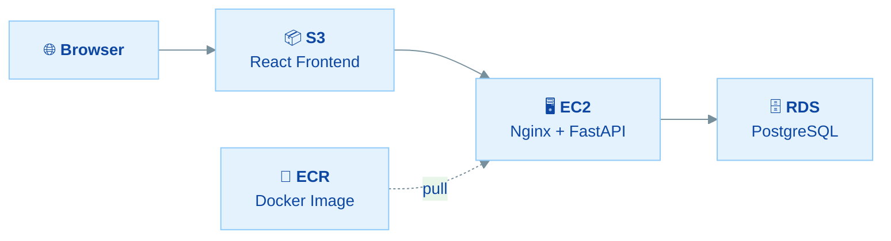

# Woche 9 – AWS Cloud Services

## Lernziele

Am Ende der Woche kannst du:

- AWS-Service-Kategorien benennen und einordnen (Compute, Storage, DB, Netzwerk, Observability, Security)
- Eine Architektur-Entscheidung für eine Fullstack-App begründen
- Docker Images in einer privaten AWS-Registry (ECR) verwalten
- Eine managed PostgreSQL-Datenbank mit AWS RDS betreiben
- Ein containerisiertes Backend auf EC2 deployen und mit RDS verbinden
- Ein React-Frontend über S3 als statische Website hosten
- Eine komplette Cloud-Architektur (Frontend → Backend → Datenbank) verstehen und aufbauen

---

## Zeitplan

| Tag | Thema | Übung |
|-----|-------|-------|
| Mo (vormittags) | AWS Services & Architektur-Überblick | [Übung 30.0 – Services, Architekturen & Entscheidungslogik](uebung-30.0-aws-services-architektur.md) |
| Mo (nachmittags) | AWS Sandbox & ECR | [Übung 30.1 – Docker Images in der Cloud](uebung-30.1-aws-ecr.md) |
| Di | AWS RDS | [Übung 30.2 – Managed PostgreSQL](uebung-30.2-aws-rds.md) |
| Mi | EC2 Docker Deployment | [Übung 30.3 – Backend in der Cloud](uebung-30.3-ec2-deployment.md) |
| Do | Frontend & Architektur | [Übung 30.4 – Frontend Deployment & Cloud-Architektur](uebung-30.4-frontend-architektur.md) |

---

## Projekt: CloudNotes

Diese Woche baust du eine komplette Cloud-Anwendung – Schritt für Schritt:

**CloudNotes** ist eine einfache Notiz-App, die du mit bekannten Technologien baust (FastAPI, React, PostgreSQL, Docker) und dann mit AWS-Services in die Cloud bringst.

---

## Zielbild: Abschlussprojekt-Architektur

Die Architektur, die du diese Woche lernst, ist **direkt übertragbar** auf dein Abschlussprojekt:

| Diese Woche (CloudNotes) | Dein Abschlussprojekt |
|--------------------------|----------------------|
| S3: React-Frontend | Dein Frontend online |
| EC2 + Docker: FastAPI-Backend | Dein Backend in der Cloud |
| RDS: PostgreSQL-Datenbank | Deine Datenbank managed |
| ECR: Docker Images | Deine Images versioniert |
| Security Groups & IAM | Sicherheit für dein Projekt |

In Übung 30.0 lernst du auch, welche **Alternativen** es gibt (ECS/Fargate, Lambda) und warum wir bewusst diese Architektur wählen.

---

## Voraussetzungen

- Woche 8 abgeschlossen (Docker)
- Grundkenntnisse in FastAPI, PostgreSQL und React
- AWS Sandbox-Zugang (sandboxes.techstarter.de)
- Docker Desktop installiert und lauffähig

## Benötigte Tools

- Docker Desktop
- AWS CLI (wird in Übung 30.1 eingerichtet)
- VS Code
- Node.js und npm
- Python 3.11+
- psql oder pgAdmin
