# AWS-Grundlagen: Services, Architekturen & Entscheidungslogik

## Übersicht

Bevor wir diese Woche unsere CloudNotes-App in die AWS Cloud bringen, klären wir zuerst die wichtigsten Fragen:

- **Welche AWS-Services gibt es** und wie lassen sie sich einordnen?
- **Welche Architektur-Optionen** haben wir für eine Fullstack-App?
- **Warum haben wir genau diese Architektur gewählt**, und welche Alternativen gibt es?
- **Was bedeutet das für euer Abschlussprojekt?**

Diese Übung gibt dir das **Big Picture**, bevor wir ab morgen Schritt für Schritt bauen.

---

## Inhaltsverzeichnis

| Teil | Thema | Zeitbedarf |
|------|-------|------------|
| **Teil 1** | AWS-Services: Die wichtigsten Kategorien | 15 min |
| **Teil 2** | Drei Architektur-Optionen im Vergleich | 15 min |
| **Teil 3** | Entscheidungsmatrix: Warum Architektur A? | 10 min |
| **Teil 4** | Was wir bewusst nicht wählen, und warum | 10 min |
| **Teil 5** | Zielbild: Abschlussprojekt-Architektur | 10 min |
| | **Gesamt** | **ca. 45 bis 60 Minuten** |

---

## Teil 1: AWS-Services: Die wichtigsten Kategorien

> **Ziel:** Du hast eine mentale Landkarte der AWS-Services, die für Fullstack-Anwendungen relevant sind
> **Zeitbedarf:** ca. 15 Minuten

AWS hat über 200 Services. Für uns als Fullstack-Entwickler sind aber nur eine Handvoll wirklich relevant. Hier die wichtigsten Kategorien:

### 1.1 Die Service-Landkarte

```mermaid
%%{init: {'theme': 'base', 'themeVariables': {'primaryColor': '#e3f2fd', 'primaryTextColor': '#0d47a1', 'primaryBorderColor': '#90caf9', 'secondaryColor': '#e8f5e9', 'secondaryTextColor': '#1b5e20', 'secondaryBorderColor': '#a5d6a7', 'tertiaryColor': '#fff3e0', 'tertiaryTextColor': '#e65100', 'tertiaryBorderColor': '#ffcc80', 'lineColor': '#78909c', 'fontSize': '13px'}}}%%
graph TB
    subgraph compute ["🖥️ Compute"]
        EC2["<b>EC2</b><br/>Virtuelle Server"]
        LAMBDA["<b>Lambda</b><br/>Serverless"]
        ECS["<b>ECS/Fargate</b><br/>Container"]
    end
    subgraph storage ["📦 Storage"]
        S3["<b>S3</b><br/>Objekt-Speicher"]
        EBS["<b>EBS</b><br/>Block-Speicher"]
        ECR["<b>ECR</b><br/>Docker Images"]
    end
    subgraph db ["🗄️ Datenbanken"]
        RDS["<b>RDS</b><br/>PostgreSQL, MySQL"]
        DYNAMO["<b>DynamoDB</b><br/>NoSQL"]
    end
    subgraph network ["🌐 Netzwerk"]
        VPC["<b>VPC</b><br/>Virtuelles Netzwerk"]
        SG["<b>Security Groups</b><br/>Firewall"]
        R53["<b>Route 53</b><br/>DNS"]
        CF["<b>CloudFront</b><br/>CDN"]
        APIGW["<b>API Gateway</b>"]
    end
    subgraph observe ["📊 Observability"]
        CW["<b>CloudWatch</b><br/>Metriken, Alarme"]
    end
    subgraph security ["🔑 Security"]
        IAM["<b>IAM</b><br/>Users, Roles"]
    end
```

### 1.2 Übersichtstabelle

| Kategorie | Service | Was macht er? | Kennen wir schon? |
|-----------|---------|---------------|-------------------|
| **Compute** | EC2 | Virtuelle Server (Linux/Windows) | [Ja: Modul 2, Woche 4](../../modul-2/woche-4/ec2-erstellen.md) |
| | Lambda | Code ohne Server ausführen (pay-per-call) | Nein |
| | ECS / Fargate | Docker-Container verwalten und orchestrieren | Nein |
| **Storage** | S3 | Dateien speichern, Websites hosten | [Ja: Modul 2, Woche 4](../../modul-2/woche-4/s3-bucket-erstellen.md) |
| | ECR | Private Docker-Image-Registry | **Diese Woche** |
| **Datenbank** | RDS | Managed PostgreSQL, MySQL etc. | **Diese Woche** |
| | DynamoDB | Serverless NoSQL (Key-Value) | Nein |
| **Netzwerk** | VPC / Security Groups | Netzwerk & Firewall | [Ja: Modul 2, Woche 4](../../modul-2/woche-4/ec2-erstellen.md) |
| | CloudFront | CDN (Content Delivery Network) | [Bonus: Modul 3, Woche 5](../woche-5/uebung-26.4-aws-deployment.md) |
| | API Gateway | REST/HTTP APIs verwalten | Nein |
| **Observability** | CloudWatch | Monitoring, Logs, Alarme | **Diese Woche** |
| **Security** | IAM | Zugriffssteuerung (Users, Roles) | [Ja: Modul 2, Woche 4](../../modul-2/woche-4/aws-cli-einrichten.md) |

> **Merksatz:** Du brauchst nicht alle 200+ AWS-Services zu kennen. Für eine typische Webanwendung reichen die oben genannten ~12 Services völlig aus. Alles andere sind Spezialfälle.

### Wissensfrage 1

Ordne folgende Aufgaben den richtigen AWS-Service-Kategorien zu: "Docker Image speichern", "Firewall-Regel erstellen", "PostgreSQL-Datenbank betreiben", "React-App als Website hosten".

Antwort anzeigen

| Aufgabe | Kategorie | Service |
|---------|-----------|---------|
| Docker Image speichern | Storage | **ECR** (Elastic Container Registry) |
| Firewall-Regel erstellen | Netzwerk | **Security Groups** |
| PostgreSQL-Datenbank betreiben | Datenbank | **RDS** (Relational Database Service) |
| React-App als Website hosten | Storage | **S3** (Static Website Hosting) |

---

## Teil 2: Drei Architektur-Optionen im Vergleich

> **Ziel:** Du kennst drei realistische Wege, eine Fullstack-App auf AWS zu deployen
> **Zeitbedarf:** ca. 15 Minuten

Es gibt nicht **den einen** richtigen Weg, eine App in die Cloud zu bringen. Hier sind drei Architekturen, die für eine FastAPI + React + PostgreSQL App realistisch sind:

### Architektur A: EC2 + Docker (unser Weg diese Woche)

```mermaid
%%{init: {'theme': 'base', 'themeVariables': {'primaryColor': '#e3f2fd', 'primaryTextColor': '#0d47a1', 'primaryBorderColor': '#90caf9', 'secondaryColor': '#e8f5e9', 'secondaryTextColor': '#1b5e20', 'secondaryBorderColor': '#a5d6a7', 'tertiaryColor': '#fff3e0', 'tertiaryTextColor': '#e65100', 'tertiaryBorderColor': '#ffcc80', 'lineColor': '#78909c', 'fontSize': '14px'}}}%%
graph LR
    USER["🌐 Browser"] --> S3["📦 S3<br/>React"]
    S3 --> EC2["🖥️ EC2<br/>Docker + FastAPI"]
    EC2 --> RDS["🗄️ RDS<br/>PostgreSQL"]
    ECR["🐳 ECR"] -.->|pull| EC2
```

**So funktioniert es:**

- Du baust ein Docker Image und pushst es nach **ECR**
- Ein **EC2-Server** pullt das Image und startet den Container
- Die Datenbank läuft als **managed RDS** PostgreSQL
- Das React-Frontend liegt als statische Website auf **S3**

| Aspekt | Bewertung |
|--------|-----------|
| Komplexität | Mittel: du verwaltest den EC2-Server selbst |
| Kosten (Sandbox) | ~25 bis 30€/Monat (EC2 + RDS laufen 24/7) |
| Debugging | Einfach: SSH auf den Server, `docker logs` |
| Skalierung | Manuell (mehr/größere EC2-Instanzen) |
| Lernkurve | Niedrig: baut auf Docker- und EC2-Wissen auf |

### Architektur B: ECS / Fargate (Container-Orchestrierung)

```mermaid
%%{init: {'theme': 'base', 'themeVariables': {'primaryColor': '#e3f2fd', 'primaryTextColor': '#0d47a1', 'primaryBorderColor': '#90caf9', 'secondaryColor': '#e8f5e9', 'secondaryTextColor': '#1b5e20', 'secondaryBorderColor': '#a5d6a7', 'tertiaryColor': '#fff3e0', 'tertiaryTextColor': '#e65100', 'tertiaryBorderColor': '#ffcc80', 'lineColor': '#78909c', 'fontSize': '14px'}}}%%
graph LR
    USER["🌐 Browser"] --> ALB["⚖️ Load Balancer"]
    ALB --> FARGATE["🚀 Fargate<br/>Container (managed)"]
    FARGATE --> RDS["🗄️ RDS<br/>PostgreSQL"]
    ECR["🐳 ECR"] -.->|pull| FARGATE
```

**So funktioniert es:**

- Du pushst das Image nach **ECR** (wie bei A)
- **ECS (Elastic Container Service)** startet und verwaltet den Container automatisch
- Mit **Fargate** brauchst du keinen EC2-Server, AWS managed die Infrastruktur
- Ein **Load Balancer** verteilt den Traffic

| Aspekt | Bewertung |
|--------|-----------|
| Komplexität | Hoch: viele AWS-Konzepte (Tasks, Services, Cluster, Target Groups) |
| Kosten (Sandbox) | Ähnlich, aber flexibler (pay-per-use mit Fargate). [Aktuelle Preise](https://aws.amazon.com/fargate/pricing/) |
| Debugging | Schwieriger: kein SSH, Logs nur über CloudWatch |
| Skalierung | Automatisch (Auto-Scaling Policies) |
| Lernkurve | Hoch: viele neue Konzepte auf einmal |

### Architektur C: Lambda + API Gateway (Serverless)

```mermaid
%%{init: {'theme': 'base', 'themeVariables': {'primaryColor': '#e3f2fd', 'primaryTextColor': '#0d47a1', 'primaryBorderColor': '#90caf9', 'secondaryColor': '#e8f5e9', 'secondaryTextColor': '#1b5e20', 'secondaryBorderColor': '#a5d6a7', 'tertiaryColor': '#fff3e0', 'tertiaryTextColor': '#e65100', 'tertiaryBorderColor': '#ffcc80', 'lineColor': '#78909c', 'fontSize': '14px'}}}%%
graph LR
    USER["🌐 Browser"] --> S3["📦 S3<br/>React"]
    S3 --> APIGW["🚪 API Gateway"]
    APIGW --> LAMBDA["⚡ Lambda<br/>FastAPI (Mangum)"]
    LAMBDA --> RDS["🗄️ RDS<br/>PostgreSQL"]
```

**So funktioniert es:**

- Dein FastAPI-Code läuft als **Lambda-Funktion** (mit einem Adapter wie Mangum)
- **API Gateway** empfängt HTTP-Requests und leitet sie an Lambda weiter
- Kein Server, kein Docker, kein Container-Management
- Die Funktion läuft nur, wenn ein Request kommt (pay-per-call)

| Aspekt | Bewertung |
|--------|-----------|
| Komplexität | Mittel-Hoch: andere Denkweise (Event-basiert) |
| Kosten (Sandbox) | Am günstigsten bei wenig Traffic (pay-per-call) |
| Debugging | Schwierig: kein SSH, Cold Starts, verteilte Logs |
| Skalierung | Automatisch und quasi unbegrenzt |
| Lernkurve | Hoch: neues Paradigma (Serverless), Adapter nötig |

### Wissensfrage 2

Was ist der Hauptunterschied zwischen Architektur A (EC2 + Docker) und Architektur C (Lambda)?

Antwort anzeigen

Der Hauptunterschied ist das **Betriebsmodell**:

- **EC2 + Docker (A):** Du hast einen **dauerhaft laufenden Server**. Er kostet Geld, auch wenn niemand die API aufruft. Dafür hast du volle Kontrolle (SSH, Docker, Logs direkt auf dem Server).

- **Lambda (C):** Es gibt **keinen dauerhaften Server**. Dein Code wird nur ausgeführt, wenn ein Request kommt. Bei Inaktivität zahlst du nichts. Dafür hast du weniger Kontrolle und ein anderes Debugging-Erlebnis (kein SSH, nur CloudWatch Logs).

**Analogie:** EC2 ist wie eine eigene Wohnung (immer da, du zahlst Miete), Lambda ist wie ein Hotelzimmer (du zahlst nur, wenn du es nutzt).

---

## Teil 3: Entscheidungsmatrix: Warum Architektur A?

> **Ziel:** Du verstehst, warum wir Architektur A (EC2 + Docker) wählen und kannst diese Entscheidung begründen
> **Zeitbedarf:** ca. 10 Minuten

### 3.1 Vergleich der drei Optionen

| Kriterium | A: EC2 + Docker | B: ECS / Fargate | C: Lambda |
|-----------|:---:|:---:|:---:|
| **Nutzt bekanntes Wissen** | Docker (Woche 8), EC2 (Modul 2) | Teilweise (Docker) | Fast nichts |
| **Debugging** | SSH + `docker logs` | Nur CloudWatch | Nur CloudWatch |
| **Neue Konzepte** | Wenige (ECR, RDS) | Viele (Tasks, Services, ALB, Target Groups) | Viele (Event-Model, Mangum, API GW) |
| **Sandbox-Budget (~15€)** | Passt (knapp) | Riskant (ALB hat laufende Fixkosten) | Passt gut |
| **Übertragbar auf Abschlussprojekt** | Sehr gut | Gut, aber komplex | Begrenzt |
| **Transparenz** | Hoch: du siehst alles | Mittel: vieles ist abstrahiert | Niedrig: "Magie" |
| **Praxis-Relevanz** | Sehr hoch | Hoch (Enterprise) | Hoch (Startups, MVPs) |
| **Time-to-Learn (1 Woche)** | Machbar | Zu viel | Zu viel |

### 3.2 Unsere Entscheidung

Wir wählen **Architektur A (EC2 + Docker)**, weil:

1. **Aufbauen statt Neulernen:** Ihr wisst bereits, wie Docker funktioniert (Woche 8) und wie EC2 funktioniert (Modul 2). Diese Woche zeigt, wie beides **zusammenkommt**
2. **Transparenz:** Bei EC2 + Docker seht ihr **jeden Schritt**, vom Image-Build über den Push bis zum `docker run` auf dem Server. Nichts ist versteckt
3. **Debugging ist real:** Wenn etwas nicht funktioniert, könnt ihr per SSH auf den Server, `docker logs` lesen, `curl` testen. Das ist das, was ihr auch im Job macht
4. **Sandbox-Budget:** Die Architektur passt in euer ~15€-Budget
5. **Abschlussprojekt-ready:** Diese Architektur könnt ihr 1:1 für euer Abschlussprojekt verwenden

> **Merksatz:** Die "beste" Architektur ist die, die ihr **versteht und debuggen könnt**. In der Praxis ist es besser, eine einfachere Architektur zu beherrschen, als eine komplexere halbherzig einzusetzen.

### Wissensfrage 3

Ein Startup mit sehr wenig Traffic (50 Requests pro Tag) und ohne DevOps-Team fragt dich: "Welche Architektur sollen wir nehmen?" Was würdest du empfehlen?

Antwort anzeigen

Für ein Startup mit sehr wenig Traffic und ohne DevOps-Team wäre **Architektur C (Lambda + API Gateway)** eine gute Wahl:

1. **Kosten:** Bei 50 Requests/Tag fallen quasi keine Kosten an (Lambda Free Tier: 1 Mio Requests/Monat kostenlos)
2. **Kein Server-Management:** Kein EC2, der gepatcht werden muss
3. **Automatische Skalierung:** Falls das Startup plötzlich viral geht, skaliert Lambda automatisch

**Aber:** Wenn das Team Docker bereits kennt und schnell starten will, wäre **Architektur A** auch ein guter Start, einfacher zu debuggen und vertrauter.

Es gibt keine universell "beste" Antwort. Die richtige Architektur hängt immer vom Kontext ab: Team-Skills, Budget, erwarteter Traffic, Time-to-Market.

---

## Teil 4: Was wir bewusst nicht wählen, und warum

> **Ziel:** Du verstehst, welche Alternativen es gibt und warum wir sie nicht nutzen
> **Zeitbedarf:** ca. 10 Minuten

Transparenz ist wichtig: Hier die Dinge, die wir **bewusst weglassen** und warum:

### 4.1 Nicht gewählt: ECS / Fargate

| Was es kann | Warum wir es nicht nutzen |
|-------------|--------------------------|
| Automatisches Container-Management | Zu viele neue Konzepte für eine Woche (Cluster, Tasks, Services, Target Groups, Load Balancer) |
| Auto-Scaling | Brauchen wir nicht für ein Lernprojekt |
| Managed Infrastructure | Der Load Balancer hat laufende Basiskosten + Nutzungsgebühren, selbst ohne viel Traffic wird das in Sandboxes schnell teuer |

> **Gut zu wissen:** ECS/Fargate begegnet euch in der Praxis häufig, z.B. im Job. Es baut auf Docker auf (eure ECR-Images funktionieren identisch). Für euer Abschlussprojekt bleibt aber bei EC2 + Docker, das reicht völlig aus.

### 4.2 Nicht gewählt: Lambda + API Gateway

| Was es kann | Warum wir es nicht nutzen |
|-------------|--------------------------|
| Serverless, kein Server-Management | Andere Denkweise (Event-basiert statt Server-basiert), das wäre ein eigenes Thema |
| Pay-per-Call, günstig bei wenig Traffic | FastAPI auf Lambda erfordert einen Adapter (Mangum), zusätzliche Komplexität |
| Automatische Skalierung | Cold Starts: Lambda muss bei der ersten Anfrage erst "aufwachen" (1-3 Sekunden Wartezeit), das macht Testen und Debugging mühsam |

> **Gut zu wissen:** Lambda begegnet euch in der Praxis bei Startups und MVPs. Für eine klassische CRUD-API (wie euer Abschlussprojekt) ist EC2 + Docker aber einfacher und transparenter.

### 4.3 Nicht gewählt: Kubernetes (EKS)

| Was es kann | Warum wir es nicht nutzen |
|-------------|--------------------------|
| Container-Orchestrierung im großen Maßstab | Massiver Overhead: Kubernetes ist ein eigenständiges Ökosystem |
| Multi-Container, Auto-Scaling, Self-Healing | Für eine einzelne App mit einer Handvoll Containern überdimensioniert |
| Industriestandard für große Systeme | EKS-Cluster kosten allein ~70€/Monat (ohne Worker Nodes). [Aktuelle Preise](https://aws.amazon.com/eks/pricing/) |

> **Für die Zukunft:** Kubernetes ist relevant, wenn ihr mit vielen Microservices arbeitet. Für den Einstieg in Cloud-Deployments ist es aber overkill.

### 4.4 Nicht gewählt: DynamoDB statt RDS

| Was es kann | Warum wir es nicht nutzen |
|-------------|--------------------------|
| Serverless NoSQL-Datenbank | Ihr kennt PostgreSQL, RDS nutzt eure bestehenden SQL-Skills |
| Auto-Scaling, pay-per-request | Anderes Datenmodell (Key-Value/Document), erfordert Umdenken |
| Keine Instanz-Verwaltung | Passt nicht zum relationalen Datenmodell unserer App |

### 4.5 Übersicht: Was wir nutzen vs. was wir weglassen

```mermaid
%%{init: {'theme': 'base', 'themeVariables': {'primaryColor': '#e3f2fd', 'primaryTextColor': '#0d47a1', 'primaryBorderColor': '#90caf9', 'secondaryColor': '#e8f5e9', 'secondaryTextColor': '#1b5e20', 'secondaryBorderColor': '#a5d6a7', 'tertiaryColor': '#fff3e0', 'tertiaryTextColor': '#e65100', 'tertiaryBorderColor': '#ffcc80', 'lineColor': '#78909c', 'fontSize': '14px'}}}%%
graph TB
    subgraph nutzen ["✅ Nutzen wir"]
        A["EC2: Server"]
        B["ECR: Docker Registry"]
        C["RDS: PostgreSQL"]
        D["S3: Frontend Hosting"]
        E["IAM Roles: Zugriffssteuerung"]
        F["Security Groups: Firewall"]
        G["CloudWatch: Monitoring"]
    end
    subgraph nicht ["⏭️ Nicht diese Woche"]
        H["ECS / Fargate"]
        I["Lambda"]
        J["API Gateway"]
        K["DynamoDB"]
        L["Kubernetes (EKS)"]
        M["CloudFront CDN"]
    end
```

### Wissensfrage 4

Warum ist es sinnvoll, explizit zu benennen, was man **nicht** gewählt hat?

Antwort anzeigen

1. **Kontextverständnis:** Du weißt, dass es Alternativen gibt. Deine gewählte Lösung ist nicht "die einzige", sondern "die passende für diesen Kontext"
2. **Entscheidungskompetenz:** In der Praxis musst du Architektur-Entscheidungen begründen können. "Wir haben X gewählt, weil..." ist wertvoller als "Wir nutzen X"
3. **Keine Sackgasse:** Wenn sich die Anforderungen ändern (mehr Traffic, andere Team-Größe), weißt du, welche Alternative du evaluieren kannst
4. **Bewerbung:** Wenn dich im Job-Interview jemand fragt: "Warum EC2 statt Lambda?", hast du eine fundierte Antwort

---

## Teil 5: Zielbild: Abschlussprojekt-Architektur

> **Ziel:** Du siehst, wie die Architektur dieser Woche direkt auf euer Abschlussprojekt übertragbar ist
> **Zeitbedarf:** ca. 10 Minuten

### 5.1 CloudNotes-Architektur = Abschlussprojekt-Blueprint

Die Architektur, die wir diese Woche bauen, ist **genau das**, was ihr für euer Abschlussprojekt braucht:

### 5.2 Was ihr diese Woche für das Abschlussprojekt lernt

| Diese Woche | Abschlussprojekt |
|-------------|-----------------|
| Docker Image bauen & pushen (ECR) | Euer eigenes Backend-Image |
| RDS PostgreSQL einrichten | Eure Datenbank in der Cloud |
| EC2 + Docker deployen | Euer Backend in der Cloud |
| S3 Frontend Hosting | Eure React-App online |
| Security Groups & IAM | Sicherheit für euer Projekt |
| CORS konfigurieren | Frontend-Backend-Kommunikation |
| Cleanup & Kosten | Budget-Bewusstsein |

### 5.3 Ausblick: So sieht es in Produktion aus

In der Praxis (z.B. im Job oder bei einem eigenen Produkt mit echten Nutzern) würde man die Architektur noch erweitern:

| Produktions-Feature | AWS-Service | Warum in Produktion wichtig |
|---------------------|-------------|----------------------------|
| HTTPS (verschlüsselt) | CloudFront + ACM | Pflicht bei echten Nutzerdaten und Logins |
| Eigene Domain | Route 53 (DNS) | Professionelle URL statt AWS-Adressen |
| Datei-Uploads (Bilder) | S3 + Pre-signed URLs | Sichere Uploads ohne Server-Last |
| Hintergrund-Jobs | Lambda | E-Mails, Bild-Verarbeitung etc. |
| Caching | ElastiCache (Redis) | Performance bei vielen Nutzern |

> **Für euer Abschlussprojekt:** Bleibt bei der **einfachen** Architektur (EC2 + RDS + S3) ohne eigene Domain, ohne HTTPS, ohne CloudFront. Euer Abschlussprojekt ist ein Prototyp. Es geht darum, die Technologien zu lernen und zu zeigen, dass ihr eine Fullstack-App in die Cloud bringen könnt. YAGNI: "You Ain't Gonna Need It" gilt hier besonders.

### 5.4 Die Woche im Überblick

Hier nochmal der Plan, wie wir diese Architektur Stück für Stück aufbauen:

| Tag | Was bauen wir? | AWS Service | Verbindung zu vorher |
|-----|----------------|------------|---------------------|
| **Mo** | Docker Image in die Cloud | ECR | [Docker (Woche 8)](../woche-8/uebung-29.2-dockerfile-eigene-images-bauen.md) |
| **Di** | Datenbank in die Cloud | RDS | [PostgreSQL (Woche 7)](../woche-7/uebung-28.2-fastapi-postgresql.md) |
| **Mi** | Backend in die Cloud | EC2 + Docker | [EC2 (Modul 2)](../../modul-2/woche-4/ec2-erstellen.md) + [Docker (Woche 8)](../woche-8/uebung-29.1-docker-grundlagen-mental-model.md) |
| **Do** | Frontend in die Cloud + Cleanup | S3 | [React (Woche 3 bis 5)](../woche-5/uebung-26.4-aws-deployment.md) + [S3 (Modul 2)](../../modul-2/woche-4/s3-bucket-erstellen.md) |

Jeder Tag hat ein klares Ziel. Am Ende jedes Tages wird aufgeräumt, was nicht mehr gebraucht wird, und am Donnerstag machen wir einen vollständigen Cleanup aller Ressourcen.

### Wissensfrage 5

Du planst dein Abschlussprojekt: Eine Rezept-App mit React-Frontend, FastAPI-Backend und PostgreSQL-Datenbank. Nutzer können Bilder von Gerichten hochladen. Welche AWS-Services brauchst du mindestens, und welchen zusätzlichen Service würdest du für die Bild-Uploads ergänzen?

Antwort anzeigen

**Mindestens (Basis-Architektur wie CloudNotes):**

- **S3**: React-Frontend hosten
- **EC2**: FastAPI-Backend mit Docker
- **RDS**: PostgreSQL-Datenbank
- **ECR**: Docker Images speichern
- **IAM**: Zugriffssteuerung
- **Security Groups**: Netzwerksicherheit

**Zusätzlich für Bild-Uploads:**

- **S3 (zweiter Bucket)**: Bilder speichern. Die FastAPI-App generiert **Pre-signed Upload URLs**, damit der Browser Bilder direkt zu S3 hochladen kann, ohne über den Backend-Server zu gehen. Das spart Bandbreite und ist performanter.

Insgesamt: 7 AWS-Services, aber die Kern-Architektur ist identisch mit CloudNotes!

---

## Zusammenfassung

### Was du jetzt weißt

1. **AWS-Services lassen sich in 6 Kategorien einteilen:** Compute, Storage, Datenbank, Netzwerk, Observability, Security
2. **Du kannst drei Architektur-Optionen benennen und vergleichen:** EC2+Docker, ECS/Fargate, Lambda+API Gateway
3. **Du kannst begründen, warum EC2+Docker die richtige Wahl für diese Woche ist:** baut auf bekanntem Wissen auf, transparent, debugbar, Budget-kompatibel
4. **Du kannst erklären, welche AWS-Services für eine Fullstack-App zusammenspielen:** ECR für Images, RDS für die Datenbank, EC2 für Compute, S3 für das Frontend
5. **Du erkennst, wie die CloudNotes-Architektur auf dein Abschlussprojekt übertragbar ist**

### Nächster Schritt

Ab der nächsten Übung (30.1) bauen wir diese Architektur Schritt für Schritt auf, angefangen mit der AWS Sandbox und dem Docker Image in ECR.

---

## Checkliste

Prüfe, ob du die Konzepte verstanden hast:

- [ ] Ich kann die 6 AWS-Service-Kategorien benennen und je einen Service zuordnen
- [ ] Ich kann drei Architektur-Optionen für eine Fullstack-App erklären
- [ ] Ich kann begründen, warum wir EC2+Docker wählen
- [ ] Ich weiß, welche Alternativen es gibt und warum wir sie nicht nutzen
- [ ] Ich verstehe, wie die CloudNotes-Architektur auf mein Abschlussprojekt übertragbar ist
