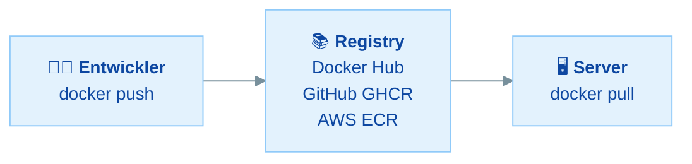
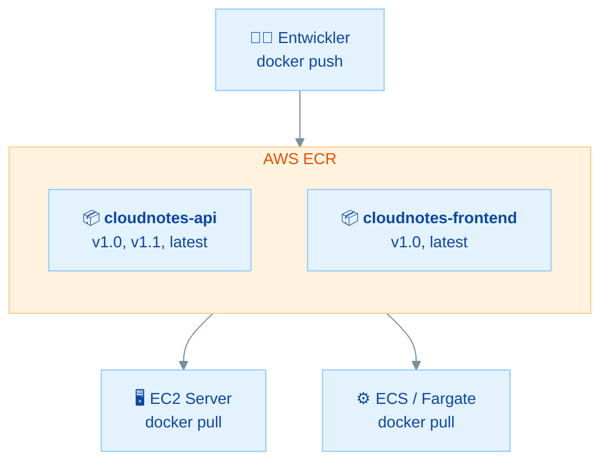
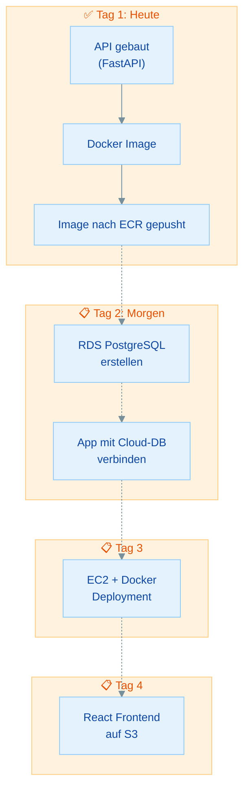

# AWS Sandbox & ECR: Docker Images in der Cloud

## Übersicht

In dieser Übung baust du eine neue FastAPI-App und bringst sie als Docker-Image in die AWS Cloud:

- **AWS Sandbox einrichten** - Deine Cloud-Umgebung vorbereiten und die CLI konfigurieren
- **ECR verstehen** - Was ist eine private Container-Registry in AWS?
- **CloudNotes Backend bauen** - Eine einfache Notiz-API mit FastAPI und SQLAlchemy erstellen
- **Docker Image erstellen** - Die App in einen Container verpacken (Woche 29 Wissen anwenden)
- **Image nach ECR pushen** - Dein erstes Docker-Image in die AWS Cloud hochladen
- **Image verwalten** - Tags, Versionen und Lifecycle in ECR verstehen

Diese Woche baust du Schritt für Schritt eine komplette Cloud-Anwendung auf. Heute startest du mit dem Backend und bringst es als Docker-Image in die AWS Cloud. In den nächsten Tagen folgen Datenbank (RDS), Deployment (EC2) und Frontend (S3).

### Warum ECR heute?

> **Architektur-Kontext:** In Übung 30.0 hast du die Gesamtarchitektur kennengelernt. Heute bauen wir den ersten Baustein: Das Docker Image muss in eine **private Registry** (ECR), damit der EC2-Server es am Mittwoch pullen kann. Ohne ECR kein Cloud-Deployment!
>
> ```
> 📦 ECR ← Heute (Mo)
> 🗄️ RDS ← Morgen (Di)
> 🖥️ EC2 ← Mittwoch
> 📦 S3  ← Donnerstag
> ```

---

## Inhaltsverzeichnis

| Teil | Thema | Zeitbedarf |
|------|-------|------------|
| **Rückblick** | Docker, Registries & der Weg in die Cloud | 10 min (lesen) |
| **Teil 1** | AWS Sandbox einrichten & CLI konfigurieren | 25 min |
| **Teil 2** | Was ist ECR? Konzept & Vergleich | 15 min |
| **Teil 3** | ECR Repository erstellen | 20 min |
| **Teil 4** | CloudNotes Backend bauen | 35 min |
| **Teil 5** | Docker Image bauen & lokal testen | 20 min |
| **Teil 6** | Image taggen & nach ECR pushen | 25 min |
| **Teil 7** | Image in ECR verifizieren & verwalten | 15 min |
| **Bonus** | ECR Lifecycle Policies & Image Scanning | 15 min |
| | **Gesamt** | **ca. 2,5 bis 3 Stunden** |

### Minimalpfad (wenn du wenig Zeit hast)

**In 60 bis 90 Minuten die wichtigsten Schritte:**

1. **Teil 1** - Sandbox & CLI einrichten - *Grundvoraussetzung*
2. **Teil 4** - CloudNotes Backend bauen - *Die App*
3. **Teil 5** - Docker Image bauen - *Containerisierung*
4. **Teil 6** - Image nach ECR pushen - *Kernübung*

---

## Voraussetzungen & Setup

**Bevor du startest:**

1. **Docker Desktop** ist installiert und läuft
2. **Python 3.11+** ist installiert
3. **VS Code** (oder ein anderer Editor) ist bereit
4. Du hast ein **Terminal** offen (Git Bash empfohlen unter Windows)
5. Du hast deine **AWS Sandbox Zugangsdaten** bereit

<details markdown>
<summary>Welche Shell nutze ich? (wichtig für Windows)</summary>

Unter Windows gibt es mehrere Shells, und sie verhalten sich unterschiedlich:

| Shell | Wo zu finden | Empfehlung |
|-------|-------------|------------|
| **Git Bash** | Wird mit Git installiert | Empfohlen, verhält sich wie Linux |
| **CMD** (Eingabeaufforderung) | `cmd` im Startmenü | Funktioniert gut |
| **PowerShell 7+** | `pwsh` im Startmenü | Funktioniert gut |
| **PowerShell 5.1** | `powershell` im Startmenü | Kann Probleme machen |

> **Achtung:** Windows PowerShell 5.1 unterstützt **kein `&&`** zum Verketten von Befehlen. In dieser Übung schreiben wir Befehle deshalb immer einzeln untereinander.

</details>

**Überprüfe deine Installationen:**

```bash
docker --version
```

```bash
python --version
```

Falls beides eine Versionsnummer anzeigt, bist du startklar!

---

## Rückblick: Docker, Registries & der Weg in die Cloud

In [Woche 8 (Docker)](../woche-8/uebersicht.md) hast du gelernt, wie Docker funktioniert: [Images bauen](../woche-8/uebung-29.2-dockerfile-eigene-images-bauen.md), [Container starten](../woche-8/uebung-29.1-docker-grundlagen-mental-model.md), [Docker Compose nutzen](../woche-8/uebung-29.4-docker-compose.md). Jetzt bringen wir dieses Wissen in die Cloud.

### Von lokal in die Cloud

```mermaid
%%{init: {'theme': 'base', 'themeVariables': {'primaryColor': '#e3f2fd', 'primaryTextColor': '#0d47a1', 'primaryBorderColor': '#90caf9', 'secondaryColor': '#e8f5e9', 'secondaryTextColor': '#1b5e20', 'secondaryBorderColor': '#a5d6a7', 'tertiaryColor': '#fff3e0', 'tertiaryTextColor': '#e65100', 'tertiaryBorderColor': '#ffcc80', 'lineColor': '#78909c', 'fontSize': '14px'}}}%%
graph LR
    subgraph lokal ["🖥️ Lokal (Woche 29)"]
        direction TB
        CODE["Code"] --> IMG["Docker Image"]
        IMG --> CON["Container"]
    end
    subgraph cloud ["☁️ AWS Cloud"]
        direction TB
        ECR["ECR<br/>(Image Storage)"]
        EC2["EC2<br/>(Container läuft)"]
        RDS["RDS<br/>(Datenbank)"]
        ECR --> EC2
        EC2 --> RDS
    end
    IMG -->|docker push| ECR
```



**Letzte Woche**: Alles lief auf deinem Rechner: Image, Container, Datenbank.

**Diese Woche**: Du lagerst die Teile in die Cloud aus:

| Was | Lokal (Woche 29) | Cloud (diese Woche) |
|-----|------------------|---------------------|
| **Docker Image** | Docker Desktop | **ECR** (heute!) |
| **Datenbank** | PostgreSQL in Docker | **RDS** (morgen) |
| **Backend** | Container auf localhost | **EC2** (Mittwoch) |
| **Frontend** | npm run dev | **S3** (Donnerstag) |

### Registries: Wohin mit dem Image?

Aus Woche 29 kennst du das Konzept der Registry:



Du hast bisher Images von **Docker Hub** heruntergeladen (nginx, python, postgres). Jetzt lernst du, wie du **deine eigenen Images** in eine **private AWS-Registry** hochlädst.

### Wissensfrage 1

Warum sollte man sein eigenes Docker-Image nicht einfach auf Docker Hub (öffentlich) hochladen?

<details markdown>
<summary>Antwort anzeigen</summary>

1. **Sicherheit:** Dein Code, Konfigurationen und möglicherweise Secrets wären öffentlich sichtbar
2. **Compliance:** Unternehmen erlauben oft nicht, dass firmeninterner Code öffentlich zugänglich ist
3. **Kontrolle:** Du hast weniger Kontrolle über Zugriff, Löschung und Versionierung
4. **Performance:** Eine Registry in der gleichen AWS-Region ist schneller als Docker Hub

Daher nutzt man in der Praxis **private Registries** wie AWS ECR, GitHub Container Registry oder selbst gehostete Registries.

</details>

---

## Teil 1: AWS Sandbox einrichten & CLI konfigurieren

> **Ziel:** Deine AWS-Umgebung ist einsatzbereit und die CLI funktioniert
> **Zeitbedarf:** ca. 25 Minuten

> **Rückblick:** Die AWS CLI hast du bereits in [Modul 2, Woche 4: AWS CLI einrichten](../../modul-2/woche-4/aws-cli-einrichten.md) kennengelernt. Falls `aws sts get-caller-identity` bei dir bereits funktioniert, kannst du direkt zu [Teil 2](#teil-2-was-ist-ecr-konzept-vergleich) springen. Falls du eine neue Sandbox hast oder die CLI nicht mehr konfiguriert ist, folge den Schritten unten.

### 1.1 In die AWS Sandbox einloggen

1. Öffne deinen Browser und gehe zu: **https://sandboxes.techstarter.de/**
2. Logge dich mit deinen Zugangsdaten ein
3. Du gelangst zur AWS Management Console

> **Wichtig:** Prüfe oben rechts die **Region**! Wähle **eu-central-1 (Frankfurt)** aus dem Dropdown-Menü. Alle Ressourcen, die wir diese Woche erstellen, sollen in Frankfurt liegen.

### 1.2 AWS CLI prüfen

Falls du die AWS CLI noch nicht installiert hast, installiere sie jetzt:

<details markdown>
<summary>AWS CLI Installation (falls noch nicht installiert)</summary>

**Windows:**

1. Lade den Installer herunter: https://awscli.amazonaws.com/AWSCLIV2.msi
2. Doppelklick auf die Datei und folge dem Installationsassistenten
3. Schließe dein Terminal und öffne ein neues

**macOS:**

```bash
brew install awscli
```

**Linux:**

```bash
curl "https://awscli.amazonaws.com/awscli-exe-linux-x86_64.zip" -o "awscliv2.zip"
unzip awscliv2.zip
sudo ./aws/install
```

</details>

Prüfe, ob die CLI funktioniert:

```bash
aws --version
```

Du solltest eine Ausgabe wie `aws-cli/2.x.x` sehen.

### 1.3 CLI konfigurieren

Du brauchst deine **Zugangsdaten aus der Sandbox**. Diese findest du im Sandbox-Portal.

```bash
aws configure
```

Es werden vier Werte abgefragt:

```
AWS Access Key ID: <dein Access Key aus der Sandbox>
AWS Secret Access Key: <dein Secret Key aus der Sandbox>
Default region name: eu-central-1
Default output format: json
```

### 1.4 Verbindung testen

```bash
aws sts get-caller-identity
```

Du solltest eine JSON-Antwort sehen mit deiner Account-ID, deinem ARN und deiner User-ID:

```json
{
    "UserId": "AIDAXXXXXXXXXXXXXXXXX",
    "Account": "123456789012",
    "Arn": "arn:aws:iam::123456789012:user/sandbox-user"
}
```

> **Tipp:** Notiere dir die **Account-ID** (die 12-stellige Zahl), du brauchst sie später für die ECR-URI.

### 1.5 Budget-Hinweis

> **Wichtig:** Deine Sandbox hat ein begrenztes Budget (~15€). Achte darauf:
>
> - Lösche Ressourcen, die du nicht mehr brauchst
> - Am Ende jedes Tages prüfen, ob unnötige Services laufen
> - Am Donnerstag räumen wir alles komplett auf

!!! warning "Sandbox ≠ AWS Free Tier"
    Die Techstarter-Sandbox-Accounts haben **kein automatisches Free Tier**. Alle Kostenangaben in diesen Übungen (z.B. "db.t3.micro ist Free-Tier-fähig") beziehen sich auf reguläre AWS-Accounts. In der Sandbox fallen sofort Kosten an. Deshalb ist der Cleanup am Donnerstag so wichtig!

### Wissensfrage 2

Was macht der Befehl `aws sts get-caller-identity` und warum ist er nützlich?

<details markdown>
<summary>Antwort anzeigen</summary>

`aws sts get-caller-identity` zeigt dir:

1. **Wer du bist** (UserId): welcher IAM-User du bist
2. **Welcher Account**: in welchem AWS-Account du arbeitest
3. **Welcher ARN**: dein vollständiger Amazon Resource Name

Das ist nützlich zum:

- **Testen der CLI-Konfiguration**: wenn dieser Befehl funktioniert, stimmen deine Credentials
- **Debuggen**: wenn etwas nicht funktioniert, prüfst du zuerst, ob du den richtigen Account und User verwendest
- **Skripte**: du kannst die Account-ID automatisch auslesen (z.B. für ECR-URIs)

</details>

---

## Teil 2: Was ist ECR? Konzept & Vergleich

> **Ziel:** Du verstehst, was ECR ist und warum wir es nutzen
> **Zeitbedarf:** ca. 15 Minuten

### ECR = Elastic Container Registry

**Amazon ECR** (Elastic Container Registry) ist Amazons **private Docker-Registry**. Stell dir ECR als dein eigenes, privates Docker Hub vor, aber integriert in dein AWS-Konto.



### Vergleich: Docker Hub vs. ECR

| Eigenschaft | Docker Hub | AWS ECR |
|-------------|-----------|---------|
| **Zugriff** | Öffentlich oder privat | Privat (IAM-gesteuert) |
| **Kosten** | 1 privates Repo kostenlos | 500 MB kostenlos (Free Tier) |
| **Integration** | Standalone | Direkt mit AWS-Services verbunden |
| **Authentifizierung** | Docker-Login | AWS IAM (Rollen & Policies) |
| **Standort** | USA (Standard) | In deiner AWS-Region (z.B. Frankfurt) |
| **Scan** | Basis-Scan | Automatisches Vulnerability Scanning |

### Warum ECR statt Docker Hub?

Für unser Projekt ist ECR ideal, weil:

1. **Gleiche Region**: Das Image liegt in Frankfurt, der EC2-Server auch. Schnelles Pullen.
2. **IAM-Integration**: Der EC2-Server kann per IAM-Role auf ECR zugreifen, ohne Passwörter
3. **Privat**: Nur autorisierte AWS-User/Services können das Image sehen
4. **Einfach**: Kein separater Account nötig, es gehört zu deinem AWS-Konto

### Die ECR-URI verstehen

Jedes ECR-Image hat eine eindeutige URI (Adresse):

```
<account-id>.dkr.ecr.<region>.amazonaws.com/<repository-name>:<tag>
```

**Beispiel:**

```
123456789012.dkr.ecr.eu-central-1.amazonaws.com/cloudnotes-api:v1.0
```

| Teil | Bedeutung |
|------|-----------|
| `123456789012` | Deine AWS Account-ID |
| `dkr.ecr` | Docker ECR Service |
| `eu-central-1` | Region (Frankfurt) |
| `amazonaws.com` | AWS Domain |
| `cloudnotes-api` | Repository-Name (wählst du selbst) |
| `v1.0` | Tag (Version) |

> **Merksatz:** Die ECR-URI ist wie eine Adresse für dein Image. Damit weiß Docker genau, wohin es pushen und woher es pullen soll.

### Wissensfrage 3

Warum ist es ein Vorteil, dass ECR in derselben AWS-Region wie der EC2-Server liegt?

<details markdown>
<summary>Antwort anzeigen</summary>

1. **Geschwindigkeit:** Der Datentransfer innerhalb einer Region ist deutlich schneller als über das Internet (niedrige Latenz)
2. **Kosten:** Datentransfer innerhalb einer Region ist **kostenlos**. Über Regionen oder ins Internet hinaus kostet Geld
3. **Zuverlässigkeit:** Weniger Netzwerk-Hops = weniger Fehlerquellen

Wenn dein ECR-Image in Frankfurt liegt und dein EC2-Server ebenfalls in Frankfurt, dauert ein `docker pull` nur wenige Sekunden statt Minuten.

</details>

---

## Teil 3: ECR Repository erstellen

> **Ziel:** Ein ECR-Repository für dein CloudNotes-Image existiert
> **Zeitbedarf:** ca. 20 Minuten

### 3.1 ECR in der Console öffnen

1. Gehe in die **AWS Management Console**
2. Tippe oben in der Suchleiste **"ECR"** ein
3. Klicke auf **"Elastic Container Registry"**
4. Du siehst das ECR Dashboard (vermutlich noch leer)

### 3.2 Repository erstellen (Console)

1. Klicke auf **"Create repository"** (oder "Repository erstellen")
2. Fülle das Formular aus:

| Einstellung | Wert | Erklärung |
|-------------|------|-----------|
| **Visibility** | Private | Nur du hast Zugriff |
| **Repository name** | `cloudnotes-api` | Name für unser Backend-Image |
| **Tag immutability** | Disabled | Tags können überschrieben werden |
| **Image scan** | Enabled | Automatische Sicherheitsscans |

3. Klicke auf **"Create repository"**

> **Hinweis:** "Tag immutability" bedeutet: Wenn aktiviert, kann ein Tag wie `v1.0` nicht überschrieben werden. Für Entwicklung ist "Disabled" praktischer, in Produktion aktiviert man es für Sicherheit.

### 3.3 Repository-URI notieren

Nach dem Erstellen siehst du dein Repository in der Liste. Notiere dir die **URI**, du brauchst sie gleich:

```
<deine-account-id>.dkr.ecr.eu-central-1.amazonaws.com/cloudnotes-api
```

### 3.4 Alternative: Repository per CLI erstellen

Du kannst das Repository auch per CLI erstellen (optional, nur wenn du die Console-Variante überspringen willst):

```bash
aws ecr create-repository --repository-name cloudnotes-api --region eu-central-1
```

Die Antwort enthält die Repository-URI:

```json
{
    "repository": {
        "repositoryArn": "arn:aws:ecr:eu-central-1:123456789012:repository/cloudnotes-api",
        "repositoryUri": "123456789012.dkr.ecr.eu-central-1.amazonaws.com/cloudnotes-api",
        "repositoryName": "cloudnotes-api"
    }
}
```

### Übung: Push-Befehle anzeigen

1. Klicke in der Console auf dein Repository **cloudnotes-api**
2. Klicke oben rechts auf **"View push commands"** (oder "Push-Befehle anzeigen")
3. AWS zeigt dir die exakten Befehle, die du gleich brauchst:
   - ECR Login
   - Image taggen
   - Image pushen

> **Tipp:** Lass dieses Fenster offen, du brauchst diese Befehle in Teil 6!

### Wissensfrage 4

Was ist der Unterschied zwischen einem ECR-Repository und einem Docker-Image?

<details markdown>
<summary>Antwort anzeigen</summary>

- Ein **Repository** ist ein Container (Ordner) für zusammengehörige Images. Es hat einen festen Namen (z.B. `cloudnotes-api`) und kann mehrere Versionen (Tags) enthalten.
- Ein **Image** ist eine konkrete Version innerhalb des Repositories, identifiziert durch einen Tag (z.B. `v1.0`, `latest`).

**Analogie:** Ein Repository ist wie ein Ordner auf deinem Computer, und die Images sind die einzelnen Dateien darin.

Beispiel:
```
cloudnotes-api/          ← Repository
  ├── v1.0               ← Image (Tag v1.0)
  ├── v1.1               ← Image (Tag v1.1)
  └── latest             ← Image (Tag latest)
```

</details>

---

## Teil 4: CloudNotes Backend bauen

> **Ziel:** Eine funktionierende FastAPI-App mit CRUD-Endpoints für Notizen
> **Zeitbedarf:** ca. 35 Minuten
> **Du bist fertig, wenn:** Die API unter `http://localhost:8000/docs` Notizen erstellen und anzeigen kann

> **Rückblick:** Die Patterns hier (SQLAlchemy ORM, Pydantic Schemas, FastAPI CRUD) kennst du aus [Woche 7: FastAPI & PostgreSQL](../woche-7/uebung-28.2-fastapi-postgresql.md). Wir bauen eine neue, einfache App, die genau diese Patterns nutzt.

### 4.1 Projektordner erstellen

Erstelle einen neuen Ordner für das CloudNotes-Projekt:

```bash
mkdir cloudnotes
cd cloudnotes
mkdir backend
cd backend
```

### 4.2 Python Virtual Environment

```bash
python -m venv venv
```

Aktiviere das Virtual Environment:

**Git Bash / macOS / Linux:**
```bash
source venv/bin/activate
```

**Windows CMD:**
```bash
venv\Scripts\activate
```

**Windows PowerShell:**
```bash
venv\Scripts\Activate.ps1
```

### 4.3 Dependencies installieren

Erstelle eine Datei `requirements.txt`:

```txt
fastapi==0.115.12
uvicorn==0.34.2
sqlalchemy==2.0.41
pydantic==2.11.3
python-dotenv==1.1.0
psycopg[binary]==3.2.9
```

Installiere die Pakete:

```bash
pip install -r requirements.txt
```

> **Hinweis:** `psycopg[binary]` ist der PostgreSQL-Treiber, den wir ab morgen (Tag 30.2) brauchen. Wir installieren ihn schon heute mit, damit das Docker Image komplett ist.

### 4.4 Datenbankverbindung einrichten

Erstelle die Datei `database.py`:

```python
import os
from sqlalchemy import create_engine
from sqlalchemy.orm import sessionmaker, DeclarativeBase
from dotenv import load_dotenv

load_dotenv()

# DATABASE_URL aus Umgebungsvariable lesen
# Standard: SQLite für lokale Entwicklung
DATABASE_URL = os.getenv("DATABASE_URL", "sqlite:///./notes.db")

# Engine erstellen
# Für SQLite brauchen wir connect_args, für PostgreSQL nicht
if DATABASE_URL.startswith("sqlite"):
    engine = create_engine(DATABASE_URL, connect_args={"check_same_thread": False})
else:
    engine = create_engine(DATABASE_URL, pool_size=5, max_overflow=10)

# Session Factory
SessionLocal = sessionmaker(bind=engine)


# Base-Klasse für alle Models
class Base(DeclarativeBase):
    pass


# Dependency für FastAPI
def get_db():
    db = SessionLocal()
    try:
        yield db
    finally:
        db.close()
```

> **Rückblick [Woche 7](../woche-7/uebung-28.2-fastapi-postgresql.md):** Du kennst dieses Pattern bereits aus der FastAPI-PostgreSQL-Übung! Der einzige Unterschied: Wir nutzen **SQLite als Standard** für lokales Testen. Sobald wir morgen RDS haben, ändern wir nur die `DATABASE_URL`.

### 4.5 SQLAlchemy Model erstellen

Erstelle die Datei `models.py`:

```python
import uuid
from datetime import datetime, timezone
from sqlalchemy import String, Text, DateTime
from sqlalchemy.orm import Mapped, mapped_column
from database import Base


class Note(Base):
    __tablename__ = "notes"

    id: Mapped[str] = mapped_column(
        String(36), primary_key=True, default=lambda: str(uuid.uuid4())
    )
    title: Mapped[str] = mapped_column(String(200), nullable=False)
    content: Mapped[str] = mapped_column(Text, nullable=False)
    created_at: Mapped[datetime] = mapped_column(
        DateTime(timezone=True),
        default=lambda: datetime.now(timezone.utc),
    )

    def __repr__(self):
        return f"<Note {self.title}>"
```

### 4.6 Pydantic Schemas erstellen

Erstelle die Datei `schemas.py`:

```python
from pydantic import BaseModel, Field
from datetime import datetime


class NoteCreate(BaseModel):
    title: str = Field(..., min_length=1, max_length=200, examples=["Einkaufsliste"])
    content: str = Field(..., min_length=1, examples=["Milch, Brot, Eier"])


class NoteUpdate(BaseModel):
    title: str | None = Field(None, min_length=1, max_length=200)
    content: str | None = Field(None, min_length=1)


class NoteResponse(BaseModel):
    id: str
    title: str
    content: str
    created_at: datetime

    model_config = {"from_attributes": True}
```

> **Rückblick [Woche 7](../woche-7/uebung-28.2-fastapi-postgresql.md):** Pydantic-Schemas trennen die API-Validierung von der Datenbank-Schicht. `NoteCreate` ist was reinkommt, `NoteResponse` ist was rausgeht.

### 4.7 FastAPI App erstellen

Erstelle die Datei `main.py`:

```python
from fastapi import FastAPI, Depends, HTTPException
from fastapi.middleware.cors import CORSMiddleware
from sqlalchemy.orm import Session
from database import engine, get_db, Base
from models import Note
from schemas import NoteCreate, NoteUpdate, NoteResponse

# Tabellen erstellen (für lokale Entwicklung mit SQLite)
Base.metadata.create_all(bind=engine)

app = FastAPI(
    title="CloudNotes API",
    description="Eine einfache Notiz-API, deployed in der AWS Cloud",
    version="1.0.0",
)

# CORS erlauben (brauchen wir am Donnerstag für das Frontend)
app.add_middleware(
    CORSMiddleware,
    allow_origins=["*"],  # Wird in Übung 30.4 auf die S3-URL eingeschränkt
    allow_credentials=False,  # Bei allow_origins=["*"] muss credentials False sein
    allow_methods=["*"],
    allow_headers=["*"],
)


@app.get("/")
def root():
    return {"message": "CloudNotes API läuft!", "version": "1.0.0"}


@app.get("/health")
def health_check():
    return {"status": "healthy"}


@app.post("/notes", response_model=NoteResponse, status_code=201)
def create_note(note_data: NoteCreate, db: Session = Depends(get_db)):
    """Neue Notiz erstellen"""
    new_note = Note(title=note_data.title, content=note_data.content)
    db.add(new_note)
    db.commit()
    db.refresh(new_note)
    return new_note


@app.get("/notes", response_model=list[NoteResponse])
def get_notes(db: Session = Depends(get_db)):
    """Alle Notizen abrufen"""
    notes = db.query(Note).order_by(Note.created_at.desc()).all()
    return notes


@app.get("/notes/{note_id}", response_model=NoteResponse)
def get_note(note_id: str, db: Session = Depends(get_db)):
    """Eine Notiz nach ID abrufen"""
    note = db.query(Note).filter(Note.id == note_id).first()
    if not note:
        raise HTTPException(status_code=404, detail="Notiz nicht gefunden")
    return note


@app.put("/notes/{note_id}", response_model=NoteResponse)
def update_note(note_id: str, note_data: NoteUpdate, db: Session = Depends(get_db)):
    """Eine Notiz aktualisieren"""
    note = db.query(Note).filter(Note.id == note_id).first()
    if not note:
        raise HTTPException(status_code=404, detail="Notiz nicht gefunden")

    if note_data.title is not None:
        note.title = note_data.title
    if note_data.content is not None:
        note.content = note_data.content

    db.commit()
    db.refresh(note)
    return note


@app.delete("/notes/{note_id}", status_code=204)
def delete_note(note_id: str, db: Session = Depends(get_db)):
    """Eine Notiz löschen"""
    note = db.query(Note).filter(Note.id == note_id).first()
    if not note:
        raise HTTPException(status_code=404, detail="Notiz nicht gefunden")

    db.delete(note)
    db.commit()
```

### 4.8 Lokal testen

Erstelle eine `.env` Datei (für lokale Entwicklung):

```env
DATABASE_URL=sqlite:///./notes.db
```

Starte die App:

```bash
uvicorn main:app --reload --host 0.0.0.0 --port 8000
```

Öffne im Browser: **http://localhost:8000/docs**

Du siehst die Swagger-Dokumentation deiner API. Teste die Endpoints:

1. **POST /notes**: Erstelle eine Notiz mit Titel und Inhalt
2. **GET /notes**: Zeige alle Notizen an
3. **GET /notes/{id}**: Zeige eine bestimmte Notiz
4. **PUT /notes/{id}**: Aktualisiere eine Notiz
5. **DELETE /notes/{id}**: Lösche eine Notiz

Stoppe den Server mit `Ctrl+C`.

### Wissensfrage 5

Warum nutzen wir zunächst SQLite und nicht direkt PostgreSQL?

<details markdown>
<summary>Antwort anzeigen</summary>

1. **Schneller Start:** SQLite braucht keine separate Installation, es ist eine Datei-basierte Datenbank
2. **Kein Server nötig:** Kein PostgreSQL-Server muss laufen
3. **Gleicher Code:** Dank SQLAlchemy ORM funktioniert der gleiche Python-Code mit SQLite **und** PostgreSQL
4. **Schrittweise Komplexität:** Heute konzentrieren wir uns auf Docker & ECR, morgen kommt die Cloud-Datenbank

Das ist die Stärke eines ORM: Der Code ist **datenbank-unabhängig**. Morgen ändern wir nur die `DATABASE_URL` und der gleiche Code läuft gegen PostgreSQL auf RDS.

</details>

---

## Teil 5: Docker Image bauen & lokal testen

> **Ziel:** Ein Docker-Image deiner CloudNotes-App das lokal funktioniert
> **Zeitbedarf:** ca. 20 Minuten

> **Rückblick:** Dockerfiles und Image-Builds kennst du aus [Woche 8: Eigene Images bauen](../woche-8/uebung-29.2-dockerfile-eigene-images-bauen.md). Hier wendest du das Gelernte an.

### 5.1 Dockerfile erstellen

Erstelle im `backend/` Ordner eine Datei namens `Dockerfile` (ohne Dateiendung):

```dockerfile
# Basis-Image: Python 3.11 (schlank)
FROM python:3.11-slim

# Arbeitsverzeichnis im Container setzen
WORKDIR /app

# Dependencies zuerst kopieren (Layer-Caching!)
COPY requirements.txt .

# Dependencies installieren
RUN pip install --no-cache-dir -r requirements.txt

# App-Code kopieren
COPY . .

# Port dokumentieren
EXPOSE 8000

# App starten
CMD ["uvicorn", "main:app", "--host", "0.0.0.0", "--port", "8000"]
```

> **Rückblick [Woche 8](../woche-8/uebung-29.2-dockerfile-eigene-images-bauen.md):** Du erkennst das Pattern: Stabile Dinge (requirements.txt) zuerst, volatile Dinge (App-Code) zuletzt → optimales Layer-Caching!

### 5.2 .dockerignore erstellen

Erstelle eine `.dockerignore` Datei:

```
venv/
__pycache__/
*.pyc
.env
notes.db
.git/
```

> **Wichtig:** Die `.env` Datei und die lokale `notes.db` sollen **nicht** ins Image! Umgebungsvariablen werden beim Container-Start von außen übergeben.

### 5.3 Image bauen

Stelle sicher, dass du im `backend/` Ordner bist:

```bash
cd backend
```

```bash
docker build -t cloudnotes-api:v1.0 .
```

Du solltest die einzelnen Build-Steps sehen:

```
[1/4] FROM python:3.11-slim
[2/4] WORKDIR /app
[3/4] COPY requirements.txt .
[4/4] RUN pip install --no-cache-dir -r requirements.txt
...
```

Prüfe, ob das Image existiert:

```bash
docker images | grep cloudnotes
```

### 5.4 Container lokal testen

```bash
docker run -d --name cloudnotes-test -p 8000:8000 cloudnotes-api:v1.0
```

Teste die API:

```bash
curl http://localhost:8000/
```

Erwartete Antwort:

```json
{"message":"CloudNotes API läuft!","version":"1.0.0"}
```

Teste auch die Swagger Docs im Browser: **http://localhost:8000/docs**

Räume den Test-Container auf:

```bash
docker stop cloudnotes-test
docker rm cloudnotes-test
```

### Wissensfrage 6

Warum kopieren wir `requirements.txt` **vor** dem App-Code ins Image?

<details markdown>
<summary>Antwort anzeigen</summary>

**Layer-Caching!**

Docker baut Images in Schichten (Layers). Wenn sich eine Schicht nicht ändert, wird der Cache verwendet:

1. `COPY requirements.txt .` → Ändert sich selten → Cache wird genutzt
2. `RUN pip install ...` → Wird nur ausgeführt, wenn requirements.txt sich ändert
3. `COPY . .` → Ändert sich bei jeder Code-Änderung → wird jedes Mal neu gebaut

Wenn wir alles auf einmal kopieren würden (`COPY . .` vor `pip install`), müsste Docker bei **jeder Code-Änderung** auch alle Dependencies neu installieren. Das dauert viel länger!

</details>

---

## Teil 6: Image taggen & nach ECR pushen

> **Ziel:** Dein CloudNotes-Image liegt in AWS ECR
> **Zeitbedarf:** ca. 25 Minuten
> **Du bist fertig, wenn:** Das Image in der ECR Console sichtbar ist

### 6.1 Bei ECR einloggen

Docker muss sich bei ECR authentifizieren, bevor es Images pushen kann. Dafür nutzen wir die AWS CLI:

```bash
aws ecr get-login-password --region eu-central-1 | docker login --username AWS --password-stdin <deine-account-id>.dkr.ecr.eu-central-1.amazonaws.com
```

> **Hinweis:** Ersetze `<deine-account-id>` mit deiner 12-stelligen Account-ID (aus Teil 1.4).

Du solltest sehen: `Login Succeeded`

<details markdown>
<summary>Was passiert hier genau?</summary>

Dieser Befehl macht zwei Dinge:

1. `aws ecr get-login-password`: Die AWS CLI erzeugt ein temporäres Passwort (gültig für 12 Stunden)
2. `docker login`: Docker nutzt dieses Passwort, um sich bei der ECR-Registry anzumelden

Das ist sicherer als ein festes Passwort: Das Token läuft automatisch ab und wird jedes Mal neu generiert.

Die Pipe (`|`) leitet die Ausgabe des ersten Befehls als Eingabe an den zweiten weiter.

</details>

<details markdown>
<summary>Hilfe: "Error" oder "Access Denied"?</summary>

Häufige Fehler und Lösungen:

1. **"Unable to locate credentials"** → Führe `aws configure` erneut aus (Teil 1.3)
2. **"An error occurred (AccessDeniedException)"** → Deine Sandbox-Credentials haben evtl. keine ECR-Berechtigung. Prüfe deine IAM-Rolle
3. **"no basic credentials"** → Docker Desktop ist nicht gestartet. Starte Docker Desktop und versuche es erneut
4. **Account-ID falsch** → Prüfe mit `aws sts get-caller-identity`

</details>

### 6.2 Image für ECR taggen

Docker-Images müssen mit der vollständigen ECR-URI getaggt werden, damit Docker weiß, wohin es pushen soll:

```bash
docker tag cloudnotes-api:v1.0 <deine-account-id>.dkr.ecr.eu-central-1.amazonaws.com/cloudnotes-api:v1.0
```

Prüfe den neuen Tag:

```bash
docker images | grep cloudnotes
```

Du solltest jetzt zwei Einträge sehen: das lokale Image und den ECR-Tag. Beide verweisen auf das gleiche Image (gleiche Image-ID).

> **Merksatz:** `docker tag` erstellt **keinen** neuen Build. Es fügt nur einen zusätzlichen Namen (Tag) zum bestehenden Image hinzu. Wie ein Alias.

### 6.3 Image pushen

Jetzt der spannende Moment, dein Image geht in die Cloud:

```bash
docker push <deine-account-id>.dkr.ecr.eu-central-1.amazonaws.com/cloudnotes-api:v1.0
```

Du siehst die einzelnen Layer, die hochgeladen werden:

```
The push refers to repository [123456789012.dkr.ecr.eu-central-1.amazonaws.com/cloudnotes-api]
a1b2c3d4e5f6: Pushed
b2c3d4e5f6a7: Pushed
...
v1.0: digest: sha256:abc123... size: 1234
```

> **Tipp:** Der erste Push dauert am längsten, weil alle Layers hochgeladen werden. Spätere Pushes sind schneller, weil sich nur geänderte Layers ändern (Layer-Caching!).

### 6.4 Auch als "latest" taggen und pushen

Es ist Best Practice, auch einen `latest` Tag zu setzen:

```bash
docker tag cloudnotes-api:v1.0 <deine-account-id>.dkr.ecr.eu-central-1.amazonaws.com/cloudnotes-api:latest
```

```bash
docker push <deine-account-id>.dkr.ecr.eu-central-1.amazonaws.com/cloudnotes-api:latest
```

Dieser Push geht viel schneller, weil die Layers bereits im ECR liegen!

### Wissensfrage 7

Was passiert, wenn du versuchst `docker push` auszuführen, ohne dich vorher bei ECR eingeloggt zu haben?

<details markdown>
<summary>Antwort anzeigen</summary>

Du bekommst einen **Authentifizierungsfehler** wie:

```
denied: Your authorization token has expired. Reauthenticate and try again.
```

oder

```
no basic auth credentials
```

Docker weiß nicht, wer du bist, und ECR verweigert den Zugriff. Private Registries erfordern **immer** eine Authentifizierung, im Gegensatz zu öffentlichen Images auf Docker Hub, die jeder pullen kann.

**Lösung:** Führe den `aws ecr get-login-password | docker login` Befehl erneut aus.

</details>

---

## Teil 7: Image in ECR verifizieren & verwalten

> **Ziel:** Du kannst dein Image in ECR sehen und per CLI verwalten
> **Zeitbedarf:** ca. 15 Minuten

### 7.1 In der Console prüfen

1. Gehe zur **ECR Console** (suche nach "ECR" in der AWS-Suchleiste)
2. Klicke auf dein Repository **cloudnotes-api**
3. Du solltest dein Image sehen mit:
   - **Tag:** `v1.0` und `latest`
   - **Pushed at:** Heute
   - **Size:** ca. 150-250 MB (komprimiert)
   - **Digest:** SHA256-Hash des Images

### 7.2 Per CLI prüfen

```bash
aws ecr describe-images --repository-name cloudnotes-api --region eu-central-1
```

Du siehst eine JSON-Ausgabe mit Details zu deinen Images:

```json
{
    "imageDetails": [
        {
            "imageTags": ["v1.0", "latest"],
            "imageSizeInBytes": 95432167,
            "imagePushedAt": "2025-...",
            "imageDigest": "sha256:abc123..."
        }
    ]
}
```

### 7.3 Repositories auflisten

```bash
aws ecr describe-repositories --region eu-central-1
```

### 7.4 Image-Tags verstehen

| Tag | Bedeutung | Verwendung |
|-----|-----------|------------|
| `v1.0` | Feste Version | Reproduzierbar, für Produktion |
| `latest` | Neueste Version | Praktisch für Entwicklung |
| `sha256:abc...` | Digest (unveränderlich) | Eindeutige Identifikation |

> **Best Practice:** Verwende in Produktion **immer** Versions-Tags (z.B. `v1.0`, `v1.1`) statt `latest`. So weißt du genau, welche Version läuft. `latest` kann sich jederzeit ändern!

### Wissensfrage 8

Was ist der Unterschied zwischen einem Image-Tag (z.B. `v1.0`) und einem Image-Digest (z.B. `sha256:abc123...`)?

<details markdown>
<summary>Antwort anzeigen</summary>

- **Tag** ist ein **menschenlesbarer Name**, den du frei vergibst. Ein Tag kann auf verschiedene Images zeigen (du kannst `v1.0` überschreiben, wenn Tag Immutability deaktiviert ist).
- **Digest** ist ein **kryptografischer Hash** des Image-Inhalts. Er ist unveränderlich. Wenn sich auch nur ein Byte ändert, ändert sich der Digest.

| Eigenschaft | Tag | Digest |
|-------------|-----|--------|
| Lesbar | Ja (v1.0, latest) | Nein (sha256:abc...) |
| Änderbar | Ja (kann überschrieben werden) | Nein (fest) |
| Eindeutig | Nein | Ja |
| Verwendung | Entwicklung, Deployment | Audit, Reproduzierbarkeit |

**Merksatz:** Tags sind wie Post-its (können umgeklebt werden), Digests sind wie Fingerabdrücke (einzigartig und unveränderlich).

</details>

---

## Zusammenfassung: Was du heute geschafft hast



**Heute hast du:**

1. Deine AWS Sandbox eingerichtet und die CLI konfiguriert
2. ECR als private Container-Registry kennengelernt
3. Die CloudNotes FastAPI-App gebaut
4. Ein Docker Image erstellt und lokal getestet
5. Das Image in die AWS Cloud (ECR) gepusht

**Morgen** verbindest du die App mit einer echten PostgreSQL-Datenbank in der Cloud (AWS RDS).

---

## Bonus: ECR Lifecycle Policies & Image Scanning

> **Zeitbedarf:** ca. 15 Minuten

### Lifecycle Policies

In der Praxis sammeln sich schnell viele Images an. ECR bietet **Lifecycle Policies**, die automatisch alte Images löschen:

1. Gehe in dein Repository **cloudnotes-api**
2. Klicke auf **"Lifecycle Policy"** (im linken Menü)
3. Du könntest z.B. eine Regel erstellen:
   - "Behalte nur die letzten 5 Images"
   - "Lösche ungetaggte Images nach 7 Tagen"

> **Hinweis:** Für unsere Übung ist das nicht nötig, aber in der Praxis spart es Speicherkosten.

### Image Scanning

ECR kann deine Images automatisch auf **bekannte Sicherheitslücken** (CVEs) scannen:

1. Gehe in dein Repository
2. Klicke auf dein Image (z.B. `v1.0`)
3. Unter **"Vulnerabilities"** siehst du das Scan-Ergebnis
4. Dort steht, ob bekannte Schwachstellen in deinen Base-Images oder Dependencies gefunden wurden

> **Tipp:** Falls Vulnerabilities angezeigt werden, keine Panik! Die meisten betreffen das Basis-Image (python:3.11-slim) und sind für Lernprojekte unkritisch. In Produktion würde man diese Findings bewerten und ggf. updaten.

---

---

## Aufräumen (Definition of Done)

> **Wichtig:** Am Ende jedes Tages prüfen wir, ob unnötige Ressourcen laufen. Heute gibt es noch nicht viel aufzuräumen, aber gewöhne dir die Routine an:

- [ ] **Lokaler Test-Container** gestoppt und entfernt (`docker stop cloudnotes-test && docker rm cloudnotes-test`)
- [ ] **ECR Repository** bleibt bestehen, das brauchen wir die ganze Woche!
- [ ] **Lokale Docker Images** bleiben, du brauchst sie morgen

> **Budget-Check:** Heute entstehen kaum Kosten. ECR-Speicher kostet ~0,10€/GB/Monat, bei einem Image von ~150 MB ist das vernachlässigbar.

---

## Checkliste

Prüfe, ob du alle Ziele erreicht hast:

- [ ] AWS Sandbox funktioniert und CLI ist konfiguriert (`aws sts get-caller-identity`)
- [ ] ECR Repository `cloudnotes-api` existiert
- [ ] CloudNotes FastAPI-App läuft lokal (Swagger Docs funktionieren)
- [ ] Docker Image `cloudnotes-api:v1.0` lokal gebaut
- [ ] Image erfolgreich nach ECR gepusht (mit `v1.0` und `latest` Tag)
- [ ] Image ist in der ECR Console sichtbar
- [ ] Ich kann den Unterschied zwischen Docker Hub und ECR erklären
- [ ] Ich verstehe, warum wir eine private Registry nutzen
- [ ] Lokaler Test-Container aufgeräumt

> **Ausblick:** Morgen in Übung 30.2 erstellen wir eine PostgreSQL-Datenbank in der AWS Cloud (RDS) und verbinden unsere CloudNotes-App damit. Der Code bleibt fast identisch, nur die `DATABASE_URL` ändert sich!
