# Backend Deployment: FastAPI auf EC2 mit Docker

## Übersicht

In dieser Übung bringst du dein CloudNotes-Backend komplett in die AWS Cloud:

- **EC2 Instanz starten** - Einen Cloud-Server einrichten (Recap aus Modul 2)
- **Docker auf EC2 installieren** - Die Container-Runtime in der Cloud verfügbar machen
- **IAM Role für ECR** - Dem EC2-Server sicheren Zugriff auf deine Images geben
- **Container aus ECR starten** - Dein CloudNotes-Image pullen und ausführen
- **Mit RDS verbinden** - Backend-Container mit der Cloud-Datenbank koppeln
- **Nginx Reverse Proxy** - Professionellen Webserver davor schalten
- **End-to-End testen** - Die API über das Internet erreichbar machen

Heute kommt alles zusammen: Docker (Woche 29) + ECR (Tag 30.1) + RDS (Tag 30.2) + EC2 (Modul 2) = dein Backend läuft komplett in der Cloud!

### Warum EC2 + Docker heute?

> **Architektur-Kontext:** In Übung 30.0 hast du gesehen, dass wir bewusst **EC2 + Docker** statt ECS/Fargate oder Lambda wählen. Der Grund: Du kannst per SSH auf den Server, siehst `docker logs`, und verstehst jeden Schritt. Heute verbinden sich die bisherigen Bausteine (ECR-Image + RDS-Datenbank) auf einem EC2-Server.
>
> ```
> ✅ ECR ← Montag
> ✅ RDS ← Gestern (Di)
> 🖥️ EC2 ← Heute (Mi)
> 📦 S3  ← Morgen (Do)
> ```

---

## Inhaltsverzeichnis

| Teil | Thema | Zeitbedarf |
|------|-------|------------|
| **Rückblick** | Die Cloud-Architektur | 10 min (lesen) |
| **Teil 1** | EC2 Instanz starten | 20 min |
| **Teil 2** | Docker auf EC2 installieren | 20 min |
| **Teil 3** | IAM Role für ECR-Zugriff | 25 min |
| **Teil 4** | Image pullen & Container starten | 20 min |
| **Teil 5** | Container mit RDS verbinden | 20 min |
| **Teil 6** | Nginx Reverse Proxy einrichten | 25 min |
| **Teil 7** | API testen & Troubleshooting | 15 min |
| **Bonus** | Container Auto-Restart mit Systemd | 15 min |
| | **Gesamt** | **ca. 2,5–3 Stunden** |

### Minimalpfad (wenn du wenig Zeit hast)

**In 60–90 Minuten die wichtigsten Schritte:**

1. **Teil 1** - EC2 Instanz starten - *Server bereitstellen*
2. **Teil 2** - Docker installieren - *Grundvoraussetzung*
3. **Teil 4+5** - Container starten & mit RDS verbinden - *Kernübung*

---

## Voraussetzungen & Setup

**Bevor du startest:**

1. **Übung 30.1 + 30.2 abgeschlossen:**
   - ECR Repository mit CloudNotes Image (v1.1 oder latest)
   - RDS PostgreSQL Instanz läuft (Status: Available)
2. **AWS CLI konfiguriert** und Sandbox funktioniert
3. **Folgende Werte bereithalten:**
   - ECR Repository URI: `<account-id>.dkr.ecr.eu-central-1.amazonaws.com/cloudnotes-api`
   - RDS Endpoint: `cloudnotes-db.xxxxxxxxxx.eu-central-1.rds.amazonaws.com`
   - RDS Username und Passwort

> **Tipp:** Falls deine RDS-Instanz gestoppt ist, starte sie jetzt über die RDS Console (Actions → Start). Es dauert ein paar Minuten.

---

## Rückblick: Die Cloud-Architektur

Heute verbinden wir alle Teile der letzten Tage:

```mermaid
%%{init: {'theme': 'base', 'themeVariables': {'primaryColor': '#e3f2fd', 'primaryTextColor': '#0d47a1', 'primaryBorderColor': '#90caf9', 'secondaryColor': '#e8f5e9', 'secondaryTextColor': '#1b5e20', 'secondaryBorderColor': '#a5d6a7', 'tertiaryColor': '#fff3e0', 'tertiaryTextColor': '#e65100', 'tertiaryBorderColor': '#ffcc80', 'lineColor': '#78909c', 'fontSize': '14px'}}}%%
graph LR
    USER["🌐 <b>Browser</b><br/>http://ec2-ip"] --> NGINX["🔀 <b>Nginx</b><br/>Reverse Proxy<br/>Port 80"]
    subgraph ec2 ["EC2 Instanz"]
        NGINX --> API["🐳 <b>Docker Container</b><br/>FastAPI<br/>Port 8000"]
    end
    API --> RDS["🗄️ <b>RDS</b><br/>PostgreSQL<br/>Port 5432"]
    ECR["📦 <b>ECR</b><br/>Docker Image"] -.->|docker pull| API
```



| Komponente | Erstellt am | Service |
|------------|------------|---------|
| Docker Image | Tag 1 (30.1) | ECR |
| Datenbank | Tag 2 (30.2) | RDS |
| **Server + Deployment** | **Heute (30.3)** | **EC2** |
| Frontend | Morgen (30.4) | S3 |

### Wissensfrage 1

Warum nutzen wir Docker auf EC2, anstatt die FastAPI-App direkt auf EC2 zu installieren (wie in Modul 2)?

<details markdown>
<summary>Antwort anzeigen</summary>

Docker auf EC2 hat mehrere Vorteile:

1. **Reproduzierbarkeit:** Das gleiche Image läuft lokal und in der Cloud identisch, keine "Works on my machine"-Probleme
2. **Schnelles Deployment:** `docker pull` + `docker run` ist schneller als `git clone` + `pip install` + Konfiguration
3. **Isolation:** Die App läuft isoliert vom Host-System, keine Konflikte mit Systempackages
4. **Versionierung:** Einfacher Rollback auf eine ältere Version durch Tag-Wechsel
5. **Skalierung:** Dasselbe Image kann auf mehreren EC2-Instanzen laufen

In [Modul 2, Woche 10](../../modul-2/woche-10/tag-4-deployment-aws-EC2-logging-21.4.md) hast du die App direkt installiert. Das funktioniert, ist aber weniger flexibel und fehleranfälliger bei Updates.

</details>

---

## Teil 1: EC2 Instanz starten

> **Ziel:** Ein EC2-Server in der Cloud auf den du per SSH zugreifen kannst
> **Zeitbedarf:** ca. 20 Minuten

> **Rückblick:** EC2-Instanzen erstellen kennst du aus [Modul 2, Woche 4: EC2 mit Nginx](../../modul-2/woche-4/ec2-erstellen.md). Die Schritte sind fast identisch, diesmal nutzen wir den Server aber für Docker statt für eine direkte Installation. In [Modul 2, Woche 10](../../modul-2/woche-10/tag-4-deployment-aws-EC2-logging-21.4.md) hast du bereits FastAPI direkt auf EC2 deployed, diesmal geht es eleganter mit Docker.

### 1.1 EC2 Console öffnen

1. Gehe in die **AWS Console**
2. Suche nach **"EC2"**
3. Klicke auf **"Launch instance"**

### 1.2 Instance konfigurieren

| Einstellung | Wert | Erklärung |
|-------------|------|-----------|
| **Name** | `cloudnotes-server` | Name deiner Instanz |
| **AMI** | Ubuntu Server 22.04 LTS | Bekanntes Linux aus Modul 2 |
| **Instance type** | t2.micro | Free Tier (1 vCPU, 1 GB RAM) |

### 1.3 Key Pair

1. Unter **"Key pair"** klicke auf **"Create new key pair"**
2. Name: `cloudnotes-key`
3. Key pair type: **RSA**
4. Private key format: **.pem**
5. Klicke **"Create key pair"**

Die `.pem`-Datei wird automatisch heruntergeladen. Verschiebe sie an einen sicheren Ort:

**Windows (Git Bash):**
```bash
mkdir -p ~/aws-keys
mv ~/Downloads/cloudnotes-key.pem ~/aws-keys/
chmod 400 ~/aws-keys/cloudnotes-key.pem
```

**macOS / Linux:**
```bash
mkdir -p ~/.ssh
mv ~/Downloads/cloudnotes-key.pem ~/.ssh/
chmod 400 ~/.ssh/cloudnotes-key.pem
```

### 1.4 Security Group

Unter **"Network settings"** klicke auf **"Edit"** und erstelle eine neue Security Group:

| Security Group Name | `ec2-cloudnotes-sg` |
|-----|------|
| **Description** | `Zugriff auf CloudNotes EC2` |

**Inbound Rules:**

| Type | Port | Source | Erklärung |
|------|------|--------|-----------|
| SSH | 22 | My IP | SSH-Zugang für dich |
| HTTP | 80 | Anywhere (0.0.0.0/0) | API-Zugriff für alle |
| HTTPS | 443 | Anywhere (0.0.0.0/0) | Für späteres HTTPS (optional, nicht Teil dieser Übung) |

> **Hinweis:** HTTP für "Anywhere" ist hier okay, weil wir die API öffentlich zugänglich machen wollen. Bei SSH erlauben wir nur unsere eigene IP. Port 443 (HTTPS) ist vorbereitet, wird aber in dieser Übung **nicht** genutzt. Für HTTPS bräuchte man ein SSL-Zertifikat (z.B. über Let's Encrypt oder AWS ACM + CloudFront).

### 1.5 Launch!

Klicke auf **"Launch instance"**. Warte, bis der Status **"Running"** zeigt.

### 1.6 Public IP notieren

1. Gehe zur EC2-Instanzliste
2. Klicke auf `cloudnotes-server`
3. Notiere die **Public IPv4 address** (z.B. `3.123.45.67`)

### 1.7 SSH-Verbindung testen

```bash
ssh -i ~/aws-keys/cloudnotes-key.pem ubuntu@<deine-ec2-ip>
```

<details markdown>
<summary>Windows: SSH-Verbindung mit unterschiedlichen Shells</summary>

**Git Bash (empfohlen):**
```bash
ssh -i ~/aws-keys/cloudnotes-key.pem ubuntu@<deine-ec2-ip>
```

**PowerShell:**
```powershell
ssh -i $env:USERPROFILE\aws-keys\cloudnotes-key.pem ubuntu@<deine-ec2-ip>
```

**CMD:**
```cmd
ssh -i %USERPROFILE%\aws-keys\cloudnotes-key.pem ubuntu@<deine-ec2-ip>
```

</details>

<details markdown>
<summary>Hilfe: "Permission denied" oder "Connection refused"?</summary>

**"Permission denied (publickey)":**
- Falscher Key? Prüfe den Dateinamen
- Falscher User? Für Ubuntu AMI ist der User `ubuntu` (nicht `ec2-user`)
- Berechtigungen? `chmod 400 cloudnotes-key.pem`

**"Connection timed out":**
- Security Group prüfen: SSH (Port 22) für "My IP" erlaubt?
- IP geändert? Security Group aktualisieren
- Instanz läuft? Status muss "Running" sein

**Windows: "WARNING: UNPROTECTED PRIVATE KEY FILE!":**
1. Rechtsklick auf die .pem Datei → Eigenschaften → Sicherheit
2. Erweitert → Vererbung deaktivieren → "Alle geerbten Berechtigungen entfernen"
3. Hinzufügen → Deinen Benutzer auswählen → Vollzugriff

</details>

Du bist verbunden, wenn du siehst:

```
ubuntu@ip-xxx-xxx-xxx-xxx:~$
```

---

## Teil 2: Docker auf EC2 installieren

> **Ziel:** Docker läuft auf deinem EC2-Server
> **Zeitbedarf:** ca. 20 Minuten

Ab jetzt arbeitest du **auf dem EC2-Server** (per SSH verbunden).

### 2.1 System aktualisieren

```bash
sudo apt update
sudo apt upgrade -y
```

### 2.2 Docker installieren

```bash
sudo apt install -y docker.io
```

### 2.3 Docker starten und aktivieren

```bash
sudo systemctl start docker
sudo systemctl enable docker
```

### 2.4 Deinen User zur Docker-Gruppe hinzufügen

Damit du Docker ohne `sudo` nutzen kannst:

```bash
sudo usermod -aG docker ubuntu
```

> **Wichtig:** Du musst dich **neu einloggen**, damit die Gruppenänderung wirksam wird:

```bash
exit
```

Verbinde dich erneut per SSH:

```bash
ssh -i ~/aws-keys/cloudnotes-key.pem ubuntu@<deine-ec2-ip>
```

### 2.5 Docker testen

```bash
docker --version
```

```bash
docker run hello-world
```

Du solltest die Hello-World-Nachricht sehen. Docker läuft!

### 2.6 AWS CLI installieren

Für den ECR-Zugriff brauchen wir die AWS CLI auf dem EC2-Server:

```bash
sudo apt install -y unzip
curl "https://awscli.amazonaws.com/awscli-exe-linux-x86_64.zip" -o "awscliv2.zip"
unzip awscliv2.zip
sudo ./aws/install
rm -rf awscliv2.zip aws/
```

Prüfe:

```bash
aws --version
```

### Wissensfrage 2

Warum fügen wir den User `ubuntu` zur Docker-Gruppe hinzu, anstatt Docker immer mit `sudo` auszuführen?

<details markdown>
<summary>Antwort anzeigen</summary>

1. **Bequemlichkeit:** Kein `sudo` vor jedem Docker-Befehl nötig
2. **Skripte:** Automatisierte Skripte funktionieren ohne Passwort-Abfrage
3. **Best Practice:** In Produktionsumgebungen läuft Docker als Service, die Docker-Gruppe ermöglicht kontrollierten Zugriff ohne Root-Rechte

**Achtung:** Die Docker-Gruppe gibt effektiv Root-Rechte auf dem Host-System (weil Docker-Container als Root laufen können). In hochsensiblen Umgebungen nutzt man stattdessen rootless Docker.

</details>

---

## Teil 3: IAM Role für ECR-Zugriff

> **Ziel:** Der EC2-Server kann Docker Images aus ECR pullen, ohne Access Keys
> **Zeitbedarf:** ca. 25 Minuten

> **Rückblick:** IAM Roles für EC2 hast du bereits im [AWS Praxisprojekt (Modul 2, Woche 4)](../../modul-2/woche-4/selbstlernaufgabe-15.5.md) kennengelernt, wo du einer EC2-Instanz Zugriff auf S3 gegeben hast. Hier nutzen wir das gleiche Prinzip, diesmal für ECR statt S3.

### Warum IAM Roles statt Access Keys?

In [Modul 2](../../modul-2/woche-4/aws-cli-einrichten.md) hast du `aws configure` mit Access Key und Secret Key genutzt. Auf einem EC2-Server ist das **keine gute Praxis**:

| Methode | Sicherheit | Warum? |
|---------|-----------|--------|
| Access Keys auf EC2 | Schlecht | Keys liegen als Datei auf dem Server, bei Hack sofort kompromittiert |
| **IAM Role für EC2** | **Gut** | Temporäre Credentials, automatisch rotiert, kein Datei-Zugriff nötig |

```mermaid
%%{init: {'theme': 'base', 'themeVariables': {'primaryColor': '#e3f2fd', 'primaryTextColor': '#0d47a1', 'primaryBorderColor': '#90caf9', 'secondaryColor': '#e8f5e9', 'secondaryTextColor': '#1b5e20', 'secondaryBorderColor': '#a5d6a7', 'tertiaryColor': '#fff3e0', 'tertiaryTextColor': '#e65100', 'tertiaryBorderColor': '#ffcc80', 'lineColor': '#78909c', 'fontSize': '14px'}}}%%
graph LR
    EC2["🖥️ EC2 Server"] -->|"Ich bin cloudnotes-server<br/>Darf ich ECR nutzen?"| IAM["🔑 IAM Service<br/>Prüft Role"]
    IAM -->|"Ja, hier sind<br/>temporäre Credentials"| EC2
    EC2 -->|"docker pull<br/>(mit temp. Credentials)"| ECR["📦 ECR"]
```



### 3.1 IAM Role erstellen

1. Gehe in die **AWS Console** → suche nach **"IAM"**
2. Im linken Menü: **"Roles"**
3. Klicke **"Create role"**

### 3.2 Trusted Entity

| Einstellung | Wert |
|-------------|------|
| **Trusted entity type** | AWS service |
| **Use case** | EC2 |

Klicke **"Next"**.

### 3.3 Permissions (Berechtigungen)

Suche nach: `AmazonEC2ContainerRegistryReadOnly`

Hake diese Policy an. Sie erlaubt dem EC2-Server, Images aus **allen** ECR-Repositories deines Accounts zu **lesen** (pullen), aber nicht zu pushen oder zu löschen.

Klicke **"Next"**.

### 3.4 Role benennen

| Einstellung | Wert |
|-------------|------|
| **Role name** | `ec2-ecr-readonly-role` |
| **Description** | `Erlaubt EC2 Instanzen Docker Images aus ECR zu pullen` |

Klicke **"Create role"**.

### 3.5 Role an EC2 anhängen

1. Gehe zurück zur **EC2 Console**
2. Wähle deine Instanz `cloudnotes-server` aus
3. Klicke **"Actions"** → **"Security"** → **"Modify IAM role"**
4. Wähle die Role `ec2-ecr-readonly-role` aus
5. Klicke **"Update IAM role"**

### 3.6 Verifizieren (auf dem EC2-Server)

Gehe zurück in dein SSH-Terminal und teste:

```bash
aws sts get-caller-identity
```

Du solltest jetzt eine Ausgabe sehen, die die IAM Role enthält:

```json
{
    "UserId": "AROA...:i-0abc123...",
    "Account": "123456789012",
    "Arn": "arn:aws:sts::123456789012:assumed-role/ec2-ecr-readonly-role/i-0abc123..."
}
```

> **Beachte:** Du hast **kein** `aws configure` auf dem EC2-Server ausgeführt! Die Credentials kommen automatisch von der IAM Role. Das ist die empfohlene Methode.

### 3.7 ECR Login auf EC2

```bash
aws ecr get-login-password --region eu-central-1 | docker login --username AWS --password-stdin <deine-account-id>.dkr.ecr.eu-central-1.amazonaws.com
```

Du solltest `Login Succeeded` sehen.

> **Tipp:** Der ECR-Login ist **12 Stunden gültig**. Wenn du morgen weiterarbeitest oder nach einer Pause einen `docker pull` machst und eine Fehlermeldung wie `authorization token has expired` bekommst, führe den Login-Befehl einfach erneut aus. Das ist ein häufiger Stolperstein!

### Wissensfrage 3

Was passiert, wenn ein Hacker Zugriff auf deinen EC2-Server bekommt? Was kann er mit der IAM Role machen und was nicht?

<details markdown>
<summary>Antwort anzeigen</summary>

**Was der Hacker kann** (mit `AmazonEC2ContainerRegistryReadOnly`):
- Docker Images aus ECR **lesen** (pullen)
- Die Repository-Liste und Image-Tags sehen

**Was der Hacker NICHT kann:**
- Images pushen oder löschen
- Andere AWS-Services nutzen (S3, RDS, IAM, ...)
- Neue Ressourcen erstellen
- Die Role selbst ändern

Das ist das **Principle of Least Privilege** (Prinzip der minimalen Rechte): Die Role hat nur die Berechtigungen, die der Server tatsächlich braucht, nicht mehr. Wenn du nur lesen musst, gib nur Lese-Rechte.

Vergleiche das mit Access Keys: Wenn ein Hacker deine Access Keys findet, hat er **alle** Berechtigungen deines IAM-Users, potenziell Full Admin Access.

</details>

---

## Teil 4: Image pullen & Container starten

> **Ziel:** Dein CloudNotes-Container läuft auf dem EC2-Server
> **Zeitbedarf:** ca. 20 Minuten

Ab hier arbeitest du wieder **auf dem EC2-Server** (per SSH).

### 4.1 Image aus ECR pullen

```bash
docker pull <deine-account-id>.dkr.ecr.eu-central-1.amazonaws.com/cloudnotes-api:latest
```

Du siehst die Layer, die heruntergeladen werden:

```
latest: Pulling from cloudnotes-api
a1b2c3d4: Pull complete
e5f6a7b8: Pull complete
...
Digest: sha256:abc123...
Status: Downloaded newer image for ...
```

### 4.2 Image prüfen

```bash
docker images
```

Du solltest dein CloudNotes-Image sehen.

### 4.3 Container starten (Erster Test)

Starte den Container zunächst ohne Datenbankverbindung, um zu prüfen, ob er grundsätzlich funktioniert:

```bash
docker run -d --name cloudnotes-test -p 8000:8000 <deine-account-id>.dkr.ecr.eu-central-1.amazonaws.com/cloudnotes-api:latest
```

### 4.4 Container-Status prüfen

```bash
docker ps
```

Erwartete Ausgabe (Container läuft):

```
CONTAINER ID   IMAGE          COMMAND            STATUS        PORTS                    NAMES
abc123...      cloudnotes..   "uvicorn main:…"   Up X seconds  0.0.0.0:8000->8000/tcp   cloudnotes-test
```

```bash
docker logs cloudnotes-test
```

Erwartete Ausgabe (Uvicorn-Startmeldung):

```
INFO:     Started server process [1]
INFO:     Waiting for application startup.
INFO:     Application startup complete.
INFO:     Uvicorn running on http://0.0.0.0:8000
```

### 4.5 API testen

```bash
curl http://localhost:8000/
```

Erwartete Ausgabe:

```json
{"message":"CloudNotes API läuft!","version":"1.0.0"}
```

!!! warning "Port 8000 ist nur intern erreichbar"
    Der Container lauscht auf Port 8000, aber die Security Group lässt nur Port 80 (HTTP) von außen durch. Teste Port 8000 ausschließlich per SSH auf dem Server mit `curl http://localhost:8000/`. Von deinem PC aus erreichst du die API erst nach der Nginx-Konfiguration (Teil 6) über Port 80: `http://<deine-ec2-ip>/`.

Perfekt! Der Container läuft auf EC2. Stoppe ihn jetzt, in Teil 5 starten wir ihn mit der RDS-Verbindung:

```bash
docker stop cloudnotes-test
docker rm cloudnotes-test
```

---

## Teil 5: Container mit RDS verbinden

> **Ziel:** Der Container auf EC2 nutzt die RDS-Datenbank
> **Zeitbedarf:** ca. 20 Minuten
> **Du bist fertig, wenn:** CRUD-Operationen über EC2 auf RDS funktionieren

### 5.1 RDS Security Group erweitern

Aktuell erlaubt die RDS Security Group nur deine lokale IP. Der EC2-Server braucht ebenfalls Zugriff:

1. Gehe in die **AWS Console** → **EC2** → **Security Groups**
2. Wähle `rds-cloudnotes-sg` aus
3. Klicke **"Edit inbound rules"**
4. Klicke **"Add rule"**:

| Type | Port | Source | Erklärung |
|------|------|--------|-----------|
| PostgreSQL | 5432 | Custom → `ec2-cloudnotes-sg` | EC2 Security Group als Quelle |

5. Klicke **"Save rules"**

> **Hinweis:** Anstatt eine IP-Adresse anzugeben, referenzieren wir die **Security Group** des EC2-Servers. Das ist eleganter, weil:
> - Die EC2-IP sich ändern kann (z.B. bei Neustart)
> - Alle Instanzen mit dieser Security Group automatisch Zugriff haben

### 5.2 Container mit DATABASE_URL starten

Jetzt starten wir den Container mit der Datenbankverbindung als Umgebungsvariable:

```bash
docker run -d \
  --name cloudnotes-api \
  -p 8000:8000 \
  -e DATABASE_URL="postgresql+psycopg://cloudnotes_admin:<dein-passwort>@cloudnotes-db.xxxxxxxxxx.eu-central-1.rds.amazonaws.com:5432/cloudnotes" \
  --restart unless-stopped \
  <deine-account-id>.dkr.ecr.eu-central-1.amazonaws.com/cloudnotes-api:latest
```

> **Erklärung der Flags:**
> - `-d`: Im Hintergrund laufen (detached)
> - `--name cloudnotes-api`: Container-Name
> - `-p 8000:8000`: Port-Mapping
> - `-e DATABASE_URL=...`: Umgebungsvariable für die Datenbankverbindung
> - `--restart unless-stopped`: Automatischer Neustart bei Crash oder EC2-Reboot

### 5.3 Container prüfen

```bash
docker ps
```

```bash
docker logs cloudnotes-api
```

Du solltest sehen, dass Uvicorn startet und **keine Datenbankfehler** auftreten.

<details markdown>
<summary>Hilfe: Container startet nicht oder crasht sofort?</summary>

**"Connection refused" oder "could not connect to server":**
- RDS Security Group prüfen: Ist die EC2 Security Group als Source erlaubt?
- RDS-Instanz läuft? (Status muss "Available" sein)
- Endpoint korrekt? (Tippfehler?)

**"password authentication failed":**
- Passwort in der DATABASE_URL korrekt?
- Username korrekt? (`cloudnotes_admin`)
- Sonderzeichen im Passwort? Müssen URL-encoded werden (z.B. `@` → `%40`)

**Container startet und stoppt sofort:**
- `docker logs cloudnotes-api` für Fehlermeldungen
- Häufig: Tippfehler in der DATABASE_URL

**Debugging von EC2 aus:**
```bash
# Kann EC2 RDS erreichen?
sudo apt install -y postgresql-client
psql -h cloudnotes-db.xxxxxxxxxx.eu-central-1.rds.amazonaws.com -U cloudnotes_admin -d cloudnotes
```

</details>

### 5.4 API über EC2 testen

```bash
curl http://localhost:8000/health
```

```bash
curl http://localhost:8000/notes
```

**Notiz erstellen:**

```bash
curl -X POST http://localhost:8000/notes \
  -H "Content-Type: application/json" \
  -d '{"title": "Cloud-Notiz", "content": "Erstellt auf EC2, gespeichert in RDS!"}'
```

**Notizen abrufen:**

```bash
curl http://localhost:8000/notes
```

Du solltest die Notiz sehen, gespeichert in der RDS-Datenbank!

### Wissensfrage 4

Warum übergeben wir die DATABASE_URL als Umgebungsvariable (`-e`) statt sie ins Docker Image zu packen?

<details markdown>
<summary>Antwort anzeigen</summary>

1. **Sicherheit:** Passwörter und Verbindungsdaten gehören nicht ins Image. Das Image könnte von anderen gepullt werden oder in Logs auftauchen.

2. **Flexibilität:** Dasselbe Image kann in verschiedenen Umgebungen laufen (Dev, Staging, Production), nur die Umgebungsvariablen ändern sich.

3. **12-Factor App:** Das Prinzip "Store config in the environment" besagt, dass Konfiguration (besonders Secrets) immer über Umgebungsvariablen übergeben werden soll.

4. **Einfaches Update:** Wenn sich das Passwort ändert, musst du nur den Container neu starten, nicht das Image neu bauen und pushen.

</details>

---

## Teil 6: Nginx Reverse Proxy einrichten

> **Ziel:** Die API ist über Port 80 erreichbar (ohne :8000 in der URL)
> **Zeitbedarf:** ca. 25 Minuten

> **Rückblick:** Nginx als Reverse Proxy kennst du aus [Modul 2, Woche 4 (EC2 mit Nginx)](../../modul-2/woche-4/ec2-erstellen.md) und [Modul 2, Woche 10 (FastAPI Deployment)](../../modul-2/woche-10/tag-4-deployment-aws-EC2-logging-21.4.md). Die Konfiguration ist fast identisch, Nginx leitet Requests von Port 80 an die App auf Port 8000 weiter.

### Warum Nginx vor dem Container?

```mermaid
%%{init: {'theme': 'base', 'themeVariables': {'primaryColor': '#e3f2fd', 'primaryTextColor': '#0d47a1', 'primaryBorderColor': '#90caf9', 'secondaryColor': '#e8f5e9', 'secondaryTextColor': '#1b5e20', 'secondaryBorderColor': '#a5d6a7', 'tertiaryColor': '#fff3e0', 'tertiaryTextColor': '#e65100', 'tertiaryBorderColor': '#ffcc80', 'lineColor': '#78909c', 'fontSize': '14px'}}}%%
graph LR
    USER["🌐 Browser<br/>http://ec2-ip"] -->|Port 80| NGINX["🔀 Nginx<br/>Reverse Proxy"]
    NGINX -->|Port 8000<br/>(intern)| API["🐳 FastAPI<br/>Container"]
```

**Vorteile von Nginx als Reverse Proxy:**

| Vorteil | Erklärung |
|---------|-----------|
| **Standard-Port** | Port 80 (HTTP) statt 8000, saubere URLs |
| **SSL/TLS** | Nginx kann HTTPS terminieren (nicht Teil dieser Übung, aber möglich für euer Abschlussprojekt) |
| **Load Balancing** | Mehrere Container hinter einem Nginx |
| **Static Files** | Kann statische Dateien direkt ausliefern |
| **Security** | Versteckt den eigentlichen Application Server |

### 6.1 Nginx installieren

Auf dem EC2-Server:

```bash
sudo apt install -y nginx
```

### 6.2 Nginx konfigurieren

Erstelle eine neue Konfiguration:

```bash
sudo nano /etc/nginx/sites-available/cloudnotes
```

Füge folgenden Inhalt ein:

```nginx
server {
    listen 80;
    server_name _;

    location / {
        proxy_pass http://localhost:8000;
        proxy_set_header Host $host;
        proxy_set_header X-Real-IP $remote_addr;
        proxy_set_header X-Forwarded-For $proxy_add_x_forwarded_for;
        proxy_set_header X-Forwarded-Proto $scheme;
    }
}
```

Speichere und schließe (`Ctrl+X`, dann `Y`, dann `Enter`).

### 6.3 Konfiguration aktivieren

```bash
sudo ln -s /etc/nginx/sites-available/cloudnotes /etc/nginx/sites-enabled/
```

Entferne die Default-Konfiguration:

```bash
sudo rm /etc/nginx/sites-enabled/default
```

Teste die Konfiguration:

```bash
sudo nginx -t
```

Du solltest sehen: `syntax is ok` und `test is successful`.

### 6.4 Nginx neustarten

```bash
sudo systemctl restart nginx
```

### 6.5 Testen: API über Port 80

Zuerst auf dem EC2-Server:

```bash
curl http://localhost/
```

Dann **von deinem lokalen PC** im Browser:

```
http://<deine-ec2-public-ip>/
```

Du solltest sehen:

```json
{"message":"CloudNotes API läuft!","version":"1.0.0"}
```

Teste auch die Swagger Docs:

```
http://<deine-ec2-public-ip>/docs
```

**Deine API ist jetzt über das Internet erreichbar!**

<details markdown>
<summary>Hilfe: Nginx zeigt 502 Bad Gateway?</summary>

**"502 Bad Gateway"** bedeutet, Nginx läuft, kann aber den FastAPI-Container nicht erreichen:

1. Läuft der Container? `docker ps`
2. Läuft er auf Port 8000? `curl http://localhost:8000/`
3. Container-Logs prüfen: `docker logs cloudnotes-api`
4. Nginx-Logs prüfen: `sudo tail -f /var/log/nginx/error.log`

</details>

### Wissensfrage 5

Was passiert, wenn ein User `http://<ec2-ip>/notes` aufruft? Beschreibe den Weg der Anfrage.

<details markdown>
<summary>Antwort anzeigen</summary>

1. **Browser** sendet HTTP-Request an die EC2 Public IP auf **Port 80**
2. **Security Group** prüft: Port 80 von Anywhere erlaubt? → Ja, durchgelassen
3. **Nginx** empfängt die Anfrage und leitet sie weiter an `http://localhost:8000/notes`
4. **Docker Container** (FastAPI/Uvicorn) empfängt die Anfrage auf Port 8000
5. **FastAPI** verarbeitet den Route `/notes` und fragt die Datenbank ab
6. **SQLAlchemy** sendet eine SQL-Query an den **RDS Endpoint** (Port 5432)
7. **RDS Security Group** prüft: Kommt die Anfrage von der EC2 Security Group? → Ja
8. **RDS PostgreSQL** führt die Query aus und sendet die Daten zurück
9. **FastAPI** formatiert die Antwort als JSON
10. **Nginx** leitet die Antwort an den **Browser** zurück

Das sind viele Schritte, aber jeder hat seinen Zweck (Sicherheit, Routing, Datenverarbeitung).

</details>

---

## Teil 7: API testen & Troubleshooting

> **Ziel:** Sicherstellen, dass alles end-to-end funktioniert
> **Zeitbedarf:** ca. 15 Minuten

### 7.1 Vollständiger API-Test von deinem PC

Öffne ein Terminal **auf deinem lokalen PC** (nicht auf EC2):

**Health Check:**
```bash
curl http://<deine-ec2-ip>/health
```

**Notiz erstellen:**
```bash
curl -X POST http://<deine-ec2-ip>/notes \
  -H "Content-Type: application/json" \
  -d '{"title": "Test von lokal", "content": "Erstellt von meinem PC, läuft auf EC2, gespeichert in RDS!"}'
```

**Alle Notizen abrufen:**
```bash
curl http://<deine-ec2-ip>/notes
```

Du solltest alle Notizen sehen, sowohl die, die du auf EC2 erstellt hast, als auch die neue von deinem PC.

### 7.2 Swagger Docs im Browser

Öffne im Browser:

```
http://<deine-ec2-ip>/docs
```

Teste alle Endpoints interaktiv über die Swagger-Oberfläche.

### 7.3 Troubleshooting-Checkliste

Falls etwas nicht funktioniert, prüfe diese Punkte:

| Problem | Prüfung | Lösung |
|---------|---------|--------|
| Seite lädt nicht | Security Group: HTTP Port 80? | Rule hinzufügen |
| 502 Bad Gateway | `docker ps`: Container läuft? | `docker start cloudnotes-api` |
| DB-Fehler in Logs | RDS Security Group: EC2 SG erlaubt? | Inbound Rule hinzufügen |
| Timeout | RDS Status: Available? | Warten oder starten |
| 500 Internal Error | `docker logs cloudnotes-api` | Fehler im Log lesen |

### 7.4 Nützliche Debug-Befehle (auf EC2)

```bash
# Container-Status
docker ps -a

# Container-Logs (Live)
docker logs -f cloudnotes-api

# In den Container schauen
docker exec -it cloudnotes-api sh

# Nginx-Logs
sudo tail -f /var/log/nginx/access.log
sudo tail -f /var/log/nginx/error.log

# Netzwerk-Check: Kann EC2 RDS erreichen?
curl -v telnet://cloudnotes-db.xxxxxxxxxx.eu-central-1.rds.amazonaws.com:5432
```

---

## Zusammenfassung: Was du heute geschafft hast


**Heute hast du:**

1. Einen EC2-Server gestartet und Docker installiert
2. Eine IAM Role erstellt (sicherer Zugriff auf ECR ohne Access Keys)
3. Dein Docker Image aus ECR auf EC2 gepullt
4. Den Container mit der RDS-Datenbank verbunden
5. Nginx als Reverse Proxy konfiguriert
6. Die API über das Internet erreichbar gemacht

**Dein Backend läuft jetzt komplett in der AWS Cloud!**

**Morgen** deployen wir das React-Frontend auf S3 und verbinden es mit deiner API. Dann ist die komplette Cloud-Architektur fertig!

---

## Bonus: Container Auto-Restart mit Systemd

> **Zeitbedarf:** ca. 15 Minuten

Mit `--restart unless-stopped` startet Docker den Container bei einem Crash automatisch neu. Aber was passiert bei einem EC2-Reboot?

### Docker-Service sicherstellen

Docker ist bereits als Service eingerichtet:

```bash
sudo systemctl is-enabled docker
```

Sollte `enabled` anzeigen. Falls nicht:

```bash
sudo systemctl enable docker
```

### Container bei Reboot testen

Das Flag `--restart unless-stopped` sorgt dafür, dass der Container nach einem Reboot automatisch wieder startet, solange Docker selbst als Service enabled ist.

Teste es (optional):

```bash
sudo reboot
```

Warte 1-2 Minuten, dann verbinde dich erneut per SSH:

```bash
ssh -i ~/aws-keys/cloudnotes-key.pem ubuntu@<deine-ec2-ip>
docker ps
```

Der Container sollte wieder laufen!

> **Achtung:** Die Public IP kann sich bei einem Reboot ändern, wenn du keine **Elastic IP** nutzt. Eine Elastic IP ist eine feste öffentliche IP-Adresse, die du deiner EC2-Instanz zuweisen kannst. Sie bleibt auch nach einem Reboot gleich. Für unsere Übung ist eine wechselnde IP okay, aber in Produktion würde man eine Elastic IP zuweisen (kostenlos, solange sie einer laufenden Instanz zugeordnet ist).

---

---

## Aufräumen (Definition of Done)

> **Wichtig:** Ab heute laufen **zwei** kostenpflichtige Services (EC2 + RDS). Prüfe am Ende des Tages:

- [ ] **EC2-Instanz:** Bleibt laufen, du brauchst sie morgen! Falls du heute aufhörst und morgen **nicht** weiterarbeitest, **stoppe** sie: EC2 Console → Instance State → Stop instance (nicht terminieren!)
- [ ] **RDS-Instanz:** Läuft noch? Gut, brauchen wir morgen auch
- [ ] **Container auf EC2:** Läuft im Hintergrund mit `--restart unless-stopped`, das ist gewollt
- [ ] **IAM Role:** Bleibt bestehen, brauchen wir weiterhin
- [ ] **Security Groups:** Beide bleiben (ec2-cloudnotes-sg + rds-cloudnotes-sg)

> **Budget-Check:** EC2 (t2.micro) + RDS (db.t3.micro) kosten zusammen ca. 1€/Tag. Wir nutzen bewusst die kleinsten Instanzen, um die Kosten minimal zu halten. In Sandbox-Accounts fallen die Kosten sofort an (kein Free Tier, siehe Hinweis in Übung 30.1). **Morgen (Donnerstag) räumen wir alles komplett auf!**

---

## Checkliste

Prüfe, ob du alle Ziele erreicht hast:

- [ ] EC2 Instanz läuft und ist per SSH erreichbar
- [ ] Docker ist auf EC2 installiert und funktioniert
- [ ] IAM Role `ec2-ecr-readonly-role` ist an EC2 angehängt
- [ ] Docker Image aus ECR auf EC2 gepullt
- [ ] RDS Security Group erlaubt Zugriff von EC2 Security Group
- [ ] Container läuft und ist mit RDS verbunden
- [ ] Nginx leitet Anfragen von Port 80 an Port 8000 weiter
- [ ] API ist über `http://<ec2-ip>/` von meinem PC erreichbar
- [ ] CRUD-Operationen funktionieren (Notizen erstellen, lesen, löschen)
- [ ] Ich kann erklären, warum IAM Roles sicherer sind als Access Keys
- [ ] Budget-Check: EC2 + RDS laufen (oder gestoppt für Pause)

> **Ausblick:** Morgen in Übung 30.4 bauen wir ein React-Frontend und deployen es auf S3. Dann kannst du die CloudNotes-App im Browser nutzen, komplett in der Cloud! Am Ende von morgen räumen wir **alle** Ressourcen auf.
