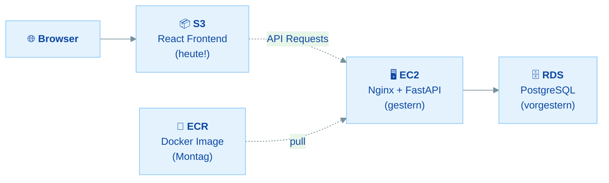
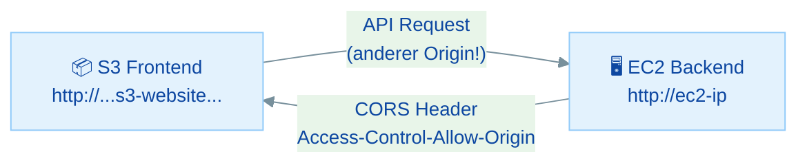
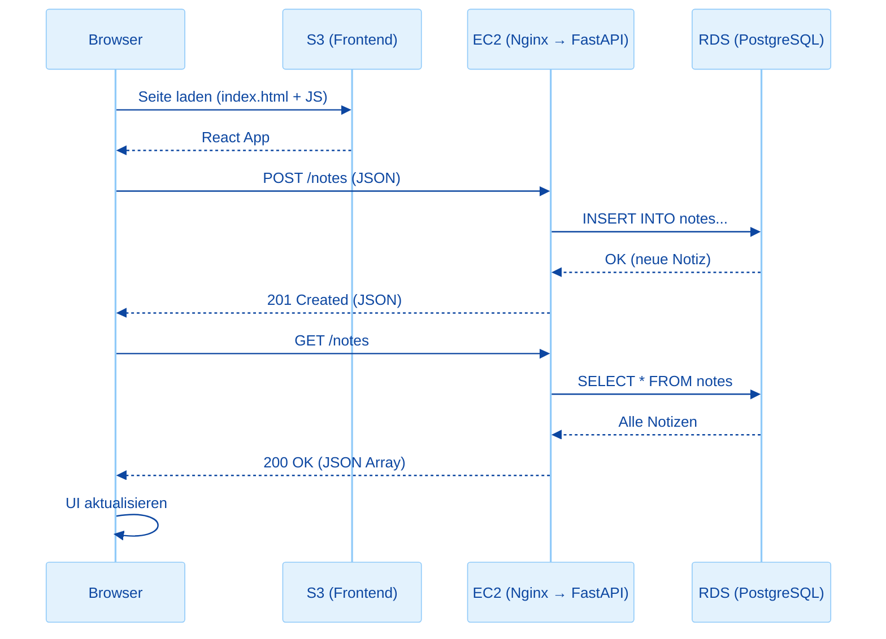
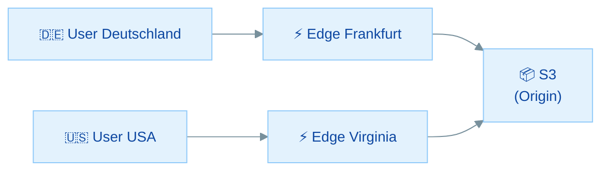

# Frontend Deployment & Cloud-Architektur

## Übersicht

In dieser Übung vervollständigst du deine Cloud-Anwendung und räumst anschließend auf:

- **React Frontend bauen** - Eine einfache Notiz-App mit React und Vite erstellen
- **S3 Static Hosting** - Das Frontend als statische Website auf S3 deployen
- **CORS konfigurieren** - Cross-Origin-Requests zwischen S3 und EC2 ermöglichen
- **End-to-End testen** - Die gesamte Cloud-Anwendung im Browser nutzen
- **CloudWatch Monitoring** - Grundlagen der Überwachung kennenlernen
- **Cleanup** - Alle AWS-Ressourcen sauber aufräumen

Heute ist der Abschluss der Woche: Frontend → S3, Backend → EC2, Datenbank → RDS. Deine komplette Cloud-Anwendung wird live!

### Warum S3 für das Frontend?

> **Architektur-Kontext:** In Übung 30.0 hast du gelernt, dass S3 für statische Dateien optimiert ist: günstiger, skalierbarer und zuverlässiger als ein EC2-Server. Eine React-App nach `npm run build` ist nur HTML + CSS + JS, perfekt für S3. Heute kommt das letzte Puzzleteil und du räumst am Ende **alle** Ressourcen auf.
>
> ```
> ✅ ECR ← Montag
> ✅ RDS ← Dienstag
> ✅ EC2 ← Gestern (Mi)
> 📦 S3  ← Heute (Do) + 🧹 Cleanup!
> ```

---

## Inhaltsverzeichnis

| Teil | Thema | Zeitbedarf |
|------|-------|------------|
| **Rückblick** | Die komplette Architektur | 10 min (lesen) |
| **Teil 1** | React Frontend bauen | 30 min |
| **Teil 2** | S3 Bucket für Static Hosting | 20 min |
| **Teil 3** | React Build hochladen | 15 min |
| **Teil 4** | CORS konfigurieren | 20 min |
| **Teil 5** | End-to-End Test | 15 min |
| **Teil 6** | CloudWatch: Metriken & Alarme | 25 min |
| **Teil 7** | Cleanup: Alle Ressourcen aufräumen | 20 min |
| **Bonus** | CloudFront CDN vor S3 | 15 min |
| | **Gesamt** | **ca. 2,5–3 Stunden** |

### Minimalpfad (wenn du wenig Zeit hast)

**In 60–90 Minuten die wichtigsten Schritte:**

1. **Teil 1** - React Frontend bauen - *Die App*
2. **Teil 2+3** - S3 Hosting + Upload - *Deployment*
3. **Teil 5** - End-to-End Test - *Erfolgserlebnis*
4. **Teil 7** - Cleanup - *Budget schonen!*

---

## Voraussetzungen & Setup

**Bevor du startest:**

1. **Übungen 30.1–30.3 abgeschlossen:**
   - CloudNotes API läuft auf EC2 (`http://<ec2-ip>/`)
   - RDS PostgreSQL ist verbunden
2. **Node.js und npm** sind lokal installiert
3. **EC2 Public IP** bereithalten

**Prüfe, ob die API noch läuft:**

```bash
curl http://<deine-ec2-ip>/health
```

Erwartete Antwort: `{"status":"healthy"}`

> **Falls die API nicht antwortet:** SSH auf EC2 → `docker ps` prüfen → ggf. `docker start cloudnotes-api`

**Folgende Werte bereithalten:**

| Was | Wo findest du es | Beispiel |
|-----|-------------------|----------|
| **EC2 Public IP** | EC2 Console → Instanz-Details | `3.123.45.67` |
| **RDS Endpoint** | RDS Console → Datenbank-Details | `cloudnotes-db.xxxxx.eu-central-1.rds.amazonaws.com` |
| **ECR Repository URI** | Aus Übung 30.1 | `123456789012.dkr.ecr.eu-central-1.amazonaws.com/cloudnotes-api` |
| **RDS Passwort** | Von Übung 30.2 | (dein gewähltes Passwort) |
| **AWS Account-ID** | `aws sts get-caller-identity` | `123456789012` |

> **Tipp:** Du brauchst diese Werte heute mehrfach. Halte sie in einem Texteditor bereit.

---

## Rückblick: Die komplette Cloud-Architektur

Diese Woche hast du Schritt für Schritt eine Cloud-Architektur aufgebaut. Heute kommt das letzte Puzzleteil:



| Tag | Was | AWS Service | Status |
|-----|-----|------------|--------|
| Mo | Docker Image | ECR | ✅ |
| Di | Datenbank | RDS | ✅ |
| Mi | Backend | EC2 | ✅ |
| **Do** | **Frontend** | **S3** | **Heute!** |

### Wissensfrage 1

Warum hosten wir das React-Frontend auf S3 und nicht auf dem gleichen EC2-Server wie das Backend?

<details markdown>
<summary>Antwort anzeigen</summary>

1. **Trennung der Verantwortungen:** Frontend (statische Dateien) und Backend (dynamische API) sind unterschiedliche Workloads
2. **Performance:** S3 ist für statische Dateien optimiert, schneller und günstiger als ein EC2-Server
3. **Skalierung:** S3 skaliert automatisch (egal ob 10 oder 10.000 Besucher), EC2 müsste manuell skaliert werden
4. **Kosten:** S3 Hosting kostet Cent-Beträge, EC2 kostet ~15€/Monat auch wenn niemand die Seite besucht
5. **Verfügbarkeit:** S3 bietet 99,99% Verfügbarkeit, höher als eine einzelne EC2-Instanz

In der Praxis nutzt man oft noch ein **CDN** (CloudFront) vor S3 für noch bessere Performance weltweit.

</details>

---

## Teil 1: React Frontend bauen

> **Ziel:** Eine funktionsfähige React-App für CloudNotes
> **Zeitbedarf:** ca. 30 Minuten

> **Rückblick:** React mit Vite, useState, useEffect und fetch kennst du aus [Woche 3–5 (React)](../woche-3/uebung-24.1-react-setup-jsx.md). Hier baust du eine einfache App, die das Gelernte anwendet.

### 1.1 React-Projekt erstellen

Gehe zurück in deinen `cloudnotes/` Hauptordner (nicht `backend/`):

```bash
cd ~/cloudnotes
npm create vite@latest frontend -- --template react
cd frontend
npm install
```

### 1.2 App.jsx erstellen

Ersetze den Inhalt von `src/App.jsx`:

```jsx
import { useState, useEffect } from "react";
import "./App.css";

const API_URL = import.meta.env.VITE_API_URL || "http://localhost:8000";

function App() {
  const [notes, setNotes] = useState([]);
  const [title, setTitle] = useState("");
  const [content, setContent] = useState("");
  const [loading, setLoading] = useState(true);
  const [error, setError] = useState(null);

  // Notizen laden
  useEffect(() => {
    fetchNotes();
  }, []);

  async function fetchNotes() {
    try {
      setLoading(true);
      const response = await fetch(`${API_URL}/notes`);
      if (!response.ok) throw new Error("Fehler beim Laden");
      const data = await response.json();
      setNotes(data);
      setError(null);
    } catch (err) {
      setError("API nicht erreichbar: " + err.message);
    } finally {
      setLoading(false);
    }
  }

  // Neue Notiz erstellen
  async function createNote(e) {
    e.preventDefault();
    if (!title.trim() || !content.trim()) return;

    try {
      const response = await fetch(`${API_URL}/notes`, {
        method: "POST",
        headers: { "Content-Type": "application/json" },
        body: JSON.stringify({ title, content }),
      });

      if (!response.ok) throw new Error("Fehler beim Erstellen");

      setTitle("");
      setContent("");
      fetchNotes();
    } catch (err) {
      setError("Fehler: " + err.message);
    }
  }

  // Notiz löschen
  async function deleteNote(id) {
    try {
      await fetch(`${API_URL}/notes/${id}`, { method: "DELETE" });
      fetchNotes();
    } catch (err) {
      setError("Fehler beim Löschen: " + err.message);
    }
  }

  return (
    <div className="app">
      <header>
        <h1>CloudNotes</h1>
        <p>Deine Notizen in der AWS Cloud</p>
      </header>

      <form onSubmit={createNote} className="note-form">
        <input
          type="text"
          placeholder="Titel"
          value={title}
          onChange={(e) => setTitle(e.target.value)}
          required
        />
        <textarea
          placeholder="Inhalt"
          value={content}
          onChange={(e) => setContent(e.target.value)}
          required
        />
        <button type="submit">Notiz erstellen</button>
      </form>

      {error && <p className="error">{error}</p>}

      {loading ? (
        <p>Laden...</p>
      ) : notes.length === 0 ? (
        <p>Noch keine Notizen vorhanden.</p>
      ) : (
        <div className="notes-list">
          {notes.map((note) => (
            <div key={note.id} className="note-card">
              <h3>{note.title}</h3>
              <p>{note.content}</p>
              <small>
                {new Date(note.created_at).toLocaleString("de-DE", {
                  day: "2-digit",
                  month: "2-digit",
                  year: "numeric",
                  hour: "2-digit",
                  minute: "2-digit",
                })}
              </small>
              <button onClick={() => deleteNote(note.id)} className="delete-btn">
                Löschen
              </button>
            </div>
          ))}
        </div>
      )}

      <footer>
        <p>
          Frontend: S3 | Backend: EC2 + Docker | Datenbank: RDS PostgreSQL
        </p>
      </footer>
    </div>
  );
}

export default App;
```

### 1.3 Styling hinzufügen

Ersetze den Inhalt von `src/App.css`:

```css
* {
  margin: 0;
  padding: 0;
  box-sizing: border-box;
}

body {
  font-family: -apple-system, BlinkMacSystemFont, "Segoe UI", Roboto, sans-serif;
  background-color: #f5f5f5;
  color: #333;
}

.app {
  max-width: 800px;
  margin: 0 auto;
  padding: 20px;
}

header {
  text-align: center;
  margin-bottom: 30px;
  padding: 20px;
  background: linear-gradient(135deg, #232f3e, #ff9900);
  color: white;
  border-radius: 10px;
}

header h1 {
  font-size: 2rem;
  margin-bottom: 5px;
}

header p {
  opacity: 0.9;
}

.note-form {
  display: flex;
  flex-direction: column;
  gap: 10px;
  margin-bottom: 30px;
  padding: 20px;
  background: white;
  border-radius: 10px;
  box-shadow: 0 2px 4px rgba(0, 0, 0, 0.1);
}

.note-form input,
.note-form textarea {
  padding: 12px;
  border: 2px solid #ddd;
  border-radius: 6px;
  font-size: 1rem;
}

.note-form textarea {
  min-height: 80px;
  resize: vertical;
}

.note-form input:focus,
.note-form textarea:focus {
  outline: none;
  border-color: #ff9900;
}

.note-form button {
  padding: 12px;
  background: #ff9900;
  color: white;
  border: none;
  border-radius: 6px;
  font-size: 1rem;
  cursor: pointer;
  font-weight: bold;
}

.note-form button:hover {
  background: #e68a00;
}

.error {
  color: #d32f2f;
  background: #ffebee;
  padding: 10px;
  border-radius: 6px;
  margin-bottom: 20px;
}

.notes-list {
  display: flex;
  flex-direction: column;
  gap: 15px;
}

.note-card {
  background: white;
  padding: 20px;
  border-radius: 10px;
  box-shadow: 0 2px 4px rgba(0, 0, 0, 0.1);
  position: relative;
}

.note-card h3 {
  margin-bottom: 8px;
  color: #232f3e;
}

.note-card p {
  margin-bottom: 10px;
  line-height: 1.5;
}

.note-card small {
  color: #888;
}

.delete-btn {
  position: absolute;
  top: 15px;
  right: 15px;
  background: #ff4444;
  color: white;
  border: none;
  padding: 6px 12px;
  border-radius: 4px;
  cursor: pointer;
  font-size: 0.85rem;
}

.delete-btn:hover {
  background: #cc0000;
}

footer {
  text-align: center;
  margin-top: 40px;
  padding: 15px;
  color: #888;
  font-size: 0.85rem;
}
```

### 1.4 Lokal testen

Erstelle eine `.env` Datei im `frontend/` Ordner für die lokale Entwicklung:

```env
VITE_API_URL=http://localhost:8000
```

> **Hinweis:** Falls dein lokales Backend nicht läuft, kannst du auch direkt die EC2-IP verwenden:
> `VITE_API_URL=http://<deine-ec2-ip>`

Starte den Dev-Server:

```bash
npm run dev
```

Öffne **http://localhost:5173** im Browser. Du solltest die CloudNotes-App sehen und Notizen erstellen können.

Stoppe den Dev-Server mit `Ctrl+C`.

### 1.5 Production Build erstellen

Erstelle eine `.env.production` Datei mit der EC2 Public IP:

```env
VITE_API_URL=http://<deine-ec2-public-ip>
```

> **Wichtig:** Ersetze `<deine-ec2-public-ip>` mit der tatsächlichen IP deines EC2-Servers!

Erstelle den Production Build:

```bash
npm run build
```

Der Build liegt jetzt im `dist/` Ordner. Schaue hinein:

```bash
ls dist/
```

> **Windows CMD/PowerShell:** Falls du nicht Git Bash nutzt: `dir dist\` statt `ls dist/`.

Du siehst: `index.html`, `assets/` (JavaScript und CSS, optimiert und minifiziert).

### Wissensfrage 2

Warum müssen wir `VITE_API_URL` in `.env.production` setzen, bevor wir `npm run build` ausführen?

<details markdown>
<summary>Antwort anzeigen</summary>

Bei einem React/Vite Build werden Umgebungsvariablen **zur Build-Zeit** in den Code eingebettet, nicht zur Laufzeit:

1. `npm run build` liest `VITE_API_URL` aus `.env.production`
2. Überall wo `import.meta.env.VITE_API_URL` steht, wird der Wert **direkt eingesetzt**
3. Das resultierende JavaScript enthält die URL als String-Literal

Das bedeutet: **Nach dem Build kann die URL nicht mehr geändert werden!** Wenn sich die EC2-IP ändert, musst du den Build neu erstellen.

Das ist ein Unterschied zu Server-Side-Rendering, wo Umgebungsvariablen zur Laufzeit gelesen werden.

</details>

---

## Teil 2: S3 Bucket für Static Hosting

> **Ziel:** Ein S3-Bucket der als Website konfiguriert ist
> **Zeitbedarf:** ca. 20 Minuten

> **Rückblick:** S3-Buckets erstellen und Static Website Hosting kennst du aus [Modul 2, Woche 4: S3 Website hosten](../../modul-2/woche-4/s3-bucket-erstellen.md). In [Woche 5](../woche-5/uebung-26.4-aws-deployment.md) hast du bereits eine React-App auf S3 deployed. Die Schritte sind identisch, hier nochmal im Kontext unserer Cloud-Architektur.

### 2.1 S3 Console öffnen

1. Gehe in die **AWS Console**
2. Suche nach **"S3"**
3. Klicke auf **"Create bucket"**

### 2.2 Bucket erstellen

| Einstellung | Wert | Erklärung |
|-------------|------|-----------|
| **Bucket name** | `cloudnotes-frontend-<dein-name>` | Muss global eindeutig sein! |
| **Region** | eu-central-1 (Frankfurt) | Gleiche Region wie EC2 und RDS |

> **Hinweis:** Bucket-Namen müssen **weltweit eindeutig** sein. Hänge deinen Namen oder eine Zufallszahl an, z.B. `cloudnotes-frontend-max123`.

### 2.3 Block Public Access deaktivieren

Scrolle zu **"Block Public Access settings for this bucket"** und:

1. **Deaktiviere** "Block all public access" (Haken entfernen)
2. Bestätige die Warnung mit dem Haken: "I acknowledge..."

> **Hinweis:** Für eine öffentliche Website müssen wir Public Access erlauben. In der Praxis nutzt man CloudFront davor, um S3 privat zu halten.

### 2.4 Bucket erstellen

Klicke auf **"Create bucket"**.

### 2.5 Static Website Hosting aktivieren

1. Klicke auf deinen neuen Bucket
2. Gehe zum Tab **"Properties"**
3. Scrolle ganz nach unten zu **"Static website hosting"**
4. Klicke **"Edit"**

| Einstellung | Wert |
|-------------|------|
| **Static website hosting** | Enable |
| **Hosting type** | Host a static website |
| **Index document** | `index.html` |
| **Error document** | `index.html` |

> **Wichtig:** Das Error-Dokument ist auch `index.html`, das ist nötig für React Router! Wenn jemand z.B. `/notes/123` direkt aufruft, gibt S3 normalerweise einen 404-Fehler. Mit `index.html` als Error-Dokument wird stattdessen die React-App geladen, die dann das Client-Side-Routing übernimmt.

5. Klicke **"Save changes"**

### 2.6 Bucket Policy hinzufügen

1. Gehe zum Tab **"Permissions"**
2. Unter **"Bucket policy"** klicke **"Edit"**
3. Füge folgende Policy ein:

```json
{
    "Version": "2012-10-17",
    "Statement": [
        {
            "Sid": "PublicReadGetObject",
            "Effect": "Allow",
            "Principal": "*",
            "Action": "s3:GetObject",
            "Resource": "arn:aws:s3:::cloudnotes-frontend-<dein-name>/*"
        }
    ]
}
```

> **Wichtig:** Ersetze `cloudnotes-frontend-<dein-name>` mit deinem tatsächlichen Bucket-Namen!

4. Klicke **"Save changes"**

### 2.7 Website-URL notieren

Gehe zurück zum Tab **"Properties"** → **"Static website hosting"**.

Dort findest du die **Bucket website endpoint**:

```
http://cloudnotes-frontend-<dein-name>.s3-website.eu-central-1.amazonaws.com
```

**Notiere dir diese URL!**

!!! warning "S3 Website Hosting = nur HTTP"
    Die S3 Website Endpoint URL beginnt mit `http://` (nicht `https://`). S3 Static Website Hosting unterstützt **kein HTTPS**. Für HTTPS brauchst du **CloudFront** davor (siehe Bonus-Abschnitt am Ende). Für unsere Übung reicht HTTP völlig aus, weil keine echten Nutzerdaten oder Logins übertragen werden. Für euer Abschlussprojekt mit echten Nutzern: CloudFront + HTTPS einrichten (siehe Bonus am Ende).

### Wissensfrage 3

Warum ist S3 für das Hosting von React-Apps ideal?

<details markdown>
<summary>Antwort anzeigen</summary>

1. **Statische Dateien:** Eine React-App (nach `npm run build`) besteht nur aus HTML, CSS und JavaScript. Genau das, was S3 am besten kann
2. **Kein Server nötig:** S3 ist "serverless", du brauchst keinen EC2-Server für statische Dateien
3. **Automatische Skalierung:** Egal ob 10 oder 100.000 Besucher, S3 skaliert automatisch
4. **Günstig:** S3-Hosting kostet nur wenige Cent pro Monat (viel günstiger als EC2)
5. **Zuverlässig:** S3 bietet 99,99% Verfügbarkeit

S3 ist für statische Dateien, was RDS für Datenbanken ist: ein managed Service, der dir die Infrastruktur abnimmt.

</details>

---

## Teil 3: React Build hochladen

> **Ziel:** Dein React-Frontend ist über die S3-URL erreichbar
> **Zeitbedarf:** ca. 15 Minuten

### 3.1 Per AWS CLI hochladen

Gehe in deinen `frontend/` Ordner und lade den Build hoch:

```bash
aws s3 sync dist/ s3://cloudnotes-frontend-<dein-name> --region eu-central-1
```

Du siehst die hochgeladenen Dateien:

```
upload: dist/index.html to s3://cloudnotes-frontend-.../index.html
upload: dist/assets/index-abc123.js to s3://cloudnotes-frontend-.../assets/index-abc123.js
upload: dist/assets/index-def456.css to s3://cloudnotes-frontend-.../assets/index-def456.css
```

### 3.2 Im Browser testen

Öffne die S3-Website-URL im Browser:

```
http://cloudnotes-frontend-<dein-name>.s3-website.eu-central-1.amazonaws.com
```

Du solltest die CloudNotes-App sehen!

<details markdown>
<summary>Hilfe: 403 Forbidden?</summary>

**"403 Forbidden":**
- Bucket Policy korrekt? Bucket-Name in der Policy richtig?
- "Block Public Access" deaktiviert?
- Static Website Hosting aktiviert?
- Die richtige URL verwenden (mit `s3-website`, nicht die normale S3-URL!)

**"404 Not Found":**
- `index.html` hochgeladen?
- Static Website Hosting: Index-Dokument auf `index.html` gesetzt?

</details>

> **Hinweis:** Die App zeigt wahrscheinlich einen Fehler "API nicht erreichbar". Das ist normal, wir müssen erst CORS konfigurieren (Teil 4)!

---

## Teil 4: CORS konfigurieren

> **Ziel:** Das Frontend auf S3 kann die API auf EC2 aufrufen
> **Zeitbedarf:** ca. 20 Minuten

> **Rückblick:** CORS wurde bereits in den [S3-Übungen (Modul 2, Woche 4)](../../modul-2/woche-4/uebung-s3-15.3.md) kurz behandelt. Hier siehst du es im Praxiskontext: Dein Frontend (S3) muss mit deinem Backend (EC2) kommunizieren, und das sind unterschiedliche Origins.

### Was ist CORS und warum brauchen wir es?

**CORS** (Cross-Origin Resource Sharing) ist ein Browser-Sicherheitsmechanismus:



Das Frontend (S3-URL) und das Backend (EC2-IP) haben **unterschiedliche Origins**. Der Browser blockiert standardmäßig Requests zwischen verschiedenen Origins, es sei denn, der Server (Backend) erlaubt es explizit über **CORS-Header**.

### 4.1 CORS in der FastAPI-App anpassen

In Übung 30.1 haben wir bereits CORS mit `allow_origins=["*"]` konfiguriert. Für Produktion schränken wir das ein.

Bearbeite `main.py` in deinem `backend/` Ordner:

```python
# CORS - Erlaube nur das S3-Frontend
app.add_middleware(
    CORSMiddleware,
    allow_origins=[
        "http://cloudnotes-frontend-<dein-name>.s3-website.eu-central-1.amazonaws.com",
        "http://localhost:5173",  # Lokale Entwicklung
    ],
    allow_credentials=False,  # Für unsere App nicht nötig (keine Cookies/Auth-Header)
    allow_methods=["*"],
    allow_headers=["*"],
)
```

> **Hinweis:** Ersetze die S3-URL mit deiner tatsächlichen S3-Website-URL!

### 4.2 Neues Docker Image bauen und pushen

Da wir die `main.py` geändert haben, brauchen wir ein neues Image:

```bash
cd backend
docker build -t cloudnotes-api:v1.2 .
```

Taggen und nach ECR pushen:

```bash
docker tag cloudnotes-api:v1.2 <deine-account-id>.dkr.ecr.eu-central-1.amazonaws.com/cloudnotes-api:v1.2
docker tag cloudnotes-api:v1.2 <deine-account-id>.dkr.ecr.eu-central-1.amazonaws.com/cloudnotes-api:latest
```

Falls nötig, erneut bei ECR einloggen:

```bash
aws ecr get-login-password --region eu-central-1 | docker login --username AWS --password-stdin <deine-account-id>.dkr.ecr.eu-central-1.amazonaws.com
```

```bash
docker push <deine-account-id>.dkr.ecr.eu-central-1.amazonaws.com/cloudnotes-api:v1.2
docker push <deine-account-id>.dkr.ecr.eu-central-1.amazonaws.com/cloudnotes-api:latest
```

### 4.3 Container auf EC2 aktualisieren

Verbinde dich per SSH mit deinem EC2-Server:

```bash
ssh -i ~/aws-keys/cloudnotes-key.pem ubuntu@<deine-ec2-ip>
```

Stoppe den alten Container, ziehe das neue Image und starte neu:

```bash
docker stop cloudnotes-api
docker rm cloudnotes-api
```

```bash
aws ecr get-login-password --region eu-central-1 | docker login --username AWS --password-stdin <deine-account-id>.dkr.ecr.eu-central-1.amazonaws.com
```

```bash
docker pull <deine-account-id>.dkr.ecr.eu-central-1.amazonaws.com/cloudnotes-api:latest
```

```bash
docker run -d \
  --name cloudnotes-api \
  -p 8000:8000 \
  -e DATABASE_URL="postgresql+psycopg://cloudnotes_admin:<dein-passwort>@cloudnotes-db.xxxxxxxxxx.eu-central-1.rds.amazonaws.com:5432/cloudnotes" \
  --restart unless-stopped \
  <deine-account-id>.dkr.ecr.eu-central-1.amazonaws.com/cloudnotes-api:latest
```

Prüfe, ob der Container läuft:

```bash
docker ps
docker logs cloudnotes-api
```

### 4.4 Alternative: CORS war bereits auf "*" gesetzt

Falls du die CORS-Einstellung nicht ändern möchtest (z.B. Zeitdruck), funktioniert `allow_origins=["*"]` aus Übung 30.1 ebenfalls. In dem Fall kannst du die Schritte 4.1–4.3 überspringen.

> **Best Practice:** In Produktion sollte man die Origins **immer** einschränken. `"*"` bedeutet, dass **jede** Website API-Requests an dein Backend senden kann.

### Wissensfrage 4

Was passiert im Browser, wenn CORS nicht konfiguriert ist?

<details markdown>
<summary>Antwort anzeigen</summary>

Der Browser zeigt einen **CORS-Fehler** in der Konsole:

```
Access to fetch at 'http://ec2-ip/notes' from origin 'http://s3-url...' has been blocked by CORS policy: No 'Access-Control-Allow-Origin' header is present on the requested resource.
```

**Wichtig:** Es ist der **Browser**, der den Request blockiert, nicht der Server! Der Server hat die Anfrage tatsächlich erhalten und beantwortet, aber der Browser verweigert, die Antwort an das JavaScript weiterzugeben.

Das ist ein Sicherheitsmechanismus: Ohne CORS könnte jede Website im Internet API-Requests an beliebige Server senden und die Antworten lesen (z.B. Banking-APIs).

CORS-Fehler treten **nur im Browser** auf. Tools wie `curl` oder `Postman` ignorieren CORS, weil sie kein "Origin" haben.

</details>

---

## Teil 5: End-to-End Test

> **Ziel:** Die komplette Cloud-Anwendung funktioniert
> **Zeitbedarf:** ca. 15 Minuten

### 5.1 Frontend im Browser öffnen

Öffne die S3-Website-URL:

```
http://cloudnotes-frontend-<dein-name>.s3-website.eu-central-1.amazonaws.com
```

### 5.2 Funktionen testen

**1. Notiz erstellen:**
- Gib einen Titel und Inhalt ein
- Klicke "Notiz erstellen"
- Die Notiz sollte in der Liste erscheinen

**2. Mehrere Notizen erstellen:**
- Erstelle 2-3 weitere Notizen
- Sie sollten chronologisch sortiert erscheinen (neueste zuerst)

**3. Notiz löschen:**
- Klicke "Löschen" bei einer Notiz
- Sie verschwindet aus der Liste

**4. Seite neu laden:**
- Drücke `F5` oder `Ctrl+R`
- Alle Notizen sollten wieder da sein (sie sind in RDS gespeichert!)

### 5.3 Den Weg eines Requests nachvollziehen

Wenn du auf "Notiz erstellen" klickst, passiert folgendes:



### 5.4 In RDS verifizieren (optional)

Verbinde dich von deinem PC per psql mit RDS und prüfe die Daten:

```bash
psql -h cloudnotes-db.xxxxxxxxxx.eu-central-1.rds.amazonaws.com -U cloudnotes_admin -d cloudnotes
```

```sql
SELECT id, title, created_at FROM notes ORDER BY created_at DESC;
```

Du siehst alle Notizen, die du über das Frontend erstellt hast!

```sql
\q
```

### 5.5 Erfolgserlebnis!

Du hast eine **komplette Cloud-Anwendung** gebaut:

- **Frontend** auf S3 (statische Website)
- **Backend** auf EC2 (Docker Container mit FastAPI)
- **Datenbank** auf RDS (Managed PostgreSQL)
- **Docker Image** in ECR (Private Registry)

Alles mit AWS-Services, die du in den letzten Wochen Stück für Stück kennengelernt hast!

---

## Teil 6: CloudWatch: Metriken & Alarme

> **Ziel:** Grundverständnis von AWS Monitoring
> **Zeitbedarf:** ca. 25 Minuten

### 6.1 Was ist CloudWatch?

**Amazon CloudWatch** ist der zentrale Monitoring-Service von AWS. Er sammelt **Metriken** und **Alarme** für alle AWS-Ressourcen.

!!! info "Wo sind die Logs?"
    CloudWatch kann auch Logs sammeln, aber das funktioniert **nicht automatisch**. Dafür müsste auf dem EC2-Server der **CloudWatch Agent** installiert und konfiguriert sein. Ohne Agent bleiben die Logs lokal auf dem Server. Für unsere Übung reicht `docker logs cloudnotes-api` per SSH völlig aus. In Produktion würde man den CloudWatch Agent einrichten, damit Logs zentral einsehbar sind.

### 6.2 EC2 Metriken anschauen

1. Gehe in die **AWS Console** → **EC2**
2. Wähle deine Instanz `cloudnotes-server`
3. Klicke auf den Tab **"Monitoring"**

Du siehst Metriken wie:

| Metrik | Bedeutung |
|--------|-----------|
| **CPU Utilization** | Wie stark ist die CPU ausgelastet? |
| **Network In/Out** | Wie viel Datenverkehr gibt es? |
| **Disk Read/Write** | Wie viele Festplattenoperationen? |
| **Status Checks** | Ist die Instanz gesund? |

> **Tipp:** Die Werte sind bei unserer kleinen Übung sehr niedrig. In Produktion würdest du hier Spitzen bei viel Traffic sehen.

### 6.3 RDS Metriken anschauen

1. Gehe zur **RDS Console**
2. Wähle deine Instanz `cloudnotes-db`
3. Klicke auf den Tab **"Monitoring"**

Interessante Metriken:

| Metrik | Bedeutung | Warum wichtig? |
|--------|-----------|----------------|
| **Database Connections** | Aktive Verbindungen | Zu viele = Performance-Problem |
| **CPU Utilization** | DB-Server Auslastung | Hoch = evtl. Instanz upgraden |
| **Free Storage Space** | Verfügbarer Speicher | Null = Datenbank voll! |
| **Read/Write IOPS** | I/O-Operationen | Zeigt DB-Aktivität |

### 6.4 CloudWatch Dashboard (optional)

1. Gehe zur **CloudWatch Console** (suche nach "CloudWatch")
2. Klicke auf **"Dashboards"** → **"Create dashboard"**
3. Name: `CloudNotes-Overview`
4. Füge Widgets hinzu:
   - EC2 CPU Utilization
   - RDS Database Connections
   - RDS Free Storage Space

### 6.5 Einfachen Alarm erstellen

1. In der **CloudWatch Console** → **"Alarms"** → **"Create alarm"**
2. Wähle eine Metrik: EC2 → Per-Instance Metrics → `cloudnotes-server` → CPU Utilization
3. Bedingung: Greater than 80%
4. Aktionen: Für die Übung kannst du die Aktion überspringen (normalerweise würde man eine E-Mail-Benachrichtigung einrichten)
5. Name: `CloudNotes-High-CPU`
6. Klicke **"Create alarm"**

> **In der Praxis** würde ein solcher Alarm eine E-Mail oder Slack-Nachricht senden, wenn die CPU-Auslastung zu hoch wird. Das ermöglicht proaktives Reagieren, bevor Nutzer Probleme bemerken.

### Wissensfrage 5

Was kostet diese Cloud-Architektur ungefähr pro Monat, wenn man kein Free Tier mehr hat?

<details markdown>
<summary>Antwort anzeigen</summary>

Grobe Kostenschätzung für die Region Frankfurt (eu-central-1):

| Service | Instanz | ca. Kosten/Monat |
|---------|---------|-------------------|
| **EC2** | t2.micro (24/7) | ~9€ |
| **RDS** | db.t3.micro (24/7) | ~15€ |
| **ECR** | 500 MB Images | ~0,05€ |
| **S3** | Static Website | ~0,50€ |
| **Datentransfer** | Gering | ~1€ |
| | **Gesamt** | **~25-30€/Monat** |

Das ist ein einfaches Setup. In Produktion kommen oft hinzu:
- Größere Instanzen (mehr CPU/RAM)
- Multi-AZ für Hochverfügbarkeit (verdoppelt RDS-Kosten)
- CloudFront CDN (~5-20€)
- Backups, Logging, Monitoring

Für professionelle Anwendungen gibt es auch **Serverless-Alternativen** (Lambda, Aurora Serverless, Amplify), die bei wenig Traffic günstiger sein können.

</details>

---

## Teil 7: Alle Ressourcen aufräumen

> **Ziel:** Alle AWS-Ressourcen löschen, um das Sandbox-Budget zu schonen
> **Zeitbedarf:** ca. 20 Minuten

> **Wichtig:** Dieser Teil ist essenziell! Laufende Ressourcen verbrauchen Budget, auch wenn du sie nicht aktiv nutzt.

### 7.1 EC2 Instance terminieren

1. Gehe zur **EC2 Console** → **Instances**
2. Wähle `cloudnotes-server`
3. **Instance state** → **Terminate instance**
4. Bestätige mit **"Terminate"**

> **Hinweis:** "Terminate" löscht die Instanz unwiderruflich. "Stop" würde sie nur pausieren (EBS-Kosten laufen weiter). Für unsere Übung wollen wir sie komplett löschen.

### 7.2 RDS Instance löschen

1. Gehe zur **RDS Console** → **Databases**
2. Wähle `cloudnotes-db`
3. **Actions** → **Delete**
4. **Wichtig:** Haken bei "Create final snapshot?" → **Nein** (deaktivieren)
5. Haken bei "I acknowledge..." setzen
6. Tippe `delete me` zur Bestätigung
7. Klicke **"Delete"**

### 7.3 S3 Bucket leeren und löschen

**Zuerst leeren:**

```bash
aws s3 rm s3://cloudnotes-frontend-<dein-name> --recursive
```

**Dann löschen:**

```bash
aws s3 rb s3://cloudnotes-frontend-<dein-name>
```

Oder über die Console:

1. Gehe zur **S3 Console**
2. Wähle den Bucket → **"Empty"** → Bestätigen
3. Wähle den Bucket → **"Delete"** → Bestätigen

### 7.4 ECR Repository löschen

```bash
aws ecr delete-repository --repository-name cloudnotes-api --force --region eu-central-1
```

Das `--force` Flag löscht auch alle enthaltenen Images.

Oder über die Console: ECR → Repository auswählen → "Delete"

### 7.5 Security Groups löschen

1. Gehe zur **EC2 Console** → **Security Groups**
2. Lösche `rds-cloudnotes-sg`
3. Lösche `ec2-cloudnotes-sg`

> **Hinweis:** Die Standard-Security-Group (default) kann und sollte nicht gelöscht werden.

### 7.6 IAM Role löschen

1. Gehe zur **IAM Console** → **Roles**
2. Suche nach `ec2-ecr-readonly-role`
3. Wähle die Role → **Delete**
4. Bestätige

### 7.7 Key Pairs aufräumen (optional)

1. Gehe zur **EC2 Console** → **Key Pairs**
2. Lösche `cloudnotes-key`
3. Lösche auch die lokale `.pem` Datei

### 7.8 Abschluss-Check

Prüfe in der AWS Console, ob noch Ressourcen laufen:

- **EC2**: Keine laufenden Instances (terminated ist okay, die verschwinden nach einer Weile)
- **RDS**: Keine Databases
- **S3**: Kein CloudNotes-Bucket
- **ECR**: Kein Repository

---

## Zusammenfassung: Was du diese Woche geschafft hast

```mermaid
%%{init: {'theme': 'base', 'themeVariables': {'primaryColor': '#e3f2fd', 'primaryTextColor': '#0d47a1', 'primaryBorderColor': '#90caf9', 'secondaryColor': '#e8f5e9', 'secondaryTextColor': '#1b5e20', 'secondaryBorderColor': '#a5d6a7', 'tertiaryColor': '#fff3e0', 'tertiaryTextColor': '#e65100', 'tertiaryBorderColor': '#ffcc80', 'lineColor': '#78909c', 'fontSize': '14px'}}}%%
graph TD
    subgraph woche ["✅ Woche 30: AWS Cloud Services"]
        subgraph mo ["Montag"]
            A["FastAPI App gebaut"]
            B["Docker Image → ECR"]
        end
        subgraph di ["Dienstag"]
            C["RDS PostgreSQL erstellt"]
            D["App mit Cloud-DB verbunden"]
        end
        subgraph mi ["Mittwoch"]
            E["EC2 + Docker + IAM"]
            F["Backend in der Cloud"]
        end
        subgraph do ["Donnerstag"]
            G["React Frontend → S3"]
            H["CORS & End-to-End"]
            I["CloudWatch Monitoring"]
        end
        A --> B --> C --> D --> E --> F --> G --> H --> I
    end
```



### Diese Woche hast du gelernt:

| Thema | AWS Service | Verknüpfung |
|-------|------------|-------------|
| Private Container Registry | **ECR** | Docker (Woche 29) |
| Managed Datenbank | **RDS** | PostgreSQL (Woche 28) |
| Cloud Server mit Docker | **EC2** | EC2 (Modul 2) + Docker (Woche 29) |
| Static Website Hosting | **S3** | S3 (Modul 2) + React (Woche 25-26) |
| Zugriffskontrolle | **IAM Roles** | IAM (Modul 2) |
| Netzwerksicherheit | **Security Groups** | Security Groups (Modul 2) |
| Monitoring | **CloudWatch** | Neu! |

### Die wichtigste Erkenntnis

Du hast die **gleichen Technologien** verwendet, die du bereits kennst (FastAPI, PostgreSQL, Docker, React), und sie mit **einfachen AWS-Services** in die Cloud gebracht. Die meisten Änderungen waren **Konfiguration** (URLs, Security Groups, IAM), nicht Code-Änderungen.

Das ist die Realität in der Cloud-Entwicklung: Der Code bleibt gleich, die Infrastruktur wird professioneller.

---

## Bonus: CloudFront CDN vor S3

> **Zeitbedarf:** ca. 15 Minuten

### Was ist CloudFront?

**Amazon CloudFront** ist ein CDN (Content Delivery Network). Es cacht deine Dateien an **Edge Locations** weltweit, damit Nutzer sie schneller laden können.



### Vorteile von CloudFront

| Ohne CloudFront | Mit CloudFront |
|-----------------|----------------|
| Jeder Request geht direkt zu S3 | Gecachte Dateien von der nächsten Edge Location |
| Kein HTTPS (S3 Website) | HTTPS kostenlos mit AWS-Zertifikat |
| S3 muss public sein | S3 kann private bleiben (OAC) |
| Keine benutzerdefinierte Domain | Custom Domain möglich |

### CloudFront einrichten (Kurzversion)

1. Gehe zur **CloudFront Console**
2. Klicke **"Create distribution"**
3. **Origin domain:** Wähle deinen S3-Bucket
4. **Default root object:** `index.html`
5. Erstelle die Distribution

> **Hinweis:** CloudFront-Distributionen brauchen 5-10 Minuten zum Deployen. Für unsere Übung ist S3-Hosting ausreichend. CloudFront wäre der nächste Schritt für eine produktionsreife Anwendung.

---

## Checkliste

Prüfe, ob du alle Ziele erreicht hast:

- [ ] React Frontend gebaut mit API-Anbindung
- [ ] S3 Static Website Hosting konfiguriert
- [ ] Frontend über S3-URL erreichbar
- [ ] CORS ist korrekt konfiguriert (Frontend kann API aufrufen)
- [ ] End-to-End: Notizen erstellen, anzeigen, löschen funktioniert
- [ ] Daten sind in RDS gespeichert (überlebt Seiten-Reload)
- [ ] CloudWatch Metriken angeschaut (EC2 + RDS)
- [ ] **Alle AWS-Ressourcen aufgeräumt (Cleanup!)**
- [ ] Ich kann die gesamte Cloud-Architektur erklären (S3 → EC2 → RDS)
- [ ] Ich verstehe, warum CORS nötig ist
