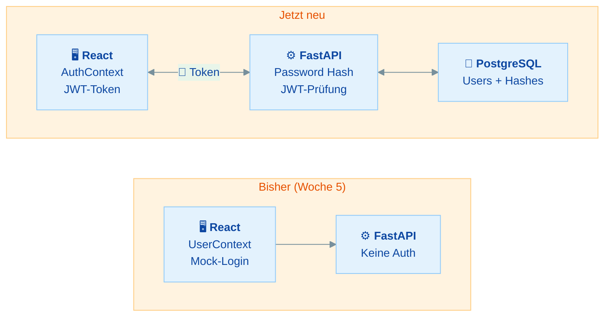
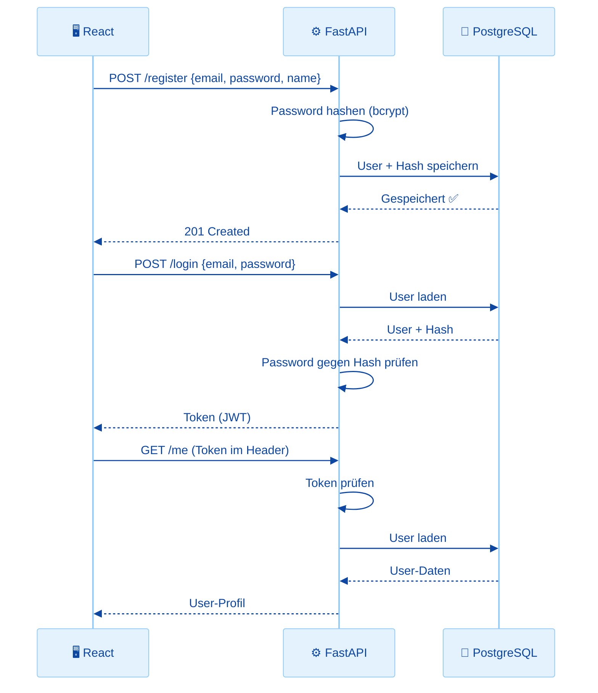

# Authentication Konzepte & Password Hashing - Praktische Übungen

## Übersicht

In dieser Übung lernst du die Grundlagen sicherer Authentifizierung:

- **Wie funktioniert Authentication im Web?** - Stateless vs Stateful, warum der React-State nicht reicht
- **Warum Klartext-Passwörter gefährlich sind** - Data Breaches und ihre Folgen
- **Password Hashing mit bcrypt** - Passwörter sicher speichern mit passlib
- **User-Model erweitern** - SQLAlchemy-Model und Alembic-Migration für `hashed_password`
- **Register- und Login-Endpoints** - Erste echte Auth-Endpoints in FastAPI

In Woche 5 habt ihr einen UserContext mit Mock-Login gebaut (Benutzername eingeben, "eingeloggt"). In Woche 7 habt ihr FastAPI + PostgreSQL verbunden. Jetzt bringen wir beides zusammen: **echte, sichere Authentifizierung**.

| Teil | Thema | Zeitbedarf |
|------|-------|------------|
| **Rückblick** | Authentication im Web – wie funktioniert das? | 10 min (lesen) |
| **Teil 1** | Warum Klartext-Passwörter gefährlich sind | 15 min |
| **Teil 2** | Password Hashing mit passlib/bcrypt | 25 min |
| **Teil 3** | Utility-Modul `app/auth.py` | 10 min |
| **Teil 4** | User-Model mit Passwort-Hash erweitern | 25 min |
| **Teil 5** | Register- und Login-Endpoints | 30 min |
| **Bonus** | Argon2 als Alternative zu bcrypt | 10 min (lesen) |
| | **Gesamt** | **ca. 1,5–2 Stunden** |

**Minimalpfad (ca. 65 Minuten):** Rückblick + Teil 1 + Teil 2 + Teil 3 + Teil 4. Teil 5 (Endpoints) wird für die Folgeübung empfohlen, kann aber auch dort nachgeholt werden.

---

## Rückblick: Authentication im Web

Bevor wir loslegen, schauen wir uns an, was "Authentication" eigentlich bedeutet – und warum euer bisheriger Ansatz nicht ausreicht.

### Euer Stack bekommt eine Auth-Schicht



### Was euer bisheriger UserContext macht – und was fehlt

In Woche 5 habt ihr einen `UserContext` gebaut. Das sah ungefähr so aus:

```javascript
function login(username, role = 'User') {
  setUser({ name: username, role, loginTime: new Date() });
}
```

**Das Problem:** Jeder kann sich als "Admin" einloggen – ohne Passwort, ohne Prüfung. Der Login-Status lebt nur im Browser-State. Wenn du die Seite neu lädst, bist du ausgeloggt. Und das Backend weiß gar nicht, wer du bist.

| Aspekt | UserContext (Woche 5) | Echte Authentication |
|--------|----------------------|---------------------|
| Passwort-Prüfung | ❌ Keine | ✅ Hash-Vergleich im Backend |
| Sicherheit | ❌ Jeder kann sich als Admin ausgeben | ✅ Backend prüft Identität |
| Persistenz | ❌ Weg nach Reload | ✅ Token bleibt erhalten |
| Backend-Schutz | ❌ Alle Endpoints offen | ✅ Token wird bei jedem Request geprüft |

### Wie funktioniert echte Authentication?



**Die 3 Schritte:**
1. **Registrierung:** User erstellt Account, Passwort wird **gehasht** (nicht im Klartext!) gespeichert
2. **Login:** User sendet Email + Passwort, Backend prüft Hash, gibt **Token** zurück
3. **Geschützte Requests:** Frontend sendet Token bei jeder Anfrage mit, Backend prüft Token

### Stateless vs Stateful Authentication

| Eigenschaft | Stateful (Sessions) | Stateless (JWT) |
|-------------|-------------------|-----------------|
| Server speichert Status | ✅ Ja (Redis/DB) | ❌ Nein |
| Token enthält Daten | ❌ Nur Session-ID | ✅ User-ID, Rolle, Ablaufdatum |
| Skalierung | Schwieriger (shared State) | Einfach (jeder Server kann prüfen) |
| Widerrufen | Sofort (Session löschen) | Schwieriger (Token gültig bis Ablauf) |
| Typischer Einsatz | Klassische Webapps | SPAs, APIs, Microservices |

> **In diesem Material:** Wir verwenden **JWT (JSON Web Tokens)** – das ist der Standard für moderne SPAs wie eure React-Apps.

### Wissensfrage 1

> Warum reicht es nicht, den Login-Status nur im React-State (Context) zu speichern?

<details markdown>
<summary>Antwort anzeigen</summary>

Der React-State lebt nur im Browser. Jeder kann den State manipulieren (z.B. über die DevTools), sich als Admin ausgeben oder beliebige Daten senden. Das Backend hat keine Möglichkeit zu prüfen, ob der Request von einem echten, eingeloggten User kommt. Echte Authentication braucht serverseitige Prüfung – das Frontend ist niemals vertrauenswürdig.

</details>

### Wissensfrage 2

> Was ist der Unterschied zwischen Stateful (Session-basiert) und Stateless (JWT-basiert) Authentication?

<details markdown>
<summary>Antwort anzeigen</summary>

Bei **Stateful Authentication** speichert der Server den Login-Status (z.B. in Redis oder einer Datenbank). Der Client bekommt nur eine Session-ID. Bei **Stateless Authentication** (JWT) enthält der Token selbst alle nötigen Informationen (User-ID, Rolle, Ablaufdatum). Der Server muss keinen Status speichern – er prüft nur die Signatur des Tokens.

</details>

---

## Teil 1: Warum Klartext-Passwörter gefährlich sind

### Übung 1: Die Gefahr von Klartext verstehen

> **Ziel:** Verstehen, warum Passwörter niemals im Klartext gespeichert werden dürfen
> **Zeitbedarf:** ca. 15 Minuten
> **Du bist fertig, wenn:** Du erklären kannst, was Hashing ist und warum es nötig ist

Stell dir vor, deine User-Tabelle sieht so aus:

| id | email | password | name |
|----|-------|----------|------|
| 1 | max@example.com | `geheim123` | Max |
| 2 | anna@example.com | `anna2024!` | Anna |
| 3 | tom@example.com | `passwort` | Tom |

**Was passiert bei einem Data Breach?**

Wenn ein Angreifer Zugriff auf diese Datenbank bekommt (durch SQL Injection, gestohlene Backups, kompromittierte Server), hat er **sofort alle Passwörter im Klartext**. Da viele Menschen dasselbe Passwort für mehrere Dienste verwenden, sind damit nicht nur deine App, sondern auch deren Email, Social Media und Banking-Accounts gefährdet.

> **Realität:** Data Breaches passieren regelmäßig – auch bei großen Unternehmen. Die Frage ist nicht *ob*, sondern *wie gut du vorbereitet bist*.

### Hashing vs Verschlüsselung

| Eigenschaft | Hashing | Verschlüsselung |
|-------------|---------|-----------------|
| Richtung | ➡️ Einweg (nicht umkehrbar) | ↔️ Zweiweg (ent-/verschlüsselbar) |
| Zweck | Passwort prüfen, ohne es zu kennen | Daten schützen und später wieder lesen |
| Beispiel | `bcrypt("geheim") → $2b$12$x7J...` | `AES("Nachricht", key) → verschlüsselt` |
| Umkehrbar? | **Nein** – genau das wollen wir! | Ja – mit dem richtigen Schlüssel |
| Für Passwörter? | ✅ Ja! | ❌ Nein – zu riskant |

> **Merke:** Passwörter werden **gehasht**, nicht verschlüsselt. Auch du als Entwickler sollst das Passwort eines Users **niemals** kennen oder wiederherstellen können.

So sieht die Tabelle mit Hashing aus:

| id | email | hashed_password | name |
|----|-------|----------------|------|
| 1 | max@example.com | `$2b$12$x7JkQ...` | Max |
| 2 | anna@example.com | `$2b$12$9mRvZ...` | Anna |
| 3 | tom@example.com | `$2b$12$Lp3nW...` | Tom |

Selbst bei einem Breach: Der Angreifer sieht nur unleserliche Hashes. Er kann daraus **nicht** die Original-Passwörter berechnen.

### Wissensfrage 3

> Was ist der Unterschied zwischen Hashing und Verschlüsselung?

<details markdown>
<summary>Antwort anzeigen</summary>

**Hashing** ist eine Einweg-Funktion: Aus einem Passwort wird ein Hash berechnet, aber aus dem Hash kann man das Passwort nicht zurückberechnen. **Verschlüsselung** ist eine Zweiweg-Funktion: Daten werden mit einem Schlüssel verschlüsselt und können mit demselben (oder einem passenden) Schlüssel wieder entschlüsselt werden. Für Passwörter verwenden wir immer Hashing, weil wir das Original-Passwort nie wieder brauchen – wir prüfen nur, ob ein eingegebenes Passwort zum gespeicherten Hash passt.

</details>

---

## Teil 2: Password Hashing mit passlib/bcrypt

### Übung 2: passlib installieren und ausprobieren

> **Ziel:** bcrypt-Hashing in Python ausprobieren und verstehen
> **Zeitbedarf:** ca. 25 Minuten
> **Du bist fertig, wenn:** Du ein Passwort hashen und verifizieren kannst

**Schritt 1: passlib installieren**

```bash
pip install "passlib[bcrypt]"
```

> **Warum passlib?** passlib ist ein Python-Paket, das verschiedene Hashing-Algorithmen bereitstellt. Es kümmert sich um Salt-Generierung, Algorithmus-Verwaltung und bietet eine saubere API. bcrypt ist der Algorithmus, den wir verwenden.

**Schritt 2: In der Python-Shell ausprobieren**

Öffne eine Python-Shell (`python`) und probiere es aus:

```python
from passlib.context import CryptContext

# CryptContext erstellen – er weiß, welcher Algorithmus verwendet wird
pwd_context = CryptContext(schemes=["bcrypt"], deprecated="auto")

# Passwort hashen
hash1 = pwd_context.hash("geheim123")
print(hash1)
# → $2b$12$x7JkQ3Rz... (jedes Mal anders!)

# Nochmal hashen – gleicher Input, anderer Hash!
hash2 = pwd_context.hash("geheim123")
print(hash2)
# → $2b$12$9mRvZ1Lp... (anders als hash1!)

print(hash1 == hash2)
# → False (!)
```

**Warum sind die Hashes unterschiedlich?** Weil bcrypt automatisch einen zufälligen **Salt** hinzufügt. Der Salt wird im Hash selbst gespeichert:

```
$2b$12$x7JkQ3Rz5mNpLwYr8vK2Oe.WzH3h1KqZ9Yb2NcM4T6RdFgA7sXuC
 ↑   ↑  ↑─────────────────────↑ ↑───────────────────────────────↑
 │   │  Salt (22 Zeichen)       Hash (31 Zeichen)
 │   └─ Cost Factor (12 = 2^12 Runden)
 └── Algorithmus (2b = bcrypt)
```

| Bestandteil | Wert | Bedeutung |
|-------------|------|-----------|
| `$2b$` | Algorithmus | bcrypt |
| `12` | Cost Factor | 2^12 = 4096 Hashing-Runden (langsam = sicher!) |
| `x7JkQ3Rz5mNpLwYr8vK2Oe` | Salt | Zufälliger Wert, bei jedem Hash anders |
| Rest | Hash | Das eigentliche Ergebnis |

**Schritt 3: Passwort verifizieren**

```python
# Passwort prüfen – passlib extrahiert den Salt aus dem Hash
print(pwd_context.verify("geheim123", hash1))  # True ✅
print(pwd_context.verify("falsch", hash1))      # False ❌

# Funktioniert auch mit hash2
print(pwd_context.verify("geheim123", hash2))  # True ✅
```

> **So funktioniert der Login:** Beim Login hasht bcrypt das eingegebene Passwort mit dem Salt, der im gespeicherten Hash steckt, und vergleicht die Ergebnisse. Gleich = richtiges Passwort. Ungleich = falsches Passwort.

### Troubleshooting

| Problem | Ursache | Lösung |
|---------|---------|--------|
| `ModuleNotFoundError: No module named 'passlib'` | passlib nicht installiert | `pip install "passlib[bcrypt]"` |
| `ModuleNotFoundError: No module named 'bcrypt'` | bcrypt-Extra fehlt | `pip install "passlib[bcrypt]"` (mit `[bcrypt]`!) |
| Hash sieht anders aus als erwartet | Normales Verhalten – Salt ist zufällig | Verify verwenden, nicht String-Vergleich |

### Wissensfrage 4

> Warum erzeugt `pwd_context.hash("geheim123")` jedes Mal einen anderen Hash – und warum ist das eine gute Sache?

<details markdown>
<summary>Antwort anzeigen</summary>

bcrypt fügt bei jedem Aufruf einen zufälligen **Salt** hinzu. Der Salt wird zusammen mit dem Hash gespeichert. Das bedeutet: Selbst wenn zwei User dasselbe Passwort verwenden, haben sie unterschiedliche Hashes in der Datenbank. Ein Angreifer kann also nicht erkennen, welche User das gleiche Passwort haben. Ohne Salt könnte ein Angreifer eine Tabelle aller möglichen Hashes vorberechnen (Rainbow Table) und Passwörter schnell nachschlagen.

</details>

---

## Teil 3: Utility-Modul `app/auth.py`

### Übung 3: auth.py erstellen

> **Ziel:** Ein wiederverwendbares Auth-Modul für euer Projekt erstellen
> **Zeitbedarf:** ca. 10 Minuten
> **Du bist fertig, wenn:** Du `hash_password()` und `verify_password()` aus `app/auth.py` importieren kannst

Erstelle die Datei `app/auth.py` in deinem kursapp-Projekt:

```
kursapp-backend/
├── app/
│   ├── __init__.py
│   ├── main.py          # FastAPI-App (aus Woche 7)
│   ├── database.py      # DB-Verbindung (aus Woche 7)
│   ├── models.py         # SQLAlchemy-Models (aus Woche 7)
│   ├── schemas.py        # Pydantic-Schemas (aus Woche 7)
│   └── auth.py           # ← NEU!
├── alembic/
├── .env
└── requirements.txt
```

**Aufgabe:** Erstelle `app/auth.py` mit zwei Funktionen:

1. `hash_password(password: str) -> str` – Hasht ein Klartext-Passwort
2. `verify_password(plain_password: str, hashed_password: str) -> bool` – Prüft ein Passwort gegen einen Hash

<details markdown>
<summary>Musterlösung anzeigen</summary>

```python
# app/auth.py

from passlib.context import CryptContext

pwd_context = CryptContext(schemes=["bcrypt"], deprecated="auto")


def hash_password(password: str) -> str:
    """Hasht ein Klartext-Passwort mit bcrypt."""
    return pwd_context.hash(password)


def verify_password(plain_password: str, hashed_password: str) -> bool:
    """Prüft ein Klartext-Passwort gegen einen bcrypt-Hash."""
    return pwd_context.verify(plain_password, hashed_password)
```

</details>

**Schnelltest in der Python-Shell:**

```python
from app.auth import hash_password, verify_password

h = hash_password("test123")
print(verify_password("test123", h))   # True
print(verify_password("falsch", h))    # False
```

---

## Teil 4: User-Model mit Passwort-Hash erweitern

### Übung 4: User-Model erweitern

> **Ziel:** Die `hashed_password`-Spalte zum User-Model hinzufügen und die DB-Migration ausführen
> **Zeitbedarf:** ca. 25 Minuten
> **Du bist fertig, wenn:** Deine User-Tabelle eine `hashed_password`-Spalte hat und du passende Pydantic-Schemas hast

**Schritt 1: SQLAlchemy-Model erweitern**

Öffne `app/models.py` und füge `hashed_password` zum User-Model hinzu:

```python
# app/models.py

from sqlalchemy import Column, Integer, String
from app.database import Base


class User(Base):
    __tablename__ = "users"

    id = Column(Integer, primary_key=True, index=True)
    email = Column(String, unique=True, nullable=False, index=True)
    name = Column(String, nullable=False)
    hashed_password = Column(String, nullable=False)       # ← NEU!
    role = Column(String, default="user")                   # ← NEU!
```

> **Wichtig:** Die Spalte heißt `hashed_password` – nicht `password`! Das macht jedem Entwickler klar, dass hier ein Hash steht, kein Klartext.

**Schritt 2: Alembic-Migration erstellen**

```bash
alembic revision --autogenerate -m "add hashed_password and role to users"
```

Prüfe die generierte Migration (in `alembic/versions/...`), dann:

```bash
alembic upgrade head
```

**Schritt 3: Pydantic-Schemas erstellen**

Öffne `app/schemas.py` und füge die Auth-Schemas hinzu:

```python
# app/schemas.py – Auth-Schemas hinzufügen

from pydantic import BaseModel, EmailStr


class UserRegister(BaseModel):
    """Schema für die Registrierung – mit Passwort."""
    email: str
    name: str
    password: str      # Klartext-Passwort vom User (wird NICHT gespeichert!)


class LoginRequest(BaseModel):
    """Schema für den Login."""
    email: str
    password: str


class UserResponse(BaseModel):
    """Schema für die API-Response – OHNE Passwort!"""
    id: int
    email: str
    name: str
    role: str

    model_config = {"from_attributes": True}
```

> **Warum hat `UserResponse` kein Passwort-Feld?** Weil der Hash niemals die API verlassen darf. Selbst der Hash könnte einem Angreifer Informationen liefern. Pydantic sorgt dafür, dass nur die definierten Felder in der Response landen.

### Wissensfrage 5

> Warum hat das `UserResponse`-Schema kein Passwort- oder Hash-Feld?

<details markdown>
<summary>Antwort anzeigen</summary>

Der Passwort-Hash darf niemals über die API an den Client gesendet werden. Selbst ein Hash könnte einem Angreifer Informationen liefern (z.B. für Offline-Brute-Force-Angriffe). Pydantic-Schemas trennen sauber, was hereinkommt (UserRegister mit Passwort) und was herausgeht (UserResponse ohne Passwort). So kann das Passwort-Feld nicht versehentlich in einer API-Response landen.

</details>

### Troubleshooting

| Problem | Ursache | Lösung |
|---------|---------|--------|
| `alembic revision --autogenerate` findet keine Änderungen | `target_metadata` nicht gesetzt | In `alembic/env.py` prüfen: `target_metadata = Base.metadata` |
| `nullable=False` schlägt fehl bei bestehenden Rows | Bestehende Zeilen haben `NULL` in der neuen Spalte | Entweder bestehende Daten löschen oder Spalte erst `nullable=True` erstellen, Daten füllen, dann ändern |
| `EmailStr` nicht verfügbar | `email-validator` Paket fehlt | `pip install email-validator` oder stattdessen `str` verwenden (für Lernzwecke reicht `str`) |

---

## Teil 5: Register- und Login-Endpoints

### Übung 5: POST /register

> **Ziel:** Einen Registrierungs-Endpoint bauen, der das Passwort sicher hasht
> **Zeitbedarf:** ca. 15 Minuten
> **Du bist fertig, wenn:** Du über Swagger UI einen neuen User registrieren kannst

**Aufgabe:** Implementiere `POST /register` in `app/main.py`:

1. Akzeptiert `UserRegister` (email, name, password)
2. Prüft, ob die Email bereits vergeben ist → `409 Conflict`
3. Hasht das Passwort mit `hash_password()`
4. Speichert den User mit dem Hash in PostgreSQL
5. Gibt `UserResponse` zurück (ohne Passwort!)

<details markdown>
<summary>Musterlösung anzeigen</summary>

```python
# In app/main.py

from fastapi import FastAPI, Depends, HTTPException
from sqlalchemy.orm import Session
from app.database import get_db
from app.models import User
from app.schemas import UserRegister, UserResponse
from app.auth import hash_password

app = FastAPI()


@app.post("/register", response_model=UserResponse, status_code=201)
def register(user_data: UserRegister, db: Session = Depends(get_db)):
    # Prüfen ob Email bereits vergeben
    existing = db.query(User).filter(User.email == user_data.email).first()
    if existing:
        raise HTTPException(status_code=409, detail="Email bereits registriert")

    # User erstellen – Passwort wird gehasht!
    new_user = User(
        email=user_data.email,
        name=user_data.name,
        hashed_password=hash_password(user_data.password),
        role="user",
    )
    db.add(new_user)
    db.commit()
    db.refresh(new_user)
    return new_user
```

</details>

**Teste mit Swagger UI** (http://localhost:8000/docs):

1. Öffne den `POST /register` Endpoint
2. Klicke "Try it out"
3. Sende: `{"email": "max@example.com", "name": "Max", "password": "geheim123"}`
4. Erwartete Response (201):
   ```json
   {
     "id": 1,
     "email": "max@example.com",
     "name": "Max",
     "role": "user"
   }
   ```

> **Beachte:** Die Response enthält kein Passwort – genau so soll es sein!

### Übung 6: POST /login

> **Ziel:** Einen Login-Endpoint bauen, der Email und Passwort prüft
> **Zeitbedarf:** ca. 15 Minuten
> **Du bist fertig, wenn:** Du dich mit korrekten Daten einloggen kannst und bei falschen Daten einen Fehler bekommst

**Aufgabe:** Implementiere `POST /login`:

1. Akzeptiert `LoginRequest` (email, password)
2. Sucht den User in der DB
3. Prüft das Passwort mit `verify_password()`
4. Gibt bei Erfolg eine Erfolgsmeldung zurück (JWT-Token kommt in der nächsten Übung!)
5. Gibt bei Fehler `401 Unauthorized` zurück

> **Sicherheitsregel:** Die Fehlermeldung darf **nicht** verraten, ob die Email existiert oder das Passwort falsch war. Sonst kann ein Angreifer herausfinden, welche Emails registriert sind.

<details markdown>
<summary>Musterlösung anzeigen</summary>

```python
# In app/main.py

from app.schemas import LoginRequest
from app.auth import verify_password


@app.post("/login")
def login(login_data: LoginRequest, db: Session = Depends(get_db)):
    # User per Email suchen
    user = db.query(User).filter(User.email == login_data.email).first()

    # Prüfen: User existiert UND Passwort stimmt
    # ⚠️ Generische Fehlermeldung – NICHT "Email nicht gefunden" oder "Passwort falsch"!
    if not user or not verify_password(login_data.password, user.hashed_password):
        raise HTTPException(
            status_code=401,
            detail="Ungültige Anmeldedaten"
        )

    # Erstmal nur Bestätigung – JWT-Token kommt in Übung 02!
    return {"message": "Login erfolgreich", "user_id": user.id, "name": user.name}
```

</details>

**Teste mit Swagger UI:**

1. **Richtiges Passwort:** `{"email": "max@example.com", "password": "geheim123"}` → `200 OK`
2. **Falsches Passwort:** `{"email": "max@example.com", "password": "falsch"}` → `401 Unauthorized`
3. **Unbekannte Email:** `{"email": "nobody@example.com", "password": "egal"}` → `401 Unauthorized`

> **Beachte:** Fehler 2 und 3 geben die **gleiche** Fehlermeldung zurück. Das ist Absicht!

### Wissensfrage 6

> Warum sollte die Login-Fehlermeldung NICHT verraten, ob die Email existiert oder das Passwort falsch war?

<details markdown>
<summary>Antwort anzeigen</summary>

Wenn die Fehlermeldung unterscheidet ("Email nicht gefunden" vs "Passwort falsch"), kann ein Angreifer systematisch Emails durchprobieren und herausfinden, welche Accounts existieren. Das nennt man **User Enumeration**. Mit einer generischen Meldung ("Ungültige Anmeldedaten") bekommt der Angreifer keine Information darüber, ob eine Email registriert ist oder nicht.

</details>

### Troubleshooting

| Problem | Ursache | Lösung |
|---------|---------|--------|
| `IntegrityError` bei Register | Email bereits vergeben | Email-Check vor dem Insert (409 Response) |
| Login gibt immer 401 | Hash stimmt nicht mit Passwort überein | Prüfe ob beim Register `hash_password()` verwendet wurde |
| `422 Unprocessable Entity` bei Login | Request-Body falsch formatiert | JSON-Body senden, nicht Query-Parameter |

---

## Bonus: Argon2 als Alternative zu bcrypt

Argon2 hat 2015 den [Password Hashing Competition](https://www.password-hashing.net/) gewonnen und gilt als der modernste Algorithmus. Er bietet zusätzlich Schutz gegen GPU-basierte Angriffe, indem er absichtlich viel RAM verbraucht.

**Installation:**

```bash
pip install "passlib[argon2]"
```

**Verwendung – fast identisch zu bcrypt:**

```python
from passlib.context import CryptContext

# Einfach "argon2" statt "bcrypt"
pwd_context = CryptContext(schemes=["argon2"], deprecated="auto")

hash = pwd_context.hash("geheim123")
print(hash)
# → $argon2id$v=19$m=65536,t=3,p=4$...

pwd_context.verify("geheim123", hash)  # True
```

| Eigenschaft | bcrypt | Argon2 |
|-------------|--------|--------|
| Alter | 1999 | 2015 |
| CPU-Schutz | ✅ Ja (Cost Factor) | ✅ Ja (Time Cost) |
| RAM-Schutz | ❌ Nein | ✅ Ja (Memory Cost) |
| Standard für | Die meisten Web-Apps | Sicherheitskritische Systeme |
| passlib-Unterstützung | ✅ Stabil | ✅ Stabil |

> **Empfehlung:** Für die meisten Web-Apps ist **bcrypt** völlig ausreichend und besser getestet. Argon2 ist die "Next Generation"-Option für besonders sicherheitskritische Anwendungen.

---

## Zusammenfassung

In dieser Übung hast du die Grundlagen sicherer Authentifizierung gelernt:

| Konzept | Was du gelernt hast |
|---------|-------------------|
| Klartext-Gefahr | Passwörter dürfen **niemals** im Klartext gespeichert werden |
| Hashing vs Verschlüsselung | Hashing ist Einweg – genau richtig für Passwörter |
| bcrypt | Salt + Cost Factor = sicherer Hash mit passlib |
| `app/auth.py` | Wiederverwendbares Modul mit `hash_password()` und `verify_password()` |
| User-Model | `hashed_password`-Spalte in SQLAlchemy + Alembic-Migration |
| Pydantic-Schemas | `UserRegister` (mit Passwort) vs `UserResponse` (ohne!) |
| Register-Endpoint | POST `/register` mit Hash + Duplikat-Check (409) |
| Login-Endpoint | POST `/login` mit generischer Fehlermeldung (401) |

### Was kommt als Nächstes?

Der Login gibt aktuell nur `{"message": "Login erfolgreich"}` zurück. In der nächsten Übung (**02 – JWT Authentication**) lernst du, wie du einen **JWT-Token** zurückgibst, den das Frontend bei jedem Request mitsendet.

---

## Checkliste

- [ ] Ich verstehe, warum Klartext-Passwörter gefährlich sind
- [ ] Ich kann den Unterschied zwischen Hashing und Verschlüsselung erklären
- [ ] Ich kann mit passlib/bcrypt ein Passwort hashen und verifizieren
- [ ] Ich habe `app/auth.py` mit `hash_password()` und `verify_password()` erstellt
- [ ] Mein User-Model hat eine `hashed_password`-Spalte
- [ ] Ich habe die Alembic-Migration ausgeführt
- [ ] Mein `UserResponse`-Schema enthält kein Passwort-Feld
- [ ] POST `/register` hasht das Passwort und prüft auf doppelte Emails
- [ ] POST `/login` gibt eine generische Fehlermeldung bei falschen Daten
