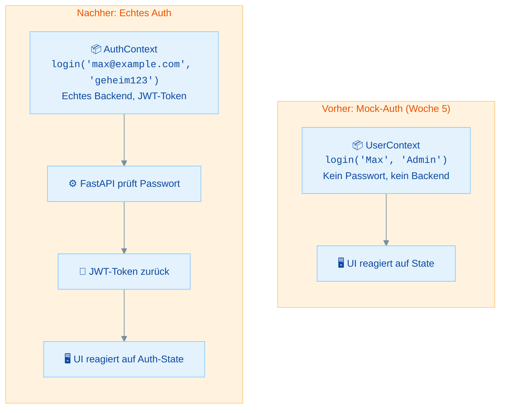
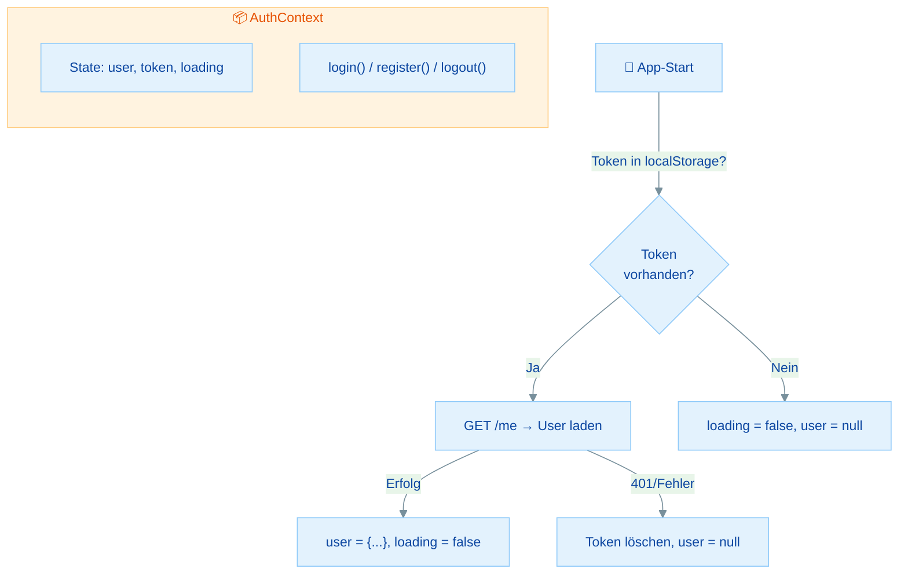

# Authentication im React-Frontend - Praktische Übungen

## Übersicht

In dieser Übung baust du die Frontend-Seite der Authentifizierung:

- **Login- und Register-Formulare** - Echte Formulare, die mit deiner API kommunizieren
- **Token-Speicherung und API-Helper** - Wo der JWT gespeichert wird und wie er mitgeschickt wird
- **AuthContext mit echtem Backend** - Der UserContext aus Woche 5, aber diesmal echt
- **Protected Routes** - Routen, die nur für eingeloggte User sichtbar sind
- **Logout und Token-Lifecycle** - Was passiert, wenn der Token abläuft

In Woche 5 habt ihr einen `UserContext` mit Mock-Login gebaut. In Übung 02 habt ihr JWT-Authentication im Backend eingerichtet. Jetzt bringen wir beides zusammen: Ein echtes Auth-Frontend.

| Teil | Thema | Zeitbedarf |
|------|-------|------------|
| **Rückblick** | Von Mock-Auth zu echtem Auth | 10 min (lesen) |
| **Teil 1** | Login- und Register-Formulare | 25 min |
| **Teil 2** | Token-Speicherung und API-Helper | 25 min |
| **Teil 3** | AuthContext mit echtem Backend | 30 min |
| **Teil 4** | Protected Routes mit React Router | 25 min |
| **Teil 5** | Logout und Token-Lifecycle | 15 min |
| **Bonus** | Automatisches Token-Refresh | 15 min (lesen) |
| | **Gesamt** | **ca. 2–2,5 Stunden** |

**Minimalpfad (ca. 80 Minuten):** Teil 1 + Teil 2 + Teil 3. Protected Routes (Teil 4) und Lifecycle (Teil 5) sind optional, aber empfohlen für eine vollständige App.

---

## Rückblick: Von Mock-Auth zu echtem Auth

### Vorher vs Nachher



| Aspekt | UserContext (Woche 5) | AuthContext (jetzt) |
|--------|----------------------|---------------------|
| Login | `login('Max', 'Admin')` – jeder kann alles | `login(email, password)` – Backend prüft |
| Token | ❌ Keiner | ✅ JWT-Token vom Backend |
| API-Calls | Ohne Auth-Header | Mit `Authorization: Bearer <token>` |
| Persistenz | Weg nach Reload | Token in localStorage überlebt Reload |
| Backend-Schutz | Keiner | Token wird bei jedem Request geprüft |

### Die Dateistruktur die wir aufbauen

```
src/
├── contexts/
│   └── AuthContext.jsx       # ← NEU: Ersetzt UserContext
├── utils/
│   └── api.js                # ← NEU: Auth-Fetch-Helper
├── components/
│   ├── LoginForm.jsx         # ← NEU: Echtes Login
│   ├── RegisterForm.jsx      # ← NEU: Registrierung
│   └── ProtectedRoute.jsx    # ← NEU: Route-Schutz
├── pages/
│   ├── LoginPage.jsx
│   ├── RegisterPage.jsx
│   ├── DashboardPage.jsx     # Geschützt
│   └── ProfilePage.jsx       # Geschützt
└── App.jsx
```

### Wissensfrage 1

> Was ändert sich am UserContext, wenn wir echte Authentication hinzufügen?

<details>
<summary>Antwort anzeigen</summary>

1. **Login wird async** – er muss auf die API-Antwort warten (`POST /login`)
2. **Ein JWT-Token wird gespeichert** – nicht nur ein Username
3. **Der Token wird bei API-Calls mitgeschickt** – als `Authorization: Bearer <token>` Header
4. **Der Auth-State überlebt Reloads** – weil der Token in localStorage gespeichert wird
5. **Es gibt einen Loading-State** – beim Start prüfen wir, ob ein gespeicherter Token noch gültig ist

</details>

---

## Teil 1: Login- und Register-Formulare

### Übung 1: Register-Formular

> **Ziel:** Ein Registrierungsformular bauen, das mit `POST /register` kommuniziert
> **Zeitbedarf:** ca. 12 Minuten
> **Du bist fertig, wenn:** Du über das Formular einen neuen User in der Datenbank anlegen kannst

**Aufgabe:** Erstelle `src/components/RegisterForm.jsx`:

1. Felder: Email, Name, Passwort
2. Controlled Inputs (wie in Woche 3 gelernt)
3. Submit → `POST /register`
4. Fehlerbehandlung (Email schon vergeben → Fehlermeldung)
5. Erfolg → Weiterleitung zum Login

<details>
<summary>Musterlösung anzeigen</summary>

```jsx
// src/components/RegisterForm.jsx

import { useState } from "react";
import { useNavigate } from "react-router-dom";

const API_BASE = import.meta.env.VITE_API_BASE || "http://localhost:8000";

function RegisterForm() {
  const [email, setEmail] = useState("");
  const [name, setName] = useState("");
  const [password, setPassword] = useState("");
  const [error, setError] = useState("");
  const [loading, setLoading] = useState(false);
  const navigate = useNavigate();

  async function handleSubmit(e) {
    e.preventDefault();
    setError("");
    setLoading(true);

    try {
      const response = await fetch(`${API_BASE}/register`, {
        method: "POST",
        headers: { "Content-Type": "application/json" },
        body: JSON.stringify({ email, name, password }),
      });

      if (response.status === 409) {
        setError("Diese Email ist bereits registriert.");
        return;
      }

      if (!response.ok) {
        setError("Registrierung fehlgeschlagen. Bitte versuche es erneut.");
        return;
      }

      // Erfolg → zum Login weiterleiten
      navigate("/login");
    } catch (err) {
      setError("Server nicht erreichbar. Läuft das Backend?");
    } finally {
      setLoading(false);
    }
  }

  return (
    <form onSubmit={handleSubmit}>
      <h2>Registrieren</h2>

      {error && <p style={{ color: "red" }}>{error}</p>}

      <div>
        <label htmlFor="email">Email:</label>
        <input
          id="email"
          type="email"
          value={email}
          onChange={(e) => setEmail(e.target.value)}
          required
        />
      </div>

      <div>
        <label htmlFor="name">Name:</label>
        <input
          id="name"
          type="text"
          value={name}
          onChange={(e) => setName(e.target.value)}
          required
        />
      </div>

      <div>
        <label htmlFor="password">Passwort:</label>
        <input
          id="password"
          type="password"
          value={password}
          onChange={(e) => setPassword(e.target.value)}
          required
          minLength={8}
        />
      </div>

      <button type="submit" disabled={loading}>
        {loading ? "Wird registriert..." : "Registrieren"}
      </button>
    </form>
  );
}

export default RegisterForm;
```

</details>

### Übung 2: Login-Formular

> **Ziel:** Ein Login-Formular bauen, das einen JWT-Token vom Backend erhält
> **Zeitbedarf:** ca. 13 Minuten
> **Du bist fertig, wenn:** Du dich einloggen kannst und den JWT-Token in der Console siehst

**Aufgabe:** Erstelle `src/components/LoginForm.jsx`:

1. Felder: Email, Passwort
2. Submit → `POST /login`
3. Bei Erfolg: Token speichern (erstmal in `console.log`, die richtige Speicherung kommt in Teil 2)
4. Bei Fehler: Fehlermeldung anzeigen

<details>
<summary>Musterlösung anzeigen</summary>

```jsx
// src/components/LoginForm.jsx

import { useState } from "react";

const API_BASE = import.meta.env.VITE_API_BASE || "http://localhost:8000";

function LoginForm({ onLoginSuccess }) {
  const [email, setEmail] = useState("");
  const [password, setPassword] = useState("");
  const [error, setError] = useState("");
  const [loading, setLoading] = useState(false);

  async function handleSubmit(e) {
    e.preventDefault();
    setError("");
    setLoading(true);

    try {
      const response = await fetch(`${API_BASE}/login`, {
        method: "POST",
        headers: { "Content-Type": "application/json" },
        body: JSON.stringify({ email, password }),
      });

      if (response.status === 401) {
        setError("Ungültige Anmeldedaten.");
        return;
      }

      if (!response.ok) {
        setError("Login fehlgeschlagen.");
        return;
      }

      const data = await response.json();
      console.log("Token erhalten:", data.access_token);

      // Token an Parent-Komponente oder Context weiterreichen
      if (onLoginSuccess) {
        onLoginSuccess(data.access_token);
      }
    } catch (err) {
      setError("Server nicht erreichbar. Läuft das Backend?");
    } finally {
      setLoading(false);
    }
  }

  return (
    <form onSubmit={handleSubmit}>
      <h2>Login</h2>

      {error && <p style={{ color: "red" }}>{error}</p>}

      <div>
        <label htmlFor="login-email">Email:</label>
        <input
          id="login-email"
          type="email"
          value={email}
          onChange={(e) => setEmail(e.target.value)}
          required
        />
      </div>

      <div>
        <label htmlFor="login-password">Passwort:</label>
        <input
          id="login-password"
          type="password"
          value={password}
          onChange={(e) => setPassword(e.target.value)}
          required
        />
      </div>

      <button type="submit" disabled={loading}>
        {loading ? "Wird eingeloggt..." : "Einloggen"}
      </button>
    </form>
  );
}

export default LoginForm;
```

</details>

---

## Teil 2: Token-Speicherung und API-Helper

### Übung 3: Wo speichern wir den Token?

> **Ziel:** Die verschiedenen Speicheroptionen kennen und eine bewusste Entscheidung treffen
> **Zeitbedarf:** ca. 10 Minuten
> **Du bist fertig, wenn:** Du Token-Helper-Funktionen erstellt hast

**Die Optionen im Vergleich:**

| Speicherort | Überlebt Reload? | XSS-sicher? | CSRF-sicher? | Komplexität |
|-------------|-----------------|-------------|-------------|-------------|
| `localStorage` | ✅ Ja | ⚠️ Nein (JS kann lesen) | ✅ Ja | Einfach |
| `sessionStorage` | ❌ Nein (nur Tab) | ⚠️ Nein (JS kann lesen) | ✅ Ja | Einfach |
| Memory (Variable) | ❌ Nein | ✅ Ja | ✅ Ja | Mittel |
| httpOnly Cookie | ✅ Ja | ✅ Ja | ⚠️ Nein (CSRF nötig) | Komplex |

> **Für diese Übung:** Wir verwenden **localStorage**. Das ist die einfachste Lösung und für Lernzwecke ideal. In Übung 04 (Fullstack Integration) besprechen wir die sicherere httpOnly-Cookie-Variante.

**Erstelle `src/utils/api.js`:**

```javascript
// src/utils/api.js

const API_BASE = import.meta.env.VITE_API_BASE || "http://localhost:8000";
const TOKEN_KEY = "access_token";

// --- Token-Management ---

export function getToken() {
  return localStorage.getItem(TOKEN_KEY);
}

export function setToken(token) {
  localStorage.setItem(TOKEN_KEY, token);
}

export function removeToken() {
  localStorage.removeItem(TOKEN_KEY);
}
```

### Übung 4: authFetch – Der authentifizierte Fetch-Wrapper

> **Ziel:** Einen Fetch-Wrapper bauen, der automatisch den JWT-Token mitschickt
> **Zeitbedarf:** ca. 15 Minuten
> **Du bist fertig, wenn:** `authFetch("/me")` automatisch den Token im Header mitschickt

**Aufgabe:** Erweitere `src/utils/api.js` um eine `authFetch`-Funktion:

1. Fügt automatisch `Authorization: Bearer <token>` hinzu
2. Fügt automatisch `Content-Type: application/json` hinzu
3. Reagiert auf `401`-Responses (Token ungültig/abgelaufen)

<details>
<summary>Musterlösung anzeigen</summary>

```javascript
// src/utils/api.js – authFetch hinzufügen

export async function authFetch(url, options = {}) {
  const token = getToken();

  // Headers zusammenbauen
  const headers = {
    "Content-Type": "application/json",
    ...options.headers,
  };
  if (token) {
    headers["Authorization"] = `Bearer ${token}`;
  }

  const response = await fetch(`${API_BASE}${url}`, {
    ...options,
    headers,
  });

  // Bei 401: Token ist ungültig oder abgelaufen
  if (response.status === 401) {
    removeToken();
    window.location.href = "/login";
    throw new Error("Nicht authentifiziert");
  }

  return response;
}
```

</details>

**Verwendung (Vorschau):**

```javascript
// Statt:
const response = await fetch("http://localhost:8000/me", {
  headers: { Authorization: `Bearer ${token}` },
});

// Einfach:
const response = await authFetch("/me");
const user = await response.json();
```

### Wissensfrage 2

> Warum müssen wir den Token bei jedem API-Request mitsenden?

<details>
<summary>Antwort anzeigen</summary>

HTTP ist **stateless** – der Server erinnert sich nicht an vorherige Requests. Jede Anfrage ist unabhängig. Der Server weiß bei einem neuen Request nicht, dass wir uns vor 5 Sekunden eingeloggt haben. Der JWT-Token ist unser "Ausweis", den wir bei jeder Anfrage vorzeigen. Ohne Token behandelt der Server uns wie einen anonymen Besucher.

</details>

---

## Teil 3: AuthContext mit echtem Backend

### Übung 5: AuthContext erstellen

> **Ziel:** Einen vollständigen AuthContext bauen, der den Login-State global verwaltet
> **Zeitbedarf:** ca. 30 Minuten
> **Du bist fertig, wenn:** Login, Logout und Auto-Load beim Start funktionieren

Das ist das Herzstück deiner Frontend-Authentication. Der AuthContext:
- Speichert `user`, `token` und `loading`-State
- Bietet `login()`, `register()` und `logout()`
- Prüft beim App-Start, ob ein gespeicherter Token noch gültig ist



**Aufgabe:** Erstelle `src/contexts/AuthContext.jsx`:

<details>
<summary>Musterlösung anzeigen</summary>

```jsx
// src/contexts/AuthContext.jsx

import { createContext, useContext, useState, useEffect } from "react";
import { getToken, setToken, removeToken, authFetch } from "../utils/api";

const API_BASE = import.meta.env.VITE_API_BASE || "http://localhost:8000";

const AuthContext = createContext(null);

export function AuthProvider({ children }) {
  const [user, setUser] = useState(null);
  const [token, setTokenState] = useState(getToken());
  const [loading, setLoading] = useState(true);

  // Beim App-Start: Prüfen ob gespeicherter Token noch gültig ist
  useEffect(() => {
    if (token) {
      loadUser();
    } else {
      setLoading(false);
    }
  }, []);

  async function loadUser() {
    try {
      const response = await authFetch("/me");
      if (response.ok) {
        const userData = await response.json();
        setUser(userData);
      } else {
        // Token ungültig – aufräumen
        handleLogout();
      }
    } catch (err) {
      handleLogout();
    } finally {
      setLoading(false);
    }
  }

  async function login(email, password) {
    const response = await fetch(`${API_BASE}/login`, {
      method: "POST",
      headers: { "Content-Type": "application/json" },
      body: JSON.stringify({ email, password }),
    });

    if (!response.ok) {
      const error = await response.json();
      throw new Error(error.detail || "Login fehlgeschlagen");
    }

    const data = await response.json();

    // Token speichern
    setToken(data.access_token);
    setTokenState(data.access_token);

    // User-Daten laden
    const meResponse = await authFetch("/me");
    if (meResponse.ok) {
      const userData = await meResponse.json();
      setUser(userData);
    }
  }

  async function register(email, name, password) {
    const response = await fetch(`${API_BASE}/register`, {
      method: "POST",
      headers: { "Content-Type": "application/json" },
      body: JSON.stringify({ email, name, password }),
    });

    if (!response.ok) {
      const error = await response.json();
      throw new Error(error.detail || "Registrierung fehlgeschlagen");
    }

    return true;
  }

  function handleLogout() {
    removeToken();
    setTokenState(null);
    setUser(null);
  }

  const value = {
    user,
    token,
    loading,
    isLoggedIn: !!user,
    login,
    register,
    logout: handleLogout,
  };

  return (
    <AuthContext.Provider value={value}>
      {children}
    </AuthContext.Provider>
  );
}

export function useAuth() {
  const context = useContext(AuthContext);
  if (!context) {
    throw new Error("useAuth muss innerhalb eines AuthProviders verwendet werden");
  }
  return context;
}
```

</details>

**In `App.jsx` einbinden** (genau wie `ThemeProvider` oder `UserProvider` in Woche 5):

```jsx
// src/App.jsx

import { BrowserRouter } from "react-router-dom";
import { AuthProvider } from "./contexts/AuthContext";

function App() {
  return (
    <BrowserRouter>
      <AuthProvider>
        {/* Deine Routes und Komponenten hier */}
      </AuthProvider>
    </BrowserRouter>
  );
}

export default App;
```

**Login-Formular aktualisieren** (jetzt mit AuthContext):

```jsx
// Aktualisiertes LoginForm mit useAuth()
import { useAuth } from "../contexts/AuthContext";
import { useNavigate } from "react-router-dom";

function LoginForm() {
  const { login } = useAuth();
  const navigate = useNavigate();
  const [email, setEmail] = useState("");
  const [password, setPassword] = useState("");
  const [error, setError] = useState("");

  async function handleSubmit(e) {
    e.preventDefault();
    try {
      await login(email, password);
      navigate("/dashboard");   // Nach Login weiterleiten
    } catch (err) {
      setError(err.message);
    }
  }

  // ... Rest wie vorher
}
```

### Troubleshooting

| Problem | Ursache | Lösung |
|---------|---------|--------|
| `useAuth muss innerhalb eines AuthProviders...` | Komponente ist nicht im AuthProvider | `<AuthProvider>` muss in `App.jsx` um alles gewickelt werden |
| Endlos-Loop beim Laden | `loadUser` triggert re-render, der `useEffect` erneut auslöst | `useEffect` Dependency-Array muss leer sein `[]` |
| Token da, aber User `null` | `GET /me` schlägt fehl | Backend läuft? CORS konfiguriert? Token-Format korrekt? |
| Login funktioniert, aber Seite zeigt "nicht eingeloggt" | State wird nicht aktualisiert | Prüfe ob `setUser` nach `/me`-Call aufgerufen wird |

---

## Teil 4: Protected Routes mit React Router

### Übung 6: ProtectedRoute-Komponente

> **Ziel:** Eine Komponente bauen, die nicht-eingeloggte User zum Login umleitet
> **Zeitbedarf:** ca. 12 Minuten
> **Du bist fertig, wenn:** `/dashboard` zum Login weiterleitet, wenn du nicht eingeloggt bist

**Erstelle `src/components/ProtectedRoute.jsx`:**

<details>
<summary>Musterlösung anzeigen</summary>

```jsx
// src/components/ProtectedRoute.jsx

import { Navigate } from "react-router-dom";
import { useAuth } from "../contexts/AuthContext";

function ProtectedRoute({ children, requiredRole }) {
  const { isLoggedIn, user, loading } = useAuth();

  // Noch am Laden (Token wird geprüft) → Ladeindikator zeigen
  if (loading) {
    return <p>Laden...</p>;
  }

  // Nicht eingeloggt → zum Login weiterleiten
  if (!isLoggedIn) {
    return <Navigate to="/login" replace />;
  }

  // Rolle prüfen (optional)
  if (requiredRole && user.role !== requiredRole) {
    return <Navigate to="/" replace />;
  }

  // Alles ok → Kinder rendern
  return children;
}

export default ProtectedRoute;
```

</details>

### Übung 7: Route-Struktur aufbauen

> **Ziel:** Die App-Routen in öffentliche und geschützte Bereiche aufteilen
> **Zeitbedarf:** ca. 13 Minuten
> **Du bist fertig, wenn:** Öffentliche Seiten ohne Login erreichbar sind und geschützte Seiten zum Login umleiten

**Aktualisiere `App.jsx`:**

<details>
<summary>Musterlösung anzeigen</summary>

```jsx
// src/App.jsx

import { BrowserRouter, Routes, Route } from "react-router-dom";
import { AuthProvider } from "./contexts/AuthContext";
import ProtectedRoute from "./components/ProtectedRoute";

// Pages
import LoginPage from "./pages/LoginPage";
import RegisterPage from "./pages/RegisterPage";
import DashboardPage from "./pages/DashboardPage";
import ProfilePage from "./pages/ProfilePage";
import AdminPage from "./pages/AdminPage";

function App() {
  return (
    <BrowserRouter>
      <AuthProvider>
        <Routes>
          {/* Öffentliche Routen */}
          <Route path="/login" element={<LoginPage />} />
          <Route path="/register" element={<RegisterPage />} />

          {/* Geschützte Routen – nur für eingeloggte User */}
          <Route
            path="/dashboard"
            element={
              <ProtectedRoute>
                <DashboardPage />
              </ProtectedRoute>
            }
          />
          <Route
            path="/profile"
            element={
              <ProtectedRoute>
                <ProfilePage />
              </ProtectedRoute>
            }
          />

          {/* Admin-Route – nur für Admins */}
          <Route
            path="/admin"
            element={
              <ProtectedRoute requiredRole="admin">
                <AdminPage />
              </ProtectedRoute>
            }
          />
        </Routes>
      </AuthProvider>
    </BrowserRouter>
  );
}

export default App;
```

</details>

**Beispiel-Page-Komponente:**

```jsx
// src/pages/DashboardPage.jsx

import { useAuth } from "../contexts/AuthContext";

function DashboardPage() {
  const { user } = useAuth();

  return (
    <div>
      <h1>Dashboard</h1>
      <p>Willkommen, {user.name}!</p>
      <p>Deine Rolle: {user.role}</p>
    </div>
  );
}

export default DashboardPage;
```

### Wissensfrage 3

> Reicht es, Routen nur im Frontend zu schützen?

<details>
<summary>Antwort anzeigen</summary>

**Nein!** Frontend-Schutz ist nur UX – es verhindert, dass User eine Seite sehen, die sie nicht sehen sollten. Aber ein Angreifer kann den Frontend-Code umgehen (DevTools, direkte API-Calls mit curl). **Jeder Endpoint im Backend muss eigenständig prüfen**, ob der User berechtigt ist (`Depends(get_current_user)`). Das Frontend schützt die UI, das Backend schützt die Daten.

</details>

---

## Teil 5: Logout und Token-Lifecycle

### Übung 8: Logout implementieren

> **Ziel:** Eine saubere Logout-Funktion bauen
> **Zeitbedarf:** ca. 8 Minuten
> **Du bist fertig, wenn:** Nach dem Logout der Token gelöscht ist und die App zum Login weiterleitet

**Logout-Button-Komponente:**

```jsx
// src/components/LogoutButton.jsx

import { useAuth } from "../contexts/AuthContext";
import { useNavigate } from "react-router-dom";

function LogoutButton() {
  const { logout } = useAuth();
  const navigate = useNavigate();

  function handleLogout() {
    logout();           // Token löschen, User-State clearen
    navigate("/login"); // Zum Login weiterleiten
  }

  return <button onClick={handleLogout}>Ausloggen</button>;
}

export default LogoutButton;
```

### Was passiert bei abgelaufenem Token?

Drei Szenarien:

| Szenario | Was passiert | Lösung |
|----------|-------------|--------|
| User ist aktiv, Token läuft ab | Nächster API-Call gibt `401` | `authFetch` leitet automatisch zum Login |
| User schließt Browser, öffnet später | Token in localStorage, aber abgelaufen | `loadUser()` beim Start bemerkt `401`, leitet zum Login |
| User ist offline | Kein API-Call möglich | Fehlerbehandlung zeigt "Keine Verbindung" |

> **Der `authFetch`-Wrapper** aus Teil 2 kümmert sich darum: Bei jeder `401`-Response wird der Token gelöscht und zum Login weitergeleitet. Das ist der "automatische Logout bei abgelaufenem Token".

### Übung 9: Navbar mit Auth-Status

> **Ziel:** Eine Navbar zeigen, die den Login-Status widerspiegelt
> **Zeitbedarf:** ca. 7 Minuten
> **Du bist fertig, wenn:** Die Navbar "Login/Register" für Gäste und "Dashboard/Profil/Logout" für eingeloggte User zeigt

<details>
<summary>Musterlösung anzeigen</summary>

```jsx
// src/components/Navbar.jsx

import { Link } from "react-router-dom";
import { useAuth } from "../contexts/AuthContext";
import LogoutButton from "./LogoutButton";

function Navbar() {
  const { isLoggedIn, user } = useAuth();

  return (
    <nav>
      {isLoggedIn ? (
        <>
          <span>Hallo, {user.name}!</span>
          <Link to="/dashboard">Dashboard</Link>
          <Link to="/profile">Profil</Link>
          {user.role === "admin" && <Link to="/admin">Admin</Link>}
          <LogoutButton />
        </>
      ) : (
        <>
          <Link to="/login">Login</Link>
          <Link to="/register">Registrieren</Link>
        </>
      )}
    </nav>
  );
}

export default Navbar;
```

</details>

### Troubleshooting

| Problem | Ursache | Lösung |
|---------|---------|--------|
| Nach Login wird Navbar nicht aktualisiert | State-Update wird nicht propagiert | Prüfe ob `setUser` im AuthContext korrekt aufgerufen wird |
| Redirect-Schleife (/login → /login → ...) | ProtectedRoute leitet um, Login-Page ist auch geschützt | `/login` und `/register` dürfen NICHT in ProtectedRoute sein |
| "Laden..." wird ewig angezeigt | `loadUser` setzt `loading` nie auf `false` | Prüfe die `finally`-Clause im `loadUser` |

---

## Bonus: Automatisches Token-Refresh

Wenn der Access Token abläuft, muss der User sich aktuell neu einloggen. Mit einem **Refresh Token** kann das Frontend automatisch einen neuen Access Token anfordern:

```javascript
// Konzept (wird in Übung 04 vollständig implementiert)

async function authFetchWithRefresh(url, options = {}) {
  let response = await authFetch(url, options);

  // Token abgelaufen?
  if (response.status === 401) {
    // Versuche Refresh
    const refreshed = await refreshAccessToken();

    if (refreshed) {
      // Nochmal versuchen mit neuem Token
      response = await authFetch(url, options);
    } else {
      // Refresh fehlgeschlagen → Login nötig
      logout();
    }
  }

  return response;
}
```

> **Die vollständige Implementierung** von Refresh Tokens kommt in **Übung 04 – Fullstack Integration**.

---

## Zusammenfassung

In dieser Übung hast du das React-Frontend für Authentication gebaut:

| Konzept | Was du gelernt hast |
|---------|-------------------|
| Register-Formular | `POST /register` mit Error Handling |
| Login-Formular | `POST /login` → JWT-Token erhalten |
| Token-Speicherung | localStorage mit `getToken()`/`setToken()`/`removeToken()` |
| `authFetch()` | Fetch-Wrapper mit automatischem `Authorization`-Header |
| AuthContext | Globaler Auth-State mit `login()`, `register()`, `logout()` |
| `useAuth()` | Custom Hook für Auth-Zugriff in jeder Komponente |
| ProtectedRoute | Redirect zu `/login` für nicht-eingeloggte User |
| Rollen-Check | Admin-Routen nur für User mit `role === "admin"` |
| Auto-Load | Beim App-Start: Gespeicherten Token prüfen mit `GET /me` |

### Was kommt als Nächstes?

In der nächsten Übung (**04 – Fullstack Integration**) verbinden wir alles: CORS-Konfiguration für Auth, Refresh Tokens, und wir schützen die bestehenden CRUD-Endpoints mit Authentication.

---

## Checkliste

- [ ] Ich habe ein Register-Formular das mit `POST /register` kommuniziert
- [ ] Ich habe ein Login-Formular das einen JWT-Token erhält
- [ ] Token wird in localStorage gespeichert und gelöscht
- [ ] `authFetch()` schickt automatisch den Token mit und reagiert auf 401
- [ ] AuthContext verwaltet user, token und loading global
- [ ] `useAuth()` Hook funktioniert in meinen Komponenten
- [ ] ProtectedRoute leitet nicht-eingeloggte User zum Login um
- [ ] Die Navbar zeigt unterschiedliche Links je nach Auth-Status
- [ ] Beim App-Start wird der gespeicherte Token geprüft (GET /me)
