# Auth Fullstack: React + FastAPI + PostgreSQL - Praktische Übungen

## Übersicht

In dieser Übung verbindest du alles zu einem vollständigen Auth-System:

- **CORS für Authentication** - Die richtige CORS-Konfiguration für Token-basierte Auth
- **Refresh Token Pattern** - Automatisch neue Access Tokens holen, ohne neu einzuloggen
- **CRUD mit Auth** - Bestehende Endpoints mit Authentication schützen
- **Security Best Practices** - Die wichtigsten Sicherheitsregeln für dein Auth-System

Diese Übung baut auf **01 (Password Hashing)**, **02 (JWT Backend)** und **03 (React Frontend)** auf. Du hast bereits ein funktionierendes Auth-System – jetzt machen wir es produktionstauglich.

| Teil | Thema | Zeitbedarf |
|------|-------|------------|
| **Rückblick** | Der vollständige Auth-Flow | 10 min (lesen) |
| **Teil 1** | CORS für Authentication konfigurieren | 20 min |
| **Teil 2** | Refresh Token Pattern implementieren | 35 min |
| **Teil 3** | CRUD mit Auth: Bestehende Endpoints schützen | 25 min |
| **Teil 4** | Security Best Practices | 20 min |
| **Bonus** | httpOnly Cookies statt localStorage | 20 min (lesen) |
| | **Gesamt** | **ca. 2–2,5 Stunden** |

**Minimalpfad (ca. 55 Minuten):** Rückblick + Teil 1 + Teil 3. CORS-Konfiguration und geschützte CRUD-Endpoints sind das Wichtigste. Refresh Tokens und Security-Details sind optional, aber für jedes echte Projekt empfohlen.

---

## Rückblick: Der vollständige Auth-Flow

### Alles auf einen Blick

```mermaid
%%{init: {'theme': 'base', 'themeVariables': {'primaryColor': '#e3f2fd', 'primaryTextColor': '#0d47a1', 'primaryBorderColor': '#90caf9', 'secondaryColor': '#e8f5e9', 'secondaryTextColor': '#1b5e20', 'secondaryBorderColor': '#a5d6a7', 'tertiaryColor': '#fff3e0', 'tertiaryTextColor': '#e65100', 'tertiaryBorderColor': '#ffcc80', 'lineColor': '#78909c', 'fontSize': '14px'}}}%%
sequenceDiagram
    participant R as 🖥️ React
    participant F as ⚙️ FastAPI
    participant D as 🐘 PostgreSQL

    rect rgb(232, 245, 233)
        Note over R,D: 1. Registrierung
        R->>F: POST /register {email, name, password}
        F->>F: hash_password(password)
        F->>D: INSERT INTO users (email, name, hashed_password)
        F-->>R: 201 {id, email, name, role}
    end

    rect rgb(227, 242, 253)
        Note over R,D: 2. Login
        R->>F: POST /login {email, password}
        F->>D: SELECT * FROM users WHERE email = ...
        F->>F: verify_password() ✅
        F->>F: create_access_token({sub, role})
        F-->>R: {access_token, token_type}
        Note over R: Token in localStorage speichern
    end

    rect rgb(255, 243, 224)
        Note over R,D: 3. Authentifizierte Requests
        R->>F: GET /items<br/>Authorization: Bearer eyJ...
        F->>F: decode_access_token() ✅
        F->>D: SELECT * FROM items WHERE owner_id = ...
        F-->>R: [{id, title, owner_id}, ...]
    end
```



### Was wir bisher gebaut haben

| Schicht | Datei | Was es tut |
|---------|-------|-----------|
| **Backend** | `app/auth.py` | hash_password, verify_password, create/decode JWT |
| **Backend** | `app/dependencies.py` | get_current_user, require_role |
| **Backend** | `app/main.py` | /register, /login, /me, /admin/users |
| **Frontend** | `src/utils/api.js` | authFetch, Token-Management |
| **Frontend** | `src/contexts/AuthContext.jsx` | AuthProvider, useAuth |
| **Frontend** | `src/components/ProtectedRoute.jsx` | Route-Schutz |

### Wissensfrage 1

> Welche Daten gehen über die Leitung, wenn sich ein User einloggt?

<details markdown>
<summary>Antwort anzeigen</summary>

**Request:** Email und Passwort im Klartext (im JSON-Body über HTTP). Deshalb ist HTTPS in Produktion Pflicht! **Response:** Ein JWT Access Token, der die User-ID, Rolle und Ablaufdatum enthält (signiert, aber nicht verschlüsselt). Das Passwort verlässt den Server nie wieder – es wird nur gegen den Hash geprüft.

</details>

---

## Teil 1: CORS für Authentication konfigurieren

### Übung 1: CORS mit Credentials

> **Ziel:** CORS so konfigurieren, dass authentifizierte Requests vom React-Frontend funktionieren
> **Zeitbedarf:** ca. 20 Minuten
> **Du bist fertig, wenn:** Login und geschützte API-Calls vom Frontend zum Backend funktionieren

Aus Woche 6 kennst du bereits CORS. Mit Authentication wird es etwas strenger:

**Die Regeln für CORS + Auth:**

| Regel | Warum |
|-------|-------|
| `allow_credentials=True` | Damit Cookies und Auth-Header erlaubt sind |
| Keine Wildcard `"*"` bei Origins | Browser verbietet `credentials` mit Wildcard |
| Exakte Origins angeben | `http://localhost:5173` (nicht `*`) |

**Aktualisiere deine CORS-Konfiguration in `app/main.py`:**

```python
from fastapi.middleware.cors import CORSMiddleware

app.add_middleware(
    CORSMiddleware,
    allow_origins=[
        "http://localhost:5173",    # Vite Dev-Server
        "http://localhost:3000",    # Alternative
    ],
    allow_credentials=True,
    allow_methods=["*"],
    allow_headers=["*"],
)
```

> **Häufiger Fehler:** Wenn `allow_origins=["*"]` mit `allow_credentials=True` kombiniert wird, blockiert der Browser alle Requests. Das ist ein Sicherheitsfeature – mit Credentials muss der Server genau wissen, welche Origins erlaubt sind.

### Troubleshooting: CORS-Fehler bei Auth

| Fehler im Browser | Ursache | Lösung |
|-------------------|---------|--------|
| `CORS policy: No 'Access-Control-Allow-Origin'` | Origin nicht in der Liste | Exakte Origin hinzufügen (mit Port!) |
| `CORS policy: credentials flag is true but...wildcard` | `allow_origins=["*"]` mit Credentials | Wildcard durch exakte Origins ersetzen |
| `CORS preflight...Authorization header not allowed` | `allow_headers` fehlt | `allow_headers=["*"]` oder `["Authorization", "Content-Type"]` |
| Request funktioniert in Swagger UI aber nicht in React | Swagger läuft auf gleicher Domain (kein CORS) | CORS-Config prüfen – Swagger umgeht CORS |

---

## Teil 2: Refresh Token Pattern

### Übung 2: Refresh Token im Backend

> **Ziel:** Ein Refresh-Token-System bauen, das automatisch neue Access Tokens ausstellt
> **Zeitbedarf:** ca. 20 Minuten
> **Du bist fertig, wenn:** `POST /refresh` einen neuen Access Token zurückgibt

**Warum Refresh Tokens?**

```mermaid
%%{init: {'theme': 'base', 'themeVariables': {'primaryColor': '#e3f2fd', 'primaryTextColor': '#0d47a1', 'primaryBorderColor': '#90caf9', 'secondaryColor': '#e8f5e9', 'secondaryTextColor': '#1b5e20', 'secondaryBorderColor': '#a5d6a7', 'tertiaryColor': '#fff3e0', 'tertiaryTextColor': '#e65100', 'tertiaryBorderColor': '#ffcc80', 'lineColor': '#78909c', 'fontSize': '14px'}}}%%
graph TB
    subgraph ohne ["Ohne Refresh Token"]
        A1["Access Token abgelaufen"] --> B1["User muss Passwort<br/>neu eingeben 😤"]
    end
    subgraph mit ["Mit Refresh Token"]
        A2["Access Token abgelaufen"] --> B2["Frontend schickt<br/>Refresh Token"]
        B2 --> C2["Server gibt neuen<br/>Access Token 😊"]
    end
```



| Token | Lebensdauer | Verwendung |
|-------|-------------|-----------|
| Access Token | 30 Minuten | Jeder API-Call (`Authorization: Bearer ...`) |
| Refresh Token | 7 Tage | Nur für `POST /refresh` |

> **Prod-Hinweis:** In Produktionssystemen sollten Refresh Tokens **rotiert** werden (bei jedem Refresh einen neuen ausgeben, den alten invalidieren) und **serverseitig widerrufbar** sein (Token-Hash in DB speichern, bei Logout löschen). Ohne diese Maßnahmen bleibt ein gestohlener Refresh Token bis zum Ablauf nutzbar. Für diesen Kurs reicht die einfache Variante.

**Schritt 1: auth.py erweitern**

Füge eine Funktion für Refresh Tokens hinzu:

```python
# app/auth.py – Refresh Token hinzufügen

REFRESH_TOKEN_EXPIRE_DAYS = 7


def create_refresh_token(data: dict) -> str:
    """Erstellt einen langlebigen Refresh Token."""
    to_encode = data.copy()
    expire = datetime.now(timezone.utc) + timedelta(days=REFRESH_TOKEN_EXPIRE_DAYS)
    to_encode.update({"exp": expire, "type": "refresh"})
    return jwt.encode(to_encode, SECRET_KEY, algorithm=ALGORITHM)
```

**Schritt 2: Login gibt beide Tokens zurück**

```python
# Schema erweitern
class TokenResponse(BaseModel):
    access_token: str
    refresh_token: str
    token_type: str
```

```python
# Login-Endpoint aktualisieren
@app.post("/login", response_model=TokenResponse)
def login(login_data: LoginRequest, db: Session = Depends(get_db)):
    user = db.query(User).filter(User.email == login_data.email).first()
    if not user or not verify_password(login_data.password, user.hashed_password):
        raise HTTPException(status_code=401, detail="Ungültige Anmeldedaten")

    token_data = {"sub": str(user.id), "role": user.role}
    access_token = create_access_token(data=token_data)
    refresh_token = create_refresh_token(data=token_data)

    return {
        "access_token": access_token,
        "refresh_token": refresh_token,
        "token_type": "bearer",
    }
```

**Schritt 3: Refresh-Endpoint**

<details markdown>
<summary>Musterlösung anzeigen</summary>

```python
# In app/main.py

from app.auth import decode_access_token, create_access_token
from pydantic import BaseModel


class RefreshRequest(BaseModel):
    refresh_token: str


@app.post("/refresh")
def refresh_token(request: RefreshRequest, db: Session = Depends(get_db)):
    """Neuen Access Token mit Refresh Token anfordern."""
    try:
        payload = decode_access_token(request.refresh_token)

        # Prüfen ob es wirklich ein Refresh Token ist
        if payload.get("type") != "refresh":
            raise HTTPException(status_code=401, detail="Kein gültiger Refresh Token")

        user_id = payload.get("sub")
        if not user_id:
            raise HTTPException(status_code=401, detail="Token ungültig")

    except JWTError:
        raise HTTPException(status_code=401, detail="Refresh Token ungültig oder abgelaufen")

    # User existiert noch?
    user = db.query(User).filter(User.id == int(user_id)).first()
    if not user:
        raise HTTPException(status_code=401, detail="User nicht gefunden")

    # Neuen Access Token erstellen
    new_access_token = create_access_token(
        data={"sub": str(user.id), "role": user.role}
    )

    return {"access_token": new_access_token, "token_type": "bearer"}
```

</details>

### Übung 3: Refresh Token im Frontend

> **Ziel:** Das Frontend so erweitern, dass abgelaufene Tokens automatisch erneuert werden
> **Zeitbedarf:** ca. 15 Minuten
> **Du bist fertig, wenn:** Ein abgelaufener Access Token automatisch durch einen neuen ersetzt wird

**Aktualisiere `src/utils/api.js`:**

<details markdown>
<summary>Musterlösung anzeigen</summary>

```javascript
// src/utils/api.js – Refresh-Logik hinzufügen

const API_BASE = import.meta.env.VITE_API_BASE || "http://localhost:8000";
const TOKEN_KEY = "access_token";
const REFRESH_TOKEN_KEY = "refresh_token";

export function getToken() {
  return localStorage.getItem(TOKEN_KEY);
}

export function setToken(token) {
  localStorage.setItem(TOKEN_KEY, token);
}

export function getRefreshToken() {
  return localStorage.getItem(REFRESH_TOKEN_KEY);
}

export function setRefreshToken(token) {
  localStorage.setItem(REFRESH_TOKEN_KEY, token);
}

export function removeTokens() {
  localStorage.removeItem(TOKEN_KEY);
  localStorage.removeItem(REFRESH_TOKEN_KEY);
}

async function refreshAccessToken() {
  const refreshToken = getRefreshToken();
  if (!refreshToken) return false;

  try {
    const response = await fetch(`${API_BASE}/refresh`, {
      method: "POST",
      headers: { "Content-Type": "application/json" },
      body: JSON.stringify({ refresh_token: refreshToken }),
    });

    if (!response.ok) return false;

    const data = await response.json();
    setToken(data.access_token);
    return true;
  } catch {
    return false;
  }
}

export async function authFetch(url, options = {}) {
  const token = getToken();

  // Headers zusammenbauen
  const headers = {
    "Content-Type": "application/json",
    ...options.headers,
  };
  if (token) {
    headers["Authorization"] = `Bearer ${token}`;
  }

  let response = await fetch(`${API_BASE}${url}`, {
    ...options,
    headers,
  });

  // Token abgelaufen? Versuche Refresh
  if (response.status === 401) {
    const refreshed = await refreshAccessToken();

    if (refreshed) {
      // Nochmal versuchen mit neuem Token
      const retryHeaders = {
        "Content-Type": "application/json",
        Authorization: `Bearer ${getToken()}`,
        ...options.headers,
      };
      response = await fetch(`${API_BASE}${url}`, {
        ...options,
        headers: retryHeaders,
      });
    } else {
      // Refresh fehlgeschlagen → ausloggen
      removeTokens();
      window.location.href = "/login";
      throw new Error("Nicht authentifiziert");
    }
  }

  return response;
}
```

</details>

> **Vergiss nicht**, im AuthContext die `login()`-Funktion zu aktualisieren, damit sie auch den Refresh Token speichert:

```javascript
// In AuthContext.jsx – login() anpassen
async function login(email, password) {
  const response = await fetch(`${API_BASE}/login`, {
    method: "POST",
    headers: { "Content-Type": "application/json" },
    body: JSON.stringify({ email, password }),
  });

  if (!response.ok) {
    const error = await response.json();
    throw new Error(error.detail || "Login fehlgeschlagen");
  }

  const data = await response.json();
  setToken(data.access_token);
  setRefreshToken(data.refresh_token);  // ← NEU!
  // ... User laden
}
```

---

## Teil 3: CRUD mit Auth – Bestehende Endpoints schützen

### Übung 4: Endpoints mit get_current_user schützen

> **Ziel:** Die bestehenden CRUD-Endpoints aus der kursapp mit Authentication schützen
> **Zeitbedarf:** ca. 25 Minuten
> **Du bist fertig, wenn:** Nur eingeloggte User ihre eigenen Daten sehen und bearbeiten können

In Woche 7 hast du CRUD-Endpoints für `items` gebaut. Aktuell kann jeder alles sehen und ändern. Jetzt schützen wir sie.

**Schritt 1: Items-Model erweitern**

Füge `owner_id` zum Item-Model hinzu (falls nicht vorhanden):

```python
# app/models.py

class Item(Base):
    __tablename__ = "items"

    id = Column(Integer, primary_key=True, index=True)
    title = Column(String, nullable=False)
    description = Column(String)
    owner_id = Column(Integer, ForeignKey("users.id"), nullable=False)  # ← NEU!
```

```bash
alembic revision --autogenerate -m "add owner_id to items"
alembic upgrade head
```

**Schritt 2: Endpoints schützen**

<details markdown>
<summary>Musterlösung anzeigen</summary>

```python
# In app/main.py

from app.dependencies import get_current_user


# GET /items – User sieht nur eigene Items
@app.get("/items", response_model=list[ItemResponse])
def get_items(
    current_user: User = Depends(get_current_user),
    db: Session = Depends(get_db),
):
    return db.query(Item).filter(Item.owner_id == current_user.id).all()


# POST /items – Item gehört automatisch dem eingeloggten User
@app.post("/items", response_model=ItemResponse, status_code=201)
def create_item(
    item_data: ItemCreate,
    current_user: User = Depends(get_current_user),
    db: Session = Depends(get_db),
):
    new_item = Item(
        title=item_data.title,
        description=item_data.description,
        owner_id=current_user.id,   # ← Automatisch dem User zugeordnet
    )
    db.add(new_item)
    db.commit()
    db.refresh(new_item)
    return new_item


# PUT /items/{id} – Nur eigene Items bearbeiten
@app.put("/items/{item_id}", response_model=ItemResponse)
def update_item(
    item_id: int,
    item_data: ItemUpdate,
    current_user: User = Depends(get_current_user),
    db: Session = Depends(get_db),
):
    item = db.query(Item).filter(
        Item.id == item_id,
        Item.owner_id == current_user.id,   # ← Nur eigene!
    ).first()

    if not item:
        raise HTTPException(status_code=404, detail="Item nicht gefunden")

    if item_data.title is not None:
        item.title = item_data.title
    if item_data.description is not None:
        item.description = item_data.description

    db.commit()
    db.refresh(item)
    return item


# DELETE /items/{id} – Nur eigene Items löschen
@app.delete("/items/{item_id}", status_code=204)
def delete_item(
    item_id: int,
    current_user: User = Depends(get_current_user),
    db: Session = Depends(get_db),
):
    item = db.query(Item).filter(
        Item.id == item_id,
        Item.owner_id == current_user.id,   # ← Nur eigene!
    ).first()

    if not item:
        raise HTTPException(status_code=404, detail="Item nicht gefunden")

    db.delete(item)
    db.commit()
```

</details>

**Das Prinzip:** `Depends(get_current_user)` wird zu jedem Endpoint hinzugefügt. Der Filter `Item.owner_id == current_user.id` stellt sicher, dass User nur ihre eigenen Daten sehen.

### Admin-Variante

Ein Admin soll alle Items sehen können:

```python
@app.get("/admin/items", response_model=list[ItemResponse])
def admin_get_all_items(
    current_user: User = Depends(require_role("admin")),
    db: Session = Depends(get_db),
):
    """Admins sehen ALLE Items."""
    return db.query(Item).all()
```

### Wissensfrage 2

> Warum prüfen wir die Berechtigung im Backend und nicht nur im Frontend?

<details markdown>
<summary>Antwort anzeigen</summary>

Das Frontend kann jederzeit manipuliert werden (DevTools, curl, Postman). Ein Angreifer kann den Frontend-Code komplett umgehen und direkt API-Calls absetzen. Deshalb muss **jeder Endpoint im Backend eigenständig prüfen**, ob der User authentifiziert ist und ob er auf die angeforderten Daten zugreifen darf. Frontend-Schutz ist nur UX – Backend-Schutz ist Sicherheit.

</details>

---

## Teil 4: Security Best Practices

### Übung 5: Security-Checklist durchgehen

> **Ziel:** Die wichtigsten Sicherheitsregeln für dein Auth-System kennen und umsetzen
> **Zeitbedarf:** ca. 20 Minuten
> **Du bist fertig, wenn:** Du die Checklist durchgegangen bist und weißt, worauf du achten musst

### Do's und Don'ts

| ✅ Do | ❌ Don't |
|------|---------|
| Passwörter mit bcrypt/argon2 hashen | Passwörter im Klartext speichern |
| SECRET_KEY aus .env laden | SECRET_KEY im Code hardcoden |
| Generische Login-Fehlermeldungen | "Email nicht gefunden" / "Passwort falsch" unterscheiden |
| Access Tokens kurz halten (15-30 min) | Access Tokens tagelang gültig machen |
| HTTPS in Produktion verwenden | Passwörter über HTTP senden |
| Passwort-Mindestlänge setzen (8+ Zeichen) | Unsinnige Regeln ("muss Sonderzeichen + Zahl + Großbuchstabe") |
| User-Input serverseitig validieren | Nur Frontend-Validierung |
| Sensible Daten aus Responses filtern | Passwort-Hashes in API-Responses leaken |

### Passwort-Regeln: Modern vs Veraltet

| Veraltete Regel | Moderner Standard (NIST SP 800-63B) |
|----------------|--------------------------------------|
| "Mindestens 8 Zeichen, 1 Großbuchstabe, 1 Zahl, 1 Sonderzeichen" | Mindestens 8 Zeichen, besser 12+, keine Zeichenklassen-Pflicht |
| Passwort alle 90 Tage ändern | Nur ändern wenn kompromittiert |
| Fragen wie "Name deines Haustiers?" | Multi-Factor Authentication (MFA) |

> **Warum?** Komplexe Regeln führen zu Passwörtern wie `Password1!` – technisch konform, praktisch unsicher. Lange Passphrases wie `korrekt-pferd-batterie-heftklammer` sind sicherer und einfacher zu merken.

### Rate Limiting auf Login

Ein Angreifer könnte tausende Passwörter pro Sekunde durchprobieren (Brute Force). Dagegen hilft Rate Limiting:

```python
# Einfaches Rate Limiting (Konzept)
# In Produktion: Redis oder ein dediziertes Rate-Limiting-Paket

from collections import defaultdict
from datetime import datetime, timezone

login_attempts = defaultdict(list)
MAX_ATTEMPTS = 5
WINDOW_SECONDS = 300   # 5 Minuten


@app.post("/login")
def login(login_data: LoginRequest, request: Request, db: Session = Depends(get_db)):
    client_ip = request.client.host
    now = datetime.now(timezone.utc)

    # Alte Versuche aufräumen
    login_attempts[client_ip] = [
        t for t in login_attempts[client_ip]
        if (now - t).total_seconds() < WINDOW_SECONDS
    ]

    # Zu viele Versuche?
    if len(login_attempts[client_ip]) >= MAX_ATTEMPTS:
        raise HTTPException(
            status_code=429,
            detail="Zu viele Login-Versuche. Bitte warte 5 Minuten."
        )

    # Versuch zählen
    login_attempts[client_ip].append(now)

    # ... normaler Login-Code
```

> **Prod-Hinweis:** Hinter einem Reverse Proxy (Nginx, Traefik) ist `request.client.host` die Proxy-IP. Nutze dann den `X-Forwarded-For`-Header – aber nur wenn du dem Proxy vertraust.

### Wissensfrage 3

> Warum sollte man bei fehlerhaftem Login NICHT sagen, ob Email oder Passwort falsch war?

<details markdown>
<summary>Antwort anzeigen</summary>

Wenn die Fehlermeldung unterscheidet ("Email nicht gefunden" vs "Passwort falsch"), kann ein Angreifer **User Enumeration** betreiben: Er probiert systematisch Emails durch und erkennt an der Fehlermeldung, welche Accounts existieren. Mit einer generischen Meldung ("Ungültige Anmeldedaten") erhält der Angreifer keine Information darüber, ob eine bestimmte Email registriert ist.

</details>

---

## Bonus: httpOnly Cookies statt localStorage

### Das Problem mit localStorage

localStorage ist einfach und funktioniert gut, hat aber eine Schwachstelle: **Jedes JavaScript auf der Seite kann den Token lesen.** Wenn ein Angreifer es schafft, eigenes Script auf deiner Seite auszuführen (Cross-Site Scripting / XSS), kann er den Token stehlen.

### Die Alternative: httpOnly Cookies

Ein httpOnly Cookie kann **nicht** von JavaScript gelesen werden – nur der Browser selbst schickt ihn automatisch mit jedem Request an die richtige Domain.

| Eigenschaft | localStorage | httpOnly Cookie |
|-------------|-------------|-----------------|
| JS-Zugriff | ✅ Ja (XSS-Risiko) | ❌ Nein (sicher vor XSS) |
| Automatisch gesendet | ❌ Manuell im Header | ✅ Browser sendet automatisch |
| CSRF-Schutz nötig? | ❌ Nein | ✅ Ja |
| Implementierung | Einfach | Komplexer |

### Konzept: Cookie-basierter Login

**Backend (FastAPI):**

```python
from fastapi.responses import JSONResponse

@app.post("/login")
def login(login_data: LoginRequest, db: Session = Depends(get_db)):
    # ... User prüfen, Token erstellen ...

    response = JSONResponse(content={"message": "Login erfolgreich"})
    response.set_cookie(
        key="access_token",
        value=access_token,
        httponly=True,       # Nicht per JS lesbar!
        secure=True,         # Nur über HTTPS
        samesite="lax",      # CSRF-Schutz
        max_age=1800,        # 30 Minuten
    )
    return response
```

**Backend: Token aus Cookie lesen:**

```python
from fastapi import Cookie

def get_current_user_from_cookie(
    access_token: str | None = Cookie(default=None),
    db: Session = Depends(get_db),
) -> User:
    if not access_token:
        raise HTTPException(status_code=401, detail="Nicht eingeloggt")
    # ... Token decodieren, User laden ...
```

**Frontend: Kein Token-Management mehr nötig!**

```javascript
// Der Browser schickt den Cookie automatisch mit
const response = await fetch("http://localhost:8000/me", {
  credentials: "include",  // ← Cookie mitsenden
});
```

> **Wichtig:** httpOnly Cookies erfordern CSRF-Schutz (z.B. ein CSRF-Token), weil der Browser den Cookie bei **jedem** Request mitschickt – auch bei Requests von fremden Seiten. Das ist ein Thema für sich und geht über dieses Material hinaus. Für Lernprojekte ist localStorage die pragmatischere Wahl.

---

## Zusammenfassung

In dieser Übung hast du dein Auth-System produktionstauglich gemacht:

| Konzept | Was du gelernt hast |
|---------|-------------------|
| CORS + Auth | `allow_credentials=True`, keine Wildcards, exakte Origins |
| Refresh Tokens | Kurze Access Tokens (30 min) + lange Refresh Tokens (7 Tage) |
| Auto-Refresh | Frontend erneuert Access Token automatisch bei 401 |
| CRUD mit Auth | `Depends(get_current_user)` + `owner_id`-Filter |
| Admin-Zugriff | `Depends(require_role("admin"))` für Admin-Endpoints |
| Security | Generische Fehlermeldungen, Rate Limiting, HTTPS-Pflicht |
| httpOnly Cookies | Sicherere Alternative zu localStorage (Konzept) |

### Was kommt als Nächstes?

In der letzten Übung (**05 – Docker Compose**) containerisierst du das komplette Auth-System mit Docker.

---

## Checkliste

- [ ] CORS ist korrekt für Authentication konfiguriert (Credentials + exakte Origins)
- [ ] Login gibt Access Token + Refresh Token zurück
- [ ] POST `/refresh` erstellt neue Access Tokens
- [ ] Frontend erneuert Tokens automatisch bei 401
- [ ] Bestehende CRUD-Endpoints sind mit `get_current_user` geschützt
- [ ] User sehen nur ihre eigenen Daten (`owner_id`-Filter)
- [ ] Admin-Endpoints verwenden `require_role("admin")`
- [ ] Login-Fehlermeldungen sind generisch (keine User Enumeration)
- [ ] SECRET_KEY kommt aus .env, nicht aus dem Code
- [ ] Ich kenne die Vor-/Nachteile von localStorage vs httpOnly Cookies
