# Redis Grundlagen - Praktische Übungen

## Übersicht

In dieser Übung lernst du Redis kennen – den schnellsten Weg, Daten zwischenzuspeichern:

- **Redis installieren** - Redis als Docker-Container starten (ihr kennt Docker bereits!)
- **redis-cli kennenlernen** - Die wichtigsten Terminal-Befehle für Redis
- **Datentypen verstehen** - Strings, Listen, Hashes und Sets praktisch anwenden
- **TTL & Expiry** - Daten mit Ablaufdatum versehen (das Herzstück von Caching)

In Woche 7 habt ihr Redis kurz als "In-Memory Key-Value Store" kennengelernt – jetzt arbeitet ihr zum ersten Mal praktisch damit.

| Teil | Thema | Zeitbedarf |
|------|-------|------------|
| **Rückblick** | Redis im Datenbank-Universum | 10 min (lesen) |
| **Teil 1** | Redis installieren und starten | 15 min |
| **Teil 2** | redis-cli Grundlagen | 20 min |
| **Teil 3** | Datentypen: Strings, Listen, Hashes, Sets | 30 min |
| **Teil 4** | TTL und Expiry – Daten mit Ablaufdatum | 15 min |
| **Bonus** | Pub/Sub ausprobieren | 15 min |
| | **Gesamt** | **ca. 1,5–2 Stunden** |

**Minimalpfad (ca. 60 Minuten):** Teil 1 (Installation), Teil 2 (redis-cli), Teil 3 (Datentypen). TTL und Bonus sind optional, aber TTL wird für die Folgeübungen empfohlen.

---

## Rückblick: Redis im Datenbank-Universum

Bevor wir loslegen, ein kurzer Rückblick: Wo passt Redis in euren Stack?

### Euer Stack wächst weiter

```mermaid
%%{init: {'theme': 'base', 'themeVariables': {'primaryColor': '#e3f2fd', 'primaryTextColor': '#0d47a1', 'primaryBorderColor': '#90caf9', 'secondaryColor': '#e8f5e9', 'secondaryTextColor': '#1b5e20', 'secondaryBorderColor': '#a5d6a7', 'tertiaryColor': '#fff3e0', 'tertiaryTextColor': '#e65100', 'tertiaryBorderColor': '#ffcc80', 'lineColor': '#78909c', 'fontSize': '14px'}}}%%
graph LR
    subgraph bisher ["Bisher"]
        direction LR
        R1["🖥️ <b>React</b>"] <--> F1["⚙️ <b>FastAPI</b>"] <--> P1["🐘 <b>PostgreSQL</b>"]
    end
    subgraph jetzt ["Jetzt neu"]
        direction LR
        R2["🖥️ <b>React</b>"] <--> F2["⚙️ <b>FastAPI</b>"] <--> P2["🐘 <b>PostgreSQL</b>"]
        F2 <--> RED["⚡ <b>Redis</b><br/>Cache & Sessions"]
    end
```



PostgreSQL bleibt eure Hauptdatenbank – Redis kommt als **Speed-Layer** dazu. Es speichert häufig angefragte Daten im RAM, damit nicht jede Anfrage die Datenbank belasten muss.

### Datenbank-Typen im Vergleich

| Typ | Beispiel | Speicherort | Geschwindigkeit | Typischer Einsatz |
|-----|----------|-------------|-----------------|-------------------|
| Relational | PostgreSQL | Festplatte (SSD) | Millisekunden | Geschäftslogik, CRUD-Apps |
| Dokument | MongoDB | Festplatte (SSD) | Millisekunden | Logs, Events, flexibles Schema |
| **Key-Value** | **Redis** | **RAM** | **Mikrosekunden** | **Cache, Sessions, Zähler** |

> **Merke:** Redis ist **kein Ersatz** für PostgreSQL! Redis ist ein Ergänzungstool – eure "echten" Daten bleiben in PostgreSQL. Redis hält temporäre Kopien oder kurzlebige Daten im superschnellen RAM.

### Warum ist Redis so schnell?

```mermaid
%%{init: {'theme': 'base', 'themeVariables': {'primaryColor': '#e3f2fd', 'primaryTextColor': '#0d47a1', 'primaryBorderColor': '#90caf9', 'secondaryColor': '#e8f5e9', 'secondaryTextColor': '#1b5e20', 'secondaryBorderColor': '#a5d6a7', 'tertiaryColor': '#fff3e0', 'tertiaryTextColor': '#e65100', 'tertiaryBorderColor': '#ffcc80', 'lineColor': '#78909c', 'fontSize': '14px'}}}%%
graph LR
    subgraph postgresql ["PostgreSQL"]
        direction LR
        A1["Anfrage"] --> D1["📀 Festplatte<br/>lesen"] --> E1["Ergebnis"]
    end
    subgraph redis ["Redis"]
        direction LR
        A2["Anfrage"] --> D2["🧠 RAM<br/>lesen"] --> E2["Ergebnis"]
    end
```



| Speicher | Zugriffszeit | Vergleich |
|----------|-------------|-----------|
| RAM | ~100 Nanosekunden | 🏎️ Formel 1 |
| SSD | ~100 Mikrosekunden | 🚗 Auto |
| HDD | ~10 Millisekunden | 🐌 Schnecke |

Redis speichert **alles im RAM** – deshalb ist es ca. 1000x schneller als Festplattenzugriffe.

### Wissensfrage 1

Was unterscheidet eine Key-Value-Datenbank von einer relationalen Datenbank?

<details>
<summary>Antwort anzeigen</summary>

- **Key-Value:** Speichert Daten als einfache Schlüssel-Wert-Paare. Kein Schema, keine Tabellen, keine Beziehungen. Extrem schnell, aber keine komplexen Abfragen möglich.
- **Relational:** Speichert Daten in Tabellen mit definierten Spalten und Beziehungen (Foreign Keys). Unterstützt komplexe SQL-Abfragen, JOINs und Transaktionen.

**Analogie:** Key-Value ist wie ein Wörterbuch (Schlüssel → Wert). Relational ist wie eine Excel-Tabelle mit Formeln und Verknüpfungen zwischen Sheets.

</details>

### Wissensfrage 2

Warum speichert man nicht einfach alle Daten in Redis, wenn es so schnell ist?

<details>
<summary>Antwort anzeigen</summary>

1. **RAM ist teuer:** 1 GB RAM kostet ca. 10x mehr als 1 GB SSD-Speicher. Für große Datenmengen (Millionen von Datensätzen) wird das schnell unbezahlbar.
2. **Datenverlust:** Redis speichert Daten im RAM. Ohne spezielle Konfiguration (Persistenz) gehen die Daten bei einem Neustart verloren.
3. **Keine komplexen Abfragen:** `SELECT * FROM users WHERE age > 25 AND city = 'Berlin'` – so etwas kann Redis nicht. Dafür braucht ihr SQL/PostgreSQL.
4. **Keine ACID-Garantien:** Redis bietet keine Transaktionen im PostgreSQL-Sinne (Isolation, Durability).

</details>

---

## Teil 1: Redis installieren und starten

### Übung 1: Redis mit Docker starten

> **Ziel:** Redis lokal starten und die Verbindung testen
> **Zeitbedarf:** ca. 15 Minuten
> **Du bist fertig, wenn:** `redis-cli ping` mit `PONG` antwortet

Da ihr Docker bereits aus Woche 8 kennt, nutzen wir den einfachsten Weg: Redis als Docker-Container.

**Schritt 1:** Stelle sicher, dass Docker Desktop läuft (Docker-Symbol in der Taskleiste).

**Schritt 2:** Starte einen Redis-Container:

```bash
docker run -d --name redis -p 6379:6379 redis:7-alpine
```

**Was passiert hier?**

| Flag | Bedeutung |
|------|-----------|
| `-d` | Container läuft im Hintergrund (detached) |
| `--name redis` | Container heißt "redis" (statt zufälligem Namen) |
| `-p 6379:6379` | Port 6379 vom Container auf deinen Rechner mappen |
| `redis:7-alpine` | Redis Version 7, Alpine-Variante (kleine Image-Größe, ~13 MB) |

**Schritt 3:** Überprüfe, ob der Container läuft:

```bash
docker ps
```

Du solltest einen Container namens `redis` sehen.

**Schritt 4:** Verbinde dich mit redis-cli:

```bash
docker exec -it redis redis-cli
```

Du solltest den Prompt `127.0.0.1:6379>` sehen.

**Schritt 5:** Teste die Verbindung:

```
127.0.0.1:6379> PING
PONG
```

`PONG` bedeutet: Redis läuft und antwortet!

> **Tipp:** Um redis-cli wieder zu verlassen, tippe `exit` oder drücke `Ctrl+C`.

| Problem | Ursache | Lösung |
|---------|---------|--------|
| `docker: Error response... port is already allocated` | Port 6379 wird schon benutzt | `docker stop redis && docker rm redis` und nochmal versuchen |
| `docker: command not found` | Docker nicht installiert oder nicht im PATH | Docker Desktop installieren und starten |
| Container startet, aber `redis-cli` zeigt Fehler | Container noch nicht bereit | 2 Sekunden warten, dann nochmal versuchen |
| `Unable to find image 'redis:7-alpine' locally` | Normales Verhalten | Docker lädt das Image automatisch herunter |

<details>
<summary>Alternative: Redis ohne Docker (macOS/Linux)</summary>

**macOS:**
```bash
brew install redis
brew services start redis
redis-cli ping
```

**Linux (Ubuntu/Debian):**
```bash
sudo apt update
sudo apt install redis-server
sudo systemctl start redis-server
redis-cli ping
```

</details>

---

## Teil 2: redis-cli Grundlagen

### Übung 2: Erste Befehle – SET und GET

> **Ziel:** Das grundlegende Key-Value-Prinzip verstehen
> **Zeitbedarf:** ca. 10 Minuten
> **Du bist fertig, wenn:** Du Werte speichern, lesen und löschen kannst

Verbinde dich mit redis-cli (falls noch nicht verbunden):

```bash
docker exec -it redis redis-cli
```

**Schritt 1:** Speichere deinen ersten Wert:

```
SET name "Max Mustermann"
```

Redis antwortet: `OK`

**Schritt 2:** Lies den Wert wieder aus:

```
GET name
```

Redis antwortet: `"Max Mustermann"`

**Schritt 3:** Überschreibe den Wert:

```
SET name "Erika Musterfrau"
GET name
```

Redis antwortet: `"Erika Musterfrau"` – der alte Wert wird einfach ersetzt.

**Schritt 4:** Lösche den Wert:

```
DEL name
GET name
```

Redis antwortet: `(nil)` – der Key existiert nicht mehr.

### Übung 3: Weitere Grundbefehle

> **Ziel:** Die wichtigsten Redis-Befehle kennenlernen
> **Zeitbedarf:** ca. 10 Minuten
> **Du bist fertig, wenn:** Du EXISTS, KEYS und MSET/MGET anwenden kannst

**Prüfen, ob ein Key existiert:**

```
SET stadt "Berlin"
EXISTS stadt
```

Redis antwortet: `(integer) 1` (= ja, existiert). Bei einem nicht existierenden Key: `(integer) 0`.

**Alle Keys anzeigen:**

```
SET farbe "blau"
SET zahl "42"
KEYS *
```

Redis zeigt alle gespeicherten Keys. `*` ist ein Pattern – du kannst auch `KEYS st*` nutzen, um nur Keys zu finden, die mit "st" beginnen.

> **Warnung:** `KEYS *` sollte man in Produktion **niemals** verwenden – bei Millionen von Keys blockiert es den Server. Für die Übung ist es aber perfekt. In echtem Code nutzt man stattdessen `SCAN` – der durchsucht Keys stückchenweise, ohne den Server zu blockieren. In Python: `r.scan_iter(match="user:*")`.

**Mehrere Werte auf einmal setzen und lesen:**

```
MSET vorname "Max" nachname "Müller" alter "28"
MGET vorname nachname alter
```

Redis antwortet mit allen drei Werten gleichzeitig.

**Datenbank leeren (nur für Übungszwecke!):**

```
FLUSHDB
KEYS *
```

Jetzt ist die Datenbank leer.

### Zusammenfassung: Grundbefehle

| Befehl | Beschreibung | Beispiel |
|--------|-------------|----------|
| `SET key value` | Wert speichern | `SET name "Max"` |
| `GET key` | Wert lesen | `GET name` |
| `DEL key` | Key löschen | `DEL name` |
| `EXISTS key` | Prüfen ob Key existiert | `EXISTS name` → 1 oder 0 |
| `KEYS pattern` | Keys suchen | `KEYS *` oder `KEYS user:*` |
| `MSET k1 v1 k2 v2` | Mehrere Werte setzen | `MSET a "1" b "2"` |
| `MGET k1 k2` | Mehrere Werte lesen | `MGET a b` |
| `FLUSHDB` | Alle Keys löschen | `FLUSHDB` |

### Wissensfrage 3

Was gibt `GET meinemail` zurück, wenn du nie `SET meinemail ...` ausgeführt hast?

<details>
<summary>Antwort anzeigen</summary>

`(nil)` – Redis gibt `nil` zurück für Keys, die nicht existieren. Das ist vergleichbar mit `None` in Python oder `null` in JavaScript. Kein Fehler, einfach "nichts da".

</details>

---

## Teil 3: Datentypen

Redis kann mehr als nur einfache Strings speichern. Hier lernst du die vier wichtigsten Datentypen kennen.

### Übung 4: Strings – Zähler und Werte

> **Ziel:** Redis-Strings und atomare Zähler verstehen
> **Zeitbedarf:** ca. 8 Minuten
> **Du bist fertig, wenn:** Du einen Seitenaufruf-Zähler mit INCR erstellt hast

Strings sind der einfachste Datentyp – aber sie können mehr als nur Text:

```
SET besucher 0
INCR besucher
INCR besucher
INCR besucher
GET besucher
```

Redis antwortet: `"3"` – `INCR` erhöht den Wert um 1. Das passiert **atomar**: Auch bei tausenden gleichzeitigen Requests geht kein Zählerstand verloren.

**Praktisches Beispiel: Seitenaufruf-Zähler**

```
INCR seitenaufrufe:startseite
INCR seitenaufrufe:startseite
INCR seitenaufrufe:kontakt
GET seitenaufrufe:startseite
GET seitenaufrufe:kontakt
```

> **Namenskonvention:** In Redis nutzt man Doppelpunkte als Trennzeichen, z.B. `seitenaufrufe:startseite`. Das ist eine weit verbreitete Konvention – Redis behandelt den gesamten String als einen Key. **Tipp:** Nutzt immer ein einheitliches Prefix-Schema, damit ihr später gezielt Keys finden und löschen könnt:
>
> | Prefix | Zweck | Beispiel |
> |--------|-------|----------|
> | `cache:` | Gecachte Daten | `cache:user:42`, `cache:items:all` |
> | `session:` | User-Sessions | `session:abc123...` |
> | `rate:` | Rate-Limit-Zähler | `rate:192.168.1.1` |

| Befehl | Beschreibung |
|--------|-------------|
| `INCR key` | Wert um 1 erhöhen |
| `DECR key` | Wert um 1 verringern |
| `INCRBY key 5` | Wert um 5 erhöhen |
| `DECRBY key 3` | Wert um 3 verringern |

### Übung 5: Listen – Geordnete Sammlungen

> **Ziel:** Redis-Listen als geordnete Datenstruktur verstehen
> **Zeitbedarf:** ca. 8 Minuten
> **Du bist fertig, wenn:** Du einen Activity-Feed mit LPUSH und LRANGE erstellt hast

Listen in Redis sind wie Arrays – Elemente sind geordnet und man kann vorne oder hinten anfügen:

**Praktisches Beispiel: Activity Feed**

```
LPUSH aktivitaeten "User hat sich eingeloggt"
LPUSH aktivitaeten "User hat Profil bearbeitet"
LPUSH aktivitaeten "User hat Kommentar geschrieben"
```

`LPUSH` fügt am **Anfang** (links) der Liste ein. Die neueste Aktivität steht also immer oben.

**Die letzten 3 Aktivitäten anzeigen:**

```
LRANGE aktivitaeten 0 2
```

`LRANGE key start stop` gibt einen Bereich zurück. `0 2` = Index 0 bis 2 (die ersten 3 Elemente).

**Alle Elemente anzeigen:**

```
LRANGE aktivitaeten 0 -1
```

`-1` bedeutet "bis zum Ende".

| Befehl | Beschreibung |
|--------|-------------|
| `LPUSH key value` | Element am Anfang einfügen |
| `RPUSH key value` | Element am Ende einfügen |
| `LRANGE key start stop` | Bereich lesen (0-basiert, -1 = Ende) |
| `LPOP key` | Erstes Element entfernen und zurückgeben |
| `RPOP key` | Letztes Element entfernen und zurückgeben |
| `LLEN key` | Anzahl der Elemente |

### Übung 6: Hashes – Strukturierte Objekte

> **Ziel:** Redis-Hashes als Alternative zu JSON-Strings verstehen
> **Zeitbedarf:** ca. 8 Minuten
> **Du bist fertig, wenn:** Du ein User-Profil als Hash gespeichert und gelesen hast

Hashes speichern mehrere Felder unter einem Key – ähnlich wie ein Python-Dictionary oder JavaScript-Objekt:

**Praktisches Beispiel: User-Profil**

```
HSET user:1 vorname "Max" nachname "Müller" email "max@example.com" alter "28"
```

**Einzelnes Feld lesen:**

```
HGET user:1 email
```

Redis antwortet: `"max@example.com"`

**Alle Felder lesen:**

```
HGETALL user:1
```

Redis zeigt alle Feld-Wert-Paare:

```
1) "vorname"
2) "Max"
3) "nachname"
4) "Müller"
5) "email"
6) "max@example.com"
7) "alter"
8) "28"
```

**Vergleich mit anderen Ansätzen:**

| Ansatz | Beispiel | Vorteil | Nachteil |
|--------|----------|---------|----------|
| Einzelne Keys | `SET user:1:email "max@..."` | Einfach | Viele Keys, kein Zusammenhang |
| JSON-String | `SET user:1 '{"email":"max@..."}'` | Kompakt | Ganzes Objekt lesen/schreiben |
| **Hash** | `HSET user:1 email "max@..."` | **Einzelne Felder lesen/ändern** | Keine verschachtelten Objekte |

| Befehl | Beschreibung |
|--------|-------------|
| `HSET key feld wert` | Feld setzen |
| `HGET key feld` | Einzelnes Feld lesen |
| `HGETALL key` | Alle Felder lesen |
| `HDEL key feld` | Feld löschen |
| `HEXISTS key feld` | Prüfen ob Feld existiert |

### Übung 7: Sets – Einzigartige Sammlungen

> **Ziel:** Redis-Sets als Datentyp ohne Duplikate verstehen
> **Zeitbedarf:** ca. 6 Minuten
> **Du bist fertig, wenn:** Du Unique Visitors mit einem Set gezählt hast

Sets sind wie Listen, aber **ohne Duplikate** und **ohne Reihenfolge**:

**Praktisches Beispiel: Unique Visitors tracken**

```
SADD besucher:heute "user:1"
SADD besucher:heute "user:2"
SADD besucher:heute "user:3"
SADD besucher:heute "user:1"
```

Die letzte Zeile fügt `user:1` **nicht** nochmal hinzu – Sets erlauben keine Duplikate.

**Alle Besucher anzeigen:**

```
SMEMBERS besucher:heute
```

**Anzahl der einzigartigen Besucher:**

```
SCARD besucher:heute
```

Redis antwortet: `(integer) 3` (nicht 4, weil `user:1` nur einmal zählt).

**Prüfen ob ein bestimmter User dabei war:**

```
SISMEMBER besucher:heute "user:2"
```

`(integer) 1` = ja, `(integer) 0` = nein.

| Befehl | Beschreibung |
|--------|-------------|
| `SADD key member` | Element hinzufügen |
| `SMEMBERS key` | Alle Elemente anzeigen |
| `SISMEMBER key member` | Prüfen ob Element im Set |
| `SREM key member` | Element entfernen |
| `SCARD key` | Anzahl der Elemente |

### Wissensfrage 4

Du möchtest die letzten 10 Chat-Nachrichten eines Raums speichern. Welchen Redis-Datentyp wählst du – und warum?

<details>
<summary>Antwort anzeigen</summary>

**Liste (List)** – weil:
1. Die Reihenfolge ist wichtig (neueste Nachricht zuerst)
2. Du mit `LPUSH` neue Nachrichten vorne anfügen kannst
3. Du mit `LRANGE raum:42 0 9` die letzten 10 Nachrichten abfragen kannst
4. Du mit `LTRIM raum:42 0 99` die Liste auf die letzten 100 Nachrichten begrenzen kannst

Ein Set wäre falsch (keine Reihenfolge), ein Hash wäre umständlich (eher für strukturierte Objekte).

</details>

---

## Teil 4: TTL und Expiry – Daten mit Ablaufdatum

### Übung 8: Keys mit Ablaufdatum

> **Ziel:** TTL (Time To Live) verstehen – das Herzstück von Caching
> **Zeitbedarf:** ca. 15 Minuten
> **Du bist fertig, wenn:** Du einen Key mit TTL gesetzt hast und ihn beim Verschwinden beobachtet hast

TTL ist der Grund, warum Redis perfekt für Caching ist: Du speicherst einen Wert und sagst Redis, wann es ihn automatisch löschen soll.

**Schritt 1:** Setze einen Key mit 30 Sekunden Lebensdauer:

```
SET session:abc123 "user:1" EX 30
```

`EX 30` = der Key verschwindet nach 30 Sekunden.

**Schritt 2:** Prüfe die verbleibende Zeit:

```
TTL session:abc123
```

Redis zeigt die verbleibenden Sekunden, z.B. `(integer) 25`.

**Schritt 3:** Warte ein paar Sekunden und prüfe nochmal:

```
TTL session:abc123
```

Die Zahl wird kleiner. Wenn sie `-2` erreicht, ist der Key abgelaufen und gelöscht.

```
GET session:abc123
```

Nach Ablauf: `(nil)` – der Key existiert nicht mehr!

**Nachträglich eine TTL setzen:**

```
SET lieblingsfarbe "blau"
EXPIRE lieblingsfarbe 60
TTL lieblingsfarbe
```

**TTL entfernen (Key wird wieder permanent):**

```
PERSIST lieblingsfarbe
TTL lieblingsfarbe
```

Redis antwortet: `(integer) -1` – das bedeutet "kein Ablaufdatum".

**Live-Demo: Beobachte das Verschwinden**

Setze einen Key mit kurzer TTL und beobachte:

```
SET demo "verschwindet gleich" EX 10
```

Führe dann schnell mehrmals hintereinander aus:

```
TTL demo
```

Du siehst den Countdown: 9... 7... 4... 1... -2 (weg!).

### TTL-Rückgabewerte

| Rückgabewert | Bedeutung |
|-------------|-----------|
| Positive Zahl (z.B. `25`) | Key läuft in 25 Sekunden ab |
| `-1` | Key existiert, hat aber **keine** TTL (permanent) |
| `-2` | Key existiert **nicht** (oder ist abgelaufen) |

### Typische TTL-Werte in der Praxis

| Anwendungsfall | TTL | Begründung |
|---------------|-----|------------|
| API-Response-Cache | 30–300 Sek | Daten sollen aktuell bleiben |
| Session-Token | 1800 Sek (30 Min) | Sicherheit: Sessions sollen ablaufen |
| Rate-Limit-Zähler | 60 Sek | Pro Minute zurücksetzen |
| Tages-Statistik | 86400 Sek (24 Std) | Einmal pro Tag aktualisieren |

### Wissensfrage 5

Warum ist TTL für Caching besonders nützlich?

<details>
<summary>Antwort anzeigen</summary>

1. **Automatische Aktualisierung:** Gecachte Daten werden nach Ablauf automatisch gelöscht. Der nächste Request holt dann frische Daten aus PostgreSQL und schreibt sie erneut in den Cache.
2. **Kein manuelles Aufräumen nötig:** Du musst dich nicht selbst darum kümmern, veraltete Daten zu löschen – Redis macht das automatisch.
3. **Speicher-Management:** Ohne TTL würde Redis immer mehr RAM verbrauchen. Mit TTL bleibt der Speicherverbrauch unter Kontrolle.
4. **Konsistenz:** TTL begrenzt, wie lange veraltete ("stale") Daten ausgeliefert werden. Ein TTL von 60 Sekunden bedeutet: Daten sind maximal 60 Sekunden veraltet.

</details>

---

## Zusammenfassung

| Konzept | Beschreibung | Wichtigster Befehl |
|---------|-------------|-------------------|
| **Key-Value** | Grundprinzip: Schlüssel → Wert | `SET` / `GET` |
| **Strings** | Text, Zahlen, Zähler | `INCR` / `DECR` |
| **Listen** | Geordnete Sammlungen (wie Arrays) | `LPUSH` / `LRANGE` |
| **Hashes** | Strukturierte Objekte (wie Dicts) | `HSET` / `HGETALL` |
| **Sets** | Einzigartige Sammlungen (keine Duplikate) | `SADD` / `SMEMBERS` |
| **TTL** | Automatisches Ablaufdatum | `SET ... EX` / `TTL` |

---

## Bonus: Pub/Sub ausprobieren

> **Ziel:** Das Publish/Subscribe-Pattern in Redis kennenlernen
> **Zeitbedarf:** ca. 15 Minuten

Redis kann auch als einfaches Nachrichtensystem funktionieren. Dafür brauchst du **zwei Terminals**.

**Terminal 1 (Empfänger):**

```bash
docker exec -it redis redis-cli
```

```
SUBSCRIBE nachrichten
```

Terminal 1 wartet jetzt auf Nachrichten...

**Terminal 2 (Sender):**

```bash
docker exec -it redis redis-cli
```

```
PUBLISH nachrichten "Hallo Welt!"
PUBLISH nachrichten "Redis ist cool!"
```

In Terminal 1 solltest du die Nachrichten sehen! Pub/Sub wird in der Praxis für Echtzeit-Features wie Chat, Notifications oder Live-Updates verwendet.

> **Tipp:** Zum Beenden von `SUBSCRIBE` drücke `Ctrl+C`.

---

## Checkliste

- [ ] Redis als Docker-Container gestartet (`docker run ... redis:7-alpine`)
- [ ] `redis-cli ping` antwortet mit `PONG`
- [ ] SET/GET/DEL beherrscht
- [ ] Mindestens 3 Datentypen ausprobiert (Strings, Listen, Hashes, Sets)
- [ ] Einen Key mit TTL gesetzt und beim Verschwinden beobachtet
- [ ] Kannst erklären, warum Redis kein Ersatz für PostgreSQL ist

---

## Nächste Schritte

In der nächsten Übung (`02-redis-python-fastapi.md`) verbindest du Redis mit Python und baust ein Caching-System in eure FastAPI-Anwendung ein!
