---
tags:
  - Redis
  - Caching
  - Docker
  - FastAPI
---
# Redis mit Python & FastAPI - Praktische Übungen

## Übersicht

In dieser Übung verbindest du Redis mit eurem Python/FastAPI-Backend:

- **redis-py installieren** - Die Python-Bibliothek für Redis einrichten
- **Cache-Aside Pattern** - API-Responses mit Redis cachen (das wichtigste Pattern!)
- **Session-Store** - User-Sessions in Redis statt im Server-Speicher verwalten
- **Rate Limiting** - API-Anfragen pro Minute begrenzen

Diese Übung baut auf dem `kursapp`-Projekt aus Woche 7 auf (FastAPI + PostgreSQL). Redis sollte aus der vorherigen Übung bereits laufen.

| Teil | Thema | Zeitbedarf |
|------|-------|------------|
| **Rückblick** | Redis im Fullstack-Kontext | 10 min (lesen) |
| **Teil 1** | Python redis-Paket und Verbindung | 20 min |
| **Teil 2** | Cache-Aside Pattern mit FastAPI | 35 min |
| **Teil 3** | Session-Store mit Redis | 25 min |
| **Teil 4** | Rate Limiting mit Redis | 25 min |
| **Bonus** | Task-Queue Konzept (Ausblick) | 10 min (lesen) |
| | **Gesamt** | **ca. 2–2,5 Stunden** |

**Minimalpfad (ca. 90 Minuten):** Teil 1 (Verbindung), Teil 2 (Cache-Aside). Session-Store und Rate Limiting sind optional, zeigen aber wichtige Real-World-Patterns.

---

## Rückblick: Redis im Fullstack-Kontext

### Eure Architektur mit Redis

```mermaid
%%{init: {'theme': 'base', 'themeVariables': {'primaryColor': '#e3f2fd', 'primaryTextColor': '#0d47a1', 'primaryBorderColor': '#90caf9', 'secondaryColor': '#e8f5e9', 'secondaryTextColor': '#1b5e20', 'secondaryBorderColor': '#a5d6a7', 'tertiaryColor': '#fff3e0', 'tertiaryTextColor': '#e65100', 'tertiaryBorderColor': '#ffcc80', 'lineColor': '#78909c', 'fontSize': '14px'}}}%%
graph LR
    R["🖥️ <b>React</b><br/>Frontend"] <-->|HTTP + JSON| F["⚙️ <b>FastAPI</b><br/>Backend"]
    F <-->|SQL via ORM| P["🐘 <b>PostgreSQL</b><br/>Hauptdatenbank"]
    F <-->|GET/SET| RED["⚡ <b>Redis</b><br/>Cache & Sessions"]
```



> **Goldene Regel:** PostgreSQL ist die **Source of Truth** (Wahrheitsquelle). Redis ist der **Speed-Layer** – eine schnelle Zwischenschicht, die häufig angefragte Daten bereithält.

### Wann nutzt man Redis im Backend?

| Use Case | Ohne Redis | Mit Redis |
|----------|-----------|-----------|
| User-Profil laden | Jeder Request → SQL-Query | Erster Request → SQL, danach aus Cache |
| Session prüfen | Jeder Request → DB-Lookup | Jeder Request → Redis (Mikrosekunden) |
| Rate Limit | Eigene Logik mit DB oder Memory | `INCR` + `EXPIRE` (2 Zeilen Code) |
| Häufige API-Daten | Immer aus der DB | Cache mit TTL |

### Wissensfrage 1

Warum speichert man Session-Daten lieber in Redis als direkt im FastAPI-Server (z.B. in einem Python-Dictionary)?

<details markdown>
<summary>Antwort anzeigen</summary>

1. **Server-Neustart:** Ein Python-Dict geht verloren, wenn der Server neu startet. Redis behält die Daten.
2. **Mehrere Server-Instanzen:** Wenn du 3 FastAPI-Server hinter einem Load Balancer hast, teilen alle denselben Redis – aber nicht denselben Python-Speicher.
3. **TTL:** Redis löscht abgelaufene Sessions automatisch. Bei einem Dict müsstest du selbst aufräumen.

</details>

---

## Teil 1: Python redis-Paket und Verbindung

### Übung 1: redis-py installieren

> **Ziel:** Die Python-Redis-Bibliothek installieren und eine Verbindung herstellen
> **Zeitbedarf:** ca. 10 Minuten
> **Du bist fertig, wenn:** `r.ping()` in Python `True` zurückgibt

**Schritt 1:** Installiere das Paket:

```bash
pip install redis
```

**Schritt 2:** Teste die Verbindung in einem Python-Skript oder der Python-Shell:

```python
import redis

# Verbindung herstellen
r = redis.Redis(host="localhost", port=6379, db=0, decode_responses=True)

# Verbindung testen
print(r.ping())  # True
```

**Was bedeuten die Parameter?**

| Parameter | Wert | Bedeutung |
|-----------|------|-----------|
| `host` | `"localhost"` | Redis läuft auf deinem Rechner |
| `port` | `6379` | Standard-Port von Redis |
| `db` | `0` | Redis hat 16 Datenbanken (0–15), wir nutzen die erste |
| `decode_responses` | `True` | Gibt Strings statt Bytes zurück (sehr wichtig!) |

**Schritt 3:** Teste ein paar Befehle:

```python
# SET und GET – genau wie in redis-cli
r.set("sprache", "Python")
print(r.get("sprache"))  # "Python"

# INCR
r.set("zaehler", 0)
r.incr("zaehler")
r.incr("zaehler")
print(r.get("zaehler"))  # "2"

# Löschen
r.delete("sprache", "zaehler")
```

### Wissensfrage 2

Was passiert, wenn du `decode_responses=True` weglässt und dann `r.get("name")` aufrufst?

<details markdown>
<summary>Antwort anzeigen</summary>

Du bekommst ein **Bytes-Objekt** statt eines Strings zurück: `b"Max"` statt `"Max"`. Das liegt daran, dass Redis intern alles als Bytes speichert. Mit `decode_responses=True` konvertiert die Bibliothek automatisch zu Python-Strings (UTF-8).

</details>

### Übung 2: Redis-Verbindung in FastAPI einrichten

> **Ziel:** Eine Redis-Verbindung als FastAPI-Dependency bereitstellen
> **Zeitbedarf:** ca. 10 Minuten
> **Du bist fertig, wenn:** Dein FastAPI-Server startet und die Redis-Verbindung nutzt

Erstelle eine Datei `redis_client.py` in deinem Projektordner:

```python
# redis_client.py
import redis
import os

REDIS_URL = os.getenv("REDIS_URL", "redis://localhost:6379/0")

redis_client = redis.from_url(REDIS_URL, decode_responses=True)
```

> **Warum `from_url`?** Damit kannst du die Verbindung über eine einzige Umgebungsvariable konfigurieren – das ist praktischer als drei separate Variablen und funktioniert super mit Docker (kommt in Übung 04).

**Teste die Verbindung beim Server-Start** in deiner `main.py`:

```python
# main.py
from fastapi import FastAPI
from redis_client import redis_client

app = FastAPI()

@app.on_event("startup")
def startup():
    try:
        redis_client.ping()
        print("Redis verbunden!")
    except Exception as e:
        print(f"Redis nicht erreichbar: {e}")

@app.get("/health")
def health():
    redis_ok = False
    try:
        redis_ok = redis_client.ping()
    except Exception:
        pass
    return {"status": "ok", "redis": redis_ok}
```

Starte den Server und rufe `http://localhost:8000/health` auf. Du solltest `{"status": "ok", "redis": true}` sehen.

| Problem | Ursache | Lösung |
|---------|---------|--------|
| `ConnectionError: Error connecting to localhost:6379` | Redis läuft nicht | `docker start redis` oder Container neu starten |
| `ModuleNotFoundError: No module named 'redis'` | Paket nicht installiert | `pip install redis` |
| `redis.ping()` gibt `True` aber kein Print | `decode_responses` fehlt | Kein echtes Problem – `True` ist korrekt |

---

## Teil 2: Cache-Aside Pattern mit FastAPI

Das **Cache-Aside Pattern** (auch "Lazy Loading" genannt) ist das wichtigste Caching-Pattern. Die Idee:

1. Request kommt rein
2. Schau in Redis nach → **Cache HIT** → sofort zurückgeben
3. Nichts in Redis → **Cache MISS** → aus PostgreSQL laden → in Redis speichern → zurückgeben

```mermaid
%%{init: {'theme': 'base', 'themeVariables': {'primaryColor': '#e3f2fd', 'primaryTextColor': '#0d47a1', 'primaryBorderColor': '#90caf9', 'secondaryColor': '#e8f5e9', 'secondaryTextColor': '#1b5e20', 'secondaryBorderColor': '#a5d6a7', 'tertiaryColor': '#fff3e0', 'tertiaryTextColor': '#e65100', 'tertiaryBorderColor': '#ffcc80', 'lineColor': '#78909c', 'fontSize': '14px'}}}%%
flowchart TD
    A["📨 Request: GET /users/1"] --> B{"🔍 Redis Cache<br/>prüfen"}
    B -->|"✅ HIT"| C["⚡ Daten aus Redis<br/>zurückgeben"]
    B -->|"❌ MISS"| D["🐘 PostgreSQL<br/>abfragen"]
    D --> E["💾 In Redis speichern<br/>(mit TTL)"]
    E --> F["📤 Daten zurückgeben"]
```



### Übung 3: GET-Endpoint mit Caching

> **Ziel:** Einen bestehenden GET-Endpoint mit Redis-Caching beschleunigen
> **Zeitbedarf:** ca. 20 Minuten
> **Du bist fertig, wenn:** Dein Endpoint beim zweiten Aufruf aus dem Cache antwortet

Ausgangspunkt ist ein typischer Endpoint aus eurem Woche-7-Projekt:

```python
# VORHER: Ohne Cache – jeder Request geht zur Datenbank
@app.get("/users/{user_id}")
def get_user(user_id: int, db: Session = Depends(get_db)):
    user = db.query(User).filter(User.id == user_id).first()
    if not user:
        raise HTTPException(status_code=404, detail="User nicht gefunden")
    return {"id": user.id, "name": user.name, "email": user.email}
```

**Jetzt mit Redis-Caching:**

```python
# NACHHER: Mit Cache – erster Request aus DB, danach aus Redis
import json
from redis_client import redis_client

CACHE_TTL = 60  # Cache für 60 Sekunden

@app.get("/users/{user_id}")
def get_user(user_id: int, db: Session = Depends(get_db)):
    cache_key = f"cache:user:{user_id}"

    # 1. Cache prüfen
    cached = redis_client.get(cache_key)
    if cached:
        print(f"Cache HIT für {cache_key}")
        return json.loads(cached)

    # 2. Cache MISS → Datenbank abfragen
    print(f"Cache MISS für {cache_key}")
    user = db.query(User).filter(User.id == user_id).first()
    if not user:
        raise HTTPException(status_code=404, detail="User nicht gefunden")

    # 3. Ergebnis als JSON in Redis speichern
    user_data = {"id": user.id, "name": user.name, "email": user.email}
    redis_client.set(cache_key, json.dumps(user_data), ex=CACHE_TTL)

    return user_data
```

**Was passiert hier Zeile für Zeile?**

| Zeile | Was passiert |
|-------|-------------|
| `cache_key = f"cache:user:{user_id}"` | Cache-Key mit `cache:` Prefix (z.B. `cache:user:42`) – so lassen sich Cache-Keys gezielt von Sessions/Rate-Limits unterscheiden |
| `redis_client.get(cache_key)` | In Redis nachschauen |
| `json.loads(cached)` | JSON-String zurück in ein Python-Dict wandeln |
| `json.dumps(user_data)` | Python-Dict in JSON-String wandeln (Redis speichert nur Strings) |
| `ex=CACHE_TTL` | TTL setzen – nach 60 Sek wird der Cache-Eintrag gelöscht |

**Teste es:**

1. Rufe `GET /users/1` auf → im Terminal siehst du "Cache MISS"
2. Rufe `GET /users/1` nochmal auf → "Cache HIT" (und schneller!)
3. Warte 60 Sekunden → nächster Aufruf ist wieder ein "Cache MISS"

### Übung 4: Cache-Invalidierung

> **Ziel:** Verstehen, warum und wie man den Cache bei Änderungen leert
> **Zeitbedarf:** ca. 15 Minuten
> **Du bist fertig, wenn:** PUT und DELETE Endpoints den Cache korrekt invalidieren

**Das Problem:** Wenn ein User sein Profil ändert, steht im Cache noch das alte Profil. Ohne Cache-Invalidierung bekommen Requests bis zu 60 Sekunden lang veraltete Daten!

**Die Lösung:** Bei jeder Änderung (PUT/DELETE) den entsprechenden Cache-Eintrag löschen.

```python
@app.put("/users/{user_id}")
def update_user(user_id: int, user_update: UserUpdate, db: Session = Depends(get_db)):
    user = db.query(User).filter(User.id == user_id).first()
    if not user:
        raise HTTPException(status_code=404, detail="User nicht gefunden")

    # Datenbank aktualisieren
    user.name = user_update.name
    user.email = user_update.email
    db.commit()
    db.refresh(user)

    # Cache invalidieren (löschen)
    cache_key = f"cache:user:{user_id}"
    redis_client.delete(cache_key)
    print(f"Cache invalidiert für {cache_key}")

    return {"id": user.id, "name": user.name, "email": user.email}


@app.delete("/users/{user_id}")
def delete_user(user_id: int, db: Session = Depends(get_db)):
    user = db.query(User).filter(User.id == user_id).first()
    if not user:
        raise HTTPException(status_code=404, detail="User nicht gefunden")

    db.delete(user)
    db.commit()

    # Cache invalidieren
    redis_client.delete(f"cache:user:{user_id}")
    print(f"Cache gelöscht für cache:user:{user_id}")

    return {"message": "User gelöscht"}
```

> **Wichtig:** Erst die Datenbank aktualisieren, **dann** den Cache löschen. Nicht umgekehrt! Wenn die DB-Operation fehlschlägt, soll der Cache-Eintrag bestehen bleiben.

> **Tipp: JSON-Serialisierung**
> In unseren Beispielen bauen wir immer erst ein einfaches Dict (`user_data = {"id": ..., "name": ...}`) und serialisieren das mit `json.dumps()`. Das ist der sicherste Weg. Achtung: Wenn du versuchst, ein SQLAlchemy-ORM-Objekt oder ein `datetime`-Objekt direkt mit `json.dumps()` zu serialisieren, bekommst du einen `TypeError`! Lösung: Immer zuerst ein Plain-Dict bauen, oder `fastapi.encoders.jsonable_encoder()` nutzen.

> **Hinweis: print() vs. logging**
> Wir nutzen `print()` für die Übung, damit du Cache HITs/MISSes sofort siehst. In echten Projekten solltest du stattdessen Pythons `logging`-Modul verwenden (`import logging; logger = logging.getLogger(__name__)`). Damit kannst du Log-Levels (DEBUG, INFO, WARNING) konfigurieren und Logs gezielt filtern.

### Wissensfrage 3

Was passiert, wenn du einen User in PostgreSQL änderst, aber vergisst den Cache zu invalidieren?

<details markdown>
<summary>Antwort anzeigen</summary>

Der GET-Endpoint liefert **bis zu 60 Sekunden lang veraltete Daten** (je nach TTL). Erst wenn die TTL abläuft und der Cache-Eintrag gelöscht wird, holt der nächste Request die aktuellen Daten aus PostgreSQL.

Das nennt man ein **Stale Cache Problem**. Deshalb ist Cache-Invalidierung so wichtig: Bei jeder Schreiboperation (PUT, DELETE, POST) muss der betroffene Cache-Eintrag gelöscht werden.

</details>

---

## Teil 3: Session-Store mit Redis

### Übung 5: Einfacher Session-Store

> **Ziel:** User-Sessions in Redis statt im Server-Speicher verwalten
> **Zeitbedarf:** ca. 25 Minuten
> **Du bist fertig, wenn:** Du dich einloggen, eine Session erhalten und damit geschützte Endpoints aufrufen kannst

**Wie funktioniert eine Session?**

```mermaid
%%{init: {'theme': 'base', 'themeVariables': {'primaryColor': '#e3f2fd', 'primaryTextColor': '#0d47a1', 'primaryBorderColor': '#90caf9', 'secondaryColor': '#e8f5e9', 'secondaryTextColor': '#1b5e20', 'secondaryBorderColor': '#a5d6a7', 'tertiaryColor': '#fff3e0', 'tertiaryTextColor': '#e65100', 'tertiaryBorderColor': '#ffcc80', 'lineColor': '#78909c', 'fontSize': '14px'}}}%%
sequenceDiagram
    participant C as Client
    participant F as FastAPI
    participant R as Redis

    C->>F: POST /login (email, password)
    F->>F: Credentials prüfen
    F->>R: Session speichern (Token → User-Daten, TTL 30 Min)
    F->>C: Token zurückgeben

    C->>F: GET /profile (Token im Header)
    F->>R: Session laden (Token → User-Daten)
    R->>F: User-Daten
    F->>C: Profil-Daten
```



**Schritt 1:** Login-Endpoint mit Session-Erstellung:

```python
import secrets
from redis_client import redis_client

SESSION_TTL = 1800  # 30 Minuten

@app.post("/login")
def login(email: str, password: str, db: Session = Depends(get_db)):
    # ⚠️ Vereinfacht! In Produktion:
    # - Pydantic-Body-Model statt Query-Params (Passwort nie in der URL!)
    # - Passwort-Hash vergleichen (bcrypt/argon2)
    user = db.query(User).filter(User.email == email).first()
    if not user:
        raise HTTPException(status_code=401, detail="Ungültige Anmeldedaten")

    # Session-Token generieren
    token = secrets.token_hex(32)

    # Session in Redis speichern (als Hash)
    session_key = f"session:{token}"
    redis_client.hset(session_key, mapping={
        "user_id": str(user.id),
        "name": user.name,
        "email": user.email,
    })
    redis_client.expire(session_key, SESSION_TTL)

    return {"token": token, "message": "Eingeloggt!"}
```

**Schritt 2:** Session-Validierung als Dependency:

```python
from fastapi import Header

def get_current_user(authorization: str | None = Header(default=None)):
    """Dependency: Prüft den Session-Token und gibt User-Daten zurück."""
    if not authorization or not authorization.startswith("Bearer "):
        raise HTTPException(status_code=401, detail="Authorization-Header fehlt oder ungültig")

    token = authorization.replace("Bearer ", "")
    session_key = f"session:{token}"

    session_data = redis_client.hgetall(session_key)
    if not session_data:
        raise HTTPException(status_code=401, detail="Session abgelaufen oder ungültig")

    # TTL erneuern (Sliding Expiration)
    redis_client.expire(session_key, SESSION_TTL)

    return session_data
```

> **Warum `Header(default=None)` statt `Header()`?** Ohne Default gibt FastAPI automatisch `422 Unprocessable Entity` zurück, wenn der Header fehlt – bevor dein Code überhaupt läuft. Mit `default=None` übernimmst du selbst die Kontrolle und kannst sauber `401 Unauthorized` zurückgeben.

**Schritt 3:** Geschützter Endpoint:

```python
@app.get("/profile")
def get_profile(user: dict = Depends(get_current_user)):
    return {
        "user_id": user["user_id"],
        "name": user["name"],
        "email": user["email"],
    }

@app.post("/logout")
def logout(authorization: str | None = Header(default=None)):
    if not authorization or not authorization.startswith("Bearer "):
        raise HTTPException(status_code=401, detail="Authorization-Header fehlt")
    token = authorization.replace("Bearer ", "")
    redis_client.delete(f"session:{token}")
    return {"message": "Ausgeloggt!"}
```

**Vergleich: Wo speichert man Sessions?**

| Ansatz | Vorteil | Nachteil |
|--------|---------|----------|
| Python-Dict (In-Memory) | Einfach, schnell | Geht bei Neustart verloren, nicht skalierbar |
| PostgreSQL | Persistent | Langsamer, extra DB-Abfrage pro Request |
| **Redis** | **Schnell, TTL eingebaut, skalierbar** | **Extra Service nötig** |

<details markdown>
<summary>Musterlösung: Vollständiges Session-Beispiel testen</summary>

```bash
# 1. Login (ersetze die Werte durch echte User-Daten aus eurer DB)
curl -X POST "http://localhost:8000/login?email=max@example.com&password=test123"
# Antwort: {"token": "abc123...", "message": "Eingeloggt!"}

# 2. Profil abrufen (Token aus Schritt 1 einsetzen)
curl -H "Authorization: Bearer abc123..." http://localhost:8000/profile
# Antwort: {"user_id": "1", "name": "Max", "email": "max@example.com"}

# 3. Logout
curl -X POST -H "Authorization: Bearer abc123..." http://localhost:8000/logout
# Antwort: {"message": "Ausgeloggt!"}

# 4. Profil nochmal versuchen → sollte 401 geben
curl -H "Authorization: Bearer abc123..." http://localhost:8000/profile
# Antwort: {"detail": "Session abgelaufen oder ungültig"}
```

</details>

---

## Teil 4: Rate Limiting mit Redis

### Übung 6: Einfacher Rate Limiter

> **Ziel:** API-Anfragen pro Minute begrenzen, um Missbrauch zu verhindern
> **Zeitbedarf:** ca. 25 Minuten
> **Du bist fertig, wenn:** Dein Endpoint nach 10 Requests pro Minute mit Status 429 antwortet

**Das Pattern:** Für jede IP-Adresse zählt Redis die Requests pro Minute. Bei zu vielen Requests wird blockiert.

```python
from fastapi import Request

RATE_LIMIT = 10         # Max 10 Requests...
RATE_WINDOW = 60        # ...pro 60 Sekunden

def check_rate_limit(request: Request):
    """Dependency: Prüft das Rate Limit für die Client-IP."""
    client_ip = request.client.host
    rate_key = f"rate:{client_ip}"

    # Zähler erhöhen
    current = redis_client.incr(rate_key)

    # Beim ersten Request: TTL setzen
    if current == 1:
        redis_client.expire(rate_key, RATE_WINDOW)

    # Limit überschritten?
    if current > RATE_LIMIT:
        ttl = redis_client.ttl(rate_key)
        raise HTTPException(
            status_code=429,
            detail=f"Zu viele Anfragen. Versuche es in {ttl} Sekunden erneut."
        )
```

**Warum funktioniert das?**

| Schritt | Redis-Befehl | Was passiert |
|---------|-------------|-------------|
| 1. Request | `INCR rate:192.168.1.1` → `1` | Zähler auf 1, TTL auf 60 Sek |
| 2. Request | `INCR rate:192.168.1.1` → `2` | Zähler auf 2 |
| ... | ... | ... |
| 11. Request | `INCR rate:192.168.1.1` → `11` | `11 > 10` → **429 Too Many Requests** |
| Nach 60 Sek | Key läuft ab | Zähler zurückgesetzt |

**Endpoint mit Rate Limit:**

```python
@app.get("/api/data", dependencies=[Depends(check_rate_limit)])
def get_data():
    return {"message": "Hier sind deine Daten!"}
```

**Teste es:**

```bash
# Schnell 11 Requests hintereinander senden
for i in $(seq 1 11); do
    echo "Request $i:"
    curl -s -o /dev/null -w "%{http_code}" http://localhost:8000/api/data
    echo ""
done
```

Die ersten 10 sollten `200` zurückgeben, der 11. Request `429`.

> **Warum INCR + EXPIRE?** `INCR` ist **atomar** – auch bei vielen gleichzeitigen Requests wird kein Zählerstand übersprungen. `EXPIRE` sorgt dafür, dass der Zähler nach 60 Sekunden automatisch zurückgesetzt wird. Zusammen ergeben die zwei Befehle ein robustes Rate-Limiting in nur wenigen Zeilen Code.

> **Prod-Hinweis: Client-IP hinter Proxy/Load Balancer**
> `request.client.host` liefert lokal die echte IP. In Produktion (hinter nginx, AWS ALB etc.) bekommst du aber die **Proxy-IP** – und rate-limitest damit alle User auf einmal! Lösung: den `X-Forwarded-For`-Header auslesen und nur **trusted Proxies** akzeptieren. Für unsere Übung reicht `request.client.host`.

---

## Zusammenfassung

| Pattern | Zweck | Wichtigste Redis-Befehle |
|---------|-------|-------------------------|
| **Cache-Aside** | API-Responses cachen | `GET`, `SET ... EX`, `DEL` |
| **Session-Store** | User-Sessions verwalten | `HSET`, `HGETALL`, `EXPIRE`, `DEL` |
| **Rate Limiting** | Anfragen begrenzen | `INCR`, `EXPIRE`, `TTL` |

### Was du gelernt hast

```mermaid
%%{init: {'theme': 'base', 'themeVariables': {'primaryColor': '#e3f2fd', 'primaryTextColor': '#0d47a1', 'primaryBorderColor': '#90caf9', 'secondaryColor': '#e8f5e9', 'secondaryTextColor': '#1b5e20', 'secondaryBorderColor': '#a5d6a7', 'tertiaryColor': '#fff3e0', 'tertiaryTextColor': '#e65100', 'tertiaryBorderColor': '#ffcc80', 'lineColor': '#78909c', 'fontSize': '14px'}}}%%
graph TD
    subgraph redis_patterns ["Redis-Patterns in eurem Stack"]
        A["⚡ Cache-Aside"] --> A1["GET-Endpoints beschleunigen"]
        B["🔐 Session-Store"] --> B1["Login/Logout verwalten"]
        C["🚦 Rate Limiting"] --> C1["Missbrauch verhindern"]
    end
```



---

## Bonus: Task-Queue Konzept (Ausblick)

Redis-Listen (`LPUSH` / `RPOP`) können als einfache Task-Queue funktionieren:

```python
# Producer: Task in die Queue schieben
redis_client.lpush("email_queue", json.dumps({
    "to": "max@example.com",
    "subject": "Willkommen!",
    "body": "Dein Account wurde erstellt."
}))

# Worker: Tasks aus der Queue abarbeiten
while True:
    task = redis_client.rpop("email_queue")
    if task:
        data = json.loads(task)
        send_email(data["to"], data["subject"], data["body"])
```

In der Praxis nutzt man dafür spezialisierte Libraries wie **Celery** oder **RQ (Redis Queue)**, die auf diesem Prinzip aufbauen – mit Fehlerbehandlung, Retries, Monitoring und mehr. Aber das Grundprinzip ist: Redis als Warteschlange zwischen Producer und Worker.

---

## Checkliste

- [ ] `redis-py` installiert und Verbindung hergestellt
- [ ] Cache-Aside Pattern in einem GET-Endpoint implementiert
- [ ] Cache-Invalidierung bei PUT/DELETE eingebaut
- [ ] Kannst erklären, was ein "Cache MISS" und ein "Cache HIT" sind
- [ ] Session-Store oder Rate Limiting ausprobiert (mindestens eins davon)

---

## Nächste Schritte

In der nächsten Übung (`03-redis-fullstack-caching.md`) machst du das Caching auch im React-Frontend sichtbar – mit Cache-Status-Anzeige und Performance-Vergleich!
