# Redis im Fullstack: React + FastAPI + Redis - Praktische Übungen

## Übersicht

In dieser Übung machst du das Caching sichtbar – vom Backend bis ins Frontend:

- **Cache-Headers setzen** - FastAPI-Endpoints geben Auskunft, ob Daten aus dem Cache kommen
- **Cache-Status im Frontend** - React zeigt an, ob Daten aus Redis oder PostgreSQL stammen
- **Cache-Management** - Ein Admin-Endpoint zum Leeren und Überwachen des Caches

Diese Übung baut auf dem Cache-Aside Pattern aus `02-redis-python-fastapi.md` auf. Du brauchst ein laufendes Setup mit FastAPI, PostgreSQL und Redis.

| Teil | Thema | Zeitbedarf |
|------|-------|------------|
| **Rückblick** | Caching-Strategien im Fullstack | 10 min (lesen) |
| **Teil 1** | Cache-Headers im Backend | 25 min |
| **Teil 2** | Cache-Status im React-Frontend | 25 min |
| **Teil 3** | Cache-Management-Endpoint | 20 min |
| **Bonus** | Performance-Vergleich messen | 15 min |
| | **Gesamt** | **ca. 1,5–2 Stunden** |

**Minimalpfad (ca. 60 Minuten):** Teil 1 (Cache-Headers) und Teil 2 (Frontend-Anzeige). Cache-Management und Performance-Vergleich sind optional.

---

## Rückblick: Caching-Strategien im Fullstack

### Wo wird gecacht?

```mermaid
%%{init: {'theme': 'base', 'themeVariables': {'primaryColor': '#e3f2fd', 'primaryTextColor': '#0d47a1', 'primaryBorderColor': '#90caf9', 'secondaryColor': '#e8f5e9', 'secondaryTextColor': '#1b5e20', 'secondaryBorderColor': '#a5d6a7', 'tertiaryColor': '#fff3e0', 'tertiaryTextColor': '#e65100', 'tertiaryBorderColor': '#ffcc80', 'lineColor': '#78909c', 'fontSize': '14px'}}}%%
graph LR
    subgraph frontend ["Frontend"]
        B["🌐 Browser-Cache<br/>(HTTP Cache-Headers)"]
        L["💾 localStorage<br/>(manuell)"]
    end
    subgraph backend ["Backend"]
        R["⚡ Redis-Cache<br/>(Cache-Aside Pattern)"]
    end
    subgraph datenbank ["Datenbank"]
        P["🐘 PostgreSQL<br/>(Source of Truth)"]
    end
    B --> R
    L --> R
    R --> P
```



| Cache-Schicht | Wo | Wer steuert es | Typische Daten |
|--------------|-----|---------------|----------------|
| Browser-Cache | Client | HTTP-Headers | Bilder, CSS, JS-Dateien |
| localStorage | Client | JavaScript | User-Einstellungen, Formulardaten |
| **Redis-Cache** | **Server** | **FastAPI-Code** | **API-Responses, Sessions** |
| DB Query Cache | Datenbank | PostgreSQL intern | Häufige SQL-Queries |

> **Unser Fokus:** Der Redis-Cache auf Server-Ebene – und wie wir dem Frontend mitteilen, ob Daten aus dem Cache oder der Datenbank kommen.

### Wissensfrage 1

Warum cached man nicht einfach alles im Frontend (z.B. in localStorage)?

<details>
<summary>Antwort anzeigen</summary>

1. **Mehrere Clients:** Wenn User A Daten ändert, sieht User B die Änderung nicht, weil sein localStorage noch die alten Daten hat. Ein Server-seitiger Cache wird zentral invalidiert.
2. **Speicherlimit:** localStorage hat ein Limit von ca. 5 MB pro Domain.
3. **Sicherheit:** Sensible Daten (Sessions, personalisierte Inhalte) sollten nicht im Browser gespeichert werden.
4. **Kontrolle:** Der Server kann den Cache gezielt invalidieren (z.B. bei Datenänderungen). Frontend-Caches sind schwerer zu steuern.

</details>

---

## Teil 1: Cache-Headers im Backend

### Übung 1: X-Cache-Header hinzufügen

> **Ziel:** FastAPI-Endpoints geben über HTTP-Headers Auskunft, ob Daten gecacht sind
> **Zeitbedarf:** ca. 15 Minuten
> **Du bist fertig, wenn:** Du im Browser-DevTools (Network-Tab) die Header `X-Cache: HIT` oder `X-Cache: MISS` siehst

HTTP-Response-Headers sind der sauberste Weg, dem Client mitzuteilen, woher die Daten kommen. Erweitere deinen gecachten Endpoint:

```python
from fastapi.responses import JSONResponse
import json
from redis_client import redis_client

CACHE_TTL = 60

@app.get("/api/users/{user_id}")
def get_user(user_id: int, db: Session = Depends(get_db)):
    cache_key = f"cache:user:{user_id}"

    # Cache prüfen
    cached = redis_client.get(cache_key)
    if cached:
        ttl = redis_client.ttl(cache_key)
        return JSONResponse(
            content=json.loads(cached),
            headers={
                "X-Cache": "HIT",
                "X-Cache-TTL": str(ttl),
            }
        )

    # Cache MISS → Datenbank
    user = db.query(User).filter(User.id == user_id).first()
    if not user:
        raise HTTPException(status_code=404, detail="User nicht gefunden")

    user_data = {"id": user.id, "name": user.name, "email": user.email}
    redis_client.set(cache_key, json.dumps(user_data), ex=CACHE_TTL)

    return JSONResponse(
        content=user_data,
        headers={
            "X-Cache": "MISS",
            "X-Cache-TTL": str(CACHE_TTL),
        }
    )
```

**Was bedeuten die Header?**

| Header | Wert | Bedeutung |
|--------|------|-----------|
| `X-Cache` | `HIT` | Daten kamen aus Redis (schnell) |
| `X-Cache` | `MISS` | Daten kamen aus PostgreSQL (langsamer, jetzt gecacht) |
| `X-Cache-TTL` | z.B. `45` | Cache-Eintrag läuft in 45 Sekunden ab |

> **Warum `X-` Prefix?** Das `X-` kennzeichnet benutzerdefinierte HTTP-Headers. Standard-Header wie `Content-Type` sind vom HTTP-Standard definiert. Eigene Header beginnen traditionell mit `X-`.

**Teste es mit curl:**

```bash
# Erster Aufruf (MISS)
curl -v http://localhost:8000/api/users/1 2>&1 | grep -i x-cache

# Zweiter Aufruf (HIT)
curl -v http://localhost:8000/api/users/1 2>&1 | grep -i x-cache
```

Oder öffne die Browser-DevTools (F12) → Network-Tab → klicke auf den Request → schau in die Response-Headers.

### Übung 2: Items-Endpoint mit Caching

> **Ziel:** Einen Listen-Endpoint cachen (z.B. alle Items/Bookmarks)
> **Zeitbedarf:** ca. 10 Minuten
> **Du bist fertig, wenn:** `GET /api/items` gecachte Ergebnisse mit Cache-Headers liefert

```python
@app.get("/api/items")
def get_items(db: Session = Depends(get_db)):
    cache_key = "cache:items:all"

    cached = redis_client.get(cache_key)
    if cached:
        ttl = redis_client.ttl(cache_key)
        return JSONResponse(
            content=json.loads(cached),
            headers={"X-Cache": "HIT", "X-Cache-TTL": str(ttl)}
        )

    items = db.query(Item).all()
    items_data = [{"id": i.id, "title": i.title, "url": i.url} for i in items]
    redis_client.set(cache_key, json.dumps(items_data), ex=30)

    return JSONResponse(
        content=items_data,
        headers={"X-Cache": "MISS", "X-Cache-TTL": "30"}
    )
```

> **Wichtig:** Vergiss nicht, den Cache zu invalidieren, wenn Items erstellt, geändert oder gelöscht werden – also bei **POST, PUT/PATCH und DELETE**! Nicht nur beim Erstellen.

```python
@app.post("/api/items")
def create_item(item: ItemCreate, db: Session = Depends(get_db)):
    new_item = Item(**item.dict())
    db.add(new_item)
    db.commit()
    db.refresh(new_item)

    # Listen-Cache invalidieren
    redis_client.delete("cache:items:all")

    return {"id": new_item.id, "title": new_item.title, "url": new_item.url}


@app.put("/api/items/{item_id}")
def update_item(item_id: int, item_update: ItemUpdate, db: Session = Depends(get_db)):
    item = db.query(Item).filter(Item.id == item_id).first()
    if not item:
        raise HTTPException(status_code=404, detail="Item nicht gefunden")
    item.title = item_update.title
    db.commit()

    # Sowohl Einzel-Cache als auch Listen-Cache invalidieren
    redis_client.delete(f"cache:item:{item_id}", "cache:items:all")
    return {"id": item.id, "title": item.title}


@app.delete("/api/items/{item_id}")
def delete_item(item_id: int, db: Session = Depends(get_db)):
    item = db.query(Item).filter(Item.id == item_id).first()
    if not item:
        raise HTTPException(status_code=404, detail="Item nicht gefunden")
    db.delete(item)
    db.commit()

    redis_client.delete(f"cache:item:{item_id}", "cache:items:all")
    return {"message": "Item gelöscht"}
```

> **Faustregel:** Jede Schreiboperation (POST/PUT/PATCH/DELETE) muss die betroffenen Cache-Keys invalidieren. Vergisst du das, liefert der Cache veraltete Daten – das sogenannte **Stale Cache Problem**.

---

## Teil 2: Cache-Status im React-Frontend

### Übung 3: Cache-Headers in React auslesen

> **Ziel:** Im React-Frontend anzeigen, ob Daten aus dem Cache kommen
> **Zeitbedarf:** ca. 15 Minuten
> **Du bist fertig, wenn:** Deine React-App "Aus Cache" oder "Aus Datenbank" anzeigt

In React nutzt ihr bereits `fetch` für API-Calls (aus Woche 2/6). Die Response-Headers sind über `response.headers` erreichbar:

```jsx
import { useState, useEffect } from "react";

function UserProfile({ userId }) {
    const [user, setUser] = useState(null);
    const [cacheInfo, setCacheInfo] = useState(null);
    const [loading, setLoading] = useState(true);

    useEffect(() => {
        async function fetchUser() {
            setLoading(true);
            try {
                const response = await fetch(`http://localhost:8000/api/users/${userId}`);
                const data = await response.json();

                // Cache-Headers auslesen
                const cacheStatus = response.headers.get("X-Cache");
                const cacheTTL = response.headers.get("X-Cache-TTL");

                setUser(data);
                setCacheInfo({ status: cacheStatus, ttl: cacheTTL });
            } catch (error) {
                console.error("Fehler beim Laden:", error);
            } finally {
                setLoading(false);
            }
        }

        fetchUser();
    }, [userId]);

    if (loading) return <p>Laden...</p>;
    if (!user) return <p>User nicht gefunden</p>;

    return (
        <div>
            <h2>{user.name}</h2>
            <p>{user.email}</p>

            {/* Cache-Status anzeigen */}
            {cacheInfo && (
                <div style={{
                    padding: "8px 12px",
                    borderRadius: "4px",
                    fontSize: "12px",
                    backgroundColor: cacheInfo.status === "HIT" ? "#e8f5e9" : "#fff3e0",
                    color: cacheInfo.status === "HIT" ? "#1b5e20" : "#e65100",
                    marginTop: "8px"
                }}>
                    {cacheInfo.status === "HIT"
                        ? `⚡ Aus Cache (TTL: ${cacheInfo.ttl}s)`
                        : "🐘 Aus Datenbank (jetzt gecacht)"
                    }
                </div>
            )}
        </div>
    );
}

export default UserProfile;
```

**Wichtig: CORS-Headers konfigurieren!**

Damit das Frontend die benutzerdefinierten Headers lesen kann, muss FastAPI diese explizit freigeben:

```python
from fastapi.middleware.cors import CORSMiddleware

app.add_middleware(
    CORSMiddleware,
    allow_origins=["http://localhost:5173"],  # Vite Dev-Server
    allow_methods=["*"],
    allow_headers=["*"],
    expose_headers=["X-Cache", "X-Cache-TTL"],  # Das ist der entscheidende Teil!
)
```

> **Ohne `expose_headers`** kann JavaScript die `X-Cache`-Headers **nicht lesen** – der Browser blockiert den Zugriff aus Sicherheitsgründen (CORS). Das ist ein häufiger Fehler!

| Problem | Ursache | Lösung |
|---------|---------|--------|
| `response.headers.get("X-Cache")` gibt `null` | `expose_headers` fehlt in CORS | `expose_headers=["X-Cache", "X-Cache-TTL"]` in CORSMiddleware |
| Cache-Info wird nie `HIT` | Jeder Request geht zur DB | Prüfe, ob Redis läuft und der Cache-Code korrekt ist |
| CORS-Fehler in der Konsole | Frontend-URL nicht in `allow_origins` | Vite-URL `http://localhost:5173` hinzufügen |

### Übung 4: Cache-Status als wiederverwendbarer Hook

> **Ziel:** Die Cache-Logik in einen Custom Hook auslagern (wie in Woche 5)
> **Zeitbedarf:** ca. 10 Minuten
> **Du bist fertig, wenn:** Du den `useCachedFetch`-Hook in mehreren Komponenten nutzen kannst

```jsx
// hooks/useCachedFetch.js
import { useState, useEffect } from "react";

function useCachedFetch(url) {
    const [data, setData] = useState(null);
    const [loading, setLoading] = useState(true);
    const [error, setError] = useState(null);
    const [cacheInfo, setCacheInfo] = useState(null);

    useEffect(() => {
        async function fetchData() {
            setLoading(true);
            setError(null);
            try {
                const response = await fetch(url);
                if (!response.ok) throw new Error(`HTTP ${response.status}`);

                const result = await response.json();
                const cacheStatus = response.headers.get("X-Cache");
                const cacheTTL = response.headers.get("X-Cache-TTL");

                setData(result);
                setCacheInfo(
                    cacheStatus ? { status: cacheStatus, ttl: cacheTTL } : null
                );
            } catch (err) {
                setError(err.message);
            } finally {
                setLoading(false);
            }
        }

        fetchData();
    }, [url]);

    return { data, loading, error, cacheInfo };
}

export default useCachedFetch;
```

**Verwendung:**

```jsx
import useCachedFetch from "./hooks/useCachedFetch";

function ItemList() {
    const { data: items, loading, error, cacheInfo } = useCachedFetch(
        "http://localhost:8000/api/items"
    );

    if (loading) return <p>Laden...</p>;
    if (error) return <p>Fehler: {error}</p>;

    return (
        <div>
            {cacheInfo && (
                <small>
                    {cacheInfo.status === "HIT"
                        ? `⚡ Cache (${cacheInfo.ttl}s)`
                        : "🐘 DB"}
                </small>
            )}
            <ul>
                {items.map(item => (
                    <li key={item.id}>{item.title}</li>
                ))}
            </ul>
        </div>
    );
}
```

---

## Teil 3: Cache-Management-Endpoint

### Übung 5: Admin-Endpoint für Cache-Verwaltung

> **Ziel:** Einen Endpoint bauen, um den Cache zu überwachen und zu leeren
> **Zeitbedarf:** ca. 20 Minuten
> **Du bist fertig, wenn:** Du den Cache über die API leeren und Statistiken abrufen kannst

**Cache-Statistiken abrufen:**

```python
@app.get("/api/cache/stats")
def cache_stats():
    info = redis_client.info("memory")
    db_size = redis_client.dbsize()

    return {
        "keys_total": db_size,
        "memory_used": info["used_memory_human"],
        "memory_peak": info["used_memory_peak_human"],
    }
```

**Cache leeren:**

```python
@app.delete("/api/cache")
def clear_cache():
    # Nur Cache-Keys löschen, nicht Sessions oder Rate-Limits
    # Dank cache:-Prefix reicht ein einziges Pattern!
    deleted = 0
    for key in redis_client.scan_iter(match="cache:*", count=100):
        redis_client.delete(key)
        deleted += 1

    return {"message": f"{deleted} Cache-Einträge gelöscht"}
```

> **Warum funktioniert das so sauber?** Weil wir konsequent das `cache:`-Prefix nutzen: Cache-Keys heißen `cache:user:42`, `cache:items:all` usw. Sessions heißen `session:...`, Rate-Limits `rate:...`. Mit `scan_iter(match="cache:*")` erwischen wir **nur** Cache-Einträge und lassen alles andere in Ruhe.

> **Warum `scan_iter` statt `keys`?** In Übung 01 habt ihr gelernt: `KEYS *` blockiert Redis bei vielen Keys. `SCAN` (in Python: `scan_iter`) durchsucht die Keys **stückchenweise** und blockiert den Server nicht. Faustregel: **`KEYS` fürs Lernen in redis-cli, `SCAN` für echten Code.**

> **Warum nicht einfach `FLUSHDB`?** Weil das auch eure Sessions und Rate-Limit-Zähler löschen würde!

**Einzelnen Cache-Eintrag löschen:**

```python
@app.delete("/api/cache/{key}")
def delete_cache_key(key: str):
    deleted = redis_client.delete(key)
    if deleted:
        return {"message": f"Key '{key}' gelöscht"}
    return {"message": f"Key '{key}' existierte nicht"}
```

<details>
<summary>Musterlösung: Cache-Management testen</summary>

```bash
# Statistiken abrufen
curl http://localhost:8000/api/cache/stats
# {"keys_total": 5, "memory_used": "1.23M", "memory_peak": "1.45M"}

# Ein paar Cache-Einträge erzeugen
curl http://localhost:8000/api/users/1
curl http://localhost:8000/api/users/2
curl http://localhost:8000/api/items

# Statistiken nochmal prüfen
curl http://localhost:8000/api/cache/stats
# {"keys_total": 8, ...}

# Cache leeren
curl -X DELETE http://localhost:8000/api/cache
# {"message": "3 Cache-Einträge gelöscht"}

# Nächster Aufruf ist wieder ein MISS
curl -v http://localhost:8000/api/users/1 2>&1 | grep X-Cache
# X-Cache: MISS
```

</details>

---

## Bonus: Performance-Vergleich messen

> **Ziel:** Den Geschwindigkeitsunterschied zwischen Cache HIT und MISS messen
> **Zeitbedarf:** ca. 15 Minuten

### Im Frontend mit console.time

```jsx
async function fetchWithTiming(url) {
    console.time("API-Aufruf");
    const response = await fetch(url);
    const data = await response.json();
    console.timeEnd("API-Aufruf");

    const cacheStatus = response.headers.get("X-Cache");
    console.log(`Cache: ${cacheStatus}`);

    return data;
}

// Teste es:
// Erster Aufruf: "API-Aufruf: 45ms" + "Cache: MISS"
// Zweiter Aufruf: "API-Aufruf: 3ms" + "Cache: HIT"
```

### Im Backend mit Middleware

```python
import time

@app.middleware("http")
async def add_timing_header(request, call_next):
    start = time.time()
    response = await call_next(request)
    duration = time.time() - start
    response.headers["X-Response-Time"] = f"{duration:.4f}s"
    return response
```

Jetzt zeigt jede Response einen `X-Response-Time`-Header. Vergleiche:
- **Cache MISS:** `X-Response-Time: 0.0250s` (25ms – DB-Query)
- **Cache HIT:** `X-Response-Time: 0.0008s` (0.8ms – Redis)

Das ist ca. **30x schneller**!

---

## Zusammenfassung

| Konzept | Wo | Was du gelernt hast |
|---------|-----|-------------------|
| **Cache-Headers** | FastAPI | `X-Cache: HIT/MISS` in Responses setzen |
| **CORS expose_headers** | FastAPI | Custom Headers für Frontend freigeben |
| **Cache-Anzeige** | React | `response.headers.get()` auslesen und anzeigen |
| **Custom Hook** | React | `useCachedFetch` für wiederverwendbare Cache-Logik |
| **Cache-Management** | FastAPI | Stats abrufen, Cache gezielt leeren |

---

## Checkliste

- [ ] Cache-Headers (`X-Cache`, `X-Cache-TTL`) im Backend gesetzt
- [ ] `expose_headers` in CORS-Middleware konfiguriert
- [ ] Frontend zeigt Cache-Status an ("Aus Cache" / "Aus Datenbank")
- [ ] Cache kann über die API geleert werden
- [ ] Performance-Unterschied zwischen HIT und MISS verstanden

---

## Nächste Schritte

In der nächsten Übung (`04-redis-docker-compose.md`) packst du alles zusammen in ein Docker-Compose-Setup: FastAPI + PostgreSQL + Redis in einem einzigen `docker compose up`!
