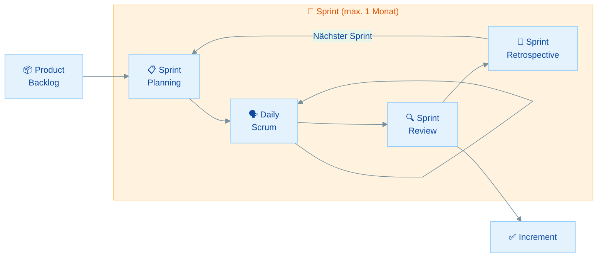
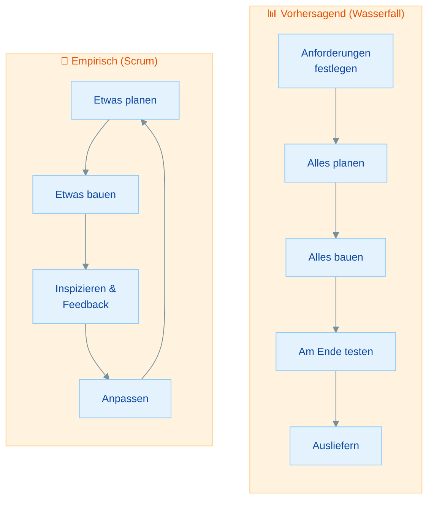
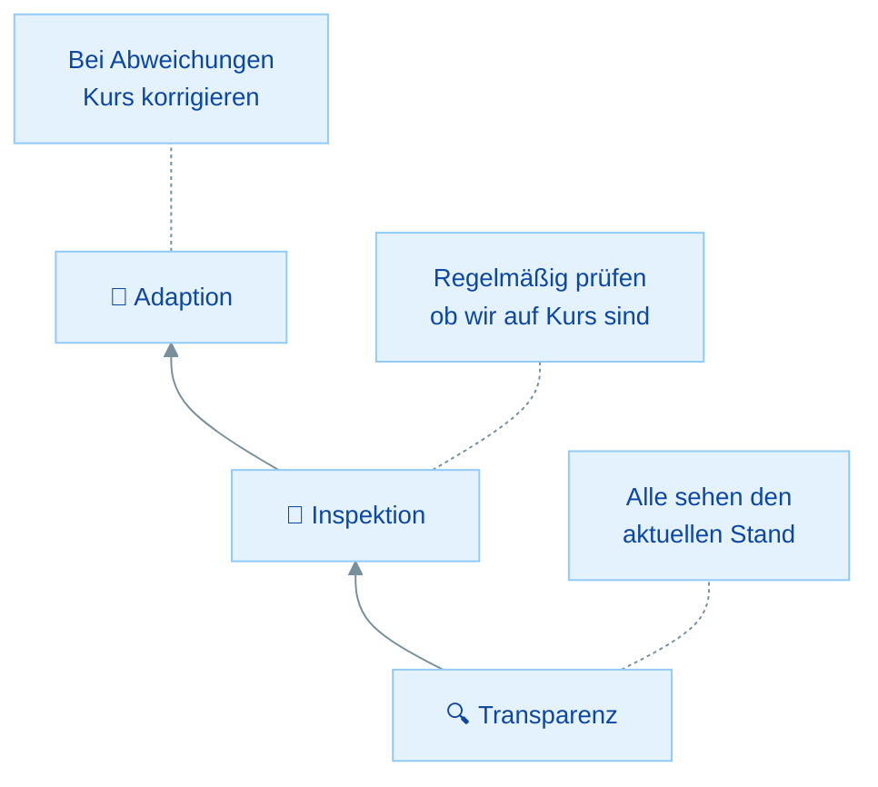
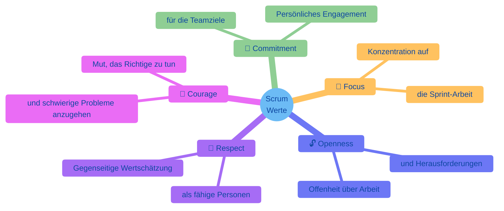

# Scrum Theorie & Werte

## Übersicht

In diesem Material lernst du die theoretischen Grundlagen von Scrum kennen:

- **Was ist Scrum?** - Ein leichtgewichtiges Framework für komplexe Produktentwicklung
- **Empirismus** - Die wissenschaftliche Grundlage hinter Scrum
- **Drei Säulen** - Transparenz, Inspektion und Adaption verstehen
- **Fünf Werte** - Die Kultur, die Scrum zum Leben erweckt
- **Scrum vs. Agile** - Was gehört zu Scrum und was nicht (prüfungskritisch!)

| Teil | Thema | Zeitbedarf |
|------|-------|------------|
| **Rückblick** | Was ist Scrum und woher kommt es? | 10 min |
| **Teil 1** | Empirismus: Die Grundlage von Scrum | 15 min |
| **Teil 2** | Die drei Säulen | 20 min |
| **Teil 3** | Die fünf Scrum Werte | 20 min |
| **Teil 4** | Scrum vs. allgemeine Agile-Praktiken | 15 min |
| | **Gesamt** | **ca. 1,5 Stunden** |

---

## Rückblick: Was ist Scrum?

### Die Kurzversion

Scrum ist ein **leichtgewichtiges Framework**, das Menschen, Teams und Organisationen hilft, Wert durch adaptive Lösungen für komplexe Probleme zu generieren. Es wurde in den 1990er-Jahren von **Ken Schwaber** und **Jeff Sutherland** entwickelt und ist im **Scrum Guide** definiert, dessen aktuelle Version aus dem Jahr **2020** stammt.

> **Merke:** Scrum ist ein **Framework**, keine Methodik und kein Prozess. Der Scrum Guide beschreibt Scrum bewusst als **unvollständig** ("intentionally incomplete"). Teams füllen die Lücken mit eigenen Praktiken, Techniken und Methoden.

### Warum ist die Unterscheidung wichtig?

| Begriff | Bedeutung | Beispiel |
|---------|-----------|----------|
| **Methodik** | Vollständige Schritt-für-Schritt-Anleitung | Wasserfall mit festen Phasen |
| **Prozess** | Definierter Ablauf mit vorhersagbarem Ergebnis | Fließbandproduktion |
| **Framework** | Rahmenwerk mit Regeln, aber Freiraum für Anpassung | **Scrum** |

Ein Framework gibt dir die **Leitplanken**, aber nicht die exakte Route. Dein Team entscheidet innerhalb dieser Leitplanken, wie es am besten arbeitet.

### Der Scrum Guide 2020

Der Scrum Guide ist das **offizielle Regelwerk** für Scrum. Alles, was in der PSM 1 Prüfung gefragt wird, basiert auf diesem Dokument. Wichtige Änderungen in der Version 2020:

- **"Roles"** wurde zu **"Accountabilities"** (Verantwortlichkeiten statt Jobtitel)
- **Product Goal** wurde als langfristiges Ziel eingeführt
- **Selbstmanagement** ersetzt "Selbstorganisation" (breiter gefasst)
- Der Guide wurde kürzer und weniger vorschreibend

!!! tip "PSM 1 Tipp"
    Die Prüfung basiert ausschließlich auf dem **Scrum Guide 2020**. Wenn du alte Blog-Artikel oder Bücher liest, achte darauf, dass sie die 2020er-Version referenzieren. Begriffe wie "Roles" oder "self-organizing" stammen aus älteren Versionen.

### Scrum auf einen Blick

---

## Teil 1: Empirismus - Die Grundlage von Scrum

### Was ist Empirismus?

Empirismus bedeutet: **Wissen entsteht durch Erfahrung**, und Entscheidungen werden auf Basis von **Beobachtungen** getroffen. Statt einen perfekten Plan zu erstellen und diesen stur zu befolgen, arbeitet man in kurzen Zyklen, lernt aus dem Ergebnis und passt den Kurs an.

> **Merke:** Scrum basiert auf **Empirismus** und **Lean Thinking**. Empirismus besagt, dass Wissen aus Erfahrung stammt und Entscheidungen auf Beobachtungen basieren. Lean Thinking reduziert Verschwendung und fokussiert auf das Wesentliche.

### Vorhersagend vs. Empirisch

In der Softwareentwicklung gibt es zwei grundlegende Ansätze zur Steuerung von Projekten:

| Aspekt | Vorhersagend (Wasserfall) | Empirisch (Scrum) |
|--------|---------------------------|-------------------|
| **Planung** | Alles zu Beginn | Iterativ, Sprint für Sprint |
| **Änderungen** | Teuer und unerwünscht | Erwartet und willkommen |
| **Feedback** | Erst am Ende | Nach jedem Sprint |
| **Risiko** | Hoch (späte Entdeckung von Problemen) | Niedrig (frühe Anpassung) |
| **Annahme** | Anforderungen sind stabil und bekannt | Anforderungen entwickeln sich |

### Warum Empirismus in der Softwareentwicklung?

Softwareentwicklung ist **komplex**. Das bedeutet:

- Anforderungen ändern sich während der Entwicklung
- Technische Herausforderungen sind schwer vorherzusagen
- Nutzer wissen oft erst, was sie wollen, wenn sie es sehen
- Der Markt verändert sich ständig

In solchen Umgebungen funktioniert ein vorhersagender Ansatz schlecht. Ein empirischer Ansatz mit kurzen Feedback-Zyklen ist hier überlegen.

### Wissensfrage 1

**Ist Scrum eine Methodik, ein Prozess oder ein Framework? Warum ist der Unterschied wichtig?**

Antwort anzeigen

Scrum ist ein **Framework**. Der Unterschied ist wichtig, weil:

- Eine **Methodik** gibt exakte Schritte vor, die befolgt werden müssen
- Ein **Prozess** beschreibt einen vorhersagbaren Ablauf mit bekanntem Ergebnis
- Ein **Framework** gibt einen Rahmen vor, innerhalb dessen Teams ihre eigenen Praktiken wählen

Der Scrum Guide ist bewusst unvollständig ("intentionally incomplete"). Er definiert Verantwortlichkeiten, Events und Artefakte, schreibt aber nicht vor, WIE die Arbeit im Detail erledigt wird. Teams ergänzen Scrum mit eigenen Techniken und Praktiken.

---

## Teil 2: Die drei Säulen des Empirismus

Die drei Säulen sind das Fundament von Scrum. Ohne sie funktioniert der empirische Ansatz nicht.

### Säule 1: Transparenz

**Transparenz** bedeutet, dass der aktuelle Stand der Arbeit, die Artefakte und der Fortschritt für **alle Beteiligten sichtbar** sind. Ohne Transparenz kann nicht sinnvoll inspiziert werden.

**Beispiele für Transparenz in Scrum:**

- Das **Product Backlog** ist für alle einsehbar und verständlich
- Das **Sprint Backlog** zeigt den aktuellen Fortschritt
- Die **Definition of Done** ist klar definiert und allen bekannt
- Das **Increment** ist sichtbar und überprüfbar

!!! warning "Wichtig für die Prüfung"
    Transparenz ist die **Grundvoraussetzung** für Inspektion. Wenn Informationen versteckt oder unklar sind, können Probleme nicht erkannt werden. Entscheidungen auf Basis intransparenter Artefakte sind riskant und potenziell wertlos.

### Säule 2: Inspektion

**Inspektion** bedeutet, dass Scrum-Artefakte und der Fortschritt **regelmäßig überprüft** werden, um unerwünschte Abweichungen oder Probleme zu erkennen. Die Inspektion darf jedoch nicht so häufig stattfinden, dass sie die Arbeit selbst behindert.

**Wo findet Inspektion in Scrum statt?**

| Event | Was wird inspiziert? |
|-------|---------------------|
| **Sprint Planning** | Product Backlog, vergangene Performance |
| **Daily Scrum** | Fortschritt Richtung Sprint Goal |
| **Sprint Review** | Increment und Fortschritt Richtung Product Goal |
| **Sprint Retrospective** | Arbeitsweise, Prozesse, Zusammenarbeit |

### Säule 3: Adaption

**Adaption** bedeutet, dass bei Abweichungen **Anpassungen vorgenommen** werden, und zwar so schnell wie möglich. Wenn durch Inspektion ein Problem erkannt wird, muss gehandelt werden.

**Wo findet Adaption in Scrum statt?**

| Event | Was wird angepasst? |
|-------|---------------------|
| **Sprint Planning** | Sprint Backlog wird erstellt/angepasst |
| **Daily Scrum** | Sprint Backlog wird täglich angepasst |
| **Sprint Review** | Product Backlog wird angepasst |
| **Sprint Retrospective** | Arbeitsweise wird verbessert |

> **Merke:** Inspektion ohne Adaption ist sinnlos. Wenn ein Team regelmäßig prüft, aber nie etwas ändert, verfehlt es den Zweck der Inspektion. Jede Inspektion sollte potenziell zu einer Anpassung führen.

### Wissensfrage 2

**Welche Säule wird verletzt, wenn das Product Backlog nur dem Product Owner bekannt ist und die Developers keinen Einblick haben?**

Antwort anzeigen

Die Säule **Transparenz** wird verletzt. Das Product Backlog muss für alle Beteiligten sichtbar und verständlich sein. Wenn nur der Product Owner es kennt:

- Können die **Developers** nicht sinnvoll planen
- Kann das **Scrum Team** nicht inspizieren, ob die Arbeit in die richtige Richtung geht
- Werden **Stakeholder** von Ergebnissen überrascht
- Ist die Grundlage für Inspektion und Adaption nicht gegeben

### Wissensfrage 3

**Was passiert, wenn ein Team regelmäßig inspiziert, aber nie Anpassungen vornimmt?**

Antwort anzeigen

Dann fehlt die Säule **Adaption**, und der empirische Prozess ist gebrochen:

- Inspektion ohne Adaption erzeugt nur **Erkenntnis ohne Wirkung**
- Das Team wiederholt dieselben Fehler Sprint für Sprint
- Events wie die Retrospektive verlieren ihren Sinn
- Der Scrum Guide betont: Adaption muss **so schnell wie möglich** erfolgen, wenn Inspektion Abweichungen zeigt

Alle drei Säulen müssen zusammenwirken. Eine einzelne Säule allein reicht nicht aus.

---

## Teil 3: Die fünf Scrum Werte

Die fünf Werte geben Scrum seine **Kultur und Richtung**. Sie beschreiben, wie Teammitglieder miteinander umgehen und arbeiten sollen. Wenn die Werte gelebt werden, entstehen die drei Säulen (Transparenz, Inspektion, Adaption) natürlich.

### Die Werte im Detail

| Wert | Englisch | Bedeutung | Praktisches Beispiel |
|------|----------|-----------|----------------------|
| **Commitment** | Commitment | Persönliches Engagement für die Erreichung der Teamziele | Das Team setzt sich voll für das Sprint Goal ein |
| **Focus** | Focus | Konzentration auf die Arbeit des Sprints und die Ziele des Teams | Ablenkungen werden minimiert, Sprint-Arbeit hat Priorität |
| **Openness** | Openness | Offenheit über die Arbeit und die Herausforderungen bei der Durchführung | Probleme werden im Daily Scrum angesprochen, nicht versteckt |
| **Respect** | Respect | Teammitglieder respektieren einander als fähige, eigenständige Personen | Entscheidungen der Developers werden respektiert |
| **Courage** | Courage | Mut, das Richtige zu tun und an schwierigen Problemen zu arbeiten | Ein Developer sagt offen, dass er ein Feature nicht rechtzeitig schafft |

!!! warning "Wichtig für die Prüfung"
    **Commitment** bedeutet NICHT, dass sich das Team verpflichtet, alle geplanten Items zu liefern. Es bedeutet persönliches Engagement für die Teamziele, insbesondere das **Sprint Goal**. Der Umfang (Scope) kann sich während des Sprints ändern, das Sprint Goal bleibt bestehen.

### Wie Werte und Säulen zusammenwirken

Die Werte **ermöglichen** die Säulen:

| Wert | Unterstützt Säule | Wie? |
|------|-------------------|------|
| **Openness** | Transparenz | Offenheit schafft Sichtbarkeit |
| **Courage** | Transparenz + Inspektion | Mut, Probleme anzusprechen |
| **Respect** | Inspektion | Respektvolles Feedback ermöglicht ehrliche Inspektion |
| **Focus** | Adaption | Fokus auf das Sprint Goal ermöglicht gezielte Anpassung |
| **Commitment** | Alle drei | Engagement für den empirischen Prozess |

### Wissensfrage 4

**Ein Teammitglied hat ein Problem, sagt aber nichts im Daily Scrum. Welcher Scrum-Wert fehlt hier?**

Antwort anzeigen

Hier fehlen vor allem zwei Werte:

- **Openness (Offenheit):** Das Teammitglied ist nicht offen über Herausforderungen bei der Arbeit. Offenheit verlangt, dass Probleme transparent gemacht werden.
- **Courage (Mut):** Es braucht Mut, Probleme offen anzusprechen, besonders wenn man befürchtet, als "langsam" oder "inkompetent" wahrgenommen zu werden.

Zusätzlich wird die Säule **Transparenz** verletzt, da der wahre Fortschritt verborgen bleibt und das Team keine Chance hat, zu helfen oder den Plan anzupassen.

---

## Teil 4: Scrum vs. allgemeine Agile-Praktiken

Dieser Abschnitt ist einer der **wichtigsten für die PSM 1 Prüfung**. Viele Kandidaten scheitern an Fragen, die testen, ob sie zwischen Scrum (dem Framework) und allgemeinen agilen Praktiken unterscheiden können.

### Was ist IN Scrum definiert?

Der Scrum Guide definiert **ausschließlich** diese Elemente:

**Verantwortlichkeiten (Accountabilities):**
- Developers
- Product Owner
- Scrum Master

**Events:**
- Sprint
- Sprint Planning
- Daily Scrum
- Sprint Review
- Sprint Retrospective

**Artefakte:**
- Product Backlog
- Sprint Backlog
- Increment

**Commitments (je eines pro Artefakt):**
- Product Goal
- Sprint Goal
- Definition of Done

**Das war's.** Alles andere ist NICHT Teil von Scrum.

### Was ist NICHT Teil von Scrum?

!!! warning "Prüfungskritisch"
    Die folgenden Praktiken werden häufig **mit** Scrum verwendet, sind aber **NICHT im Scrum Guide** definiert. Die PSM 1 Prüfung testet gezielt, ob du diesen Unterschied kennst.

| Praxis | In Scrum? | Erklärung |
|--------|-----------|-----------|
| ❌ Story Points | Nein | Beliebte Schätztechnik, aber nicht im Scrum Guide |
| ❌ Velocity | Nein | Metrik zur Messung der Team-Geschwindigkeit, nicht in Scrum |
| ❌ Burn-Down Chart | Nein | Visualisierung des Fortschritts, nicht vorgeschrieben |
| ❌ User Stories | Nein | Format für Anforderungen, nicht in Scrum vorgeschrieben |
| ❌ Planning Poker | Nein | Schätztechnik, nicht Teil von Scrum |
| ❌ Epics | Nein | Gruppierung von Anforderungen, kein Scrum-Begriff |
| ❌ Sprint 0 | Nein | Es gibt keinen "Sprint 0" in Scrum |
| ❌ Hardening Sprint | Nein | Widerspricht der Idee, jedes Increment "Done" zu liefern |
| ❌ Release Planning | Nein | Nicht im Scrum Guide als Event definiert |
| ❌ Scrum Board | Nein | Nützliches Tool, aber nicht vorgeschrieben |
| ❌ Backlog Refinement Meeting | Nein | Refinement ist eine Aktivität, kein Event |

> **Merke:** Diese Praktiken sind nicht "verboten" in Scrum! Sie können durchaus sinnvoll sein. Aber sie sind **nicht Teil des Frameworks**. In der Prüfung ist die Antwort immer "laut dem Scrum Guide", nicht "was in der Praxis üblich ist".

### Backlog Refinement: Eine häufige Falle

Product Backlog Refinement wird im Scrum Guide erwähnt, aber:

- Es ist eine **fortlaufende Aktivität**, kein Event
- Es gibt **kein separates Meeting** dafür im Scrum Guide
- Es verbraucht üblicherweise **nicht mehr als 10%** der Kapazität der Developers
- Die Developers und der Product Owner entscheiden, wann und wie sie es durchführen

### Wissensfrage 5

**Sind Story Points Teil von Scrum? Begründe deine Antwort.**

Antwort anzeigen

**Nein.** Story Points werden im Scrum Guide **nicht erwähnt**. Sie sind eine beliebte Schätztechnik, die häufig zusammen mit Scrum verwendet wird, aber kein offizieller Bestandteil des Frameworks.

Der Scrum Guide schreibt nicht vor, **wie** das Team schätzen soll. Teams können Story Points, T-Shirt-Größen, Stunden oder jede andere Technik verwenden, die für sie funktioniert. In der PSM 1 Prüfung ist die korrekte Antwort immer: "Story Points sind nicht Teil von Scrum."

### Wissensfrage 6

**Ein Scrum Master sagt: "Wir müssen unsere Velocity in diesem Sprint steigern." Was ist an dieser Aussage problematisch?**

Antwort anzeigen

Diese Aussage hat mehrere Probleme:

1. **Velocity ist nicht Teil von Scrum.** Der Scrum Guide erwähnt Velocity nicht. Es ist eine ergänzende Metrik.
2. **Der Scrum Master "sagt" dem Team nicht, was es tun soll.** Das Team ist selbstmanagend. Der SM ist ein Servant Leader, kein Manager.
3. **Fokus auf Velocity statt auf Wert.** Scrum optimiert auf **Wertlieferung**, nicht auf Output-Menge. Mehr Story Points bedeuten nicht automatisch mehr Wert.
4. **Druck auf Velocity** kann dazu führen, dass Teams ihre Schätzungen aufblähen, statt tatsächlich produktiver zu werden.

---

## Zusammenfassung

| Konzept | Kernaussage |
|---------|-------------|
| **Scrum** | Leichtgewichtiges Framework (nicht Methodik/Prozess), bewusst unvollständig |
| **Scrum Guide 2020** | Offizielle Referenz, Basis für PSM 1 Prüfung |
| **Empirismus** | Wissen aus Erfahrung, Entscheidungen aus Beobachtung |
| **Transparenz** | Arbeit und Artefakte für alle sichtbar |
| **Inspektion** | Regelmäßige Überprüfung von Fortschritt und Artefakten |
| **Adaption** | Anpassung bei Abweichungen, so schnell wie möglich |
| **5 Werte** | Commitment, Focus, Openness, Respect, Courage |
| **Nicht in Scrum** | Story Points, Velocity, Burn-Down Charts, User Stories, Planning Poker |

## Checkliste

- [ ] Ich kann erklären, warum Scrum ein Framework und keine Methodik ist
- [ ] Ich kenne die drei Säulen und kann sie mit Beispielen erklären
- [ ] Ich kann alle fünf Scrum Werte aufzählen und beschreiben
- [ ] Ich weiß, dass "Commitment" sich auf das Sprint Goal bezieht, nicht auf Item-Lieferung
- [ ] Ich kann mindestens 5 Praktiken nennen, die NICHT Teil von Scrum sind
- [ ] Ich kenne den Unterschied zwischen Scrum Guide 2017 und 2020

## Nächste Schritte

Im nächsten Material lernst du die **drei Verantwortlichkeiten** (Accountabilities) des Scrum Teams kennen: [Das Scrum Team](02-scrum-team.md)
