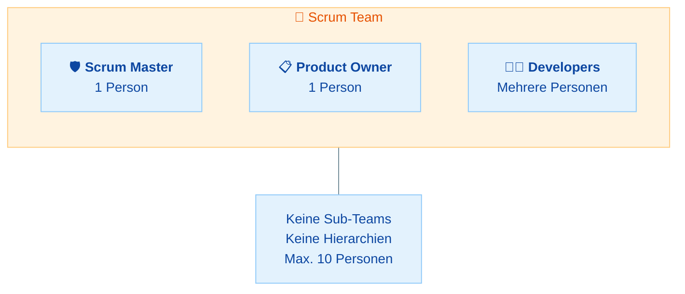
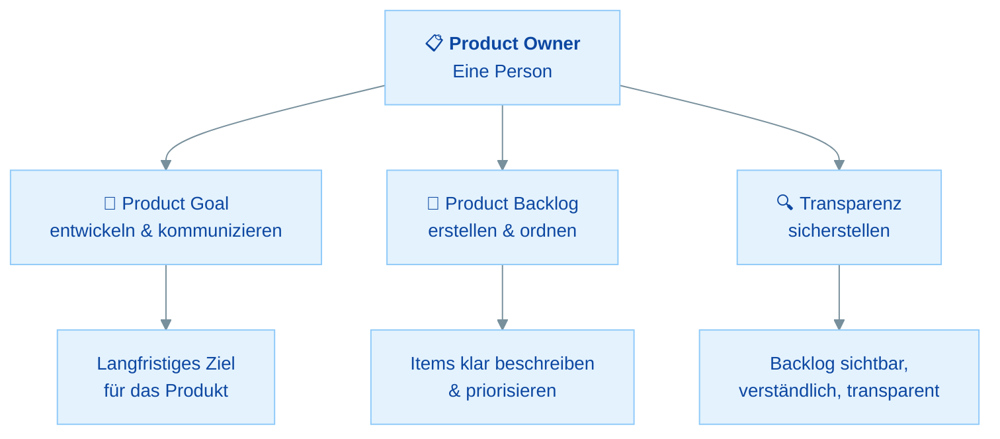
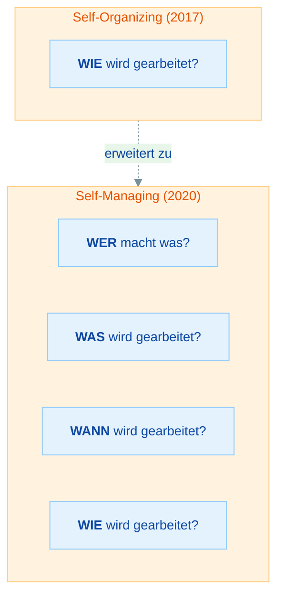

# Das Scrum Team

## Übersicht

In diesem Material lernst du die drei Verantwortlichkeiten (Accountabilities) im Scrum Team kennen:

- **Scrum Team Grundlagen** - Größe, Struktur und Eigenschaften
- **Developers** - Wer sind die Developers und was tun sie?
- **Product Owner** - Der Wertmaximierer des Produkts
- **Scrum Master** - Servant Leader und Enabler
- **Selbstmanagement & Cross-Funktionalität** - Die Schlüsseleigenschaften

| Teil | Thema | Zeitbedarf |
|------|-------|------------|
| **Teil 1** | Eigenschaften des Scrum Teams | 15 min |
| **Teil 2** | Developers: Die Umsetzer | 20 min |
| **Teil 3** | Product Owner: Der Wertmaximierer | 20 min |
| **Teil 4** | Scrum Master: Der Servant Leader | 15 min |
| **Teil 5** | Selbstmanagement und Cross-Funktionalität | 20 min |
| | **Gesamt** | **ca. 1,5 Stunden** |

---

## Teil 1: Eigenschaften des Scrum Teams

### Die Grundeinheit von Scrum

Das Scrum Team ist die **grundlegende Einheit** von Scrum. Es besteht aus genau **drei Verantwortlichkeiten** (Accountabilities):

### Kernregeln

| Eigenschaft | Regel |
|-------------|-------|
| **Größe** | Klein genug, um agil zu bleiben, groß genug, um bedeutende Arbeit zu leisten. Typischerweise **10 oder weniger** Personen. |
| **Sub-Teams** | Es gibt **keine Sub-Teams** und keine Hierarchien innerhalb des Scrum Teams. |
| **Fokus** | Das gesamte Scrum Team fokussiert sich auf **ein Ziel**: das Product Goal. |
| **Cross-funktional** | Das Team hat alle Fähigkeiten, die nötig sind, um in jedem Sprint Wert zu schaffen. |
| **Selbstmanagend** | Das Team entscheidet intern, **wer** was **wann** und **wie** tut. |

!!! info "Accountabilities, nicht Roles"
    Der Scrum Guide 2020 verwendet den Begriff **"Accountabilities"** (Verantwortlichkeiten) statt "Roles" (Rollen). Der Grund: "Roles" impliziert Jobtitel oder Positionen. "Accountabilities" betont, dass es um **Verantwortung** geht, nicht um eine Stellenbeschreibung. Eine Person kann auch mehrere Verantwortlichkeiten haben (z.B. ein Scrum Master, der auch als Developer am Increment arbeitet).

### Wissensfrage 1

**Warum verwendet der Scrum Guide 2020 den Begriff "Accountabilities" statt "Roles"?**

Antwort anzeigen

Der Begriff **"Roles"** (Rollen) wurde durch **"Accountabilities"** (Verantwortlichkeiten) ersetzt, weil:

- **Roles** impliziert Jobtitel oder feste Positionen in einer Hierarchie
- **Accountabilities** betont die **Verantwortung** für bestimmte Ergebnisse
- Es macht deutlich, dass es sich nicht um eine Stellenbeschreibung handelt
- Es erlaubt, dass eine Person in einem Scrum Team mehrere Verantwortlichkeiten tragen kann
- Der Fokus liegt auf **Was wird verantwortet?** statt auf **Wie ist mein Titel?**

---

## Teil 2: Developers - Die Umsetzer

### Wer sind die Developers?

**Developers** sind alle Mitglieder des Scrum Teams, die sich dazu verpflichten, in jedem Sprint ein nutzbares **Increment** zu erstellen.

!!! warning "Wichtig für die Prüfung"
    "Developer" in Scrum bedeutet **NICHT** nur Programmierer! Jede Person, die an der Erstellung des Increments arbeitet, ist ein Developer. Das schließt ein: Tester, Designer, UX-Experten, Analysten, DevOps-Ingenieure und alle anderen, die direkt zum Increment beitragen.

### Verantwortlichkeiten der Developers

Die Developers sind verantwortlich für:

| Verantwortlichkeit | Erklärung |
|--------------------|-----------|
| **Plan für den Sprint erstellen** | Das Sprint Backlog (die Auswahl der Items und der Plan, wie sie umgesetzt werden) |
| **Qualität sicherstellen** | Die Definition of Done einhalten |
| **Plan täglich anpassen** | Im Daily Scrum den Sprint Backlog aktualisieren |
| **Gegenseitige Verantwortung** | Sich gegenseitig als Profis verantwortlich halten |

### Was Developers NICHT tun

- Sie bekommen **keine Aufgaben zugewiesen** (sie organisieren sich selbst)
- Sie berichten **nicht an** den Scrum Master oder Product Owner (kein Hierarchieverhältnis)
- Sie arbeiten **nicht isoliert** (keine festen Zuständigkeiten wie "nur Backend" oder "nur Frontend")

### Wissensfrage 2

**Ein UX-Designer arbeitet im Scrum Team am Design der Benutzeroberfläche. Ist diese Person ein "Developer" im Sinne von Scrum?**

Antwort anzeigen

**Ja.** Im Scrum Guide bezieht sich "Developer" auf **jede Person**, die an der Erstellung des Increments arbeitet. Das ist nicht auf Programmierer beschränkt. Ein UX-Designer, der zum Increment beiträgt, ist ein Developer im Scrum-Sinne.

Der Scrum Guide vermeidet bewusst Titel wie "Tester", "Designer" oder "Analyst", um zu betonen, dass das gesamte Team **cross-funktional** für die Lieferung des Increments verantwortlich ist.

---

## Teil 3: Product Owner - Der Wertmaximierer

### Die Rolle des Product Owners

Der Product Owner ist verantwortlich für die **Maximierung des Werts** des Produkts, das aus der Arbeit des Scrum Teams entsteht. Er ist **eine Person**, kein Komitee.

### Verantwortlichkeiten des Product Owners

| Verantwortlichkeit | Details |
|--------------------|---------|
| **Product Goal entwickeln und kommunizieren** | Ein langfristiges Ziel für das Produkt definieren |
| **Product Backlog Items erstellen und klar kommunizieren** | Anforderungen verständlich formulieren |
| **Product Backlog Items ordnen** | Priorisierung nach Wert, Risiko, Abhängigkeiten |
| **Transparenz des Product Backlogs sicherstellen** | Backlog ist sichtbar, verständlich und aktuell |

### Wichtige Regeln zum Product Owner

- Der PO ist **eine Person**, nicht ein Komitee oder eine Gruppe
- Der PO **kann Arbeit delegieren**, bleibt aber **verantwortlich** (accountable)
- Die Entscheidungen des PO **müssen respektiert** werden
- Die Entscheidungen sind im **Inhalt und der Reihenfolge** des Product Backlogs sichtbar
- **Niemand** darf die Developers zwingen, an etwas anderem zu arbeiten als dem, was der PO im Product Backlog priorisiert hat

!!! tip "PSM 1 Tipp"
    Eine häufige Prüfungsfrage: "Ein Stakeholder bittet einen Developer direkt, ein Feature umzusetzen." Die korrekte Antwort: Der Developer sollte den Stakeholder an den **Product Owner** verweisen. Nur der PO verwaltet das Product Backlog und entscheidet über Prioritäten.

### Wissensfrage 3

**Darf der Product Owner die Arbeit am Product Backlog an andere delegieren? Wer bleibt verantwortlich?**

Antwort anzeigen

**Ja**, der Product Owner darf Arbeit delegieren. Er kann andere bitten, Product Backlog Items zu schreiben oder zu verfeinern. **Aber:** Der Product Owner bleibt immer **accountable** (verantwortlich) für das Product Backlog.

Das bedeutet: Auch wenn ein Developer oder Business Analyst ein Item schreibt, ist der Product Owner dafür verantwortlich, dass es klar, verständlich und korrekt priorisiert ist.

### Wissensfrage 4

**Ein Stakeholder geht direkt zu einem Developer und bittet ihn, ein dringendes Feature umzusetzen. Was sollte passieren?**

Antwort anzeigen

Der Developer sollte den Stakeholder an den **Product Owner** verweisen. Gründe:

- **Nur der Product Owner** verwaltet das Product Backlog und bestimmt die Prioritäten
- Der Developer sollte keine Arbeit annehmen, die nicht über den PO ins Product Backlog aufgenommen wurde
- Der PO muss die Anfrage bewerten und im Kontext aller anderen Anforderungen priorisieren
- Wenn Stakeholder die Developers direkt beauftragen können, wird das Product Backlog und damit die Transparenz untergraben

---

## Teil 4: Scrum Master - Der Servant Leader

### Was ist ein Scrum Master?

Der Scrum Master ist verantwortlich dafür, Scrum **so wie im Scrum Guide beschrieben** zu etablieren. Er tut dies, indem er allen hilft, die Scrum-Theorie und -Praxis zu verstehen, sowohl innerhalb des Scrum Teams als auch in der Organisation.

> **Merke:** Der Scrum Master ist ein **Servant Leader**. Er führt, indem er dient. Er ist KEIN Projektmanager, KEIN Teamleiter und KEIN Chef des Scrum Teams.

### Services des Scrum Masters

Der Scrum Master dient drei Gruppen:

| Dient... | Wie? |
|----------|------|
| **Dem Scrum Team** | Coaching in Selbstmanagement und Cross-Funktionalität, Hilfe bei der Erstellung hochwertiger Increments, Entfernung von Hindernissen, Events sicherstellen |
| **Dem Product Owner** | Hilfe bei effektiven Techniken für Product Goal und Backlog-Management, Stakeholder-Zusammenarbeit fördern |
| **Der Organisation** | Scrum-Adoption leiten und coachen, Scrum-Implementierungen planen und beraten, Barrieren zwischen Stakeholdern und Scrum Teams entfernen |

!!! info "Hinweis"
    Eine detaillierte Behandlung der Scrum Master Rolle mit den **8 Stances** und typischen Prüfungsszenarien findest du im separaten Material: [Die Scrum Master Rolle](05-scrum-master-rolle.md)

### Wissensfrage 5

**Ist der Scrum Master der Teamleiter oder Manager des Scrum Teams?**

Antwort anzeigen

**Nein.** Der Scrum Master ist ein **Servant Leader**, kein Manager oder Teamleiter:

- Er **weist keine Aufgaben** zu
- Er **kontrolliert nicht** die Arbeit des Teams
- Er **entscheidet nicht**, was entwickelt wird
- Er **bewertet nicht** die Leistung einzelner Teammitglieder

Stattdessen führt er durch **Coaching, Mentoring, Facilitation und Teaching**. Er hilft dem Team, sich selbst zu managen und die Scrum-Praktiken effektiv anzuwenden. Das Team ist **selbstmanagend** und trifft seine eigenen Entscheidungen.

---

## Teil 5: Selbstmanagement und Cross-Funktionalität

### Selbstmanagement (Self-Managing)

Eines der wichtigsten Konzepte im Scrum Guide 2020. Ein selbstmanagend Team entscheidet intern:

### Self-Managing vs. Self-Organizing

| Aspekt | Self-Organizing (2017) | Self-Managing (2020) |
|--------|------------------------|----------------------|
| **Wer** entscheidet, wer was macht? | Teilweise das Team | **Das Team** |
| **Was** wird im Sprint gearbeitet? | Wird teilweise vorgegeben | **Das Team wählt** (aus dem Product Backlog) |
| **Wann** wird gearbeitet? | Weniger explizit | **Das Team entscheidet** |
| **Wie** wird gearbeitet? | Das Team entscheidet | **Das Team entscheidet** |
| **Umfang der Autonomie** | Begrenzt auf das "Wie" | **Erweitert auf Wer, Was, Wann und Wie** |

> **Merke:** Der Scrum Guide 2020 hat "self-organizing" durch **"self-managing"** ersetzt. Self-managing ist breiter gefasst: Das Team entscheidet nicht nur WIE es arbeitet, sondern auch WER was macht, WANN es gemacht wird und WAS genau (im Rahmen des Sprint Backlogs) bearbeitet wird.

### Cross-Funktionalität

Ein cross-funktionales Team besitzt **alle Fähigkeiten innerhalb des Teams**, die nötig sind, um in jedem Sprint Wert zu schaffen. Das Team ist nicht von externen Spezialisten abhängig.

| Traditionelles Team | Scrum Team (Cross-funktional) |
|--------------------|-------------------------------|
| Frontend-Team, Backend-Team, QA-Team separat | Ein Team mit allen nötigen Skills |
| Abhängigkeiten zwischen Teams | Minimale externe Abhängigkeiten |
| Übergaben zwischen Abteilungen | Arbeit wird innerhalb des Teams abgeschlossen |
| Spezialisierte Silos | T-förmige Fähigkeiten (Breite + Tiefe) |

!!! tip "PSM 1 Tipp"
    Cross-funktional bedeutet NICHT, dass jedes Teammitglied alles können muss. Es bedeutet, dass das **Team als Ganzes** alle nötigen Fähigkeiten hat. Einzelne Mitglieder können spezialisiert sein, solange das Team insgesamt cross-funktional ist.

### Wissensfrage 6

**Was ist der Unterschied zwischen "self-organizing" (Scrum Guide 2017) und "self-managing" (Scrum Guide 2020)?**

Antwort anzeigen

**Self-managing** ist breiter gefasst als self-organizing:

- **Self-organizing (2017):** Das Team entscheidet primär, **WIE** die Arbeit erledigt wird
- **Self-managing (2020):** Das Team entscheidet zusätzlich **WER** was macht, **WANN** gearbeitet wird und **WAS** im Sprint bearbeitet wird (im Rahmen des Product Backlogs)

Die Änderung in 2020 betont die **erweiterte Autonomie** des Scrum Teams. Es geht nicht mehr nur um die Wahl der Arbeitsmethoden, sondern um die vollständige Selbstverwaltung der Arbeit innerhalb des Scrum-Rahmens.

---

## Zusammenfassung

| Accountability | Kernverantwortung | Wichtige Regel |
|----------------|-------------------|----------------|
| **Developers** | Increment erstellen, Sprint Backlog verwalten, Qualität sichern | "Developer" = jede Person am Increment, nicht nur Programmierer |
| **Product Owner** | Produktwert maximieren, Product Backlog verwalten | Eine Person, kann delegieren, bleibt verantwortlich |
| **Scrum Master** | Scrum etablieren, Team-Effektivität steigern | Servant Leader, kein Manager oder Projektleiter |

**Teamregeln:**

- Max. 10 Personen
- Keine Sub-Teams, keine Hierarchien
- Self-managing: Wer, Was, Wann, Wie
- Cross-funktional: Alle nötigen Skills im Team

## Checkliste

- [ ] Ich kann die drei Accountabilities und ihre Verantwortlichkeiten erklären
- [ ] Ich weiß, dass "Developer" alle Personen am Increment einschließt
- [ ] Ich verstehe, dass der PO eine Person ist, nicht ein Komitee
- [ ] Ich kann den Unterschied zwischen Servant Leader und Manager erklären
- [ ] Ich kenne den Unterschied zwischen self-managing und self-organizing
- [ ] Ich weiß, was cross-funktional in Scrum bedeutet

## Nächste Schritte

Im nächsten Material lernst du die **fünf Scrum Events** im Detail kennen, inklusive aller Timeboxen: [Scrum Events](03-scrum-events.md)
