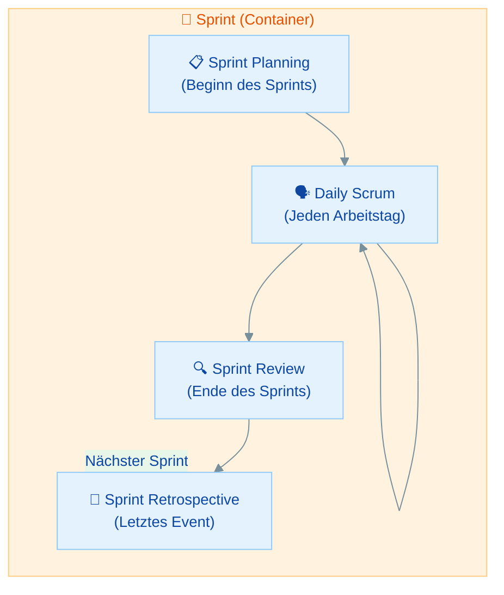
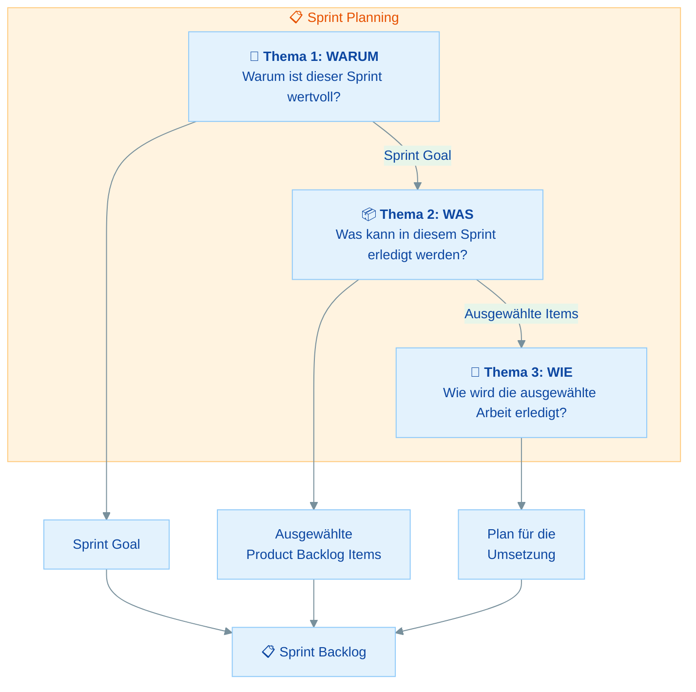
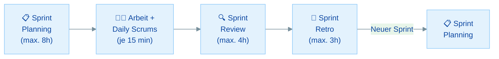

# Scrum Events

## Übersicht

Die Scrum Events sind das Herzstück des empirischen Prozesses. Jedes Event dient der **Inspektion** und **Adaption**:

- **Der Sprint** - Der Container für alle anderen Events
- **Sprint Planning** - Was werden wir in diesem Sprint tun?
- **Daily Scrum** - Sind wir auf Kurs?
- **Sprint Review** - Was haben wir erreicht?
- **Sprint Retrospective** - Wie können wir uns verbessern?
- **Timeboxen** - Alle Zeitlimits im Überblick

| Teil | Thema | Zeitbedarf |
|------|-------|------------|
| **Rückblick** | Events als formale Gelegenheiten | 10 min |
| **Teil 1** | Der Sprint | 15 min |
| **Teil 2** | Sprint Planning | 20 min |
| **Teil 3** | Daily Scrum | 15 min |
| **Teil 4** | Sprint Review | 15 min |
| **Teil 5** | Sprint Retrospective | 15 min |
| **Teil 6** | Timeboxen im Überblick | 10 min |
| | **Gesamt** | **ca. 1,5 bis 2 Stunden** |

---

## Rückblick: Events als formale Gelegenheiten

### Warum gibt es Scrum Events?

Scrum Events sind **formale Gelegenheiten** zur Inspektion und Adaption von Scrum-Artefakten. Sie schaffen Regelmäßigkeit und minimieren die Notwendigkeit von Meetings, die nicht in Scrum definiert sind.

### Grundregeln für alle Events

- Jedes Event hat eine **Timebox** (maximale Dauer)
- Die Timebox ist ein **Maximum**, kein Ziel. Events können früher enden.
- Alle Events finden **innerhalb** des Sprints statt (der Sprint ist der Container)
- Events dürfen **nicht ausgelassen** werden
- Jedes Event ist eine Gelegenheit zur **Inspektion und Adaption**

> **Merke:** Es gibt keinen Zeitraum zwischen Sprints. Ein neuer Sprint beginnt **sofort** nach dem Ende des vorherigen Sprints. Die Sprint Retrospective ist das letzte Event des Sprints.

### Wissensfrage 1

**Warum bezeichnet der Scrum Guide Events als "formale Gelegenheiten"?**

Antwort anzeigen

Der Scrum Guide nennt Events "formale Gelegenheiten", weil:

- Sie schaffen **Regelmäßigkeit** und einen vorhersagbaren Rhythmus
- Sie **reduzieren die Notwendigkeit** für zusätzliche, nicht in Scrum definierte Meetings
- Sie stellen sicher, dass Inspektion und Adaption **regelmäßig** stattfinden
- Jedes Event hat einen **klar definierten Zweck** und eine Timebox
- Sie sorgen für die nötige **Transparenz**, die der empirische Prozess erfordert

---

## Teil 1: Der Sprint

### Das Herzstück von Scrum

Der Sprint ist ein **Container** für alle anderen Events. Innerhalb eines Sprints wird Arbeit geleistet, um das Sprint Goal zu erreichen und ein nutzbares Increment zu liefern.

### Sprint-Regeln im Überblick

| Regel | Details |
|-------|---------|
| **Dauer** | Feste Länge, **maximal 1 Monat**. Kürzere Sprints sind üblich (häufig 2 Wochen). |
| **Konsistenz** | Die Sprint-Länge bleibt während der Produktentwicklung idealerweise konstant. |
| **Kein Zwischenraum** | Ein neuer Sprint beginnt **sofort** nach dem Ende des vorherigen. |
| **Sprint Goal** | Das Sprint Goal darf während des Sprints **nicht geändert** werden. |
| **Qualität** | Die Qualitätsstandards (Definition of Done) dürfen **nicht gesenkt** werden. |
| **Scope** | Der Umfang (Scope) kann mit dem Product Owner **verhandelt und geklärt** werden. |
| **Product Backlog** | Wird bei Bedarf **verfeinert** (Refinement ist eine fortlaufende Aktivität). |

### Wer kann einen Sprint abbrechen?

**Nur der Product Owner** hat die Autorität, einen Sprint abzubrechen. Dies geschieht nur, wenn das **Sprint Goal obsolet** (hinfällig) wird. Sprint-Abbrüche sind in der Praxis sehr selten.

!!! warning "Wichtig für die Prüfung"
    Häufige Prüfungsfrage: "Wer kann einen Sprint abbrechen?" Die Antwort ist immer: **Nur der Product Owner**, und nur wenn das Sprint Goal obsolet geworden ist. Nicht der Scrum Master, nicht das Management, nicht die Developers.

### Während des Sprints gilt

- ❌ Keine Änderungen, die das Sprint Goal gefährden
- ❌ Qualität darf nicht abnehmen
- ✅ Product Backlog wird bei Bedarf verfeinert
- ✅ Scope kann mit dem PO geklärt und nachverhandelt werden

> **Merke:** Das **Sprint Goal** ist unveränderlich, der **Scope** (welche konkreten Items) kann sich jedoch ändern. Das ist ein wichtiger Unterschied! Das Team kann Items hinzufügen oder entfernen, solange das Sprint Goal nicht gefährdet wird.

### Wissensfrage 2

**Wer kann einen Sprint abbrechen und unter welchen Umständen?**

Antwort anzeigen

**Nur der Product Owner** kann einen Sprint abbrechen, und zwar nur dann, wenn das **Sprint Goal obsolet** geworden ist. Beispiele:

- Das Unternehmen ändert seine Strategie grundlegend
- Die Marktbedingungen machen das Sprint Goal irrelevant
- Die technologische Grundlage ändert sich fundamental

Der Scrum Master, das Management oder die Developers können keinen Sprint abbrechen. Sprint-Abbrüche sind die absolute Ausnahme und sollten in der Praxis extrem selten vorkommen.

### Wissensfrage 3

**Darf der Umfang (Scope) eines Sprints während des Sprints geändert werden?**

Antwort anzeigen

**Ja**, der Scope kann angepasst werden, **aber** mit Einschränkungen:

- Der **Scope** (welche konkreten Product Backlog Items) kann mit dem Product Owner **geklärt und nachverhandelt** werden
- Das **Sprint Goal** darf dabei **NICHT** geändert werden
- Es dürfen keine Änderungen vorgenommen werden, die das Sprint Goal **gefährden**
- Die **Qualität** (Definition of Done) darf nicht gesenkt werden

Kurz: Items können hinzugefügt oder entfernt werden, aber das Sprint Goal und die Qualität bleiben bestehen.

---

## Teil 2: Sprint Planning

### Zweck

Das Sprint Planning **initiiert** den Sprint. Es werden drei Fragen beantwortet, die zusammen den Sprint Backlog ergeben.

### Die drei Themen des Sprint Plannings

| Thema | Frage | Ergebnis |
|-------|-------|----------|
| **1. WARUM** | Warum ist dieser Sprint wertvoll? | **Sprint Goal** |
| **2. WAS** | Was kann in diesem Sprint erledigt werden? | **Ausgewählte Product Backlog Items** |
| **3. WIE** | Wie wird die ausgewählte Arbeit erledigt? | **Plan für die Umsetzung** |

### Rahmenbedingungen

| Aspekt | Detail |
|--------|--------|
| **Timebox** | Max. **8 Stunden** für einen 1-Monats-Sprint |
| **Teilnehmer** | Das gesamte **Scrum Team** (Developers, PO, SM) |
| **Input** | Product Backlog, letztes Increment, Kapazität der Developers, vergangene Performance |
| **Output** | **Sprint Backlog** (Sprint Goal + ausgewählte Items + Plan) |

### Wichtige Details

- Das **Sprint Goal** wird vom **gesamten Scrum Team** erarbeitet
- Die **Developers** wählen aus, welche Product Backlog Items sie im Sprint umsetzen können
- Der **Product Owner** hilft beim Verständnis und bei Trade-offs
- Die Developers planen die Arbeit so detailliert wie **sie es für nötig halten**

### Wissensfrage 4

**In welcher Reihenfolge werden die drei Themen im Sprint Planning behandelt?**

Antwort anzeigen

Die drei Themen werden in dieser Reihenfolge behandelt:

1. **WARUM** ist dieser Sprint wertvoll? → Sprint Goal definieren
2. **WAS** kann in diesem Sprint erledigt werden? → Items auswählen
3. **WIE** wird die Arbeit erledigt? → Plan erstellen

Diese Reihenfolge ist logisch: Erst wird das Ziel festgelegt (WARUM), dann wird bestimmt, welche Arbeit zum Ziel beiträgt (WAS), und schließlich wird geplant, wie diese Arbeit umgesetzt wird (WIE).

---

## Teil 3: Daily Scrum

### Zweck

Das Daily Scrum dient dazu, den **Fortschritt Richtung Sprint Goal** zu inspizieren und den **Sprint Backlog** bei Bedarf anzupassen.

### Rahmenbedingungen

| Aspekt | Detail |
|--------|--------|
| **Timebox** | Max. **15 Minuten** |
| **Häufigkeit** | **Jeden Arbeitstag** des Sprints |
| **Ort & Zeit** | Immer am **gleichen Ort** zur **gleichen Zeit** |
| **Teilnehmer** | **Developers** (sie führen das Event durch) |
| **Zweck** | Fortschritt zum Sprint Goal inspizieren, Sprint Backlog anpassen |

### Häufige Prüfungsfallen

!!! warning "Prüfungskritisch"
    Das Daily Scrum hat in der PSM 1 Prüfung besonders viele Fallen. Merke dir diese Punkte:

| Falle | Wahrheit |
|-------|----------|
| "Die drei Fragen sind Pflicht" | ❌ **Falsch.** Die Developers können **jede beliebige Struktur** wählen. Die drei Fragen sind nur eine Option. |
| "Der Scrum Master führt das Daily" | ❌ **Falsch.** Die **Developers** führen das Daily durch. Der SM stellt nur sicher, dass es stattfindet. |
| "Das Daily ist ein Status-Report" | ❌ **Falsch.** Es ist ein **Planungs-Event** für die Developers, kein Report an den SM oder PO. |
| "PO und SM dürfen nicht teilnehmen" | ❌ **Falsch.** Sie dürfen teilnehmen, wenn sie aktiv an Sprint Backlog Items arbeiten, aber sie **stören oder steuern** das Event nicht. |

### Die drei klassischen Fragen

Die drei Fragen, die oft mit dem Daily Scrum verbunden werden, sind:

1. Was habe ich gestern gemacht?
2. Was mache ich heute?
3. Gibt es Hindernisse?

> **Merke:** Diese Fragen sind eine **häufig genutzte Struktur**, aber der Scrum Guide schreibt sie **NICHT vor**. Die Developers können jede Struktur verwenden, die für sie funktioniert und den Zweck des Events erfüllt: Fortschritt zum Sprint Goal inspizieren und den Sprint Backlog anpassen.

### Wissensfrage 5

**Der Product Owner möchte am Daily Scrum teilnehmen. Darf er das?**

Antwort anzeigen

Der Product Owner **darf teilnehmen**, wenn er aktiv an Sprint Backlog Items arbeitet (also als Developer beiträgt). Aber:

- Das Daily Scrum ist ein Event **für die Developers**
- Der PO sollte das Event **nicht steuern oder dominieren**
- Es ist **kein Status-Report** an den PO
- Die Developers entscheiden die Struktur und den Ablauf

Der Scrum Master stellt sicher, dass das Event stattfindet und innerhalb der Timebox bleibt, führt es aber ebenfalls nicht durch.

### Wissensfrage 6

**Muss das Daily Scrum die drei klassischen Fragen verwenden?**

Antwort anzeigen

**Nein.** Der Scrum Guide schreibt keine bestimmte Struktur für das Daily Scrum vor. Die Developers wählen selbst, welche Struktur und Technik sie verwenden möchten. Die drei Fragen ("Was habe ich gestern gemacht? Was mache ich heute? Gibt es Hindernisse?") sind nur **eine mögliche Option**.

Das Einzige, was der Scrum Guide verlangt: Das Daily Scrum muss den **Fortschritt Richtung Sprint Goal** inspizieren und bei Bedarf den **Sprint Backlog** anpassen.

---

## Teil 4: Sprint Review

### Zweck

Das Sprint Review dient dazu, das **Ergebnis (Outcome) des Sprints** zu inspizieren und zukünftige **Anpassungen** zu bestimmen.

### Rahmenbedingungen

| Aspekt | Detail |
|--------|--------|
| **Timebox** | Max. **4 Stunden** für einen 1-Monats-Sprint |
| **Teilnehmer** | **Scrum Team** + **Stakeholder** (eingeladen vom PO) |
| **Input** | Increment, Product Backlog, Sprint-Erfahrungen |
| **Output** | **Angepasstes Product Backlog** |

### Sprint Review ≠ Präsentation

!!! warning "Wichtig für die Prüfung"
    Das Sprint Review ist eine **Arbeitssitzung** (Working Session), KEINE Präsentation oder Demo! Das Scrum Team und die Stakeholder **arbeiten zusammen**, um zu bestimmen, was als Nächstes getan werden soll. Es wird diskutiert, Feedback gegeben und das Product Backlog angepasst.

### Was passiert im Sprint Review?

- Das Scrum Team **präsentiert die Ergebnisse** seiner Arbeit (das Increment)
- Stakeholder geben **Feedback** zum Increment
- Der **Fortschritt Richtung Product Goal** wird diskutiert
- Veränderte Geschäftsbedingungen werden besprochen
- Gemeinsam wird bestimmt, **was als Nächstes** getan werden könnte
- Das **Product Backlog** wird bei Bedarf angepasst

### Wissensfrage 7

**Ist das Sprint Review eine Präsentation oder Demo?**

Antwort anzeigen

**Nein.** Der Scrum Guide beschreibt das Sprint Review explizit als eine **Arbeitssitzung** (Working Session). Der Unterschied:

| Präsentation/Demo | Arbeitssitzung (Sprint Review) |
|--------------------|-------------------------------|
| Einseitige Kommunikation | Dialog und Zusammenarbeit |
| Team zeigt, Stakeholder schauen zu | Team und Stakeholder arbeiten zusammen |
| Feedback ist optional | Feedback ist der Kern des Events |
| Kein direkter Einfluss auf Planung | Direkte Anpassung des Product Backlogs |

Das Sprint Review ist eine der wichtigsten Gelegenheiten für das Scrum Team, **Feedback** zu erhalten und den **Produktkurs** anzupassen.

---

## Teil 5: Sprint Retrospective

### Zweck

Die Sprint Retrospective dient dazu, Wege zu finden, **Qualität und Effektivität** zu steigern. Das Team inspiziert, wie der letzte Sprint verlaufen ist, in Bezug auf Individuen, Interaktionen, Prozesse, Tools und die Definition of Done.

### Rahmenbedingungen

| Aspekt | Detail |
|--------|--------|
| **Timebox** | Max. **3 Stunden** für einen 1-Monats-Sprint |
| **Teilnehmer** | Das gesamte **Scrum Team** |
| **Zeitpunkt** | Das **letzte Event** des Sprints (nach dem Sprint Review) |
| **Fokus** | Wie war der Sprint? Was kann verbessert werden? |

### Was wird inspiziert?

Das Team betrachtet den Sprint in Bezug auf:

- **Individuen** - Wie haben sich einzelne Teammitglieder eingebracht?
- **Interaktionen** - Wie war die Zusammenarbeit?
- **Prozesse** - Welche Abläufe funktionierten gut oder schlecht?
- **Tools** - Waren die Werkzeuge hilfreich?
- **Definition of Done** - Ist sie angemessen oder muss sie angepasst werden?

### Was passiert mit den Ergebnissen?

- Das Team identifiziert die **wertvollsten Verbesserungen**
- Diese Verbesserungen können in den **Sprint Backlog des nächsten Sprints** aufgenommen werden
- Die Sprint Retrospective ist somit eine Gelegenheit zur **Adaption** des Prozesses

!!! tip "PSM 1 Tipp"
    Die Retrospective darf **nicht übersprungen** werden, auch wenn "alles gut läuft". Es gibt immer Verbesserungspotenzial. Wenn ein Scrum Master zustimmt, die Retrospective abzusagen, handelt er gegen den Scrum Guide.

### Wissensfrage 8

**Was wird in der Sprint Retrospective inspiziert?**

Antwort anzeigen

In der Sprint Retrospective wird inspiziert, wie der Sprint verlaufen ist, in Bezug auf:

1. **Individuen** - Persönliche Beiträge und Wohlbefinden
2. **Interaktionen** - Teamkommunikation und Zusammenarbeit
3. **Prozesse** - Arbeitsabläufe und Verfahren
4. **Tools** - Werkzeuge und technische Hilfsmittel
5. **Definition of Done** - Ist der Qualitätsstandard angemessen?

Die identifizierten Verbesserungen werden priorisiert und können als Items in den Sprint Backlog des nächsten Sprints aufgenommen werden.

---

## Teil 6: Timeboxen im Überblick

### Die vollständige Timebox-Tabelle

Diese Tabelle ist **prüfungskritisch**. Die Timeboxen werden in der PSM 1 Prüfung sehr häufig abgefragt.

| Event | Timebox (1-Monats-Sprint) | Typisch (2-Wochen-Sprint) | Zweck |
|-------|---------------------------|---------------------------|-------|
| **Sprint** | Max. 1 Monat | 2 Wochen | Container für alle Events |
| **Sprint Planning** | Max. 8 Stunden | Max. 4 Stunden | Sprint initiieren |
| **Daily Scrum** | Max. 15 Minuten | Max. 15 Minuten | Tägliche Inspektion & Adaption |
| **Sprint Review** | Max. 4 Stunden | Max. 2 Stunden | Increment inspizieren |
| **Sprint Retrospective** | Max. 3 Stunden | Max. 1,5 Stunden | Prozess verbessern |

!!! info "Hinweis zu Timeboxen"
    Die Timeboxen im Scrum Guide beziehen sich auf einen **1-Monats-Sprint**. Bei kürzeren Sprints sind die Timeboxen **in der Regel kürzer**, aber der Scrum Guide gibt hier keine exakten Formeln vor. Die Werte für den 2-Wochen-Sprint in der Tabelle sind übliche Annahmen.

### Wichtige Timebox-Regeln

- Timeboxen sind **Maximalwerte**, nicht Zielwerte
- Ein Event **darf früher enden**, wenn sein Zweck erfüllt ist
- Ein Event darf **nicht verlängert** werden (die Timebox ist fix)
- **Das Daily Scrum ist immer 15 Minuten**, unabhängig von der Sprint-Länge

### Reihenfolge der Events im Sprint

### Wissensfrage 9

**Darf ein Daily Scrum nach 8 Minuten enden?**

Antwort anzeigen

**Ja.** Die 15 Minuten sind die **maximale Dauer** (Timebox), kein Zielwert. Wenn die Developers den Zweck des Daily Scrum erfüllt haben (Fortschritt zum Sprint Goal inspiziert, Sprint Backlog bei Bedarf angepasst), darf das Event früher enden.

Dies gilt für alle Scrum Events: Timeboxen sind **Obergrenzen**. Die Events können jederzeit beendet werden, wenn ihr Zweck erfüllt ist.

---

## Zusammenfassung

| Event | Timebox (1 Monat) | Teilnehmer | Inspiziert | Adaptiert |
|-------|-------------------|------------|------------|-----------|
| **Sprint** | Max. 1 Monat | Scrum Team | Gesamten Fortschritt | Alles nach Bedarf |
| **Sprint Planning** | Max. 8 Stunden | Scrum Team | Product Backlog, Kapazität | Sprint Backlog wird erstellt |
| **Daily Scrum** | Max. 15 Minuten | Developers | Fortschritt zum Sprint Goal | Sprint Backlog wird angepasst |
| **Sprint Review** | Max. 4 Stunden | Scrum Team + Stakeholder | Increment | Product Backlog wird angepasst |
| **Sprint Retrospective** | Max. 3 Stunden | Scrum Team | Arbeitsweise & Prozesse | Verbesserungen für nächsten Sprint |

## Checkliste

- [ ] Ich kenne alle fünf Scrum Events und ihre Zwecke
- [ ] Ich kann alle Timeboxen aus dem Kopf nennen (für 1-Monats-Sprint)
- [ ] Ich weiß, dass nur der PO einen Sprint abbrechen kann
- [ ] Ich verstehe die drei Themen des Sprint Plannings (WARUM, WAS, WIE)
- [ ] Ich weiß, dass das Daily Scrum KEIN Status-Report ist
- [ ] Ich weiß, dass die drei Daily-Fragen NICHT vorgeschrieben sind
- [ ] Ich kann erklären, warum das Sprint Review KEINE Präsentation ist
- [ ] Ich kenne den Unterschied zwischen Sprint Goal (unveränderlich) und Scope (verhandelbar)

## Nächste Schritte

Im nächsten Material lernst du die **drei Scrum Artefakte** und ihre **Commitments** kennen: [Scrum Artefakte & Commitments](04-scrum-artefakte.md)
