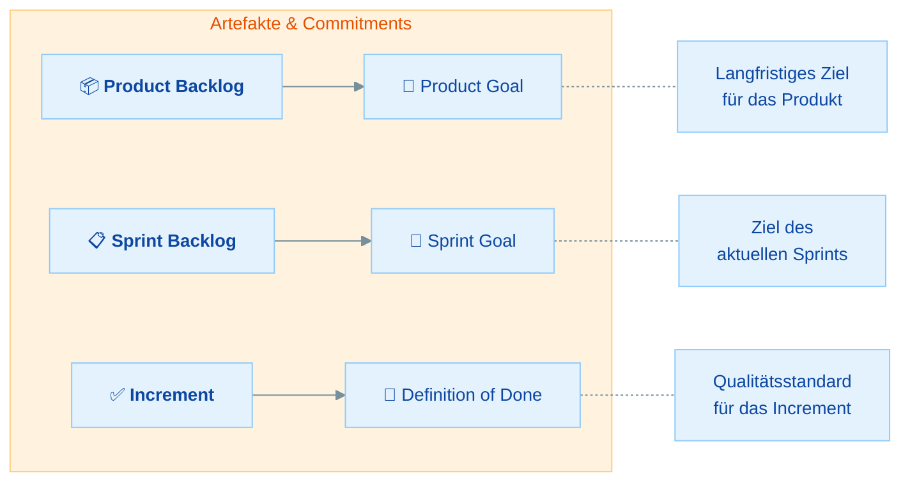
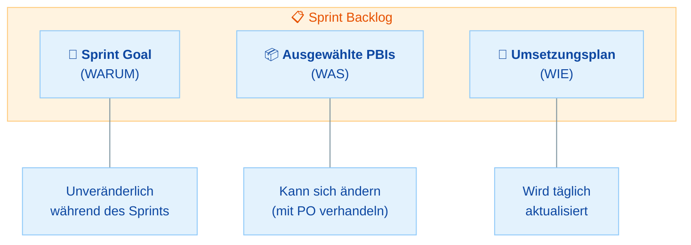
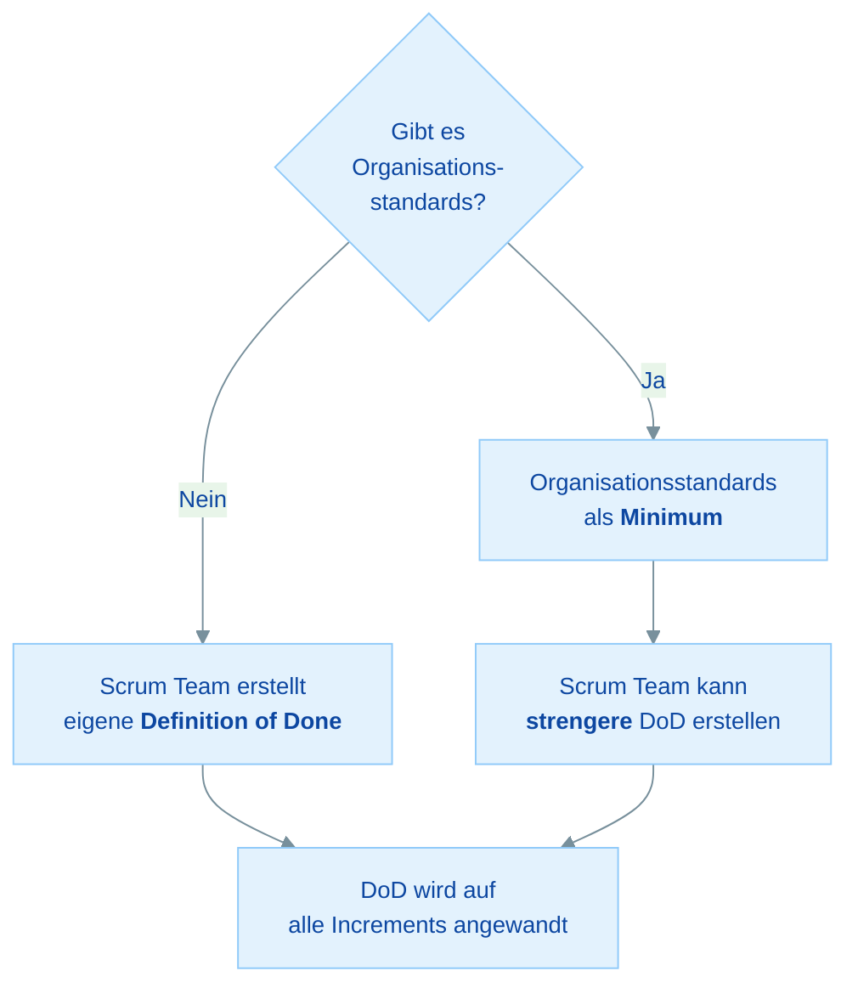

# Scrum Artefakte & Commitments

## Übersicht

Die Scrum Artefakte repräsentieren **Arbeit oder Wert** und sind darauf ausgelegt, Transparenz über Schlüsselinformationen zu maximieren. Jedes Artefakt hat ein zugehöriges **Commitment**:

- **Product Backlog** → Product Goal
- **Sprint Backlog** → Sprint Goal
- **Increment** → Definition of Done

| Teil | Thema | Zeitbedarf |
|------|-------|------------|
| **Teil 1** | Artefakte und ihre Commitments: Überblick | 10 min |
| **Teil 2** | Product Backlog & Product Goal | 20 min |
| **Teil 3** | Sprint Backlog & Sprint Goal | 20 min |
| **Teil 4** | Increment & Definition of Done | 25 min |
| **Teil 5** | Commitments als Transparenz-Werkzeug | 15 min |
| | **Gesamt** | **ca. 1,5 Stunden** |

---

## Teil 1: Artefakte und ihre Commitments - Überblick

### Die 2020er-Neuerung

Eine der wichtigsten Änderungen im Scrum Guide 2020: Jedes Artefakt hat jetzt ein zugehöriges **Commitment**. Die Commitments erhöhen die Transparenz und bieten einen Fokuspunkt für Inspektion und Adaption.

| Artefakt | Commitment | Verantwortlich | Zweck des Commitments |
|----------|------------|----------------|----------------------|
| **Product Backlog** | **Product Goal** | Product Owner | Langfristiges Ziel, das dem Backlog Richtung gibt |
| **Sprint Backlog** | **Sprint Goal** | Developers (erstellt vom Scrum Team) | Einzelnes Ziel für den Sprint, das Fokus gibt |
| **Increment** | **Definition of Done** | Scrum Team | Qualitätsstandard, der bestimmt, wann Arbeit "fertig" ist |

### Wissensfrage 1

**Warum hat der Scrum Guide 2020 jedem Artefakt ein Commitment zugeordnet?**

Antwort anzeigen

Die Commitments wurden eingeführt, um:

- **Transparenz zu erhöhen**: Jedes Artefakt hat jetzt einen messbaren Bezugspunkt
- **Fokus zu geben**: Teams wissen, worauf sie hinarbeiten
- **Inspektion zu ermöglichen**: Man kann den Fortschritt Richtung Commitment messen
- **Adaption zu leiten**: Bei Abweichungen vom Commitment kann gezielt angepasst werden

Ohne Commitments wären die Artefakte bloße Listen ohne klaren Zweck. Die Commitments geben ihnen **Bedeutung und Richtung**.

---

## Teil 2: Product Backlog & Product Goal

### Product Backlog

Das Product Backlog ist eine **geordnete Liste** von allem, was zur Verbesserung des Produkts benötigt wird. Es ist die **einzige Quelle** für Arbeit, die das Scrum Team erledigt.

| Eigenschaft | Details |
|-------------|---------|
| **Inhalt** | Alles, was nötig ist, um das Produkt zu verbessern |
| **Ordnung** | Geordnet (priorisiert) durch den Product Owner |
| **Dynamisch** | Niemals vollständig, entwickelt sich ständig weiter |
| **Verantwortlich** | Product Owner (für Inhalt, Verfügbarkeit, Ordnung) |
| **Sichtbarkeit** | Für alle transparent und einsehbar |

### Product Backlog Refinement

Refinement ist die **fortlaufende Aktivität**, bei der Product Backlog Items detaillierter beschrieben, geschätzt und geordnet werden.

!!! warning "Wichtig für die Prüfung"
    Product Backlog Refinement ist **KEIN Scrum Event**! Es ist eine fortlaufende Aktivität. Es gibt kein "Refinement Meeting" im Scrum Guide. Die Developers und der Product Owner entscheiden selbst, wann und wie sie Refinement durchführen. Als Richtwert gilt: Refinement verbraucht üblicherweise **nicht mehr als 10%** der Kapazität der Developers.

### Product Goal

Das Product Goal beschreibt einen **zukünftigen Zustand des Produkts** und dient als langfristiges Ziel für das Scrum Team.

| Eigenschaft | Details |
|-------------|---------|
| **Anzahl** | Es gibt immer nur **ein** Product Goal zur gleichen Zeit |
| **Lebenszyklus** | Wird entweder **erfüllt oder aufgegeben**, bevor ein neues Product Goal angenommen wird |
| **Zweck** | Gibt dem Product Backlog Richtung und Kontext |
| **Wo?** | Das Product Goal ist **im Product Backlog** enthalten |

> **Merke:** Das Product Goal ist das **langfristige Ziel**, auf das das Scrum Team hinarbeitet. Es gibt immer nur eines gleichzeitig. Das Team muss ein Product Goal entweder erfüllen oder aufgeben, bevor es ein neues annimmt.

### Wissensfrage 2

**Wann ist das Product Backlog "fertig"?**

Antwort anzeigen

**Nie.** Das Product Backlog ist ein **lebendes Artefakt**, das sich ständig weiterentwickelt. Solange das Produkt existiert, existiert auch das Product Backlog. Es wächst und verändert sich mit:

- Neuen Anforderungen und Erkenntnissen
- Feedback von Nutzern und Stakeholdern
- Veränderungen im Markt oder in der Technologie
- Lernerfahrungen aus vergangenen Sprints

Das Product Backlog ist nie vollständig, und das ist gewollt. Es repräsentiert den empirischen Ansatz: Anforderungen entstehen durch Erfahrung.

### Wissensfrage 3

**Wie viel Zeit sollte für Product Backlog Refinement aufgewendet werden?**

Antwort anzeigen

Der Scrum Guide sagt, dass Refinement üblicherweise **nicht mehr als 10% der Kapazität** der Developers in Anspruch nimmt. Wichtig:

- Dies ist ein **Richtwert**, keine feste Regel
- Refinement ist eine **fortlaufende Aktivität**, kein Event
- Es gibt **kein vorgeschriebenes "Refinement Meeting"** im Scrum Guide
- Die Developers und der Product Owner entscheiden **wann und wie** sie Refinement durchführen
- Refinement kann in formellen Sessions oder informell stattfinden

---

## Teil 3: Sprint Backlog & Sprint Goal

### Sprint Backlog

Das Sprint Backlog ist ein **Plan von und für die Developers**. Es besteht aus drei Elementen:

| Bestandteil | Beschreibung | Änderbar? |
|-------------|--------------|-----------|
| **Sprint Goal** | Warum ist dieser Sprint wertvoll? | ❌ **Nein** (unveränderlich) |
| **Ausgewählte Product Backlog Items** | Was wird im Sprint umgesetzt? | ✅ Ja (mit PO verhandeln) |
| **Umsetzungsplan** | Wie wird die Arbeit erledigt? | ✅ Ja (täglich aktualisiert) |

### Regeln zum Sprint Backlog

- Gehört den **Developers** (nur sie können es während des Sprints ändern)
- Ist ein **Echtzeit-Bild** der geplanten Arbeit
- Wird im **Daily Scrum** inspiziert und bei Bedarf angepasst
- Ist **detailliert genug**, um den Fortschritt im Daily Scrum sichtbar zu machen

### Sprint Goal

Das Sprint Goal ist das **einzige Ziel** des Sprints. Es wird während des Sprint Plannings vom **gesamten Scrum Team** erarbeitet.

| Eigenschaft | Details |
|-------------|---------|
| **Erstellt in** | Sprint Planning |
| **Erstellt von** | Gesamtes Scrum Team |
| **Änderbar?** | **NEIN** - Das Sprint Goal ist während des Sprints unveränderlich |
| **Zweck** | Gibt dem Sprint Kohärenz und Fokus |
| **Flexibilität** | Ermöglicht Flexibilität bei den konkreten Items |

!!! warning "Wichtig für die Prüfung"
    Das Sprint Goal ist der **einzige unveränderliche Teil** des Sprint Backlogs. Die konkreten Items und der Plan können sich ändern, aber das Sprint Goal bleibt bestehen. Wenn das Sprint Goal obsolet wird, ist das der einzige Grund, warum der Product Owner einen Sprint abbrechen könnte.

### Wissensfrage 4

**Wer "besitzt" das Sprint Backlog?**

Antwort anzeigen

Die **Developers** besitzen das Sprint Backlog. Nur sie können es während des Sprints modifizieren:

- Sie wählen im Sprint Planning die Items aus
- Sie erstellen den Umsetzungsplan
- Sie aktualisieren den Plan täglich im Daily Scrum
- Sie können Items hinzufügen oder entfernen (in Abstimmung mit dem PO)

Weder der Scrum Master noch der Product Owner können das Sprint Backlog direkt ändern. Der PO kann nur beim Scope verhandeln.

### Wissensfrage 5

**Darf das Sprint Backlog während des Sprints geändert werden?**

Antwort anzeigen

**Ja**, mit einer wichtigen Einschränkung:

- Die **ausgewählten Items** können mit dem Product Owner verhandelt werden (Scope-Änderungen)
- Der **Umsetzungsplan** wird von den Developers täglich aktualisiert, wenn sie mehr lernen
- Das **Sprint Goal** darf **NICHT** geändert werden

Das Sprint Backlog ist ein lebendes Artefakt. Die Developers passen es kontinuierlich an, wenn sie mehr über die Arbeit lernen. Es ist ein Echtzeit-Bild der Arbeit, kein starrer Plan.

---

## Teil 4: Increment & Definition of Done

### Increment

Ein Increment ist ein **konkreter Schritt** (Stepping Stone) in Richtung des Product Goals. Jedes Increment baut auf den vorherigen auf und wird gründlich verifiziert, um sicherzustellen, dass alle Increments zusammenarbeiten.

| Eigenschaft | Details |
|-------------|---------|
| **Definition** | Konkreter Schritt in Richtung Product Goal |
| **Anzahl** | Es können **mehrere Increments** innerhalb eines Sprints erstellt werden |
| **Qualität** | Jedes Increment muss die **Definition of Done** erfüllen |
| **Nutzbarkeit** | Jedes Increment muss **nutzbar** (usable) sein |
| **Lieferung** | Kann jederzeit während des Sprints geliefert werden (nicht erst am Ende) |
| **Zusammenspiel** | Alle Increments müssen zusammenarbeiten |

### Definition of Done

Die Definition of Done (DoD) ist eine **formale Beschreibung** des Zustands des Increments, wenn es die erforderlichen Qualitätsstandards erfüllt.

### Regeln zur Definition of Done

| Regel | Details |
|-------|---------|
| **Wenn Organisationsstandards existieren** | Das Scrum Team muss sie als **Minimum** befolgen |
| **Wenn keine Standards existieren** | Das Scrum Team **erstellt eine eigene** DoD |
| **Mehrere Teams am gleichen Produkt** | Müssen sich an eine **gemeinsame** DoD halten |
| **Strenger als Organisationsstandard** | Erlaubt! Das Team kann die DoD **verschärfen** |
| **Weniger streng als Organisationsstandard** | ❌ **Nicht erlaubt** |

### Was passiert, wenn ein Item die DoD nicht erfüllt?

!!! warning "Prüfungskritisch"
    Wenn ein Product Backlog Item am Ende des Sprints die Definition of Done **NICHT erfüllt**:

    - Es darf **NICHT** im Sprint Review als "fertig" präsentiert werden
    - Es darf **NICHT** released werden
    - Es geht **zurück ins Product Backlog** für zukünftige Bearbeitung
    - Es wird **NICHT** Teil des Increments

### Wissensfrage 6

**Was passiert mit einem Product Backlog Item, das am Ende des Sprints die Definition of Done nicht erfüllt?**

Antwort anzeigen

Wenn ein Item die Definition of Done nicht erfüllt:

1. Es wird **NICHT** als "Done" behandelt
2. Es wird **NICHT** im Sprint Review als fertig präsentiert
3. Es wird **NICHT** released oder ausgeliefert
4. Es geht **zurück ins Product Backlog** zur zukünftigen Bearbeitung
5. Der Product Owner entscheidet über die weitere Priorisierung

Das ist ein fundamentales Prinzip: Die Definition of Done ist eine **harte Grenze**. Arbeit ist entweder "Done" oder nicht. Es gibt kein "fast fertig" oder "90% Done" in Scrum.

### Wissensfrage 7

**Wer erstellt die Definition of Done?**

Antwort anzeigen

Es gibt zwei Szenarien:

1. **Wenn die Organisation Standards hat**: Das Scrum Team muss diese als **Minimum** befolgen. Es kann die DoD aber **verschärfen** (strengere Standards setzen).

2. **Wenn die Organisation keine Standards hat**: Das **Scrum Team** erstellt eine eigene Definition of Done.

Wenn **mehrere Scrum Teams** am gleichen Produkt arbeiten, müssen sie sich an eine **gemeinsame** Definition of Done halten, um sicherzustellen, dass alle Increments zusammenarbeiten.

---

## Teil 5: Commitments als Transparenz-Werkzeug

### Wie Commitments die drei Säulen unterstützen

Jedes Commitment ist ein Werkzeug für Transparenz, das Inspektion und Adaption ermöglicht:

| Commitment | Transparenz (sichtbar) | Inspektion (messbar) | Adaption (steuerbar) |
|------------|----------------------|---------------------|---------------------|
| **Product Goal** | Langfristiges Ziel ist für alle klar | Fortschritt Richtung Goal messbar | Product Backlog wird angepasst |
| **Sprint Goal** | Sprint-Fokus ist für alle sichtbar | Tägliche Prüfung im Daily Scrum | Sprint Backlog wird angepasst |
| **Definition of Done** | Qualitätsstandard ist klar definiert | Increment wird gegen DoD geprüft | DoD kann in Retro verschärft werden |

### "Commitment" ≠ Liefergarantie

!!! warning "Wichtig für die Prüfung"
    "Commitment" im Scrum-Kontext bedeutet **NICHT**, dass das Team garantiert, alle geplanten Items zu liefern. Es bedeutet:

    - **Product Goal**: Commitment zur langfristigen Vision
    - **Sprint Goal**: Commitment zum Ziel des Sprints (nicht zu allen einzelnen Items)
    - **Definition of Done**: Commitment zu Qualitätsstandards

    Der Scope (welche konkreten Items) kann sich ändern, aber die Commitments bleiben bestehen.

### Wissensfrage 8

**Bedeutet "Commitment" im Sprint Goal, dass alle Sprint Backlog Items geliefert werden müssen?**

Antwort anzeigen

**Nein.** "Commitment" bezieht sich auf das **Sprint Goal als Ganzes**, nicht auf die einzelnen Items:

- Das Team verpflichtet sich, das **Sprint Goal** zu erreichen
- Die **konkreten Items** können sich während des Sprints ändern
- Items können **hinzugefügt oder entfernt** werden, solange das Sprint Goal nicht gefährdet wird
- Es ist möglich, dass am Ende des Sprints nicht alle ursprünglich geplanten Items fertig sind, aber das Sprint Goal trotzdem erreicht wurde

Das Sprint Goal gibt **Flexibilität**: Es definiert das WARUM, nicht das exakte WAS.

---

## Zusammenfassung

| Artefakt | Commitment | Wer verwaltet? | Lebensdauer |
|----------|------------|----------------|-------------|
| **Product Backlog** | Product Goal | Product Owner | Solange das Produkt existiert |
| **Sprint Backlog** | Sprint Goal | Developers | Während eines Sprints |
| **Increment** | Definition of Done | Scrum Team | Fortlaufend (Increments bauen aufeinander auf) |

**Wichtige Regeln:**

- Product Backlog ist **nie fertig** (lebendes Artefakt)
- Sprint Goal ist **unveränderlich** während des Sprints
- Definition of Done ist der **harte Qualitätsstandard**
- Items ohne DoD gehen **zurück ins Product Backlog**
- Refinement ist eine **Aktivität, kein Event** (max. 10% Kapazität)
- "Commitment" bedeutet **Engagement**, keine Liefergarantie

## Checkliste

- [ ] Ich kann alle drei Artefakte und ihre Commitments zuordnen
- [ ] Ich verstehe den Unterschied zwischen Product Goal und Sprint Goal
- [ ] Ich weiß, dass das Sprint Backlog aus drei Teilen besteht (Goal + Items + Plan)
- [ ] Ich kenne die Regeln zur Definition of Done (Organisation vs. Team)
- [ ] Ich weiß, was mit Items passiert, die die DoD nicht erfüllen
- [ ] Ich kann erklären, warum Refinement kein Event ist
- [ ] Ich verstehe, dass "Commitment" keine Liefergarantie bedeutet

## Nächste Schritte

Im nächsten Material tauchst du tief in die **Scrum Master Rolle** ein, mit den 8 Stances und typischen Prüfungsszenarien: [Die Scrum Master Rolle](05-scrum-master-rolle.md)
