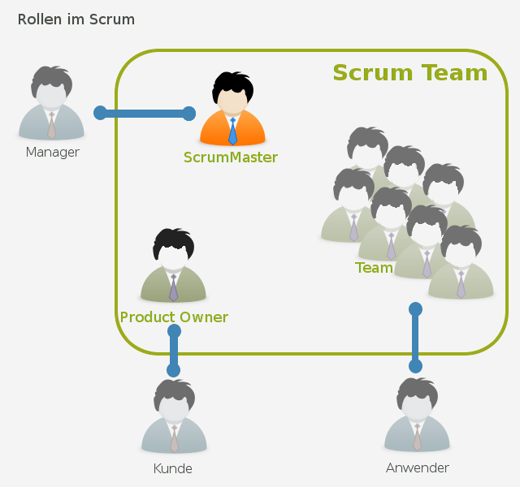
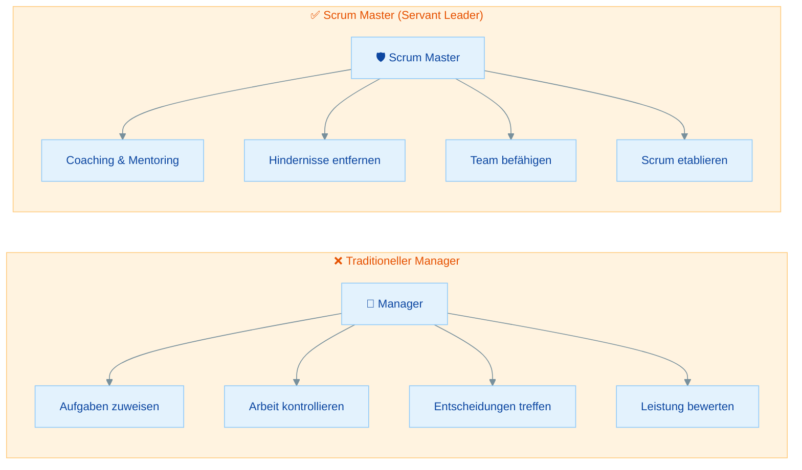
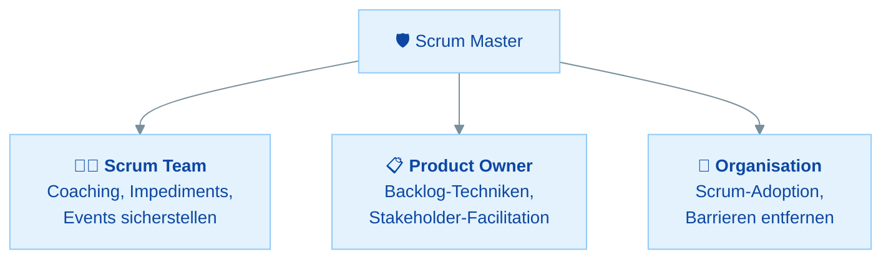
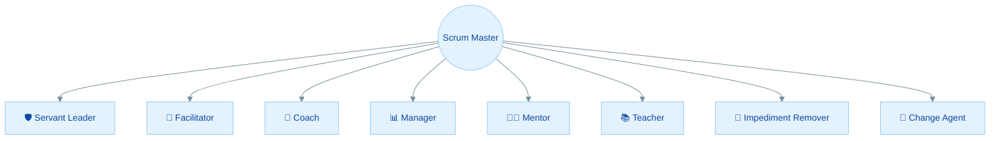

# Die Scrum Master Rolle im Detail

## Übersicht

Dieses Material taucht tief in die Scrum Master Verantwortlichkeit ein. Als angehender PSM 1 musst du genau verstehen, was ein Scrum Master tut, was er NICHT tut und wie er in verschiedenen Situationen reagiert:

- **Servant Leadership** - Führen durch Dienen
- **Services für das Scrum Team** - Coaching, Impediments, Events
- **Services für den Product Owner** - Backlog-Techniken, Stakeholder
- **Services für die Organisation** - Scrum-Adoption, Barrieren entfernen
- **Die 8 Stances** - Die verschiedenen Hüte des Scrum Masters
- **Prüfungsszenarien** - "Was sollte der Scrum Master tun?"

| Teil | Thema | Zeitbedarf |
|------|-------|------------|
| **Teil 1** | Servant Leadership | 15 min |
| **Teil 2** | Services für das Scrum Team | 20 min |
| **Teil 3** | Services für den Product Owner | 15 min |
| **Teil 4** | Services für die Organisation | 15 min |
| **Teil 5** | Die 8 Stances des Scrum Masters | 20 min |
| **Teil 6** | Typische Prüfungsszenarien | 20 min |
| | **Gesamt** | **ca. 1,5 bis 2 Stunden** |

---

Die folgende Grafik zeigt, wie der Scrum Master als Verbindungsglied zwischen dem Scrum Team (Product Owner, Developers) und externen Stakeholdern (Management, Kunden, Anwender) agiert:

<figure markdown="span">
  { width="80%" }
  <figcaption>Der Scrum Master als Bindeglied im Scrum Team (Quelle: <a href="https://alphanodes.com" target="_blank">AlphaNodes</a>)</figcaption>
</figure>

Der Scrum Master schützt das Team nach außen (z.B. gegenüber dem Management) und sorgt gleichzeitig dafür, dass die Kommunikation mit Kunden und Anwendern über den Product Owner funktioniert. Er ist kein Projektleiter, sondern ein **Servant Leader**.

---

## Teil 1: Servant Leadership

### Was bedeutet Servant Leadership?

Der Scrum Master ist ein **"true leader who serves"** (ein wahrer Anführer, der dient). Dieses Konzept unterscheidet sich fundamental von traditionellem Management.

### Vergleich: Manager vs. Scrum Master

| Aspekt | Traditioneller Manager | Scrum Master |
|--------|------------------------|--------------|
| **Aufgaben** | Weist Aufgaben zu | Team organisiert sich selbst |
| **Entscheidungen** | Trifft Entscheidungen für das Team | Team trifft eigene Entscheidungen |
| **Kontrolle** | Überwacht und kontrolliert | Coacht und befähigt |
| **Fokus** | Output und Deadlines | Teameffektivität und Scrum-Praxis |
| **Autorität** | Positionsbasiert (Hierarchie) | Einflussbasiert (Expertise) |
| **Hindernisse** | Erwartet, dass das Team sie löst | Hilft aktiv, Hindernisse zu entfernen |

> **Merke:** Der Scrum Master hat **keine Weisungsbefugnis** über das Team. Er führt nicht durch Autorität, sondern durch Coaching, Facilitation, Mentoring und Teaching. Er hilft dem Team, **sich selbst zu helfen**.

### Wissensfrage 1

**Warum ist der Scrum Master kein Projektmanager?**

Antwort anzeigen

Der Scrum Master unterscheidet sich fundamental vom Projektmanager:

- Er **weist keine Aufgaben** zu (das Team ist selbstmanagend)
- Er **erstellt keine Projektpläne** (das Team plant im Sprint Planning)
- Er **verwaltet kein Budget** (nicht seine Verantwortlichkeit)
- Er **kontrolliert keine Arbeit** (das Team kontrolliert sich selbst)
- Er **bewertet keine Leistung** (kein Hierarchieverhältnis)
- Er **berichtet nicht** über den Team-Fortschritt an das Management

Stattdessen ist er ein **Servant Leader**, der durch Coaching und Facilitation die Effektivität des Teams steigert.

---

## Teil 2: Services für das Scrum Team

### Was tut der Scrum Master für das Team?

Laut Scrum Guide dient der Scrum Master dem Scrum Team auf verschiedene Weisen:

| Service | Details |
|---------|---------|
| **Coaching in Selbstmanagement und Cross-Funktionalität** | Hilft dem Team, sich selbst zu organisieren und alle nötigen Fähigkeiten zu entwickeln |
| **Fokus auf hochwertige Increments** | Unterstützt das Team dabei, Increments zu erstellen, die die Definition of Done erfüllen |
| **Hindernisse (Impediments) entfernen** | Beseitigt Blockaden, die den Fortschritt des Teams behindern |
| **Events sicherstellen** | Sorgt dafür, dass alle Scrum Events stattfinden, positiv und produktiv sind und innerhalb der Timebox bleiben |

### "Hindernisse entfernen" richtig verstehen

!!! tip "PSM 1 Tipp"
    "Impediments entfernen" bedeutet **NICHT**, dass der Scrum Master jedes Problem selbst löst! Es bedeutet:

    - **Organisatorische Hindernisse** entfernen (z.B. fehlende Zugänge, bürokratische Hürden)
    - Das Team **befähigen**, eigene Probleme zu lösen
    - Wenn nötig, **eskalieren** und Unterstützung von der Organisation einfordern
    - **Technische Probleme** sind in der Regel Sache der Developers

### Wissensfrage 2

**Ein Developer hat ein technisches Problem mit dem Deployment. Sollte der Scrum Master es lösen?**

Antwort anzeigen

**Nicht direkt.** Der Scrum Master sollte:

- Das Team **ermutigen**, das Problem selbst zu lösen (Selbstmanagement)
- Prüfen, ob es ein **organisatorisches Hindernis** gibt (z.B. fehlende Berechtigungen), und dieses entfernen
- Bei Bedarf **Ressourcen oder Unterstützung** organisieren (z.B. Zugang zu einem Experten)
- Dem Team helfen, **Lösungsstrategien** zu entwickeln

Technische Probleme zu lösen ist primär die Aufgabe der **Developers**. Der Scrum Master entfernt die Hindernisse, die das Team daran hindern, das Problem selbst zu lösen.

---

## Teil 3: Services für den Product Owner

### Was tut der Scrum Master für den Product Owner?

| Service | Details |
|---------|---------|
| **Techniken für Product Goal und Backlog Management** | Hilft dem PO, effektive Methoden für die Backlog-Verwaltung zu finden |
| **Klare Product Backlog Items** | Hilft dem Scrum Team zu verstehen, warum präzise und klare PBIs wichtig sind |
| **Empirische Produktplanung** | Unterstützt den PO bei datenbasierter Planung in komplexen Umgebungen |
| **Stakeholder-Zusammenarbeit** | Erleichtert die Zusammenarbeit mit Stakeholdern bei Bedarf |

### Grenzen der Hilfe

Der Scrum Master hilft dem PO, **besser zu werden**, übernimmt aber nicht seine Verantwortlichkeiten:

- ✅ Der SM coacht den PO bei **Backlog-Management-Techniken**
- ❌ Der SM **ordnet nicht** das Product Backlog
- ✅ Der SM moderiert **Stakeholder-Meetings** bei Bedarf
- ❌ Der SM **spricht nicht für** den PO bei Stakeholdern
- ✅ Der SM hilft dem PO, die **Product Goal** klar zu kommunizieren
- ❌ Der SM **definiert nicht** das Product Goal

### Wissensfrage 3

**Der Product Owner hat Schwierigkeiten, das Product Backlog zu ordnen. Was tut der Scrum Master?**

Antwort anzeigen

Der Scrum Master sollte den PO **coachen**, nicht die Arbeit für ihn übernehmen:

- **Techniken** für effektives Backlog Management vorstellen (z.B. MoSCoW, WSJF, Value vs. Effort)
- Dem PO helfen, **Kriterien für die Priorisierung** zu entwickeln
- Bei Bedarf **Workshops** mit Stakeholdern facilitieren, um Prioritäten zu klären
- Den PO ermutigen, **Feedback** von den Developers einzuholen

Was der SM **NICHT** tut: Das Backlog selbst ordnen oder dem PO vorschreiben, wie er priorisieren soll. Die Verantwortlichkeit bleibt beim Product Owner.

---

## Teil 4: Services für die Organisation

### Was tut der Scrum Master für die Organisation?

| Service | Details |
|---------|---------|
| **Scrum-Adoption leiten, trainieren und coachen** | Die Organisation bei der Einführung von Scrum unterstützen |
| **Scrum-Implementierungen planen und beraten** | Bei der Skalierung und Verbreitung von Scrum helfen |
| **Empirischen Ansatz verstehen und umsetzen** | Der Organisation helfen, empirisches Arbeiten zu verstehen |
| **Barrieren entfernen** | Hindernisse zwischen Stakeholdern und Scrum Teams beseitigen |

### Wissensfrage 4

**Ein Manager möchte während des Sprints zusätzliche Features in das Sprint Backlog aufnehmen lassen. Wie reagiert der Scrum Master?**

Antwort anzeigen

Der Scrum Master sollte:

1. Dem Manager erklären, dass das **Sprint Backlog den Developers gehört** und nur sie es ändern können
2. Den Manager an den **Product Owner** verweisen, der für die Priorisierung zuständig ist
3. Erklären, dass das **Sprint Goal geschützt** werden muss und keine Änderungen vorgenommen werden dürfen, die es gefährden
4. Vorschlagen, dass die gewünschten Features **ins Product Backlog** aufgenommen und für zukünftige Sprints priorisiert werden
5. Die Organisation darüber **aufklären**, wie Scrum funktioniert und warum der Sprint geschützt sein muss

---

## Teil 5: Die 8 Stances des Scrum Masters

### Das Konzept

Die "8 Stances of a Scrum Master" (nach Barry Overeem) beschreiben die verschiedenen **Haltungen oder Hüte**, die ein Scrum Master je nach Situation einnimmt. Es ist kein offizieller Teil des Scrum Guides, wird aber häufig in der PSM 1 Vorbereitung referenziert.

### Die 8 Stances im Detail

| Stance | Beschreibung | Wann? | Beispiel |
|--------|-------------|-------|----------|
| **Servant Leader** | Führt, indem er dient und das Team befähigt | Immer als Grundhaltung | Fragt "Was braucht ihr?" statt "Tut dies!" |
| **Facilitator** | Moderiert Events und Zusammenarbeit | Events, Workshops | Leitet die Sprint Retrospective neutral |
| **Coach** | Stellt Fragen, hilft zur Selbsterkenntnis | Bei Konflikten, Entwicklung | "Was glaubt ihr, warum das passiert ist?" |
| **Manager** | Verwaltet den Scrum-Prozess (NICHT die Personen!) | Prozessverbesserung | Stellt sicher, dass Timeboxen eingehalten werden |
| **Mentor** | Teilt eigene Erfahrungen und Wissen | Langfristige Entwicklung | Erzählt von ähnlichen Situationen in früheren Teams |
| **Teacher** | Erklärt Scrum-Theorie und -Praktiken | Onboarding, Missverständnisse | Erklärt dem Team den Zweck des Daily Scrum |
| **Impediment Remover** | Beseitigt organisatorische Hindernisse | Blockaden | Beschafft fehlende Lizenzen oder Zugänge |
| **Change Agent** | Treibt Veränderung in der Organisation | Scrum-Einführung | Hilft dem Management, agile Werte zu verstehen |

!!! info "Hinweis"
    Die 8 Stances sind **kein offizieller Bestandteil** des Scrum Guides. Sie sind ein ergänzendes Modell, das hilft, die vielfältige Rolle des Scrum Masters zu verstehen. In der PSM 1 Prüfung werden sie nicht direkt abgefragt, aber das Verständnis hilft bei Szenario-Fragen.

### Wissensfrage 5

**In welcher "Stance" befindet sich der Scrum Master, wenn er dem Team Scrum-Grundlagen erklärt?**

Antwort anzeigen

In der Stance des **Teachers** (Lehrers). Der Scrum Master:

- **Vermittelt Wissen** über die Scrum-Theorie und -Praktiken
- Erklärt **Regeln und Prinzipien** des Scrum Guides
- Hilft dem Team, den **Zweck** hinter Scrum-Elementen zu verstehen
- Nutzt diese Stance besonders beim **Onboarding** neuer Teammitglieder oder wenn **Missverständnisse** über Scrum bestehen

---

## Teil 6: Typische Prüfungsszenarien

### "Was sollte der Scrum Master tun?"

Die PSM 1 Prüfung enthält viele Szenario-Fragen. Hier sind typische Situationen mit den korrekten Reaktionen:

### Wissensfrage 6

**Das Team hält die Daily Scrums regelmäßig ab, aber es gibt keine sichtbare Verbesserung. Was sollte der Scrum Master tun?**

Antwort anzeigen

Der Scrum Master sollte das Team **coachen**, den Zweck des Daily Scrum zu verstehen:

- Das Daily Scrum dient der **Inspektion des Fortschritts** Richtung Sprint Goal und der **Adaption des Sprint Backlogs**
- Wenn keine Verbesserung sichtbar ist, wird das Daily möglicherweise als reines **Status-Meeting** genutzt, statt als Planungs-Event
- Der SM könnte fragen: "Wie nutzt ihr das Daily Scrum, um euren Plan für den Tag anzupassen?"
- Vorschlagen, **alternative Formate** auszuprobieren (die drei Fragen sind nicht vorgeschrieben!)
- Sicherstellen, dass das Team das Daily als **Werkzeug für sich selbst** versteht, nicht als Pflichtübung

### Wissensfrage 7

**Die Developers bitten den Scrum Master, die Sprint Retrospective abzusagen, weil "alles gut läuft". Was tut der Scrum Master?**

Antwort anzeigen

Der Scrum Master **sorgt dafür, dass die Retrospective stattfindet**:

- Die Retrospective ist ein **verpflichtendes Scrum Event** und darf nicht übersprungen werden
- Auch wenn "alles gut läuft", gibt es **immer Verbesserungspotenzial**
- Der SM könnte das Format variieren, um frischen Wind zu bringen
- Er erklärt dem Team, dass kontinuierliche Verbesserung (Kaizen) ein **Kernprinzip** ist
- Wenn das Team die Retro als langweilig empfindet, ist das selbst ein Thema für die Retrospective

Der Scrum Master hat die Verantwortlichkeit, sicherzustellen, dass alle Events stattfinden, **positiv und produktiv** sind und innerhalb der Timebox bleiben.

### Wissensfrage 8

**Ein Stakeholder beschwert sich beim Scrum Master, dass Features nicht schnell genug geliefert werden. Wie reagiert der Scrum Master?**

Antwort anzeigen

Der Scrum Master sollte:

1. Die **Zusammenarbeit** zwischen dem Stakeholder und dem **Product Owner** facilitieren
2. Erklären, dass der **PO für die Priorisierung** verantwortlich ist und den Wert maximiert
3. Vorschlagen, dass der Stakeholder am nächsten **Sprint Review** teilnimmt, um Feedback zu geben
4. Die Situation als mögliches **organisatorisches Hindernis** betrachten (fehlendes Verständnis von Scrum)
5. Der Organisation helfen, den **empirischen Ansatz** zu verstehen

Was der SM **NICHT** tut:
- Dem Team Druck machen, schneller zu arbeiten
- Dem Stakeholder versprechen, dass Features schneller geliefert werden
- Die Prioritäten des PO überstimmen

---

## Zusammenfassung

| Aspekt | Scrum Master ist... | Scrum Master ist NICHT... |
|--------|---------------------|--------------------------|
| **Führungsstil** | Servant Leader | Manager oder Chef |
| **Aufgaben** | Coach, Facilitator, Teacher | Aufgabenzuweiser, Controller |
| **Entscheidungen** | Befähigt das Team, eigene Entscheidungen zu treffen | Entscheidet für das Team |
| **Hindernisse** | Entfernt organisatorische Blockaden | Löst alle technischen Probleme |
| **Events** | Stellt sicher, dass sie stattfinden | Leitet oder dominiert sie |
| **Backlog** | Coacht den PO bei Techniken | Ordnet oder verwaltet das Backlog |

## Checkliste

- [ ] Ich kann Servant Leadership in eigenen Worten erklären
- [ ] Ich kenne die Services des SM für Team, PO und Organisation
- [ ] Ich weiß, was "Impediments entfernen" bedeutet (und was nicht)
- [ ] Ich kann die 8 Stances des Scrum Masters benennen und beschreiben
- [ ] Ich kann typische Prüfungsszenarien korrekt beantworten
- [ ] Ich verstehe den Unterschied zwischen Coaching und Directing

## Nächste Schritte

Jetzt bist du bereit für die gezielte **Prüfungsvorbereitung** mit Übungsfragen und Strategien: [PSM 1 Prüfungsvorbereitung](06-pruefungsvorbereitung.md)
