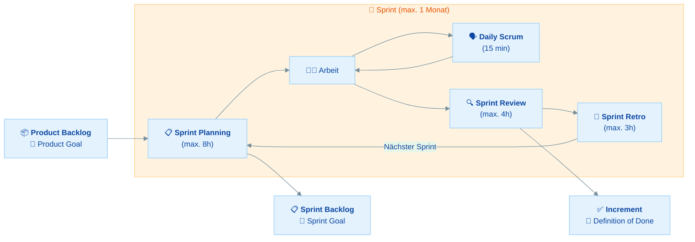

# Schnellreferenz: Scrum & PSM 1

Diese Referenz enthält alle prüfungsrelevanten Fakten für die **PSM 1 Zertifizierung** auf einen Blick.

---

## Scrum Framework auf einen Blick

---

## Drei Säulen des Empirismus

| Säule | Englisch | Bedeutung | Scrum-Beispiel |
|-------|----------|-----------|----------------|
| **Transparenz** | Transparency | Arbeit und Artefakte für alle sichtbar | Product Backlog ist für alle einsehbar |
| **Inspektion** | Inspection | Regelmäßige Überprüfung des Fortschritts | Daily Scrum inspiziert Fortschritt zum Sprint Goal |
| **Adaption** | Adaptation | Anpassung bei Abweichungen | Sprint Retro führt zu Prozessverbesserungen |

---

## Fünf Scrum Werte

| Wert | Englisch | Bedeutung |
|------|----------|-----------|
| **Commitment** | Commitment | Persönliches Engagement für die Teamziele (NICHT Liefergarantie!) |
| **Focus** | Focus | Konzentration auf Sprint-Arbeit und Teamziele |
| **Openness** | Openness | Offenheit über Arbeit und Herausforderungen |
| **Respect** | Respect | Gegenseitige Wertschätzung als fähige Personen |
| **Courage** | Courage | Mut, das Richtige zu tun und Probleme anzusprechen |

---

## Das Scrum Team

| Accountability | Englisch | Anzahl | Kernverantwortung |
|----------------|----------|--------|-------------------|
| **Developers** | Developers | Mehrere | Increment erstellen, Sprint Backlog verwalten, DoD einhalten |
| **Product Owner** | Product Owner | 1 Person | Produktwert maximieren, Product Backlog verwalten und ordnen |
| **Scrum Master** | Scrum Master | 1 Person | Scrum etablieren, Team-Effektivität steigern, Servant Leader |

**Teamregeln:**

- Max. **10 Personen** (inkl. SM und PO)
- **Keine** Sub-Teams, **keine** Hierarchien
- **Self-managing**: Team entscheidet wer, was, wann, wie
- **Cross-functional**: Alle nötigen Skills im Team

---

## Scrum Events

| Event | Timebox (1 Monat) | Teilnehmer | Was wird inspiziert? | Was wird adaptiert? |
|-------|-------------------|------------|---------------------|---------------------|
| **Sprint** | Max. 1 Monat | Scrum Team | Gesamter Fortschritt | Alles nach Bedarf |
| **Sprint Planning** | Max. 8 Stunden | Scrum Team | Product Backlog, Kapazität | Sprint Backlog wird erstellt |
| **Daily Scrum** | Max. 15 Minuten | Developers | Fortschritt zum Sprint Goal | Sprint Backlog |
| **Sprint Review** | Max. 4 Stunden | Scrum Team + Stakeholder | Increment | Product Backlog |
| **Sprint Retrospective** | Max. 3 Stunden | Scrum Team | Arbeitsweise & Prozesse | Verbesserungen |

**Sprint Planning: Die drei Themen**

| # | Frage | Ergebnis |
|---|-------|----------|
| 1 | **WARUM** ist dieser Sprint wertvoll? | Sprint Goal |
| 2 | **WAS** kann erledigt werden? | Ausgewählte PBIs |
| 3 | **WIE** wird die Arbeit erledigt? | Umsetzungsplan |

---

## Scrum Artefakte & Commitments

| Artefakt | Commitment | Verantwortlich | Beschreibung |
|----------|------------|----------------|-------------|
| **Product Backlog** | **Product Goal** | Product Owner | Geordnete Liste aller Produktverbesserungen |
| **Sprint Backlog** | **Sprint Goal** | Developers | Sprint Goal + ausgewählte Items + Umsetzungsplan |
| **Increment** | **Definition of Done** | Scrum Team | Nutzbares Ergebnis, das DoD erfüllt |

**Wichtige Regeln:**

- Product Goal: Immer nur **eines** zur gleichen Zeit
- Sprint Goal: **Unveränderlich** während des Sprints
- Definition of Done: Organisationsstandards sind **Minimum**
- Items ohne DoD: Gehen **zurück** ins Product Backlog
- Refinement: Fortlaufende **Aktivität** (kein Event!), max. 10% Kapazität

---

## Scrum Master Services

| Dient... | Services |
|----------|----------|
| **Scrum Team** | Coaching Selbstmanagement, Fokus auf hochwertige Increments, Impediments entfernen, Events sicherstellen |
| **Product Owner** | Techniken für Product Goal & Backlog, klare PBIs, empirische Planung, Stakeholder-Facilitation |
| **Organisation** | Scrum-Adoption leiten/coachen, Implementierung beraten, Barrieren entfernen |

---

## Was NICHT Teil von Scrum ist

Diese Praktiken sind nützlich, aber **nicht im Scrum Guide** definiert:

- ❌ Story Points
- ❌ Velocity
- ❌ Burn-Down / Burn-Up Charts
- ❌ User Stories
- ❌ Epics
- ❌ Planning Poker
- ❌ Sprint 0
- ❌ Hardening Sprint
- ❌ Release Planning (als Event)
- ❌ Scrum Board
- ❌ Backlog Refinement Meeting (Refinement ist eine Aktivität, kein Event)

---

## Prüfungsfakten PSM 1

| Eigenschaft | Detail |
|-------------|--------|
| **Fragen** | 80 |
| **Zeit** | 60 Minuten (45 Sek/Frage) |
| **Bestehen** | 85% (min. 68/80 richtig) |
| **Kosten** | $200 USD |
| **Sprache** | Englisch |
| **Grundlage** | Scrum Guide 2020 |
| **Gültigkeit** | Lebenslang |
| **Format** | Online, Open Book |
| **Fragetypen** | Multiple Choice, Multiple Answer, True/False |

---

## Deutsch/Englisch Glossar

| Deutsch | English |
|---------|---------|
| Verantwortlichkeiten | Accountabilities |
| Artefakte | Artifacts |
| Inkrement | Increment |
| Säulen | Pillars |
| Werte | Values |
| Selbstmanagend | Self-Managing |
| Cross-funktional | Cross-Functional |
| Hindernisse | Impediments |
| Verfeinerung | Refinement |
| Timebox | Timebox |
| Fertigstellungsdefinition | Definition of Done |
| Sprint-Ziel | Sprint Goal |
| Produkt-Ziel | Product Goal |
| Arbeitssitzung | Working Session |
| Dienende Führung | Servant Leadership |
| Anpassung | Adaptation |
| Überprüfung | Inspection |
| Durchsichtigkeit | Transparency |
