# Prompt: ASCII-Textgrafiken in Mermaid-Diagramme konvertieren

## Kontext

Dieses Projekt ist eine **MkDocs Material** Kursseite (GitHub Pages). MkDocs Material hat
eingebauten Mermaid-Support via `pymdownx.superfences`. Mermaid-Diagramme passen sich
automatisch an den Dark/Light Mode an.

## Aufgabe

Durchsuche die angegebene(n) Markdown-Datei(en) nach ASCII-Textgrafiken (Boxen mit `┌─┐`,
`│`, `└─┘`, `+--+`, Pfeile `──►`, `-->` etc.) innerhalb von regulaeren Code-Bloecken
(` ```  ``` `) und ersetze sie durch aequivalente **Mermaid-Diagramme**.

## Regeln

1. **Mermaid-Syntax verwenden:**
   - Verwende ` ```mermaid ` statt ` ``` ` fuer den Code-Block
   - Nutze `graph TD` (top-down) oder `graph LR` (left-right) je nach Diagramm-Richtung
   - Nutze `subgraph` fuer gruppierte Elemente

2. **Farbschema (konsistent ueber alle Diagramme):**
   - React/Frontend: `fill:#61dafb,stroke:#333,color:#000`
   - Python/Backend/FastAPI: `fill:#009688,stroke:#333,color:#fff`
   - Datenbank/Storage: `fill:#ff9800,stroke:#333,color:#000`
   - Erfolg/Erlaubt: `fill:#4caf50,stroke:#333,color:#fff`
   - Fehler/Blockiert: `fill:#f44336,stroke:#333,color:#fff`
   - Warnung/Entscheidung: `fill:#ff9800,stroke:#333,color:#000`
   - Browser/User: `fill:#7c4dff,stroke:#333,color:#fff`
   - Nginx/Proxy: `fill:#4caf50,stroke:#333,color:#fff`

3. **Dark Mode Kompatibilitaet:**
   - Mermaid in MkDocs Material passt sich automatisch an (kein extra CSS noetig)
   - Vermeide harte Hintergrundfarben die im Dark Mode schlecht lesbar sind
   - Die `style`-Anweisungen oben sind fuer beide Modi gut lesbar
   - Verwende `fill:none` fuer transparente Subgraph-Hintergruende

4. **Icons/Emojis fuer bessere Lesbarkeit:**
   - Verwende passende Emojis in Node-Labels (z.B. `"🖥️ Frontend"`, `"⚙️ Backend"`)
   - Nutze `<br/>` fuer Zeilenumbrueche in Labels
   - Nutze `<i>...</i>` fuer Untertitel/Beschreibungen
   - Nutze `<b>...</b>` fuer Ueberschriften
   - Nutze `<code>...</code>` fuer Code-Snippets in Labels

5. **Node-Formen:**
   - Rechteck `["..."]` fuer Services/Komponenten
   - Datenbank-Zylinder `[("...")]` fuer Datenspeicher
   - Raute `{"..."}` fuer Entscheidungen/Pruefungen
   - Abgerundet `("...")` fuer Prozesse

6. **Kanten/Verbindungen:**
   - Durchgezogen `-->` fuer direkte Kommunikation
   - Gestrichelt `-.->` fuer indirekte/optionale Verbindungen
   - Beschriftete Kanten `-- "Label" -->` fuer HTTP-Methoden, Protokolle etc.

7. **Was NICHT konvertiert werden soll:**
   - Konsolen-Output (Terminal-Darstellungen mit `$` Befehlen) - diese sind als Code-Bloecke besser
   - Dateistruktur-Darstellungen (Verzeichnisbaeume mit `├──`, `└──`)
   - Code-Beispiele innerhalb von Erklaerungen

## Beispiel-Konvertierung

**Vorher (ASCII):**
```
┌───────────┐     HTTP      ┌───────────┐
│  Frontend │ ◄──────────►  │  Backend  │
│  Port 3000│               │  Port 8000│
└───────────┘               └─────┬─────┘
                                  │
                            ┌─────▼─────┐
                            │  Datenbank │
                            └───────────┘
```

**Nachher (Mermaid):**

```mermaid
graph LR
    A["🖥️ Frontend<br/><i>Port 3000</i>"] -- "HTTP Request" --> B["⚙️ Backend<br/><i>Port 8000</i>"]
    B -- "JSON Response" --> A
    B --> C[("💾 Datenbank")]

    style A fill:#61dafb,stroke:#333,color:#000
    style B fill:#009688,stroke:#333,color:#fff
    style C fill:#ff9800,stroke:#333,color:#000
```


## Ausfuehrung

1. Oeffne die angegebene Markdown-Datei
2. Finde alle ASCII-Textgrafiken (innerhalb von ` ``` ` Code-Bloecken)
3. Analysiere die Struktur und den Informationsgehalt jeder Grafik
4. Erstelle ein aequivalentes Mermaid-Diagramm nach obigen Regeln
5. Ersetze den alten Code-Block durch den neuen Mermaid-Block
6. Falls Text-Beschreibungen unter/ueber der Grafik standen die jetzt redundant sind, pruefe ob sie als Mermaid-Labels integriert werden koennen
