# Prompt: ASCII-Textgrafiken in Mermaid-Diagramme konvertieren

## Kontext

Dieses Projekt ist eine **MkDocs Material** Kursseite (GitHub Pages). MkDocs Material hat
eingebauten Mermaid-Support via `pymdownx.superfences`. Die Seite hat einen Light/Dark Mode Toggle.

**Wichtig:** Mermaid-Diagramme muessen in BEIDEN Modi (Light + Dark) gut lesbar sein.
Dafuer nutzen wir die `%%{init}%%`-Directive mit dem `base`-Theme und hellen Pastellfarben,
die in beiden Modi funktionieren. **KEINE** hardcoded `style`-Zeilen verwenden!

## Aufgabe

Durchsuche die angegebene(n) Markdown-Datei(en) nach ASCII-Textgrafiken (Boxen mit `┌─┐`,
`│`, `└─┘`, `+--+`, Pfeile `──►`, `-->`, Baumstrukturen mit `├──`, `└──` etc.) innerhalb
von regulaeren Code-Bloecken (` ```  ``` `) und ersetze sie durch aequivalente **Mermaid-Diagramme**.

## Regeln

### 1. Theme-Konfiguration (PFLICHT fuer jedes Diagramm)

Jedes Mermaid-Diagramm MUSS mit dieser init-Directive beginnen:

```
%%{init: {'theme': 'base', 'themeVariables': {
  'primaryColor': '#e3f2fd', 'primaryTextColor': '#0d47a1', 'primaryBorderColor': '#90caf9',
  'secondaryColor': '#e0f2f1', 'secondaryTextColor': '#004d40', 'secondaryBorderColor': '#80cbc4',
  'tertiaryColor': '#fff3e0', 'tertiaryTextColor': '#e65100', 'tertiaryBorderColor': '#ffcc80',
  'lineColor': '#78909c', 'fontSize': '14px'
}}}%%
```

Das `base`-Theme mit hellen Pastellfarben funktioniert in Light UND Dark Mode.
Die Farben werden von MkDocs Material automatisch angepasst.

**KEINE `style`-Zeilen** wie `style A fill:#61dafb,stroke:#333,color:#000` verwenden!
Diese ueberschreiben das Theme und brechen den Dark Mode.

### 2. Mermaid-Syntax

- Verwende ` ```mermaid ` fuer den Code-Block
- Nutze `graph LR` (links-rechts) fuer Architektur-Diagramme — nutzt die volle Breite
- Nutze `graph TD` (top-down) fuer Hierarchien
- Nutze `subgraph` fuer gruppierte Elemente, mit `[" "]` fuer leere Titel

### 3. Saubere, minimalistische Labels

- **Kurz halten:** Max 2-3 Zeilen pro Node
- **Emoji + Bold fuer Titel:** `["🖥️ <b>React Frontend</b><br/>Port 5173"]`
- **Keine langen Texte** in Nodes — lieber in den umgebenden Markdown-Text auslagern
- `<b>...</b>` fuer Ueberschriften
- `<br/>` fuer Zeilenumbrueche
- Keine `<i>`, `<code>` oder `&nbsp;` — haelt es einfach

### 4. Node-Formen

- Rechteck `["..."]` fuer Services/Komponenten
- Datenbank-Zylinder `[("...")]` fuer Datenspeicher
- Raute `{"..."}` fuer Entscheidungen/Pruefungen

### 5. Kanten/Verbindungen

- Durchgezogen `-->` fuer direkte Kommunikation
- Gestrichelt `-.->` fuer indirekte/optionale Verbindungen
- Beschriftete Kanten `-- "Label" -->` fuer Protokolle, HTTP-Methoden
- Unsichtbare Kanten `~~~` fuer horizontales Layout ohne Pfeil

### 6. Was NICHT konvertiert werden soll

- Konsolen-Output (Terminal mit `$` Befehlen) — als Code-Block belassen
- Dateistruktur-Darstellungen mit `├──`, `└──` (wenn sie eine Ordnerstruktur zeigen)
- Code-Beispiele innerhalb von Erklaerungen
- pgAdmin-Navigationsbaeume (besser als Text-Baum)

## Beispiel-Konvertierung

**Vorher (ASCII):**
```
┌───────────┐     HTTP      ┌───────────┐
│  Frontend │ ◄──────────►  │  Backend  │
│  Port 3000│               │  Port 8000│
└───────────┘               └─────┬─────┘
                                  │
                            ┌─────▼─────┐
                            │  Datenbank │
                            └───────────┘
```

**Nachher (Mermaid):**

```mermaid
%%{init: {'theme': 'base', 'themeVariables': {'primaryColor': '#e3f2fd', 'primaryTextColor': '#0d47a1', 'primaryBorderColor': '#90caf9', 'secondaryColor': '#e0f2f1', 'secondaryTextColor': '#004d40', 'secondaryBorderColor': '#80cbc4', 'tertiaryColor': '#fff3e0', 'tertiaryTextColor': '#e65100', 'tertiaryBorderColor': '#ffcc80', 'lineColor': '#78909c', 'fontSize': '14px'}}}%%
graph LR
    A["🖥️ <b>Frontend</b><br/>Port 3000"] -- "HTTP" --> B["⚙️ <b>Backend</b><br/>Port 8000"]
    B -- "JSON" --> A
    B --> C[("💾 <b>Datenbank</b>")]
```


## Ausfuehrung

1. Oeffne die angegebene Markdown-Datei
2. Finde alle ASCII-Textgrafiken (innerhalb von ` ``` ` Code-Bloecken)
3. Analysiere die Struktur und den Informationsgehalt jeder Grafik
4. Erstelle ein aequivalentes Mermaid-Diagramm nach obigen Regeln
5. Ersetze den alten Code-Block durch den neuen Mermaid-Block
6. Halte die Diagramme schlank — weniger ist mehr
